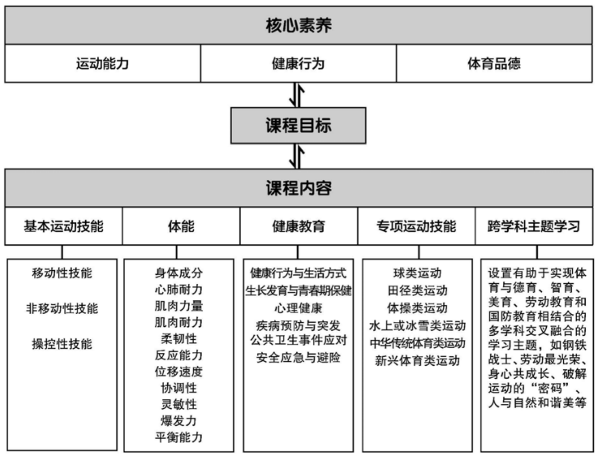

### 义务教育

# 体育与健康课程标准

（2022年版）

中华人民共和国教育部制定

### 前言

习近平总书记多次强调，课程教材要发挥培根铸魂、启智增慧的作用，必须坚持马克思主义的指导地位，体现马克思主义中国化最新成果，体现中国和中华民族风格，体现党和国家对教育的基本要求，体现国家和民族基本价值观，体现人类文化知识积累和创新成果。

义务教育课程规定了教育目标、教育内容和教学基本要求，体现国家意志，在立德树人中发挥着关键作用。2001年颁布的《义务教育课程设置实验方案》和2011年颁布的义务教育各课程标准，坚持了正确的改革方向，体现了先进的教育理念，为基础教育质量提高作出了积极贡献。随着义务教育全面普及，教育需求从“有学上”转向“上好学”，必须进一步明确“培养什么人、怎样培养人、为谁培养人”，优化学校育人蓝图。当今世界科技进步日新月异，网络新媒体迅速普及，人们生活、学习、工作方式不断改变，儿童青少年成长环境深刻变化，人才培养面临新挑战。义务教育课程必须与时俱进，进行修订完善。

### 一、指导思想

以习近平新时代中国特色社会主义思想为指导，全面贯彻党的教育方针，遵循教育教学规律，落实立德树人根本任务，发展素质教育。以人民为中心，扎根中国大地办教育。坚持德育为先，提升智育水平，加强体育美育，落实劳动教育。反映时代特征，努力构建具有中国特色、世界水准的义务教育课程体系。聚焦中国学生发展核心素养，培养学生适应未来发展的正确价值观、必备品格和关键能力，引导学生明确人生发展方向，成长为德智体美劳全面发展的社会主义建设者和接班人。

### 二、修订原则

### （一）坚持目标导向

认真学习领会习近平总书记关于教育的重要论述，全面落实有理想、有本领、有担当的时代新人培养要求，确立课程修订的根本遵循。准确理解和把握党中央、国务院关于教育改革的各项要求，全面落实习近平新时代中国特色社会主义思想，将社会主义先进文化、革命文化、中华优秀传统文化、国家安全、生命安全与健康等重大主题教育有机融入课程，增强课程思想性。

### （二）坚持问题导向

全面梳理课程改革的困难与问题，明确修订重点和任务，注重对实际问题的有效回应。遵循学生身心发展规律，加强一体化设置，促进学段衔接，提升课程科学性和系统性。进一步精选对学生终身发展有价值的课程内容，减负提质。细化育人目标，明确实施要求，增强课程指导性和可操作性。

### （三）坚持创新导向

既注重继承我国课程建设的成功经验，也充分借鉴国际先进教育理念，进一步深化课程改革。强化课程综合性和实践性，推动育人方式变革，着力发展学生核心素养。凸显学生主体地位，关注学生个性化、多样化的学习和发展需求，增强课程适宜性。坚持与时俱进，反映经济社会发展新变化、科学技术进步新成果，更新课程内容，体现课程时代性。

### 三、主要变化

### （一）关于课程方案

一是完善了培养目标。全面落实习近平总书记关于培养担当民族复兴大任时代新人的要求，结合义务教育性质及课程定位，从有理想、有本领、有担当三个方面，明确义务教育阶段时代新人培养的具体要求。

二是优化了课程设置。落实党中央、国务院“双减”政策要求，在保持义务教育阶段九年9522总课时数不变的基础上，调整优化课程设置。将小学原品德与生活、品德与社会和初中原思想品德整合为“道德与法治”，进行一体化设计。改革艺术课程设置，一至七年级以音乐、美术为主线，融入舞蹈、戏剧、影视等内容，八至九年级分项选择开设。将劳动、信息科技从综合实践活动课程中独立出来。科学、综合实践活动起始年级提前至一年级。

三是细化了实施要求。增加课程标准编制与教材编写基本要求；明确省级教育行政部门和学校课程实施职责、制度规范，以及教学改革方向和评价改革重点，对培训、教科研提出具体要求；健全实施机制，强化监测与督导要求。

### （二）关于课程标准

一是强化了课程育人导向。各课程标准基于义务教育培养目标，将党的教育方针具体化细化为本课程应着力培养的核心素养，体现正确价值观、必备品格和关键能力的培养要求。

二是优化了课程内容结构。以习近平新时代中国特色社会主义思想为统领，基于核心素养发展要求，遴选重要观念、主题内容和基础知识，设计课程内容，增强内容与育人目标的联系，优化内容组织形式。设立跨学科主题学习活动，加强学科间相互关联，带动课程综合化实施，强化实践性要求。

三是研制了学业质量标准。各课程标准根据核心素养发展水平，结合课程内容，整体刻画不同学段学生学业成就的具体表现特征，形成学业质量标准，引导和帮助教师把握教学深度与广度，为教材编写、教学实施和考试评价等提供依据。

四是增强了指导性。各课程标准针对“内容要求”提出“学业要求”“教学提示”，细化了评价与考试命题建议，注重实现“教—学—评”一致性，增加了教学、评价案例，不仅明确了“为什么教”“教什么”“教到什么程度”，而且强化了“怎么教”的具体指导，做到好用、管用。

五是加强了学段衔接。注重幼小衔接，基于对学生在健康、语言、社会、科学、艺术领域发展水平的评估，合理设计小学一至二年级课程，注重活动化、游戏化、生活化的学习设计。依据学生从小学到初中在认知、情感、社会性等方面的发展，合理安排不同学段内容，体现学习目标的连续性和进阶性。了解高中阶段学生特点和学科特点，为学生进一步学习做好准备。

在向着第二个百年奋斗目标迈进之际，实施新修订的义务教育课程方案和课程标准，对推动义务教育高质量发展、全面建设社会主义现代化强国具有重要意义。希望广大教育工作者勤勉认真、行而不辍，不断创新实践，把育人蓝图变为现实，培育一代又一代有理想、有本领、有担当的时代新人，为实现中华民族伟大复兴作出新的更大贡献！

### 目录

一、课程性质 1 二、课程理念 2 三、课程目标 5 （一）核心素养内涵 5 （二）总目标 6 （三）水平目标 7 四、课程内容 10 （一）基本运动技能 11 （二）体能 13 （三）健康教育 19 （四）专项运动技能 26 （五）跨学科主题学习 101 五、学业质量 107 （一）学业质量内涵 107 （二）学业质量描述 107 六、课程实施 120 （一）教学建议 120 （二）评价建议 125

（三）教材编写建议 128（四）课程资源开发与利用 130（五）教学研究与教师培训 132附录 跨学科主题学习案例 134

### 一、课程性质

体育与健康教育是实现儿童青少年全面发展的重要途径，对于促进学生积极参与体育运动、养成健康生活方式、健全人格品质，提升国民综合素质，推动社会文明进步，建设健康中国和体育强国，实现中华民族伟大复兴具有重要的现实和长远意义。

义务教育体育与健康课程以身体练习为主要手段，以体育与健康知识、技能和方法为主要学习内容，以发展学生核心素养和增进学生身心健康为主要目的，具有基础性、健身性、实践性和综合性等特点，是学校教育的重要组成部分，对促进学生德智体美劳全面发展具有非常重要的价值。

### 二、课程理念

### 1.坚持“健康第一”

1. 坚持“健康第一”体育与健康课程以习近平新时代中国特色社会主义思想为指导，全面贯彻党的教育方针，落实立德树人根本任务，坚持“健康第一”教育理念，以中国学生发展核心素养为引领，重视体育与育心、体育与健康教育相融合，充分体现健身育人本质特征，引导学生形成健康与安全的意识及良好的生活方式，促进学生身心健康、体魄强健、全面发展。

### 2.落实“教会、勤练、常赛”

2. 落实“教会、勤练、常赛”体育与健康课程依据学生的学习需求和兴趣爱好，面向全体学生，落实“教会、勤练、常赛”要求，注重“学、练、赛”一体化教学。坚持课内外有机结合，指导学生学会基本运动技能、体能和专项运动技能，提供更多时间让学生进行充分练习，巩固和运用所学运动知识与技能，参与形式多样的展示或比赛。激发学生参与运动的兴趣，让学生体验运动的魅力，领悟体育的意义，发扬刻苦学练的精神，逐渐养成“校内锻炼1小时、校外锻炼1小时”的习惯。

### 3.加强课程内容整体设计

体育与健康课程根据学生运动技能形成规律和身心发展规律，整体设计课程内容，体现保证基础、重视多样、关注融合、强调运用等理念。保证学生学习和掌握结构化的基本运动技能、体能、专项运动技能和健康技能等，为学生参与运动和养成健康的生活方式奠定基础；重视系统安排多种运动项目的学练，促进学生形成丰富的运动体验，协调发展运动能力；关注体育与健康教育内容、体能与技能、学练与比赛、体育与其他相关学科等方面的有机融合，提高学生举一反三、融会贯通的能力；强调引导学生将体育与健康知识、技能和方法运用到体育学习、体育锻炼、运动竞赛和日常生活中，增强学生的理解能力和实践能力。

### 4. 注重教学方式改革

体育与健康课程根据体育学习实践性和健康教育实用性的特点，强调从“以知识与技能为本”向“以学生发展为本”转变。创设丰富多彩、生动有趣的教学情境，倡导将教师的动作示范、重点讲解与学生的自主学习、合作学习、探究学习有机结合，将集体学练、小组学练与个人学练有机结合，注重将健康教育教学理论讲授、交流互动与实践应用相结合，激发学生的学习热情，帮助学生理解和掌握知识与技能，提高解决体育与健康实际问题的综合能力。

### 5. 重视综合性学习评价

体育与健康课程重视学习评价的激励和反馈功能，注重构建评价内容多维、评价方法多样、评价主体多元的评价体系。评价内容围绕核心素养，既关注基本运动技能、体能与专项运动技能，又关注学习态度、进步情况及体育品德；既关注健康基本知识与技能，又关注健康意识和行为养成。评价方法要重视过程性评价与终结性评价结合、定性评价与定量评价结合、相对性评价与绝对性评价结合。评价主体以体育教师为主，鼓励学生、其他学科教师、家长等参与到评价中。同时，重视制定明确、具体、可操作的学业质量合格标准，为教师有效教学、学生积极学习及学习评价指明方向。通过综合性学习评价，促进学生达成学习目标，形成核心素养。

### 6. 关注学生个体差异

体育与健康课程在高度关注对所有学生进行激励与指导的基础上，针对不同身体条件、运动基础和兴趣爱好的学生因材施教；提出不同的学习目标，选择适宜的教学内容，采用多样的教学方法与学习评价方式，为学生创造公平的学习机会，促进每一位学生产生良好的学练体验，增强学习的自信心，在原有的基础上获得更好发展。

### 三、课程目标

体育与健康课程围绕核心素养，体现课程性质，反映课程理念，确立课程目标。

### （一）核心素养内涵

体育与健康课程要培养的核心素养，主要是指学生通过体育与健康课程学习而逐步形成的正确价值观、必备品格和关键能力，包括运动能力、健康行为和体育品德等方面。

### 1. 运动能力

运动能力是指学生在参与体育运动过程中所表现出来的综合能力。运动能力包括体能状况、运动认知与技战术运用、体育展示或比赛三个维度，主要体现在基本运动技能、体能、专项运动技能的掌握与运用。

### 2. 健康行为

健康行为是指学生增进身心健康和积极适应外部环境的综合表现。健康行为包括体育锻炼意识与习惯、健康知识与技能的掌握和运用、情绪调控、环境适应四个维度，主要体现在养成良好的锻炼、饮食、用眼、作息和卫生习惯，树立安全意识，控制体重，远离不良嗜好，预防运动损伤和疾病，消除运动疲劳，保持良好心态，适应自然和社会环境等。

### 3. 体育品德

体育品德是指学生在体育运动中应当遵循的行为规范和体育伦理，以及形成的价值追求和精神风貌。体育品德包括体育精神、体育道德和体育品格三个维度。体育精神主要体现在积极进取、勇敢顽强、不怕困难、坚持到底、团队精神等；体育道德主要体现在遵守规则、尊重裁判、尊重对手、诚信自律、公平竞争等；体育品格主要体现在自尊自信、文明礼貌、责任意识、正确的胜负观等。

核心素养的上述三个方面密切联系，相互影响，在体育与健康教育教学过程中得以全面发展，并在解决复杂情境的实际问题过程中整体发挥作用。

### （二）总目标

### 1. 掌握与运用体能和运动技能，提高运动能力

通过体育与健康课程的学习，学生能享受运动乐趣，掌握各种体能的学练方法，积极参与各种体能练习，达到《国家学生体质健康标准（2014年修订）》的相应要求，改善体形，保持良好的身体姿态；在学练多种运动项目技战术和参与展示或比赛的基础上掌握 \(1 \sim 2\) 项运动技能；认识体能和运动技能发展的重要性，掌握所学运动项目的基础知识和基本原理，了解并运用所学运动项目的规则；经常观看体育比赛，并能简要分析体育比赛中的现象与问题；形成积极的体育态度，提高分析问题和解决问题的能力。

### 2. 学会运用健康与安全的知识和技能，形成健康的生活方式

通过体育与健康课程的学习，学生能理解体育锻炼对健康的重要性，积极参加校内外体育锻炼，逐步形成体育锻炼意识和习惯；掌握个人卫生保健、营养膳食、青春期生长发育、常见疾病和运动伤病预防、安全避险等知识与方法，并运用在学习和生活中；了解和体验体育活动对心理健康的积极影响，学会调控自己的情绪，积极应对挫折和失败，保持良好的心态；主动同他人交流与合作，知道在不同环境下进行体育锻炼的方法和注意事项，逐步适应自然环境和社会环境。

### 3. 积极参与体育活动，养成良好的体育品德

通过体育与健康课程的学习，学生能理解参与体育学练、展示或比赛对个人品德塑造的重要性；积极参与体育活动，在遇到困难或挑战自身身体极限且保证安全的情况下能克服困难、坚持到底，与同伴一起顽强拼搏；遵守体育游戏、展示或比赛规则，相互尊重，诚实守信，具有公平竞争的意识和行为；充满自信，乐于助人，表现出良好的礼仪，承担不同角色并认真履行职责，正确对待成败；能将体育运动中养成的良好体育品德迁移到日常学习和生活中。

### （三）水平目标

体育与健康课程依据核心素养达成度，分四个水平对课程目标进行细化（见表1）。

续表

|  |  |  |  |  |
| --- | --- | --- | --- | --- |
| 课程 总目标 | 水平一 | 水平二 | 水平三 | 水平四 |
| 掌握与运用体能和运动技能，提高运动能力 | 非移动性技能、操控性技能等基本运动技能。 | 能进行体育展示或比赛。 ·运用所学知识观看体育展示或比赛。 | 知识，学练运动项目的技战术，并能在体育展示或比赛中运用。 ·运用比赛规则参与裁判工作，观看体育比赛并能进行简要评价。 | 目的相关原理、历史和文化，能运用知识与技能分析和解决体育展示或比赛中遇到的问题，掌握1～2项运动技能。 ·经常观看国内外重大体育比赛，并能作出分析与评价。 |
| 学会运用健康与安全的知识和技能，形成健康的生活方式 | ·感受体育锻炼对健康的重要性，参与校内外体育活动。 ·知道个人卫生保健、营养膳食、安全避险等健康知识和方法，并将其运用于日常生活中。 ·活泼开朗，体验快乐。 ·乐于与他人交往，适应自然环境。 | ·了解体育锻炼对健康的重要性，积极参与校内外体育活动。 ·了解个人卫生保健、营养膳食、青春期生长发育、运动伤病、安全避险等健康知识和方法，并将其运用于日常生活中。 ·关注自己情绪的变化。 ·积极与他人沟通和交流，适应自然环境的变化。 | ·理解体育锻炼对健康的重要性，主动参与校内外体育锻炼。 ·将健康与安全知识和技能运用于日常生活中。 ·遭受挫折和失败时保持情绪稳定。 ·交往与合作能力提升，适应自然环境的能力增强。 | ·有规律地参与校内外体育锻炼。 ·运用健康与安全知识和技能进行健康管理的能力增强。 ·情绪调控能力增强，心态良好，充满青春活力。 ·善于沟通与合作，适应多种环境。 |

续表

|  |  |  |  |  |
| --- | --- | --- | --- | --- |
| 课程总目标 | 水平一 | 水平二 | 水平三 | 水平四 |
| 积极参与体育活动，养成良好的体育品德 | ·在体育活动中表现出不怕困难、努力坚持学练的意志品质。 ·按照要求参与体育游戏。 ·在体育活动中尊重教师、爱护同学，能扮演不同的运动角色。 | ·在有一定难度的体育活动中表现出勇敢顽强、克服困难的意志品质。 ·按照规则和要求参与体育活动。 ·在体育活动中表现出文明礼貌、乐于助人的行为。 | ·在有挑战性的体育活动中能迎难而上，表现出自信和抗挫折能力。 ·遵守各种规范和规则，尊重裁判，尊重对手，表现出公平竞争的意识。 ·具有团队精神和集体意识，能接受比赛结果。 | ·积极应对体育活动中遇到的困难，表现出吃苦耐劳、敢于拼搏、勇于争先的精神。 ·做到诚信自律、公平公正，规则意识强。 ·具有责任意识和集体荣誉感，能正确看待比赛的胜负。 |

### 四、课程内容

义务教育阶段体育与健康课程内容主要包括基本运动技能、体能、健康教育、专项运动技能和跨学科主题学习（见图1）。

根据课程目标的四个水平，设计相应内容。针对水平一目标，专门设置基本运动技能的课程内容，为体能和专项运动技能学练奠定基础；针对水平二、水平三、水平四目标，分别设置体能和专项运动技能的课程内容；健康教育和跨学科主题学习贯穿整个义务教育阶段（见表2）。其中，健康教育由体育与健康、道德与法治、生物学、科学等多门课程共同承担，体育与健康是落实健康教育的主要课程。体育文化和体育精神主要融入体育与健康课程内容之中。

### （一）基本运动技能

基本运动技能包括移动性技能、非移动性技能和操控性技能，主要发展学生的身体活动能力，为学生发展体能和学练专项运动技能奠定良好基础。

### 达到水平一目标要求

### 【内容要求】

（1）了解正确的身体姿势，能做出正确的坐、立、行和读写姿势等。

（2）体验移动性技能的具体内容和练习方法，如提踵走、高矮人走、马步跑、追逐跑、垫步跳、跑跳步、钻越、躲避、攀爬和队列练习等活动，以及“青蛙跳荷叶”“动物爬行”“老鹰捉小鸡”等游戏。

（3）体验非移动性技能的具体内容和练习方法，如伸展、屈体、扭转、悬垂、支撑与推拉、平衡等活动，以及“高人矮人”“不倒翁”“金鸡独立”“木偶人”等游戏。

（4）体验操控性技能的具体内容和练习方法，如各种投、传、击、踢、接球，用手或用脚运球，用短（长）柄器械击球等活动，以及“毛毛虫划龙舟”“托乒乓球比赛”等游戏。

（5）在运动过程中体验方向、水平、路径、节奏、力量和位移速度的变化，感受与他人或物体的相对关系，知道相关运动术语。

（6）感受时空变化，在个人和集体练习中根据指定节拍感受时间变化，在不同活动场景中学会区分自我空间和公共空间。

### 【学业要求】

（1）知道基本运动技能的内容，能说出表示方向变化、速度快慢、力量大小等的运动术语，协调发展移动性技能、非移动性技能和操控性技能，能保持良好的身体姿态，快乐地参与体育活动。

（2）乐于参与基本运动技能学练和游戏，能说出参与体育活动前后的感受；具有时空意识和安全运动意识，能在运动中做好安全方面的自我检查，与他人保持安全距离。

（3）在活动中与同伴友爱互助，遵守纪律，文明礼貌，不怕困难，努力坚持学练。

### 【教学提示】

（1）创设生动形象的情境开展游戏化教学，引导学生模仿教师动作或跟随语言提示做动作，通过扮演某种角色或对象进行学练，如模仿熊、兔子等动物的移动方式或飞机、火车等交通工具的通行方式，提高柔韧性、灵敏性、平衡能力及自我展示能力，学会与同伴友好相处。

（2）运用启发性问题，如“能不能用身体展示一个圆形的苹果？”“如何能像青蛙那样从一片荷叶跳到另一片荷叶上？”等，引导学生发挥想象力，以多种形式探索各种可能的运动，加深对不同形状及身体表达的认知，促进学生积极参与和主动思考。

（3）重视组织学生进行身体双侧协调练习，如左右手交替运球、左右脚交换跳、不同方向的追逐与躲闪游戏等，促进学生大脑均衡发展，提高学生的反应能力、身体控制能力和协调能力。

（4）注意与艺术、劳动等相结合，创设丰富多样的情境，用有创意的方式引导学生参与活动，激发学生的学习热情和兴趣。

（5）注意引导学生参与多样化的活动，如运球时进行变换方向、路径、节奏的练习，追逐跑中根据不同信号做出不同的停止动作，与同伴做镜像游戏等，丰富运动体验，培养学生对时空变化和身体变化的感知。

### （二）体能

体能学练主要针对改善身体成分，发展心肺耐力、肌肉力量、肌肉耐力、柔韧性、反应能力、位移速度、协调性、灵敏性、爆发力、平衡能力等，为学生增进体质健康和学练专项运动技能奠定良好基础。

### 达到水平二目标要求

### 【内容要求】

（1）知道身体成分的基础知识，如身体成分是肌肉、脂肪、骨骼及其他机体组成成分的相对百分比；知道身体成分的改善方法，如体育活动、合理膳食等。

（2）体验并知道发展心肺耐力的多种练习方法，如1分钟跳绳、较长距离的游泳或滑冰、折返跑、障碍跑和校园定向运动等。

(3) 体验并知道发展肌肉力量的多种练习方法， 如上坡跑、沙地跑、跳越障碍、攀登、仰卧起坐等。

(4) 体验并知道发展肌肉耐力的多种练习方法， 如支撑、悬垂、举轻哑铃、连续单脚跳、连续双脚跳、匍匐前进等。

(5) 体验并知道发展柔韧性的多种练习方法， 如横/纵叉、仰卧推起成桥、握杆转肩、体侧屈和坐位体前屈等。

(6) 体验并知道发展反应能力的多种练习方法， 如正反口令练习， 听口令变向跑、起动与制动等。

(7) 体验并知道发展位移速度的多种练习方法， 如 30 米跑、5 秒快速高抬腿跑和变速跑等。

(8) 体验并知道发展协调性的多种练习方法， 如投掷、抓握、抛接等简单的手眼协调练习， 踢毽子、跑动中踢准和射门等眼脚协调练习。

(9) 体验并知道发展灵敏性的多种练习方法， 如翻越、十字象限跳、绕杆跑、折返跑、变向跑和追逐跑等。

(10) 体验并知道发展爆发力的多种练习方法， 如立卧撑、纵跳摸高和快速斜身引体等。

(11) 体验并知道发展平衡能力的多种练习方法， 如燕式平衡和多点支撑等静态平衡练习， 在狭窄路径上行走、跳上或跳下低矮物体和双足脚尖走等动态平衡练习。

### 【学业要求】

(1) 参与体能练习、游戏和比赛， 能说出相关的体能术语和游戏名称， 体能有所发展。

(2) 与同伴合作完成体能学练， 根据身体感受调整练习节奏， 并乐在其中。

(3) 按照规则和要求参与体能游戏和比赛， 表现出克服困难、奋勇拼搏、相互尊重、乐于助人等意识和行为。

### 【教学提示】

（1）本水平学生注意力持续时间短，要注重体能学练内容的多样性及活动的科学性与安全性，开展简便易行的游戏和比赛等，让学生积极参与体能活动，培养学生持续学练的意识和行为。

（2）创设趣味性强的活动情境，如发展柔韧性的身体造型练习、发展心肺耐力的校园定向运动等，激发学生的想象力和学习兴趣，培养学生遇到困难团结协作和继续坚持学练的意志品质，提高学生对环境的适应能力。

（3）注重学生体能的全面协调发展，一方面特别关注本水平学生的体能发展敏感期，重点发展学生的柔韧性、协调性、灵敏性、平衡能力、反应能力、位移速度等，促进学生体质健康水平的提高；另一方面注意多种体能学练与运用的整合，设计的每一个体能练习不只用于提升某一种体能，而是可以综合提升多种体能，如跳越障碍、匍匐前进等。

（4）引导学生参与课外体能练习，与家长或同伴开展简便易行的体能活动，如跳绳、踢毽子、骑行、健身操等，增进学生与家长、同伴的交流，培养学生参与课外体能锻炼的意识。

### 达到水平三目标要求

### 【内容要求】

（1）了解并运用体能发展的基础知识和多种练习方法，以及科学的体能测评方法，如通过单脚闭眼站立时长测量静态平衡能力，用《国家学生体质健康标准（2014年修订）》评价体能水平等。

（2）了解并运用身体成分的基础知识和改善身体成分的多种练习方法，如能量摄取和消耗、合理饮食和体育锻炼等。

（3）了解并运用发展心肺耐力的基础知识和多种练习方法，如50米 \(\times 8\) 往返跑、长距离跑、负重校园定向运动、定时高抬腿跑和游泳等。

（4）了解并运用发展肌肉力量的基础知识和多种练习方法，如跳台阶、团身跳、举哑铃、角力等。

（5）了解并运用发展肌肉耐力的基础知识和多种练习方法，如连续做俯卧撑、仰卧卷腹、俯卧两头起和负重匍匐前进等。

（6）了解并运用发展上肢、下肢与腰腹柔韧性的基础知识和多种练习方法，如坐位体前屈、体侧屈、跪姿肩部拉伸、横/纵叉和站姿小腿肌群拉伸等。

（7）了解并运用发展反应能力的基础知识和多种练习方法，如根据不同信号进行追逐跑、变向跑和传接球练习等。

（8）了解并运用发展位移速度的基础知识和多种练习方法，如快速高抬腿跑、50米跑、追逐跑和接力跑等。

（9）了解并运用发展协调性的基础知识和多种练习方法，如抛球、击球、接反弹球等手眼协调练习，跳绳、健美操、接力跑等四肢协调练习。

（10）了解并运用发展灵敏性的基础知识和多种练习方法，如原地空中换腿跳、交叉步、跳跃接冲刺跑、跳越障碍、抢夺、躲闪和往返跑等。

（11）了解并运用发展爆发力的基础知识和多种练习方法，如双手快速推墙、纵跳摸高、蛙跳、踢打和抗阻跑等。

（12）了解并运用发展平衡能力的基础知识和多种练习方法，如燕式平衡和多点支撑平衡等静态平衡练习，悬吊、翻滚后变向和跳越障碍后变向等动态平衡练习。

### 【学业要求】

（1）描述各种体能的练习方法并能在游戏和比赛中积极运用，体能水平明显提高，能做到“站如松、坐如钟、卧如弓、行如风”。

（2）适应体能练习中运动密度与强度的变化，在遇到困难时能及时应对，主动克服，积极调控情绪。（3）根据身体条件和体能基础选择适宜的锻炼方式，在体能活动中自尊自信，积极进取，勇敢顽强。

### 【教学提示】

（1）重视让学生参与不同主题、不同形式、不同情境的体能游戏和比赛，如负重校园定向运动、军体主题运动会等，循序渐进地提升学练难度，培养学生迎难而上、顽强拼搏的精神。

（2）关注体能的关联性与完整性，引导学生参与结构化、整合性的体能学练，如让学生参与发展心肺耐力的情境式负重校园定向运动的同时，加入发展肌肉力量、肌肉耐力、位移速度、灵敏性和协调性等体能的钻过、跨过、跳过、绕过、翻越障碍、卧倒、匍匐前进、模拟投弹等练习，促进学生体能全面协调发展，培养学生解决问题的综合能力。

（3）根据水平学生身体机能尚处在发育阶段的特点，应注重体能活动的安全性与科学性，如在肌肉力量练习时注重以克服自身重量的练习为主，在柔韧性练习时注意量力而行等，培养学生的安全意识和自我保护意识。

（4）引导学生在日常体能锻炼中定期对各项体能进行自测，根据结果合理调整锻炼目标，提高锻炼效果。

### 达到水平四目标要求

### 【内容要求】

（1）理解并运用体能发展的基本原理和方法、体能锻炼计划制订的程序和方法，能根据《国家学生体质健康标准（2014年修订）》测评结果制订相应的体能锻炼计划。

(2) 理解并运用改善身体成分的基本原理和多种练习方法， 如健康饮食、控制体重、改善体形， 合理安排锻炼项目、时间、频率和强度等。

(3) 理解并运用发展心肺耐力的基本原理和多种练习方法， 如耐力跑、跳绳、游泳、长距离骑行、有氧健身操、校外定向运动、登山和长途行军等。

(4) 理解并运用发展肌肉力量的基本原理和多种练习方法， 如蛙跳、前抛实心球、哑铃负重深蹲、攀登、翻越、角力等。

(5) 理解并运用发展肌肉耐力的基本原理和多种练习方法， 如连续做引体向上、仰卧举腿、举哑铃等。

(6) 理解并运用发展柔韧性的基本原理和多种练习方法， 如体侧屈、坐位体前屈、压肩和压腿等。

(7) 理解并运用发展反应能力的基本原理和多种练习方法， 如变换口令的追逐跑、变向跑， 两人之间模仿对方动作练习和抢夺等。

(8) 理解并运用发展位移速度的基本原理和多种练习方法， 如50米跑、高抬腿跑、后蹬跑、小步跑、牵引跑、加速跑、起动与制动等。

(9) 理解并运用发展协调性的基本原理和多种练习方法， 如抛接球、接反弹球、交叉步和跳跃后变向等。

(10) 理解并运用发展灵敏性的基本原理和多种练习方法， 如跳越障碍、方格跳、十字象限跳、绳梯练习、“T”形跑、曲线运球、格斗和躲闪等。

(11) 理解并运用发展爆发力的基本原理和多种练习方法， 如快速俯卧撑、负重加速跑、前抛实心球和蛙跳等。

(12) 理解并运用发展平衡能力的基本原理和多种练习方法， 如燕式平衡、平衡站立、靠墙倒立等静态平衡练习， 翻滚后起跳、跳越障碍后变向等动态平衡练习。

### 【学业要求】

（1）描述体能对人体运动与健康的重要性，并制订包含目标、内容、方法和评价的体能锻炼计划，促进体能协调发展。（2）表现出对体能学练的兴趣和信心，积极邀请同伴一起练习，情绪稳定，精神饱满，安全、科学地进行体能练习。（3）主动参与和组织体能活动与比赛，在活动与比赛中勇于挑战，坚忍不拔，遵守规则，公平竞争。

### 【教学提示】

（1）采用生动有趣、丰富多样的内容与方式开展体能教学，如韵律活动、结对互助的练习和比赛、趣味性游戏等，激发学生的学习动力与兴趣，促进学生体能全面、均衡发展。（2）根据学生体能发展处于敏感期的特点，合理安排体能学练内容与强度，注重体能活动的安全性和科学性，如循序渐进地通过 \(1500\sim 3000\) 米跑、校园行军拉练活动发展学生的心肺耐力等，提高学生学练的实效性和科学性，增强学生的成就感和自信心。（3）重视指导学生合作制订体能锻炼计划并实施，如引导学生组成锻炼小组，选择安全的环境锻炼，相互监督、鼓励和评价，定期进行体能测试，根据测试结果调整锻炼计划等，促进学生提高协作能力，逐步形成体育锻炼习惯和健康生活方式。

### （三）健康教育

健康教育包括健康行为与生活方式、生长发育与青春期保健、心理健康、疾病预防与突发公共卫生事件应对、安全应急与避险五个领域，主要帮助学生逐步养成健康与安全的行为习惯和生活态度。

### 达到水平一目标要求

### 【内容要求】

（1）知道适量饮水的重要性，知道瓜果蔬菜需要清洗干净才能烹调或入口食用，了解常见食物的种类，了解偏食、挑食、暴饮暴食的危害，了解基本的餐桌礼仪。

（2）保持卫生，勤洗手，勤洗澡，勤刷牙，勤剪指甲，勤换衣服；不咬手指，不随地吐痰，文明如厕；知道公共场所咳嗽、打喷嚏时遮掩口鼻，患有流行性感冒等传染性呼吸道疾病时戴口罩；知道接种疫苗的注意事项和请病假的程序。

（3）知道体育锻炼有益健康，经常参与户外运动或游戏；知道基本的运动安全知识和方法；伏案学习时保持坐姿端正，行走时身姿挺拔，关注自己的体重。

（4）知道眼睛的重要性和保护视力的常用方法，树立爱眼意识，预防眼外伤；知道视力异常的症状和正确配戴眼镜的方法，能做到定期检查视力。

（5）知道生命孕育的过程、人体主要器官的名称及功能、男女生的生理差异。

（6）知道积极情绪有益健康，能识别、表达情绪，能与他人沟通交流。

（7）知道受伤外出血时及时止血的方法，知道预防溺水的知识和基本的自救方法，知道被常见动物蜇伤、咬伤或抓伤后的简单处理方法，知道遇到意外伤病时拨打急救电话。

### 【学业要求】

（1）说出体育锻炼对健康的益处，并参与户外运动或游戏，愿意与同伴交往，尽量避免可能存在的安全隐患。

（2）适量饮水，不食用不健康的食物，做到不偏食、不挑食、不暴饮暴食，用餐时注意基本的餐桌礼仪；讲究个人和环境卫生；保证充足睡眠时间；保持正确的坐、立、行和读写姿势；合理使用电子产品，读写时正确使用灯光，正确做眼保健操；能说出生命孕育的过程、人体主要器官的名称及功能、男女生的生理差异；配合预防接种，能按规定程序请病假。

（3）受伤外出血时能及时止血，懂得溺水时基本的自救方法，被动物蜇伤、咬伤或抓伤后能进行简单处理，遇到意外伤病时能拨打急救电话；表现出积极的情绪，初步适应体育活动环境和学习环境。

### 【教学提示】

（1）设置不同的场景，引导学生开展学习活动，如指导学生看图或视频说出餐桌上哪些行为不礼貌、如何保护视力等，培养学生在活动中获取多方面知识的能力。

（2）注重体验式教学，引导学生在实践活动中学习健康知识。例如：指导学生调查了解家庭成员的饮食习惯，使学生懂得不偏食、不挑食、不暴饮暴食；指导学生设计板报，宣传正确坐姿、健康饮水饮食、游戏中的安全注意事项等，培养学生的动手能力和实践能力。

（3）注意将内容的知识性与趣味性有机结合，采用通俗易懂、直观形象的教学方法，如通过儿歌、图画、游戏、故事、表演等激发学生的学习兴趣。

（4）注重将教学与学生的认知水平和生活经验相结合，可以从日常生活中的事例导入，也可以让家长参与健康教育教学，提升学生的学习效果。

### 达到水平二目标要求

### 【内容要求】

（1）了解健康食品和饮料的种类及成分，知道碳酸饮料对身体健康可能造成的危害。（2）了解吸烟、被动吸烟的危害，拒绝吸烟并抵制二手烟，发现周围有人吸烟时能进行劝阻。（3）了解参与体育锻炼、充足睡眠、合理膳食对生长发育和身心健康的益处；知道自身身体状况，参加适合的体育锻炼，选择合理的运动负荷。（4）了解近视的成因和科学矫正视力的方法，知道户外运动对预防近视的作用。（5）了解生长突增、第一性征、第二性征的概念和意义，以及青春期身体的各种变化，知道运动和日常交往中的身体边界，学会保护自己的身体不受侵犯。（6）掌握一些情绪调控方法，能积极同他人交流与合作。（7）了解体育与健康课上和课外体育活动中常见的运动伤病及简单处理方法，如割伤、刺伤、擦伤、挫伤、扭伤、冻伤和中暑的预防及简单处理方法。

### 【学业要求】

（1）说出参与体育活动的益处，积极参与体育锻炼；能列举体育活动和比赛中的安全注意事项，表现出主动规避运动伤害和危险的意识与行为；发生运动伤病时能进行简单处理。（2）识别并且避免食用“三无产品”，合理饮用饮料；能列举吸烟的危害，拒绝吸烟并抵制二手烟；注意用眼卫生，能识别近视症状，并运用科学的方法预防近视和矫正视力。

（3）接受青春期的身体变化并注意保健，能说出促进人体生长发育的主要因素并在生活中加以运用；表现出调控情绪的意识，适应体育运动环境和学习环境。

### 【教学提示】

（1）创设不同的生活情境，引导学生积极开展学习活动，如让学生给亲友讲解碳酸饮料对健康的危害，劝自己的家长戒烟，在他人吸烟时通过言行劝阻，抵制二手烟等。

（2）注重引导学生开展实践调查和讨论式学习，结合实践调查结果讨论饮食卫生、睡眠等方面的不健康行为，检查自己的相关行为是否符合健康要求，并探索改进的方法等。

（3）将知识性和趣味性有机结合，如结合学生的认知水平和生活经验，采用形象生动的教学方法，激发学生的学习兴趣，提高学生主动学习的积极性。

### 达到水平三目标要求

### 【内容要求】

（1）理解一日三餐的营养要求与作用、合理膳食的意义，以及营养均衡和饮食多样化的益处，知道适当运动有利于食物的消化和营养的吸收。

（2）理解饮酒对健康和生长发育的影响、毒品的常见种类和危害。

（3）理解健康和常见疾病的概念、影响健康的因素及定期体检的必要性；理解正常体重、超重、肥胖和体重不足的概念，以及超重、肥胖与健康问题的关系；了解保持正常体重的方法。

（4）理解视力不良对自身生活质量等方面的影响。

（5）描述青春期生理与心理的变化，具有预防运动过程中性骚扰的意识和行为。

（6）掌握并运用一些情绪调控方法，主动同他人交流与合作。

（7）理解科学锻炼的注意事项，知道骨折和心肺复苏的处理原则与正确处理方法，如固定骨折部位、搬运骨折患者的方法及心肺复苏的操作步骤。

### 【学业要求】

（1）认同体育锻炼是健康生活方式的重要组成部分，通过有规律的科学锻炼保持正常体重，促进生长发育，能在运动中保护自己。

（2）平衡膳食，做到饮食多样；拒绝饮酒，远离毒品；接受青春期生理与心理的各种变化；通过户外运动缓解眼疲劳，预防近视的发生或发展；向家庭成员讲解定期体检的必要性。

（3）知道骨折后要正确固定相关部位，不能强行搬运患者；能根据伤情的轻重和周围环境进行搬运处置；掌握实施心肺复苏的简单方法；保持情绪稳定，能适应自然环境和社会环境。

### 【教学提示】

（1）根据生活实际，引导学生主动开展学习活动，如从营养、锻炼等角度调控自己的体重等，提高学生综合运用知识的能力。

（2）重视调研活动，引导学生开展自主学习和合作学习，如查阅网络、报刊中相关的资料和报道，调查家人和朋友日常生活中饮食、作息、运动等方面的行为习惯，收集酗酒、吸毒等对健康造成危害的一些实例，并在讨论的基础上设计以健康教育为主题的板报等，提高学生的探究意识和实践能力。

（3）注重采用多种教学方式，通过课堂讲授、演讲汇报、交流研讨、健康主题日活动、外出参观学习等方式或途径，促进学生获取健康教育的知识和方法，养成健康行为。

### 达到水平四目标要求

### 【内容要求】

（1）分析和评估影响健康的因素；了解我国关于控烟、限酒、反兴奋剂、禁毒的法律法规。（2）理解肥胖的概念、危害、致因，掌握科学评价和管理体重的方法，以及预防脊柱侧弯的方法。（3）分析视力不良对职业发展的影响。（4）掌握体育运动中体温、脉搏等的自我测评和监控方法，以及与同伴交流合作的方法等；理解体育运动对促进大脑健康、调控情绪、释放压力、预防焦虑和抑郁的作用。（5）理解性骚扰的危害，提高预防性骚扰的意识和能力。（6）理解常规体检的具体项目、指标、意义和常见疾病的症状，掌握各种常见疾病的预防方法。（7）掌握预防运动伤病的知识与技能、溺水自救和配合他救的方法，掌握在踩踏事故、火灾、地震、海啸等突发事件中的自我保护和逃生技能，以及重污染天气中的户外防护方法。

### 【学业要求】

（1）体育锻炼时能进行自我监控，预防运动伤病和性骚扰，调控情绪、缓解压力、应对挫折，预防焦虑和抑郁；具有合作意识和能力。（2）养成良好的卫生习惯，建立公共卫生意识；定期参加常规体检；科学用脑，劳逸结合，形成健康的生活方式。（3）在发生各类自然灾害和公共安全事件时能自我保护、逃生和求助，溺水时能积极自救和配合他救，提高对各种突发事件的应变能力。

### 【教学提示】

（1）重视课内与课外有机结合，如引导学生向亲友讲述控烟、反兴奋剂、禁毒的相关法律法规及肥胖的危害和致因，模拟演示安全简单的止血方法、溺水自救和配合他救的方法，用身体质量指数（BMI）测评自己和家庭成员的体重等，提高学生的实践操作能力。

（2）开展探究学习，引导学生独立思考、研讨和实践体验，探索适合自己的释放压力、缓解焦虑的有效方法，制订预防肥胖或营养不良的方案等，培养学生分析问题和解决问题的能力。

（3）积极开发和利用健康教育课程资源，如应用健康教育的课件、图文资料、音像制品等进行教学，组织学生参与各类健康教育活动、参观健康教育主题展览，邀请家长或社会专业人士走进健康教育课堂等，提升教学效果，加深学生对身心健康的理解。

### （四）专项运动技能

专项运动技能包括球类运动、田径类运动、体操类运动、水上或冰雪类运动、中华传统体育类运动、新兴体育类运动六类，每类包含若干运动项目。为使学校更好地设计和安排某类运动项目的课程内容，本标准归纳和提出了每类运动的总体内容要求、学业要求和教学提示，并各选择3个项目作为案例，分水平提出具体内容要求。其中，内容要求主要包括基础知识与基本技能、技战术运用、体能、展示或比赛、规则与裁判方法、观赏与评价。学校可据此举一反三，结合实际情况，创造性地设计其他运动项目的课程内容。

### 1.球类运动

球类运动是人们为了实现自我发展和休闲娱乐而创造的以球为载体，在开放和对抗情境中合理运用攻防技战术，以战胜对方为直接目的的体育活动。球类运动的主要特点是结果的不确定性、应激反应的即时性、技能操控的复杂性、战术选择的针对性和有效性等。本标准中的球类运动项目，可分为同场对抗项目和隔网对抗项目，前者是双方在同一场地内进行的有身体接触的对抗性运动项目（如篮球、橄榄球等），后者是双方在各自区域内进行的无直接身体接触的对抗性运动项目（如排球、乒乓球等）；又可分为集体性球类运动项目和个体性球类运动项目，前者是多人相互合作的对抗性运动项目（如足球、手球等），后者是以个人为主的对抗性运动项目（如羽毛球、网球等）。

球类运动除了与其他类运动具有共同的育人价值和能力要求外，在激发学生的运动兴趣，提高学生的快速反应能力、预判能力和决策能力，培养学生勇敢顽强、遵守规则、公平竞争等体育品德方面具有独特的育人价值。其中，集体性球类运动项目有助于培养学生的协作能力和团队精神，个体性球类运动项目有助于培养学生的独立判断、快速反应和调控情绪等能力。

### 达到水平二目标要求

### 【内容要求】

<table><tr><td rowspan="2">内容</td><td rowspan="2">总体要求</td><td colspan="3">项目具体要求</td></tr><tr><td>足球</td><td>篮球</td><td>乒乓球</td></tr><tr><td>基础知识与基本技能</td><td>在所学球类运动项目的游戏中学习和体验基本动作与简单组合动作；知道所学球类运动项目的基础知识、基本技能和基本方法。</td><td>在传球、接球、运球、射门等足球游戏中学习和体验基本动作与简单组合动作，如在足球游戏中学习和体验脚控球动作；知道足球运动的基础知识。</td><td>在传球、接球、运球、投篮等篮球游戏中学习和体验基本动作与简单组合动作，如在篮球游戏中学习和体验手控球动作；知道篮球运动的基础知识。</td><td>在发球、接发球、攻球、移动步法等乒乓球游戏中学习和体验基本动作与简单组合动作，如在乒乓球游戏中学习和体验持拍控球动作；知道乒乓球运动的基础知识。</td></tr></table>

续表续表

<table><tr><td rowspan="2">内容</td><td rowspan="2">总体要求</td><td colspan="3">项目具体要求</td></tr><tr><td>足球</td><td>篮球</td><td>乒乓球</td></tr><tr><td>技战术运用</td><td>在游戏中运用所学球类运动项目的基本动作和简单组合动作。</td><td>在足球游戏中运用所学的足球基本动作和简单组合动作，如两人、三人传球过障碍，运球摆脱防守者等。</td><td>在篮球游戏中运用所学的篮球基本动作和简单组合动作，如一手运球一手与同伴手拉手拔河、运球突破投篮等。</td><td>在乒乓球游戏中运用所学的乒乓球基本动作和简单组合动作，如发球抢攻、接发球抢攻等。</td></tr><tr><td>体能</td><td>知道所学球类运动项目需要的体能简单学练方法，并乐于参与体能游戏。</td><td>知道足球运动需要的体能简单学练方法，并乐于参与体能游戏，如通过各种滚翻与起动跑、跟着视觉信号做动作等发展灵敏性、协调性与反应能力，通过单脚站立两人相互传球等发展平衡能力。</td><td>知道篮球运动需要的体能简单学练方法，并乐于参与体能游戏，如通过运球折返跑、交叉跑、绳梯跑等发展灵敏性和反应能力，通过双手运不同大小或不同重量的球发展协调性。</td><td>知道乒乓球运动需要的体能简单学练方法，并乐于参与体能游戏，如通过绕台滑步、交叉换腿跳等发展灵敏性、协调性和反应能力，通过负重挥拍、跳绳、左右滑步、交叉步等发展位移速度和肌肉力量。</td></tr><tr><td>展示或比赛</td><td>在所学球类运动项目的游戏中敢于根据不同方向、不同水平要求进行基本动作和简单组合动作展示，并参与形式多样的比赛。</td><td>在足球游戏中敢于根据不同方向、不同水平要求进行运球、传球和射门动作展示，并参与形式多样的足球比赛。</td><td>在篮球游戏中敢于根据不同方向、不同水平要求进行运球、传球和投篮动作展示，并参与形式多样的篮球比赛。</td><td>在乒乓球游戏中敢于根据不同方向、不同水平要求进行发球、接发球、攻球和移动步法展示，并参与形式多样的乒乓球比赛。</td></tr></table>

<table><tr><td rowspan="2">内容</td><td rowspan="2">总体要求</td><td colspan="3">项目具体要求</td></tr><tr><td>足球</td><td>篮球</td><td>乒乓球</td></tr><tr><td>规则与裁判方法</td><td>知道所学球类运动项目游戏的基本规则和要求；能指出违反规则的行为，并尝试进行判罚。</td><td>知道足球游戏的基本规则和要求；能指出足球游戏中违反规则的行为，并尝试进行判罚。</td><td>知道篮球游戏的基本规则和要求；能指出篮球游戏中违反规则的行为，并尝试进行判罚。</td><td>知道乒乓球游戏的基本规则和要求；能指出乒乓球游戏中违反规则的行为，并尝试进行判罚。</td></tr><tr><td>观赏与评价</td><td>知道所学球类运动项目比赛的观看方式和途径；每学期通过现场、网络或电视观看不少于8次所学球类运动项目的比赛，如观看班级内、校队、全国或国际比赛等。</td><td>知道足球比赛的观看方式和途径，每学期通过现场、网络或电视观看不少于8次足球比赛。</td><td>知道篮球比赛的观看方式和途径，每学期通过现场、网络或电视观看不少于8次篮球比赛。</td><td>知道乒乓球比赛的观看方式和途径，每学期通过现场、网络或电视观看不少于8次乒乓球比赛。</td></tr></table>

### 【学业要求】

（1）做出所学球类运动项目的基本动作和简单组合动作，并在游戏和比赛中运用；能参与班级内简化规则与要求的游戏和比赛；体能水平有所提高；说出与所学球类运动项目相关的动作术语；每学期观看不少于8次所学球类运动项目的比赛。

（2）体验所学球类运动项目游戏的乐趣，能与同伴一起参与学练，适应新的合作环境，与同伴互爱互助，发扬团队精神。

（3）按照所学球类运动项目的规则和要求参与游戏和比赛，在挑战自身身体极限且保证安全的情况下能坚持完成学练任务，表现出克服困难、勇敢坚毅的意志品质。

### 【教学提示】

（1）创设多种形式的游戏情境，激发学生学习兴趣，让学生在游戏中学练，既产生愉悦的体验，又习得运动技能，如在篮球运球教学中设计“交通信号灯”游戏，在足球传球教学中设计“穿越隧道”游戏等，引导学生在游戏情境中逐步了解运动项目的规则，学会按照运动规则和要求参与学习和比赛，培养学生的规则意识和团队合作意识。

（2）活动内容设计应体现所学球类运动项目的特征，活动方法要相对简单、具有一定变化，如在篮球运球或传球教学中，通过从无人防守到有人防守、从消极防守到积极防守的变化，培养学生适应不同环境的能力。

（3）重视球类运动项目游戏中比赛情境的创设，适当调整规则与要求、变换场地与器材等，如在足球教学中可以缩小场地、不设守门员、放大球门或设置多个小球门等，增加进球机会，激发学生学习的积极性，使学生获得成就感，建立自信心。

（4）注重精讲多练的原则，把更多时间留给学生体验，让学生充分地动起来。在教学中，不要过度强调动作细节，更不能一节课只让学生学练单一动作，应让学生尽早体验多种动作之间的联系，参与所学球类运动项目的完整活动，加深对所学项目的体验和理解。

（5）引导学生主动思考学练过程中遇到的问题，如组织小组讨论“如何把足球停稳？”“如何把篮球投准？”“为什么打不着乒乓球？”等，提高学生合作学习的意识及分析问题、解决问题的能力。

（6）重视体能练习的多样性、趣味性、补偿性和整合性，促进学生体能全面发展，培养学生遇到困难努力克服和继续坚持学练的意志品质。

### 达到水平三目标要求

### 【内容要求】

<table><tr><td rowspan="2">内容</td><td rowspan="2">总体要求</td><td colspan="3">项目具体要求</td></tr><tr><td>足球</td><td>篮球</td><td>乒乓球</td></tr><tr><td>基础知识与基本技能</td><td>学练所学球类运动项目主要的基本动作技术和组合动作技术，并描述基本要领；了解所学球类运动项目的相关知识和文化，以及常见运动损伤的处理方法。</td><td>学练掷界外球，行进间脚背正面推球，脚背内、外侧推拨球，移动中脚内侧传、接地面球，脚背正面、外侧传球，正面抢球、捅球防守等主要的基本动作技术，以及运球射门、接球射门等主要的组合动作技术，并描述基本要领；了解足球运动的相关知识和文化，以及常见足球运动损伤的处理方法。</td><td>学练传接球（双手胸前、击地、头上等）、运球（高低、快慢）、投篮（双手胸前、单手肩上）等主要的基本动作技术，以及运球投篮、接球投篮等主要的组合动作技术，并描述基本要领；了解篮球运动的相关知识和文化，以及常见篮球运动损伤的处理方法。</td><td>学练发球、接发球、推挡球、攻球等主要的基本动作技术及左推右攻等主要的组合动作技术，并描述基本要领；了解乒乓球运动的相关知识和文化，以及常见乒乓球运动损伤的处理方法。</td></tr></table>

续表

<table><tr><td rowspan="2">内容</td><td rowspan="2">总体要求</td><td colspan="3">项目具体要求</td></tr><tr><td>足球</td><td>篮球</td><td>乒乓球</td></tr><tr><td>技战术运用</td><td>在所学球类运动项目的对抗练习中运用组合动作技术和简单战术配合；学会设法得分和阻止对方得分的基本方法。</td><td>在足球对抗练习中运用运球过人、运球射门、接球射门等组合动作技术，以及两人间的传接配合、补防等简单战术配合；学会在足球运动中设法得分和阻止对方得分的基本方法。</td><td>在篮球对抗练习中运用运球突破、运球投篮、接球投篮等组合动作技术，以及侧掩护、传切配合、“关门”等简单战术配合；学会在篮球运动中设法得分和阻止对方得分的基本方法。</td><td>在乒乓球对抗练习中运用发球转与不转、左推右攻等组合动作技术，以及发球抢攻、接发球抢攻等简单战术配合；学会在乒乓球运动中设法得分和阻止对方得分的基本方法。</td></tr><tr><td>体能</td><td>在所学球类运动项目中加强体能练习。</td><td>在足球运动中加强体能练习，如通过多种动作的运球过障碍练习发展灵敏性，通过固定区域1分钟持续运球发展心肺耐力等。</td><td>在篮球运动中加强体能练习，如通过交换手运球练习发展灵敏性，通过固定线路的运球折返跑发展心肺耐力等。</td><td>在乒乓球运动中加强体能练习，如通过摸台角练习发展灵敏性和协调性，通过移动击球练习发展心肺耐力和灵敏性等。</td></tr><tr><td>展示或比赛</td><td>运用所学球类运动项目的技战术参与班级内教学比赛，表现出所学球类运动项目比赛的基本礼仪。</td><td>参与班级内四对四、五对五足球教学比赛，表现出足球比赛的基本礼仪。</td><td>参与班级内三对三、五对五篮球教学比赛，表现出篮球比赛的基本礼仪。</td><td>参与班级内单打、双打乒乓球教学比赛，表现出乒乓球比赛的基本礼仪。</td></tr></table>

### 【学业要求】

（1）掌握所学球类运动项目主要的基本动作技术和组合动作技术，并运用所学的技战术参与班级内的教学比赛；体能水平进一步提高；能描述所学球类运动项目的基本动作技术要领和基本规则；每学期观看不少于8次所学球类运动项目的比赛，并能进行简要评价。

（2）运用所学球类运动项目积极地参与体育锻炼，在学练和比赛中与同伴交流合作，能调控情绪，运用预防运动损伤的简单方法。

（3）在所学球类运动项目的学练和比赛中自尊自信，能正确看待运动中的正常碰撞与摔倒，关注同伴，遵守规则，尊重对手，履行自己的职责。

### 【教学提示】

（1）根据球类运动项目技战术学练的不同阶段，有针对性地创设活动情境。在初始学练阶段，可以设计游戏情境下的活动，如足球的“过山洞”游戏、篮球的“猫捉老鼠”游戏、乒乓球的“托球接力”游戏等；在动作技术学练阶段，可以设计对抗情境下提高控球能力与合作能力的活动，如足球学练中的固定区域设防守者破坏运控球练习、篮球学练中的“逃脱追捕”运球练习、乒乓球学练中的两人向墙上指定区域击球比赛等；在战术学练阶段，可以设计特定规则情境下的活动，如无越位规则的足球比赛、降低持球走步要求的篮球比赛、规定发球抢攻成功得两分的乒乓球比赛等，培养学生进攻与防守的意识和能力。

（2）在教学中注意增加球感练习和运动时间，提高学生对已学动作技术的熟练程度，如为了保证练习或比赛持续进行，可以在场地周围摆放一定数量的备用球，节省捡球时间。

（3）活动内容设计应体现技战术学习的进阶性和连贯性，要让学生由易到难、循序渐进学练基本技战术，并在不同情境中加以运用，如传接球射门活动，可以由设置障碍向设置防守者过渡，进攻路线由中路向边路过渡等。每节课应安排 \(8\sim 10\) 分钟教学比赛，培养学生的运动能力，以及团队合作和公平竞争的意识。

（4）在球类运动项目的体能教学中，可以提高体能练习的强度和密度，逐步融入专项体能练习。练习方法要适当，练习形式要多样，尊重个体差异，培养学生吃苦耐劳、坚持不懈的意志品质。

（5）在教学比赛中，注意让学生了解所学球类运动项目的文明礼仪，如比赛开始和结束时向观众敬礼、与对方队员握手或拥抱，同伴进球后主动上前击掌祝贺等，培养学生良好的体育品格。

（6）引导学生通过报刊、网络等途径学习所学球类运动项目的文化知识，加深对该运动项目的理解。

### 达到水平四目标要求

### 【内容要求】

<table><tr><td rowspan="2">内容</td><td rowspan="2">总体要求</td><td colspan="3">项目具体要求</td></tr><tr><td>足球</td><td>篮球</td><td>乒乓球</td></tr><tr><td>基础知识与基本技能</td><td>学练所学球类运动项目的基本动作技术、组合动作技术和战术配合；理解所学球类运动项目动作技术的基本原理和该运动项目的文化，制订并实施该运动项目的学练计划。</td><td>学练原地脚背内侧传空中球，掷界外球，移动中接空中球、反弹球，脚不同部位推拨球、拉球，正面和侧面抢球、插球防守等基本动作技术，结合射门的组合动作技术和多种战术配合；理解足球动作技术的基本原理和足球运动的文化，制订并实施足球学练计划。</td><td>学练变向/变速运球、接球、发球、跳投、防守、抢篮板球等基本动作技术，突破上篮、行进间运球上篮、接球上篮等组合动作技术和多种战术配合；理解篮球动作技术的基本原理和篮球运动的文化，制订并实施篮球学练计划。</td><td>学练搓球、削球、直拍横打、弧圈球等基本动作技术，推挡侧身攻球等组合动作技术，双打站位、移动技术和多种战术配合；理解乒乓球动作技术的基本原理和乒乓球运动的文化，制订并实施乒乓球学练计划。</td></tr></table>

续表

<table><tr><td rowspan="2">内容</td><td rowspan="2">总体要求</td><td colspan="3">项目具体要求</td></tr><tr><td>足球</td><td>篮球</td><td>乒乓球</td></tr><tr><td>技战术运用</td><td>在所学球类运动项目的对抗练习中运用多种攻防技战术。</td><td>在足球对抗练习中灵活运用运球、传球、射门等基本动作技术和组合动作技术，以及支援、接应、盯人、压迫、协防与保护、任意球和角球定位球等攻防战术。</td><td>在篮球对抗练习中灵活运用传球、运球、投篮等基本动作技术和组合动作技术，以及快攻、传切配合、掩护、协防等攻防战术。</td><td>在乒乓球对抗练习中运用发球和接发球、攻球、搓球等基本动作技术和组合动作技术，以及对攻、拉攻、搓攻、双打比赛前三板、相持球技术和发球抢攻等攻防战术。</td></tr><tr><td>体能</td><td>在所学球类运动项目中提高体能水平。</td><td>在足球运动中提高体能水平，如通过不同距离的定时运球、传球练习提高心肺耐力等。</td><td>在篮球运动中提高体能水平，如通过摸篮板练习提高下肢爆发力等。</td><td>在乒乓球运动中提高体能水平，如通过连续攻球练习提高心肺耐力等。</td></tr><tr><td>展示或比赛</td><td>积极参与班级内的教学比赛，在比赛中正确并熟练运用所学技战术。</td><td>积极参与班级内足球五对五、七对七教学比赛，在比赛中正确并熟练运用所学足球动作技术，与同伴完成战术配合。</td><td>积极参与班级内篮球五对五教学比赛或校内篮球三对三、五对五比赛，在比赛中正确并熟练运用所学篮球动作技术，与同伴完成战术配合。</td><td>积极参与班级内乒乓球单打、双打、团体教学比赛，在比赛中正确并熟练运用所学乒乓球动作技术，根据对方回球完成技战术动作。</td></tr></table>

### 【学业要求】

（1）掌握所学球类运动项目的基本动作技术、组合动作技术和战术配合，运用所学球类运动项目技战术参与班级内的教学比赛；在比赛中表现出充沛的体能；能描述所学球类运动项目的相关原理和文化，在比赛中合理运用主要的比赛规则，承担班级内比赛的裁判工作；每学期观看不少于8次所学球类运动项目的比赛，并能对某场高水平比赛作出分析与评价。

（2）在所学球类运动项目学练和比赛中保持良好、稳定的情绪，与同伴默契配合；学会安全地参与运动，发生伤害事故时能进行简单处理；能运用所学球类运动项目知识与技能制订并实施锻炼计划。

（3）在所学球类运动项目的比赛中遵守规则，尊重裁判，尊重对手，勇敢顽强，敢于拼搏，能正确看待比赛胜负。

### 【教学提示】

（1）注重球类运动项目结构化技能的教学。教学中要重视学生对多种基本动作技术和组合动作技术的学练，引导学生体验技术之间的有机联系，如每节篮球课都要让学生学练传球、运球和投篮等基本动作技术和组合动作技术，每节排球课都要让学生学练传球、垫球、发球、扣球等基本动作技术和组合动作技术，每节乒乓球课都要让学生学练发球与接发球、攻球、推挡等基本动作技术和组合动作技术等。通过结构化技能的教学，激发学生学练球类运动项目的兴趣和积极性，促进学生加强动作技术之间的连贯和衔接，提高学生对动作技术的理解力和掌握程度。

（2）重视球类运动项目战术的教学。球类运动项目，尤其是集体性球类运动项目的战术配合至关重要。本水平的战术教学应先强化基础配合，再逐步进行全队整体配合教学，培养学生的合作意识和团队精神。

（3）保证球类运动项目教学比赛的时间。每节课都应安排一定时间，让所有学生都有机会参与班级内的教学比赛。比赛人数可以多种多样，如篮球比赛可以是二对二、三对三、五对五，足球比赛可以是三对三、五对五、七对七，乒乓球比赛可以是单打、双打；比赛场地可以因地制宜，如足球比赛既可以在小场地进行，也可以在大场地进行等。通过比赛提高学生所学球类运动项目的技战术水平，培养学生的团队精神、顽强拼搏、坚忍不拔等体育精神。

（4）加强球类运动项目的体能练习。每节课安排10分钟左右 体能教学，丰富体能练习形式，提高学生的体质健康水平和运动技能 水平。

（5）重视球类运动项目主要规则的教学。教学中应重点讲解犯规与不正当行为。学生在对抗练习或教学比赛中出现常见的违规行为时，应暂停练习或比赛并进行解析与纠正；尽量让学生承担裁判工作，帮助学生形成规则意识和公平竞争意识。

### 2.田径类运动

田径类运动是走、跑、跳、投掷等运动项目，以及由以上部分项目组成的全能运动项目的总称，其特点是以个人为主独立完成速度、高度或远度等的较量。本标准中的田径类运动项目可分为跑（如短跑、中长跑、跨栏跑、接力跑等）、跳（如跳高、跳远等）、投掷（如推铅球、掷实心球、掷垒球等）三类。

田径类运动除了与其他类运动具有共同的育人价值和能力要求外，在发展学生的心肺耐力、肌肉力量、肌肉耐力、位移速度，提高学生的反应能力、注意力，培养学生勇于进取、坚忍不拔、挑战自我的体育精神等方面具有独特的育人价值。田径类运动中的短跑项目主要发展学生的快速移动能力，提高学生的无氧代谢水平；中长跑项目主要发展学生的耐久力，增强学生的心肺功能；跳跃项目主要发展学生的弹跳力、身体控制能力和灵敏性，增加学生跳跃的远度和高度；投掷项目主要发展学生的肌肉力量和爆发力，增加学生投掷的远度。

### 达到水平二目标要求

### 【内容要求】

<table><tr><td rowspan="2">内容</td><td rowspan="2">总体要求</td><td colspan="3">项目具体要求</td></tr><tr><td>100米跑</td><td>跳远</td><td>掷实心球</td></tr><tr><td>基础知识与基本技能</td><td>在所学田径类运动项目的游戏中，学习和体验基本动作和简单组合动作；知道所学田径类运动项目的起源与发展、健身价值、动作名称和练习方法等基础知识。</td><td>在降低技术要求的起跑、加速跑、途中跑、冲刺跑等的游戏中，学习和体验100米跑的基本动作和简单组合动作；知道短跑运动的基础知识，如短跑运动的起源与发展、健身价值、动作名称和练习方法等。</td><td>在降低技术要求的助跑、起跳、腾空、落地等的游戏中，学习和体验跳远的基本动作和简单组合动作；知道跳跃运动的基础知识，如跳跃运动的起源与发展、健身价值、动作名称和练习方法等。</td><td>在简化规则的推掷、抛掷、投掷等的游戏中，学习和体验掷实心球的基本动作和简单组合动作；知道投掷运动的基础知识，如投掷运动的起源与发展、健身价值、动作名称和练习方法等。</td></tr><tr><td>技战术运用</td><td>在游戏和比赛中运用所学田径类运动项目的技能。</td><td>在不同信号和姿势的起跑、30米迎面接力赛、50米追逐跑或间歇跑等游戏和比赛中运用各种跑的技能。</td><td>在单脚跳、双脚跳等游戏和比赛中运用各种跳跃技能。</td><td>在抛地滚球、传递实心球、打保龄球、前抛实心球过不同高度横绳等游戏和比赛中运用各种投抛技能。</td></tr></table>

续表续表

<table><tr><td rowspan="2">内容</td><td rowspan="2">总体要求</td><td colspan="3">项目具体要求</td></tr><tr><td>100米跑</td><td>跳远</td><td>掷实心球</td></tr><tr><td>体能</td><td>知道所学田径类运动项目需要的体能简单学练方法，并乐于参与体能游戏。</td><td>知道短跑项目需要的体能简单学练方法，并乐于参与体能游戏，如通过快速摆臂、小步跑、大步跑、高抬腿跑、30米加速跑、50米达标测试跑练习发展位移速度、下肢肌肉力量等。</td><td>知道跳远项目需要的体能简单学练方法，并乐于参与体能游戏，如通过跳山羊游戏发展上肢肌肉力量和灵敏性，通过跳台阶练习发展下肢肌肉力量和心肺耐力等。</td><td>知道投掷项目需要的体能简单学练方法，并乐于参与体能游戏，如根据视听觉信号准确完成各种投掷练习发展反应能力、灵敏性、下肢肌肉力量和协调性，通过不同姿势的抛掷练习发展上肢肌肉力量和协调性等。</td></tr><tr><td>展示或比赛</td><td>在所学田径类运动项目的游戏中敢于根据不同要求展示运动技能，并参与形式多样的比赛。</td><td>在100米跑游戏或比赛中敢于展示不同距离、不同形式的短跑技能，如不同起点或终点的短距离计时跑、不同距离的小组接力赛等。</td><td>在跳远游戏或比赛中敢于展示单脚、双脚、不同方向的跳跃技能，如猜拳跨步跳、摸高挑战等。</td><td>在投掷游戏或比赛中敢于展示单手、双手、不同姿势的投抛技能，如不同姿势（站或坐）、不同目标（移动或固定）的投准、掷远、抛高比赛等。</td></tr><tr><td>规则与裁判方法</td><td>知道所学田径类运动项目游戏的基本规则和要求，尝试判定该运动项目的有效成绩。</td><td>知道短距离跑游戏的基本规则和要求，尝试判定100米跑的有效成绩。</td><td>知道跳远游戏的基本规则和要求，尝试判定跳远的有效成绩。</td><td>知道投掷游戏的基本规则和要求，尝试判定掷实心球的有效成绩。</td></tr></table>

<table><tr><td rowspan="2">内容</td><td rowspan="2">总体要求</td><td colspan="3">项目具体要求</td></tr><tr><td>100米跑</td><td>跳远</td><td>掷实心球</td></tr><tr><td>观赏与评价</td><td>知道所学田径类运动项目比赛的观看方式和途径；每学期通过现场、网络或电视观看不少于8次所学田径类运动项目的比赛，如观看班级内、校队、全国或国际比赛等。</td><td>知道100米跑比赛的观看方式和途径，每学期通过现场、网络或电视观看不少于8次100米跑比赛。</td><td>知道跳远比赛的观看方式和途径，每学期通过现场、网络或电视观看不少于8次跳远比赛。</td><td>知道投掷项目比赛的观看方式和途径，每学期通过现场、网络或电视观看不少于8次投掷项目比赛。</td></tr></table>

### 【学业要求】

（1）在降低规则要求的情境下做出所学田径类运动项目的基本动作和简单组合动作，并运用于跑、跳、投掷游戏和比赛中；体能水平有所提高；说出发展跑、跳、投掷能力的动作名称和练习方法；每学期观看不少于8次所学田径类运动项目的比赛。

（2）适应跑、跳、投掷游戏和比赛的环境变化，主动与同伴交流合作，学练有一定难度的动作时能保持情绪稳定，初步树立安全意识。

（3）在田径类运动项目游戏和比赛中积极进取，不怕困难，勇敢顽强。

### 【教学提示】

（1）以游戏为主开展教学，如运用喊数抱团、30米迎面接力赛、“斗鸡”、袋鼠跳接力赛、打移动靶、抛地滚球等，激发学生学练田径类运动项目的兴趣。

（2）重视跑与跳、跑与投掷、跳与投掷等不同动作之间的组合练习，如助跑摸高物，助跑投掷轻物，各种跑、跳、投掷组合接力赛等，提高学生运用跑、跳、投掷技能的能力。

（3）设置有一定难度的跑、跳、投掷练习活动，如在“快速跑”教学时采用负重跑、上坡跑等，在“跳远挑战赛”教学活动中让学生根据自己的能力选择适合的高度，努力越过起跳区前设置的不同高度的橡皮带和横杆等，培养学生不断挑战自我的精神。

（4）注意结合学生体能发展敏感期，侧重发展与所学田径类运动项目相关的体能，引导学生注意发展其他体能，促进其体能全面发展。

### 达到水平三目标要求

### 【内容要求】

<table><tr><td rowspan="2">内容</td><td rowspan="2">总体要求</td><td colspan="3">项目具体要求</td></tr><tr><td>100米跑</td><td>跳远</td><td>掷实心球</td></tr><tr><td>基础知识与基本技能</td><td>学练所学田径类运动项目主要的基本动作技术、组合动作技术和完整动作技术；描述所学田径类运动项目的动作技术要领和练习方法；了解所学田径类运动项目的相关知识和文化，以及常见运动损伤的处理方法。</td><td>学练小步跑（步频）、大步跑（步幅）、起跑等主要的基本动作技术，高抬腿跑后加速跑、加速跑后途中跑等主要的组合动作技术，以及100米跑的完整动作技术；描述100米跑的动作技术要领和练习方法；了解短跑运动的相关知识和文化，以及常见短跑运动损伤的处理方法。</td><td>学练短、中距离助跑起跳板（区）起跳等主要的基本动作技术，助跑与起跳、起跳与腾空等主要的组合动作技术，以及蹲踞式跳远的完整动作技术；描述跳远的动作技术要领和练习方法；了解跳跃运动的相关知识和文化，以及常见跳跃运动损伤的处理方法。</td><td>学练坐蹲与站立、背向与正向等主要的基本动作技术，蹬地与满弓、挥臂与拨指等主要的组合动作技术，以及掷实心球的完整动作技术；描述投掷的动作技术要领和练习方法；了解投掷运动的相关知识和文化，以及常见投掷运动损伤的处理方法。</td></tr></table>

续表

<table><tr><td rowspan="2">内容</td><td rowspan="2">总体要求</td><td colspan="3">项目具体要求</td></tr><tr><td>100米跑</td><td>跳远</td><td>掷实心球</td></tr><tr><td>技战 术运 用</td><td>在游戏或比赛中运用所学田径类运动项目主要的基本动作技术和组合动作技术，对所学田径类运动项目有较完整的体验和理解。</td><td>在游戏或比赛中运用100米跑主要的基本动作技术和组合动作技术，如通过追逐游戏体验加速跑、途中跑与冲刺跑等组合动作技术的节奏变化等。</td><td>在游戏或比赛中运用跳远主要的基本动作技术和组合动作技术，如通过踏准游戏体验适合自己的助跑距离、步数与节奏等。</td><td>在游戏或比赛中运用掷实心球主要的基本动作技术和组合动作技术，如通过站位—持球—转体—引球—出手的连贯组合动作技术体验发力顺序等。</td></tr><tr><td>体能</td><td>在所学田径类运动项目中加强体能练习。</td><td>在短跑项目中加强体能练习，如通过50米匀速跑、60～80米变速跑练习发展位移速度和肌肉力量等。</td><td>在跳远项目中加强体能练习，如通过连续跨跳及各种相关跑跳组合动作练习发展下肢肌肉力量和灵敏性等。</td><td>在投掷项目中加强体能练习，如通过掷高、掷远练习发展上肢和腰腹肌肉力量等。</td></tr><tr><td>展示 或比 赛</td><td>参与所学田径类运动项目的个人或小组比赛；在比赛中正确展示该项目的动作技术，表现出相关的运动能力，以及所学田径类运动项目比赛的基本礼仪。</td><td>参与不同距离、不同形式的个人或小组短跑比赛，如参加学校田径运动会100米跑和60～80米迎面接力比赛等；在比赛中正确展示短距离跑的动作技术，表现出反应敏捷、快速奔跑的运动能力，以及100米跑比赛的基本礼仪。</td><td>参与不同起跳点和不同形式的个人或小组跳远比赛，如参加学校田径运动会跳远比赛等；在比赛中正确展示跳远动作技术，表现出节奏稳定、下肢爆发力强的运动能力，以及跳远比赛的基本礼仪。</td><td>参与不同重量、不同姿势的个人或小组投掷项目比赛，如参加学校田径运动会掷垒球、掷实心球比赛等；在比赛中正确展示投掷动作技术，表现出全身协调用力的运动能力，以及投掷项目比赛的基本礼仪。</td></tr></table>

### 【学业要求】

（1）掌握所学田径类运动项目主要的基本动作技术、组合动作技术和完整动作技术，并运用于多种游戏和比赛中；体能水平进一步提高；能描述所学田径类运动项目的动作技术要领、练习方法和比赛基本规则；每学期观看不少于8次所学田径类运动项目的比赛，并能进行简要评价。

（2）表现出学练田径类运动项目的信心，适应教学比赛环境，情绪稳定，与同伴交流合作；安全地参与所学田径类运动项目的活动，能简单处理田径类运动中的轻度损伤。

（3）在田径类运动项目学练与比赛中不畏困难，勇敢果断，刻苦学练，能接受比赛结果。

### 【教学提示】

（1）创设自主探究情境，帮助学生加深对所学田径类运动项目的理解，培养学生分析问题与解决问题的能力。例如：100米跑全程的体力如何分配？跳远时如何根据自己的体能状况和助跑跳远能力选择助跑距离？掷实心球时，全身怎样协调用力，如何增加投掷用力距离，怎样获得最适宜的出手角度？

（2）以所学田径类运动项目的完整动作技术学练为主，通过限制练习条件、降低难度要求等方法，引导学生自主体验所学田径类运动项目的完整动作技术，增强学生对所学运动项目的全面理解。例如：初学跳远时可以不固定起跳点或设置宽度为 \(35\sim 40\) 厘米的起跳区，随着学生助跑技术的熟练和步点的稳定，逐渐缩小起跳区宽度，直到学生能准确踏板起跳为止；让学生通过投掷排球或足球反复体验全身协调用力掷实心球的动作要领。

（3）注意采用丰富多样的教学内容和教学方法，避免田径类运动项目学习的单一枯燥；结合游戏练习，创设生动活泼的教学情境，提高学生参与田径类运动项目学练的兴趣。例如：采用“环形追逐跑”游戏提高学生在追逐过程中的加速能力；在跳远教学中选择适宜的起跳高度，引导学生体验空中展体、收腹和落地前伸小腿的动作；标明投掷距离和“靶心”，让学生能看到自己掷实心球的效果和与同伴竞争的胜负。

（4）重视运用安全防护措施，引导学生学习并掌握预防和处理伤害事故的方法，结合所学田径类运动项目的特点充分做好准备活动，遵守练习秩序等，培养学生安全参与运动的意识和能力。例如：跑步类运动项目要明确跑进与返回的方向及前后左右间隔的距离，避免碰撞；跳跃类运动项目要挖松沙坑或铺平海绵垫等，不能有坚硬物体，保证落地安全；投掷类运动项目要背向阳光，留有足够距离，在统一口令下投掷和取回器材，不能在投掷区域内随意穿行。

### 达到水平四目标要求

### 【内容要求】

<table><tr><td rowspan="2">内容</td><td rowspan="2">总体要求</td><td colspan="3">项目具体要求</td></tr><tr><td>100米跑</td><td>跳远</td><td>掷实心球</td></tr><tr><td>基础知识与基本技能</td><td>学练所学田径类运动项目的基本动作技术和组合动作技术，改进和提高完整动作技术；理解所学田径类运动项目动作技术的基本原理和该运动相关历史文化；学会制订并实施所学运动项目的学练计划。</td><td>学练蹲踞式起跑、加速跑、匀速跑、后蹬跑、间歇跑等100米跑的基本动作技术和组合动作技术，改进和提高100米跑的完整动作技术；理解100米跑动作技术的基本原理和短跑运动的历史文化；学会制订并实施100米跑的学练计划。</td><td>学练节奏性快速助跑、准确性踏板起跳、平衡性腾空步等跳远的基本动作技术和组合动作技术，改进和提高中长距离助跑-在起跳板（区）起跳成腾空步-做蹲踞式等跳远的完整动作技术；理解跳远动作技术的基本原理和跳跃运动的历史文化；学会制订并实施跳远的学练计划。</td><td>学练体前跨下斜前上掷、胸前推掷、自头后弧形向前掷等投掷的基本动作技术和组合动作技术，改进和提高蹬地-满弓-挥臂-拨指等投掷的完整动作技术；理解掷实心球动作技术的基本原理和投掷运动的历史文化；学会制订并实施掷实心球的学练计划。</td></tr></table>

续表

<table><tr><td rowspan="2">内容</td><td rowspan="2">总体要求</td><td colspan="3">项目具体要求</td></tr><tr><td>100米跑</td><td>跳远</td><td>掷实心球</td></tr><tr><td>技战术运用</td><td>在所学田径类运动项目的个人与小组练习和比赛中运用基本动作技术、组合动作技术和完整动作技术。</td><td>在100米跑的个人与小组练习和比赛中运用多种基本动作技术、组合动作技术和完整动作技术，如在60～100米跑的完整学练中反复强化和巩固起跑、加速、冲刺等动作技术。</td><td>在跳远的个人与小组练习和比赛中运用多种基本动作技术、组合动作技术和完整动作技术，如在完整的跳远学练中反复强化和巩固助跑、加速、起跳等动作技术。</td><td>在投掷项目的个人与小组练习和比赛中运用多种基本动作技术、组合动作技术和完整动作技术，如在掷实心球的完整学练中反复强化和巩固蹬地、送髋、出手等动作技术。</td></tr><tr><td>体能</td><td>在所学田径类运动项目中提高体能水平。</td><td>在短跑项目中提高体能水平，如通过小组间不同距离计时跑和追逐跑比赛提高位移速度等。</td><td>在跳远项目中提高体能水平，如通过两队间跨步跳等练习提高下肢爆发力等。</td><td>在投掷项目中提高体能水平，如通过站立（或坐跪）正抛（或背抛）实心球、上步推掷实心球练习提高肌肉力量和肌肉耐力等。</td></tr><tr><td>展示或比赛</td><td>积极参与班级内教学比赛，在比赛中正确并熟练运用所学田径类运动项目的技能。</td><td>积极参与班级内举行的不同距离的小组接力赛或100米跑个人比赛，在比赛中正确并熟练运用100米跑运动技能。</td><td>积极参与班级内举行的中距离助跑的跳远小组对抗赛和远距离助跑的跳远个人比赛，在比赛中正确并熟练运用跳远运动技能。</td><td>积极参与班级内举行的投掷项目团体赛和个人赛，在比赛中正确并熟练运用投掷运动技能。</td></tr></table>

### 【学业要求】

（1）掌握所学田径类运动项目的基本动作技术、组合动作技术和完整动作技术，并在比赛中合理运用，具有在田径类运动项目学练和比赛中解决问题的能力；在比赛中表现出充沛的体能；能描述所学田径类运动项目的基本原理和文化，运用所学田径类运动项目的比赛规则与裁判方法；每学期观看不少于8次所学田径类运动项目的比赛，并能对某场高水平比赛作出分析与评价。

（2）表现出对学练田径类运动项目的兴趣和信心，适应比赛环境的能力强，能克服压力、保持良好心态；能简单处理田径类运动中常见的运动损伤。

（3）在班级田径类运动项目比赛中能主动克服困难，具有挑战自我的精神，能胜任不同的运动角色，遵守规则。

### 【教学提示】

（1）创设田径类运动项目的比赛情境，指导学生运用结构化的知识与技能积极参加班级内的教学比赛，体验田径类运动项目比赛的乐趣，加深对所学田径类运动项目的理解，提高比赛能力；培养学生积极向上、挑战自我的体育精神，以及遵守规则、公平竞争的体育道德。

（2）结合田径类运动项目的学练，通过教师讲授及学生小组讨论、课外阅读相关知识，增进学生对所学田径类运动项目历史文化、基本原理和作用的理解，提高学生的体育认知能力和体育文化素养。

（3）重视多种教学方式的综合运用。除示范讲解外，应注意运用现代信息技术手段，如借助动作技术视频、比赛录像，帮助学生了解田径类运动项目的动作技术特点，建立清晰、正确的动作技术概念和运动表象等；通过自主、合作、探究的学习方式，促进学生更多地进行体验和思考，培养学生的合作精神、探究能力和创新意识。

（4）创设和选择丰富多彩的内容与方法，如趣味性体能练习和游戏、多种形式的比赛等，提高课堂运动密度和强度，引导学生体验所学田径类运动项目的乐趣。

（5）每节课都应有针对性地安排学生进行体能练习，如小组间的30米、50米计时跑和追逐跑比赛，两队间的跨步跳比赛、袋鼠跳接力赛，不同姿势的原地或移动中推掷、抛掷、投掷比准和比远等与所学田径类运动项目相关的体能练习，帮助学生提高体质健康水平，为运动技能水平的提升奠定良好基础，同时培养学生勇敢顽强、知难而上、坚持到底的意志品质。

（6）引导学生因地制宜地进行课外校外田径类运动项目练习或锻炼，如在校外进行单足跳、跨步跳、纵跳摸高、助跑摸高等不受场地限制的练习，发展跳跃能力，培养学生课外体育锻炼习惯。

### 3. 体操类运动

体操类运动是通过徒手、持轻器械或在器械上完成不同类型与难度的成套动作，充分展现身体控制能力，塑造健美形体，并具有一定艺术表现力的体育活动。本标准中的体操类运动项目可分为两类：一类是技巧与器械体操（如支撑跳跃、技巧运动、低单杠运动等），其特点是身体做出支撑、倒置、滚动、旋转、跳跃、翻腾、环绕、伸展等动作；另一类是艺术性体操（如韵律操、健美操等），其特点是伴随音乐展现节奏明快、刚劲有力、舒展优美的动作。

体操类运动除了与其他类运动具有共同的育人价值和能力要求外，对于增强学生的身体控制能力，提高学生的动作准确性、方位意识、时空概念等有着不可替代的作用，还能有效提高学生的肌肉力量、肌肉耐力和灵敏性等，在培养学生的自立自强、勇敢坚毅、不怕挫折、自尊自信、乐观开朗等优良品质方面具有独特的育人价值。技巧与器械体操有助于培养学生的自立、勇敢、坚忍等意志品质，艺术性体操有助于培养学生的节奏感、美感、想象力和表现力等。

### 达到水平二目标要求

### 【内容要求】

<table><tr><td rowspan="2">内容</td><td rowspan="2">总体要求</td><td colspan="3">项目具体要求</td></tr><tr><td>技巧运动</td><td>低单杠运动</td><td>韵律操</td></tr><tr><td>基础知识与基本技能</td><td>在所学体操类运动项目游戏中学习和体验基本动作和简单组合动作，完成多个动作的衔接和组合练习；说出所学体操类运动项目的相关动作术语，知道参与体操类运动对身心健康的益处和安全防护知识。</td><td>在技巧运动游戏中学习和体验前滚翻、后滚翻、仰卧推起成桥等基本动作，以及前滚翻交叉转体起立、后滚翻交叉转体接挺身跳等简单组合动作，完成多个动作的衔接和组合练习；说出技巧运动的相关动作术语，知道参与技巧运动对身心健康的益处和安全防护知识。</td><td>在低单杠运动游戏中学习和体验低单杠跳上、跳下、跳上成支撑、单腿摆越上、前翻下、斜身引体等基本动作和简单组合动作，完成多个动作的衔接和组合练习；说出低单杠运动的相关动作术语，知道参与低单杠运动对身心健康的益处和安全防护知识。</td><td>在韵律操游戏中学习和体验韵律操步法、上肢动作等基本动作，完成由多个动作衔接和组合成的4个八拍的韵律操小组合；说出韵律操的相关动作术语，知道参与韵律操运动对身心健康的益处和安全防护知识。</td></tr><tr><td>技战术运用</td><td>在游戏中运用所学体操类运动项目的基本动作进行衔接练习，并完成多个动作的小组合练习。</td><td>在游戏中运用前滚翻、后滚翻、仰卧推起成桥等基本动作进行衔接练习，并完成多个动作的小组合练习。</td><td>在游戏中运用低单杠跳上、跳下、前翻下等基本动作进行衔接练习，并完成多个动作的小组合练习。</td><td>在游戏中运用所学的步法和肢体动作进行衔接练习，并完成4个八拍的韵律操小组合练习。</td></tr></table>

续表续表

<table><tr><td rowspan="2">内容</td><td rowspan="2">总体要求</td><td colspan="3">项目具体要求</td></tr><tr><td>技巧运动</td><td>低单杠运动</td><td>韵律操</td></tr><tr><td>体能</td><td>知道所学体操类运动项目需要的体能简单学练方法，并乐于参与体能游戏。</td><td>知道技巧运动需要的体能简单学练方法，并乐于参与体能游戏，如通过俯卧撑、仰卧起坐练习发展上下肢、腰腹肌肉力量，通过横/纵叉、仰卧推起成桥等练习发展柔韧性等。</td><td>知道低单杠运动需要的体能简单学练方法，并乐于参与体能游戏，如通过单杠斜身引体、仰卧起坐练习发展上肢、腰腹肌肉力量，通过横/纵叉、仰卧推起成桥等练习发展柔韧性等。</td><td>知道韵律操需要的体能简单学练方法，并乐于参与体能游戏，如通过俯卧撑、仰卧起坐练习发展上肢、腰腹肌肉力量，通过纵跳、下蹲起等练习发展下肢肌肉力量等。</td></tr><tr><td>展示或比赛</td><td>在小组和班级内敢于展示所学体操类运动项目的基本动作，知道展示这些动作的具体要求，初步学会展示前和结束时的礼仪。</td><td>在小组和班级内敢于展示各个方向的滚动、滚翻等基本动作，知道技巧运动中动作的连贯与稳定要求，初步学会展示前和结束时的礼仪。</td><td>在小组和班级内敢于展示跳上、跳下、跳上成支撑、单腿摆越上、前翻下等基本动作，知道低单杠运动中动作的准确与规范要求，初步学会展示前和结束时的礼仪。</td><td>在小组和班级内敢于展示4个八拍的韵律操小组合动作，知道韵律操动作的流畅性与表现力等要素，初步学会展示前和结束时的礼仪。</td></tr><tr><td>规则与裁判方法</td><td>知道所学体操类运动项目游戏的基本规则和要求；能基本判断动作的对错，并尝试进行打分。</td><td>知道技巧运动游戏中动作的稳、美、新等方面的基本规则和要求；能基本判断动作的对错，并尝试进行打分。</td><td>知道低单杠运动游戏中关于握法、摆动、转体与下法等方面的基本规则和要求；能基本判断动作的对错，并尝试进行打分。</td><td>知道韵律操游戏中关于活力、健与美等方面的基本规则和要求；能基本判断动作的对错，并尝试进行打分。</td></tr></table>

<table><tr><td rowspan="2">内容</td><td rowspan="2">总体要求</td><td colspan="3">项目具体要求</td></tr><tr><td>技巧运动</td><td>低单杠运动</td><td>韵律操</td></tr><tr><td>观赏与评价</td><td>知道所学体操类运动项目比赛或表演的观看方式和途径，每学期通过现场、网络或电视观看不少于8次所学体操类运动项目的比赛或表演，如观看班级内、校队、全国、国际比赛或表演等。</td><td>知道技巧运动比赛的观看方式和途径，每学期通过现场、网络或电视观看不少于8次技巧运动比赛。</td><td>知道单杠运动比赛的观看方式和途径，每学期通过现场、网络或电视观看不少于8次单杠运动比赛。</td><td>知道韵律操比赛或表演的观看方式和途径，每学期通过现场、网络或电视观看不少于8次韵律操比赛或表演。</td></tr></table>

### 【学业要求】

（1）做出所学体操类运动项目的基本动作和简单组合动作，并把所学体操类运动知识与技能运用到游戏和展示中；体能水平有所提高；说出所学体操类运动项目的相关动作术语；每学期观看不少于8次所学体操类运动项目的比赛或表演。

（2）乐于参与所学体操类运动项目的学练；学练有一定难度的体操类运动项目时，情绪比较稳定；能与同伴合作，做出自我保护、相互保护与帮助的动作。

（3）按照要求进行学练，敢于在同伴和团队面前展示自己的动作，表现出面对困难与克服困难的勇气。

### 【教学提示】

（1）注意采用游戏化、辅助性的教学手段和方法，使学生在丰富多样的学练环境中感受体操带来的愉悦。

（2）注意创设特定的教学情境。例如：让学生在斜坡条件下做前后滚翻动作，体验做团身滚动动作时的身体感受；创设“自我保护”情境，让学生学练摔倒时顺势做前后滚翻动作，提高自我保护能力。

（3）重视学生学练体操类运动项目时的安全问题，指导学生学习正确的相互保护与帮助的方法，如在做低单杠跳上、跳下、跳上成支撑、单腿摆越上、前翻下等动作时，让学生充分做好准备活动，预防运动损伤，并通过相互轮换保护与帮助，形成安全运动、团队协作和关心他人的意识。

（4）注重体操类运动项目的结构化技能学练，避免单个动作的简单重复，适当增加组合动作学练。例如：在技巧运动学练中，让学生学习前滚翻分腿坐、并腿后倒、连续侧滚动三个动作后，在教师的指导下尝试三个动作的组合练习；在韵律操学练中，让学生学习两三个动作后尝试进行小组合学练，增强对所学运动项目的完整体验。

### 达到水平三目标要求

### 【内容要求】

<table><tr><td rowspan="2">内容</td><td rowspan="2">总体要求</td><td colspan="3">项目具体要求</td></tr><tr><td>技巧运动</td><td>低单杠运动</td><td>韵律操</td></tr><tr><td>基础知识与基本技能</td><td>学练所学体操类运动项目主要的基本动作技术和组合动作技术，并描述基本要领；了解所学体操类运动项目的相关知识和文化，以及常见运</td><td>学练前滚翻成直腿坐、侧手翻、肩肘倒立等主要的基本动作技术，以及前滚翻成直腿坐—后倒—仰卧推起成桥、侧手翻—直立转体—燕式平衡—挺身跳等</td><td>学练低单杠跳上成支撑—支撑后摆下、低单杠跳上成支撑—前翻下等主要的基本动作技术和组合动作技术，并描述基本要领；了解低单杠运动的</td><td>学练由5～6个韵律操步法、3～4个上肢动作组成的8个八拍韵律操主要的基本动作技术和组合动作技术，并描述基本要领；了解韵律操运动的相关知识和文化，</td></tr></table>

续表续表

<table><tr><td rowspan="2">内容</td><td rowspan="2">总体要求</td><td colspan="3">项目具体要求</td></tr><tr><td>技巧运动</td><td>低单杠运动</td><td>韵律操</td></tr><tr><td>基础知识与基本技能</td><td>动损伤的预防与处理方法。</td><td>主要的组合动作技术，并描述基本要领；了解技巧运动的相关知识和文化，以及常见技巧运动损伤的预防与处理方法。</td><td>相关知识和文化，以及常见单杠运动损伤的预防与处理方法。</td><td>以及常见韵律操运动损伤的预防与处理方法。</td></tr><tr><td>技战术运用</td><td>在所学体操类运动项目练习中合理运用该运动项目主要的基本动作技术和组合动作技术，并将创编的动作运用到个人、小组、班级的游戏或比赛中。</td><td>在多种技巧运动练习中合理运用主要的基本动作技术和组合动作技术，并将创编的动作运用到个人、小组、班级的游戏或比赛中。</td><td>在多种低单杠运动练习中合理运用主要的基本动作技术和组合动作技术，并将创编的动作运用到个人、小组、班级的游戏或比赛中。</td><td>在多种韵律操练习中合理运用主要的基本动作技术和组合动作技术，并将创编的动作运用到个人、小组、班级的游戏或比赛中。</td></tr><tr><td>体能</td><td>在所学体操类运动项目中加强体能练习。</td><td>在技巧运动中加强体能练习，如通过横/纵叉、仰卧推起成桥练习发展柔韧性等。</td><td>在低单杠运动中加强体能练习，如通过低单杠运动的斜身引体、仰卧起坐练习发展上肢和腰腹肌肉力量等。</td><td>在韵律操运动中加强体能练习，如通过伴随音乐进行有节律的单脚跳、双脚跳、并脚跳、开合跳、弓步跳、转体跳练习发展灵敏性、协调性、柔韧性等。</td></tr></table>

<table><tr><td rowspan="2">内容</td><td rowspan="2">总体要求</td><td colspan="3">项目具体要求</td></tr><tr><td>技巧运动</td><td>低单杠运动</td><td>韵律操</td></tr><tr><td>展示或比赛</td><td>参与所学体操类运动项目的个人展示或小组比赛；在展示或比赛中做出正确、规范的动作，表现出所学项目展示或比赛的基本礼仪。</td><td>参与技巧运动组合动作展示，参加小组挑战赛；在展示或比赛中做出正确、规范的动作，表现出技巧运动展示或比赛的基本礼仪。</td><td>参与低单杠运动组合动作展示，参加小组挑战赛；在展示或比赛中做出正确、规范的动作，表现出低单杠运动展示或比赛的基本礼仪。</td><td>参与韵律操的多人、小组比赛，展示个人和小组创编成果；在展示或比赛中做出正确、规范的动作，充满青春活力，表现出韵律操展示或比赛的基本礼仪。</td></tr><tr><td>规则与裁判方法</td><td>了解所学体操类运动项目的比赛规则与裁判方法，能担任组内展示或比赛的裁判。</td><td>了解技巧运动动作连贯性与稳定性的比赛规则与裁判方法，能担任组内展示或比赛的裁判。</td><td>了解低单杠运动动作准确性与规范性的比赛规则与裁判方法，能担任组内展示或比赛的裁判。</td><td>了解韵律操运动中动作流畅与表现力的比赛规则与裁判方法，能担任组内展示或比赛的裁判。</td></tr><tr><td>观赏与评价</td><td>学习如何观赏所学体操类运动项目的比赛或表演；每学期通过现场、网络或电视观看不少于8次所学体操类运动项目的比赛或表演，如观看班级内、校队、全国、国际比赛或表演等；了解所学体操类运动项目的重要比赛或表演，并能对这些比赛或表演进行简要评价。</td><td>学习如何观赏技巧运动比赛；每学期通过现场、网络或电视观看不少于8次技巧运动比赛；了解与技巧运动有关的重要比赛，并能对这些比赛进行简要评价。</td><td>学习如何观赏单杠比赛；每学期通过现场、网络或电视观看不少于8次单杠运动比赛；了解与单杠运动有关的重要比赛，并能对这些比赛进行简要评价。</td><td>学习如何观赏韵律操比赛或表演；每学期通过现场、网络或电视观看不少于8次韵律操比赛或表演；了解与韵律操运动有关的重要比赛或表演，并能对这些比赛或表演进行简要评价。</td></tr></table>

### 【学业要求】

（1）掌握所学体操类运动项目主要的基本动作技术和组合动作技术，并运用这些动作技术主动参与小组、班级的动作展示或比赛；体能水平进一步提高；能描述所学体操类运动项目的动作技术要领、练习方法和比赛基本规则；每学期观看不少于8次所学体操类运动项目的比赛或表演，并能进行简要评价。

（2）积极参与所学体操类运动项目的学练，能独立或与同伴合作完成所学组合动作技术，情绪比较稳定，积极与同伴交流；能在学练之前检查体操器械与场地安全，认真做好准备活动，初步形成安全运动的行为习惯。

（3）按照规则和要求参与所学体操类运动项目的展示或比赛，并能充满信心，积极进取，勇敢顽强，不怕挫折。

### 【教学提示】

（1）有意识地引导学生体验做体操类运动时的身体感受，提高学生的感知能力和身体控制能力。（2）注意加强动作技术之间的关联，如让学生学练技巧侧手翻一直立转体一燕式平衡一挺身跳等组合动作技术，增强学生对所学项目的完整体验和理解。（3）加强动作技术与生活实际的联系，如让学生模拟在遇到突发的自行车冲撞等危险时灵活运用鱼跃前滚翻动作化险为夷，培养学生的自我保护意识和学以致用的能力。（4）创设小组探究学习情境，启发学生通过改变动作技术方向、动作节奏、合作人数等方式，主动创编并展示所学体操类运动项目的组合动作技术，培养学生的创新意识和能力。（5）为学生提供更多机会展示所学体操类运动项目的学习成果，并引导学生相互评价。

（6）运用现代信息技术手段开展体操类运动项目的教学，如引导学生使用体操相关视频资料分析动作技术的特点等，培养学生的信息素养及分析问题和解决问题的能力。

### 达到水平四目标要求

### 【内容要求】

<table><tr><td rowspan="2">内容</td><td rowspan="2">总体要求</td><td colspan="3">项目具体要求</td></tr><tr><td>技巧运动</td><td>低单杠运动</td><td>健美操</td></tr><tr><td>基础知识与基本技能</td><td>学练所学体操类运动项目的基本动作技术和组合动作技术；理解所学体操类运动项目动作技术的基本原理和该运动项目的历史文化；学会制订并实施所学体操类运动项目的学练计划。</td><td>学练侧手翻、肩肘倒立、头手倒立等基本动作技术，以及前滚翻成直腿坐一后倒成肩肘倒立一前倒一直立一俯平衡一挺身跳（男）、前滚翻成直腿坐一后倒成肩肘倒立一跪跳起（女）等组合动作技术；理解技巧运动动作技术的基本原理和技巧运动的历史文化；学会制订并实施技巧运动的学练计划。</td><td>学练低单杠跳上成支撑一单腿摆越成骑撑一后摆下组合动作技术等；理解低单杠运动动作技术的基本原理和单杠运动的历史文化；学会制订并实施低单杠运动的学练计划。</td><td>学练由5～7个健美操步法、3～4个上肢动作，以及胸部、腰部、腿部屈伸动作组成的16个八拍的健美操组合动作技术，或小组合作完成的16个八拍的集体健美操组合动作技术；理解健美操动作技术的基本原理和健美操运动的历史文化；学会制订并实施健美操的学练计划。</td></tr></table>

续表

<table><tr><td rowspan="2">内容</td><td rowspan="2">总体要求</td><td colspan="3">项目具体要求</td></tr><tr><td>技巧运动</td><td>低单杠运动</td><td>健美操</td></tr><tr><td>技战术运用</td><td>在所学体操类运动项目的个人和小组练习中运用多种动作技术；结合团队成员特点，小组创编所学体操类运动项目的成套动作。</td><td>在技巧运动的个人和小组练习中运用多种动作技术；结合团队成员特点，小组创编技巧运动的成套动作。</td><td>在低单杠运动的个人和小组练习中运用多种动作技术；结合团队成员特点，小组创编低单杠运动的成套动作。</td><td>在健美操的个人和小组练习中运用多种动作技术；结合团队成员特点，小组创编健美操的成套动作。</td></tr><tr><td>体能</td><td>在所学体操类运动项目中提高体能水平。</td><td>在技巧运动中提高体能水平，如通过体前屈、体后屈、腰绕环练习提高柔韧性等。</td><td>在低单杠运动中提高体能水平，如通过支撑后摆下练习提高上肢肌肉力量、腰腹肌肉力量、平衡能力和协调性等。</td><td>在健美操运动中提高体能水平，如通过健美操成套动作练习提高心肺耐力等。</td></tr><tr><td>展示或比赛</td><td>积极参与所学体操类运动项目的成套动作展示，做到动作正确、规范和连贯；参与小组间成套动作创编比赛。</td><td>积极参与技巧运动成套动作展示，做到动作正确、规范和连贯；参与小组间成套动作创编比赛。</td><td>积极参与低单杠运动成套动作展示，做到动作正确、规范和连贯；参与小组间成套动作创编比赛。</td><td>积极参与健美操成套动作展示，做到动作正确、规范和流畅，表现出青春活力；参与小组间成套动作创编比赛。</td></tr><tr><td>规则与裁判方法</td><td>理解所学体操类运动项目的比赛规则和裁判方法，担任组内展示或比赛的裁判，能判断动作质量并正确执裁。</td><td>理解技巧运动比赛规则和裁判方法，担任组内展示或比赛的裁判，能判断动作质量并正确执裁。</td><td>理解单杠运动比赛规则和裁判方法，担任组内展示或比赛的裁判，能判断动作质量并正确执裁。</td><td>理解健美操比赛规则和裁判方法，担任组内展示或比赛的裁判，能判断动作质量并正确执裁。</td></tr></table>

### 【学业要求】

（1）掌握所学体操类运动项目的基本动作技术和组合动作技术，与同伴一起创编成套动作，并在展示或比赛中合理运用；在展示或比赛中表现出较充沛的体能；能描述所学体操类运动项目的基本原理和文化，运用所学体操类运动项目的比赛规则与裁判方法，承担班级内展示或比赛的部分裁判工作；每学期观看不少于8次所学体操类运动项目的比赛，并能对某场高水平比赛作出分析与评价。

（2）在所学体操类运动项目的学练中能调控自己的情绪，主动与同伴交流合作；理解并主动运用所学体操类运动项目的安全知识，做好准备活动和自我保护，能主动帮助他人安全地进行运动。

（3）在所学体操类运动项目的展示或比赛中，自尊自信，积极进取，遵守规则，敢于担当，勇敢顽强，勇于挑战自我。

### 【教学提示】

（1）注意加强学生身体控制能力和身体感受的练习，如让学生充分体验身体处于不同位置状态时大脑对肢体的控制，感受动作技术的发力、控制、连接和方位变化等，促进大脑与神经系统发育，提高协调性和控制能力。

（2）设计合作探究的学习活动，通过简化限制条件、突出结构化动作技能学习，把一些动作技术按照要素进行组合，引导学生创编组合动作，提高学生沟通交流与协同解决问题的能力。

（3）创设有助于学生体验多种角色的活动，如以小组为单位开展健美操比赛，引导学生担任动作技术解说员、展示者、裁判等角色，提升学生的角色意识、团队意识和责任意识。

（4）引导学生运用现代信息技术手段进行体操类运动项目的动作学习与展示，如让学生分享与交流课内外拍摄的小组成员练习时的动作技术视频，培养学生的信息素养与合作能力。

（5）重视提高学生学以致用的能力，引导学生将所学体操类运动项目的动作技术迁移到日常生活中，如可以用所学的技巧运动技能提高自我保护和保护他人的能力，用所学的健美操运动技能指导家庭成员进行体育锻炼等。

### 4. 水上或冰雪类运动

水上或冰雪类运动是人们在水环境或冰雪环境中开展的体育活动。水上或冰雪类运动不同于旱地运动，具有独特的环境特征。本标准中的水上或冰雪类运动项目可分为两类：一类是水上运动项目（如蛙泳、自由泳、仰泳、蝶泳等），另一类是冰雪运动项目（如速度滑冰、高山滑雪、冰球等）。

水上或冰雪类运动除了与其他类运动具有共同的育人价值外，在发展学生快速适应水环境或冰雪环境的能力，提高学生的肌肉力量、心肺耐力、位移速度、协调性和平衡能力等体能，培养学生克服困难、勇往直前、坚忍不拔、挑战自我的体育精神等方面具有独特育人价值。其中，水上运动项目能显著提升学生的心肺耐力、肌肉力量和肌肉耐力，培养学生自救和救人的能力，是可以受用一生的健身手段；冰雪运动项目有利于提高学生的心肺耐力、协调性、灵敏性和平衡能力，增强学生的耐寒能力，培养学生不怕挫折、敢于挑战的精神。

### 达到水平二目标要求

### 【内容要求】

<table><tr><td rowspan="2">内容</td><td rowspan="2">总体要求</td><td colspan="3">项目具体要求</td></tr><tr><td>速度滑冰</td><td>高山滑雪</td><td>蛙泳</td></tr><tr><td>基础知识与基本技能</td><td>在所学水上或冰雪类运动项目的游戏中，学习和体验基本动作和简单组合动作；说出所学水上或冰雪类运动项目的相关动作术语，知道该项目的起源与发展、健身价值、安全行为守则等基础知识。</td><td>在速度滑冰游戏中学习和体验冰上站立、行走、滑行、停止等基本动作和简单组合动作，如在口令游戏中学习和体验非稳定状态下行走和停住的控制等；说出速度滑冰的相关动作术语，知道速度滑冰运动的起源与发展、健身价值、安全行为守则等基础知识。</td><td>在高山滑雪游戏中学习和体验雪上站立、平地走滑、原地转向、滑行、犁式停止、摔倒后站立等基本动作和简单组合动作，如在坐轮胎滑行游戏中学习和体验腰腹在滑行中控制平衡的作用等；说出高山滑雪的相关动作术语，知道高山滑雪运动的起源与发展、健身价值、安全行为守则等基础知识。</td><td>在蛙泳游戏中学习和体验水中行走、呼吸、展体浮体、蹬壁滑行，以及蛙泳腿收、翻、蹬、夹等基本动作和简单组合动作，如在水中打球游戏中学习和体验水中移动等；说出蛙泳的相关动作术语，知道游泳运动的起源与发展、健身价值、安全行为守则等基础知识。</td></tr></table>

续表

<table><tr><td rowspan="2">内容</td><td rowspan="2">总体要求</td><td colspan="3">项目具体要求</td></tr><tr><td>速度滑冰</td><td>高山滑雪</td><td>蛙泳</td></tr><tr><td>技战术运用</td><td>在游戏中运用所学水上或冰雪类运动项目的基本动作和简单组合动作。</td><td>在冰上运动游戏中运用速度滑冰的基本动作和简单组合动作，如在竞速游戏中独立完成滑行动作等。</td><td>在雪上运动游戏中运用高山滑雪的基本动作和简单组合动作，如在听口令做反向动作游戏中快速移动和转向，运用滑行动作完成多人竞速接力游戏等。</td><td>在水上运动游戏中运用蛙泳的基本动作和简单组合动作，如在水中追逐游戏中听口令快速移动、快速站立等。</td></tr><tr><td>体能</td><td>知道所学水上或冰雪类运动项目需要的体能简单学练方法，乐于参与体能游戏。</td><td>知道速度滑冰需要的体能简单学练方法，乐于参与体能游戏，如通过单脚支撑蹲起练习增强下肢和腰腹肌肉力量、平衡能力，通过冰上疾走、疾跑游戏发展协调性和平衡能力等。</td><td>知道高山滑雪需要的体能简单学练方法，乐于参与体能游戏，如通过下蹲起、立卧撑练习发展下肢和腰腹肌肉力量，通过雪上各种移动、停止练习发展灵敏性、协调性等。</td><td>知道蛙泳需要的体能简单学练方法，乐于参与体能游戏，如通过蛙跳、仰卧起坐、背拉向上练习发展下肢和腰腹背肌肉力量，通过蹬壁滑行练习发展平衡能力等。</td></tr><tr><td>展示或比赛</td><td>在所学水上或冰雪类运动项目的游戏中敢于展示运动技能，并参与形式多样的比赛。</td><td>在冰上运动游戏中敢于展示所学的速度滑冰运动技能，并参与小型冰上追逐赛和接力赛，如班级内推冰滑车接力赛、双人30米追逐赛等。</td><td>在雪上运动游戏中敢于展示所学的高山滑雪运动技能，并参与小型雪上技能展示、追逐赛和接力赛，如班级内的穿雪板队列队形变换、雪地滑行追逐赛等。</td><td>在水上运动游戏中敢于展示所学的蛙泳运动技能，并参与小型水中竞速赛和漂浮赛，如展体浮体比赛、蹬壁滑行比赛和班级内游进30米比赛等。</td></tr></table>

### 【学业要求】

（1）做出所学水上或冰雪类运动项目的基本动作和简单组合动作，并运用于简化规则、降低要求的游戏中；体能水平有所提高；说出所学水上或冰雪类运动项目的基本术语；每学期观看不少于8次所学水上或冰雪类运动项目的比赛。

（2）乐于参与所学水上或冰雪类运动项目，做到情绪稳定，能与同伴交流、协作完成各种活动；适应水上或冰雪环境，能按照水上或冰雪类运动的注意事项安全地参与运动。

（3）在参与所学水上或冰雪类运动项目的过程中，不怕呛水，不怕摔倒，勇敢顽强。

### 【教学提示】

（1）创设水上或冰雪类运动项目的多种活动情境，如在水上运动项目教学中可以创设水上乐园、水上堡垒等情境，在冰雪运动项目教学中可以创设冰滑梯、雪城堡、冰爬犁等情境，激发学生到水上或冰雪上进行体育活动的兴趣，增强学生适应水环境或冰雪环境的能力。没有水上或冰雪条件的学校可以开发与利用相关课程资源开展教学，如选择一片平滑的地面，安排学生学习轮滑运动的动作技术，体验滑行的乐趣。

（2）初学阶段可以引导学生利用辅助器材学练水上或冰雪类运动项目的动作技术，如利用浮板学习游泳、利用冰滑车学习滑冰等。待学生能比较熟练地进行独立运动后，让其与同伴一起运动，培养学生的运动能力和合作意识。

（3）遵循先旱地后水中（或冰雪上）、先原地后移动的教学顺序，指导学生进行多种形式的水上或冰雪类运动项目动作练习，帮助学生提高对水、冰或雪的感受，克服怕呛水或怕摔倒的心理。例如：学习蛙泳时，先进行陆上蛙泳腿的收、翻、蹬、夹模仿动作练习，再进行水中蛙泳腿练习；学习速度滑冰时，先进行旱地模仿动作练习，再进行冰上的站立、行走、滑行练习。

（4）在水上或冰雪类运动项目的教学中，每节课要有针对性地安排学生进行组合体能练习，重点发展学生的协调性和平衡能力等。

（5）由于水上或冰雪类运动环境较为特殊，第一次课应进行安全教育，培养学生安全运动的意识和行为。例如：在水中、冰雪上不打闹，不推搡；进行水上运动时未经允许不到深水区，出现呛水时不要慌张，踩水吸气或仰卧水中，调整好呼吸后慢慢游进；进行冰雪运动时不随身携带坚硬、有棱角的物品，运动过程中穿戴好护具，运动中身体失去平衡时不要随意挣扎，尽量降低重心，屈身下滑。

### 达到水平三目标要求

### 【内容要求】

<table><tr><td rowspan="2">内容</td><td rowspan="2">总体要求</td><td colspan="3">项目具体要求</td></tr><tr><td>速度滑冰</td><td>高山滑雪</td><td>蛙泳</td></tr><tr><td>基础知识与基本技能</td><td>学练所学水上或冰雪类运动项目主要的基本动作技术和组合动作技术，并描述基本要领；了解所学水上或冰雪类运动项目的相关知识和文化，以及常见运动损伤的处理方法。</td><td>学练速度滑冰的直道滑跑、弯道滑跑等主要的基本动作技术和组合动作技术，并描述基本要领；了解速度滑冰运动的相关知识和文化，以及常见速度滑冰运动损伤的处理方法。</td><td>学练高山滑雪的各种滑行、滑降、蹬坡、转向、停止等主要的基本动作技术和组合动作技术，并描述基本要领；了解高山滑雪运动的相关知识和文化，以及常见高山滑雪运动损伤的处理方法。</td><td>学练蛙泳的水中呼吸，腿部收、翻、蹬、夹，手臂划水等主要的基本动作技术和组合动作技术，并描述基本要领；了解蛙泳运动的相关知识和文化，以及常见蛙泳运动损伤的处理方法。</td></tr><tr><td>技战术运用</td><td>在游戏或比赛中运用所学水上或冰雪类运动项目主要的基本动作技术和组合动作技术，对所学水上或冰雪类运动项目有较完整的体验和理解。</td><td>在速度滑冰游戏或比赛中运用直道滑跑基本动作技术和组合动作技术完成个人竞赛等。</td><td>在高山滑雪游戏或比赛中运用各种滑行、滑降、转弯、停止的基本动作技术和组合动作技术完成平地和缓坡上的快速移动竞速赛。</td><td>在蛙泳游戏或比赛中运用腿部组合、手臂划水、手臂与腿部配合的基本动作技术和组合动作技术完成个人或小组竞速赛。</td></tr></table>

续表

<table><tr><td rowspan="2">内容</td><td rowspan="2">总体要求</td><td colspan="3">项目具体要求</td></tr><tr><td>速度滑冰</td><td>高山滑雪</td><td>蛙泳</td></tr><tr><td>体能</td><td>在所学水上或冰雪类运动项目中加强体能练习。</td><td>在速度滑冰运动中加强体能练习，如通过冰上手脚配合的滑行练习发展灵敏性和协调性等。</td><td>在高山滑雪运动中加强体能练习，如通过侧向双足跳练习发展下肢肌肉力量，通过雪上滑降和转弯练习发展协调性和平衡能力等。</td><td>在蛙泳运动中加强体能练习，如通过踩水比赛、水中接力赛发展位移速度等。</td></tr><tr><td>展示或比赛</td><td>参与所学水上或冰雪类运动项目的个人或小组比赛；在比赛中做出正确、规范的动作，表现出所学项目比赛的基本礼仪。</td><td>参与班级内个人100米竞速赛、小组接力赛等速度滑冰比赛；在比赛中做出正确、规范的动作，表现出速度滑冰比赛的基本礼仪。</td><td>参与班级内双人30米滑行追逐赛、缓坡滑降竞速赛等高山滑雪比赛；在比赛中做出正确、规范的动作，表现出高山滑雪比赛的基本礼仪。</td><td>参与班级内25米蛙泳个人赛和100米蛙泳接力赛等蛙泳比赛；在比赛中做出正确、规范的动作，表现出蛙泳比赛的基本礼仪。</td></tr><tr><td>规则与裁判方法</td><td>了解所学水上或冰雪类运动项目比赛的基本规则和裁判基本知识，能对常见犯规动作进行判断与判罚。</td><td>了解速度滑冰比赛的基本规则和裁判基本知识，能对常见犯规动作进行判断与判罚。</td><td>了解高山滑雪比赛的基本规则和裁判基本知识，能对常见犯规动作进行判断与判罚。</td><td>了解蛙泳比赛的基本规则和裁判基本知识，能对常见犯规动作进行判断与判罚。</td></tr><tr><td>观赏与评价</td><td>学习如何观赏所学水上或冰雪类运动项目的比赛；每学期通过现场、网络或电视观看不少于8</td><td>学习如何观赏速度滑冰比赛；每学期通过现场、网络或电视观看不少于8次速度滑冰比赛；了解</td><td>学习如何观赏高山滑雪比赛；每学期通过现场、网络或电视观看不少于8次高山滑雪比赛；了解</td><td>学习如何观赏蛙泳比赛；每学期通过现场、网络或电视观看不少于8次蛙泳比赛；了解与蛙泳有关的重要比</td></tr></table>

### 【学业要求】

（1）掌握所学水上或冰雪类运动项目主要的基本动作技术和组合动作技术，并运用这些动作技术参与所学项目的比赛；体能水平进一步提高；能描述所学水上或冰雪类运动项目相关器材的使用和保护方法，以及比赛的基本规则；每学期观看不少于8次所学水上或冰雪类运动项目的比赛，并能进行简要评价。

（2）运用所学水上或冰雪类运动项目在相应环境中进行体育锻炼，表现出交往与沟通能力、情绪调控能力和安全运动意识；能运用简单方法处理运动损伤。

（3）按照规则和要求参与所学水上或冰雪类运动项目的比赛，能团结合作，敢于尝试，努力拼搏，勇往直前。

### 【教学提示】

（1）遵循由易到难、由简单到复杂、由基本动作技术到组合动作技术、由慢速到快速的教学顺序，引导学生学练所学水上或冰雪类运动项目的动作技术，逐步提高学练难度，增强学生的自信心。

（2）结合所学水上或冰雪类运动项目的相关知识，创设特定的学练情境，提高学生分析问题和解决问题的能力，如在蛙泳比赛中让学生加浮板和不加浮板游进，体会不同阻力下的运动感受，利用跨学科知识探究水中运动的基本原理等。

（3）设计不同距离、不同人数的比赛，让学生通过比赛感受所学水上或冰雪类运动项目的魅力，体验该运动项目带来的乐趣，培养学生的团队精神和竞争意识。

（4）在重点发展所学水上或冰雪类运动项目需要的肌肉力量、肌肉耐力及协调性等体能的基础上，引导学生发展其他体能。

（5）引导学生运用现代信息技术手段拍摄所学水上或冰雪类运动项目的动作视频，并相互指导与评价，培养学生互帮互助、共同进步的意识。

### 达到水平四目标要求

续表

<table><tr><td rowspan="2">内容</td><td rowspan="2">总体要求</td><td colspan="3">项目具体要求</td></tr><tr><td>速度滑冰</td><td>高山滑雪</td><td>蛙泳</td></tr><tr><td>技战术运用</td><td>结合个人和团队成员特点，将所学水上或冰雪类运动项目技战术运用到比赛中。</td><td>结合个人和团队成员特点，将所学速度滑冰技战术运用到长距离速度滑冰比赛中。</td><td>结合个人和团队成员特点，将所学高山滑雪技战术运用到高山滑雪缓坡滑降和回转比赛中。</td><td>结合个人和团队成员特点，将所学蛙泳技战术运用到长距离蛙泳比赛中。</td></tr><tr><td>体能</td><td>在所学水上或冰雪类运动项目中提高体能水平。</td><td>在速度滑冰运动中提高体能水平，如通过圆形场地的弯道滑跑练习提高下肢肌肉力量等。</td><td>在高山滑雪运动中提高体能水平，如通过各种难度的转弯练习提高协调性等。</td><td>在蛙泳运动中提高体能水平，如通过长距离的蛙泳游进练习提高心肺耐力和肌肉耐力等。</td></tr><tr><td>展示或比赛</td><td>积极参与班级内的教学比赛，在比赛中正确并熟练运用所学水上或冰雪类运动项目的完整动作技术。</td><td>积极参与班级内长距离速度滑冰比赛，在比赛中正确并熟练运用速度滑冰的完整动作技术。</td><td>积极参与班级内各种难度的高山滑雪滑降和回转比赛，在比赛中正确并熟练运用高山滑雪的各种动作技术。</td><td>积极参与班级内100米、200米蛙泳比赛，在比赛中正确并熟练运用蛙泳的完整动作技术。</td></tr><tr><td>规则与裁判方法</td><td>理解所学水上或冰雪类运动项目的比赛规则和裁判方法，能承担班级内和学校比赛的裁判工作。</td><td>理解速度滑冰的比赛规则和裁判方法，能承担班级内和学校比赛的裁判工作。</td><td>理解高山滑雪的比赛规则和裁判方法，能承担班级内和学校比赛的裁判工作。</td><td>理解蛙泳的比赛规则和裁判方法，能承担班级内和学校比赛的裁判工作。</td></tr><tr><td>观赏与评价</td><td>关注所学水上或冰雪类运动项目比赛的相关信息，提高对该运</td><td>关注速度滑冰比赛的相关信息，提高对速度滑冰运动的认知；每</td><td>关注高山滑雪比赛的相关信息，提高对高山滑雪运动的认知；每</td><td>关注蛙泳比赛的相关信息，提高对蛙泳运动的认知；每学期通过现场、网</td></tr></table>

续表

<table><tr><td rowspan="2">内容</td><td rowspan="2">总体要求</td><td colspan="3">项目具体要求</td></tr><tr><td>速度滑冰</td><td>高山滑雪</td><td>蛙泳</td></tr><tr><td>观赏与评价</td><td>动项目的认知；每学期通过现场、网络或电视观看不少于8次所学水上或冰雪类运动项目的比赛，如观看班级内、校队、全国或国际比赛等，能对某场高水平的比赛作出分析与评价。</td><td>学期通过现场、网络或电视观看不少于8次速度滑冰比赛，能对某场高水平的速度滑冰比赛作出分析与评价。</td><td>学期通过现场、网络或电视观看不少于8次高山滑雪比赛，能对某场高水平的雪山滑雪比赛作出分析与评价。</td><td>络或电视观看不少于8次蛙泳比赛，能对某场高水平的蛙泳比赛作出分析与评价。</td></tr></table>

### 【学业要求】

（1）在所学水上或冰雪类运动项目的比赛中正确运用基本动作技术、组合动作技术和完整动作技术；在比赛中展现出充沛的体能，能进行长距离、有难度的运动；能描述所学水上或冰雪类运动项目的文化、特点与价值，在比赛中合理运用规则，承担部分裁判工作；每学期观看不少于8次所学水上或冰雪类运动项目的比赛，并能对某场高水平的比赛作出分析与评价。

（2）在所学水上或冰雪类运动项目学练和比赛中保持情绪稳定，表现出合作能力和团队精神，安全地参与该运动项目，知道如何消除运动中的疲劳。

（3）在所学水上或冰雪类运动项目的学练和比赛过程中，表现出责任意识、规则意识、公平竞争意识，能自尊自信，坚持到底，顽强拼搏。

### 【教学提示】

（1）指导学生学练结构化的运动技能，进行不同距离、不同难度的水上或冰雪类运动项目的完整动作技术练习，提高动作技术熟练程度，增强水上或冰雪类运动能力。

（2）通过创设水上或冰雪类运动项目的比赛情境，引导学生体验比赛乐趣，提高运用所学技能的能力，培养学生勇于拼搏、坚忍不拔的体育精神，以及遵守规则、尊重裁判、尊重对手的体育道德。

（3）注重引导学生自主组织各种形式的水上或冰雪类运动项目的比赛，包括赛前制订组织方案和比赛规程、组织比赛、赛后总结与宣传等，培养学生的组织能力、协作能力和领导能力。

（4）重视引导学生运用现代信息技术手段，制作水上或冰雪类运动项目的动作技术展示视频，利用慢动作回放分析动作技术要领，建立清晰、正确的动作技术概念和运动表象。

（5）结合水上或冰雪类运动项目特点，每节课应有针对性地设置体能练习，在重点发展所学水上或冰雪类运动项目需要的肌肉力量、肌肉耐力和协调性等体能的基础上，引导学生注意发展其他体能，促进学生体能全面协调发展。

（6）引导学生以班级为单位开展水上或冰雪类运动摄影比赛、板报宣传等活动，营造学校水上或冰雪类运动的文化氛围，加深学生对水上或冰雪类运动的理解。

### 5. 中华传统体育类运动

中华传统体育类运动起源于生产劳动、典礼祭祀、军事战争、娱乐健身等，是经过历代传承、具有浓厚民族文化色彩和特征的体育活动。该类运动的主要特点是地域特色鲜明、技法形式多元、健身养生一体、文化形态多样。本标准中的中华传统体育类运动项目可分为武术类运动项目（如长拳、形意拳、八卦掌、中国式摔跤、太极拳、射箭、射弩等）和其他民族民间传统体育类运动项目（如舞龙、舞狮、摇旱船、跳竹竿、赛龙舟、荡秋千、抢花炮、珍珠球、键球、球等）。

中华传统体育类运动除了与其他类运动具有共同的育人价值外，在培养学生的中华民族认同感、文化自信等方面具有重要作用。其中，武术类运动项目有助于弘扬立身正直、见义勇为、自强不息、厚德载物的尚武精神，促进学生理解和践行中华传统体育与养生文化；其他民族民间传统体育类运动项目有助于学生形成对中华优秀传统体育的文化认同，增强民族自信和民族自豪感。

### 达到水平二目标要求

### 【内容要求】

<table><tr><td rowspan="2">内容</td><td rowspan="2">总体要求</td><td colspan="3">项目具体要求</td></tr><tr><td>中国式摔跤</td><td>长拳</td><td>舞龙</td></tr><tr><td>基础知识与基本技能</td><td>在所学中华传统体育类运动项目游戏中学习和体验基本动作和简单组合动作；说出所学中华传统体育类运动项目的基本动作术语，知道该运动项目的起源与发展、基本礼仪、安全行为守则等基础知识。</td><td>在中国式摔跤游戏中学习和体验基本动作和简单组合动作，如学习和体验专项伸展性动作（压肩、压腿、踢腿、测腰）、倒地防护动作（全蹲后倒、跪地前扑、全蹲前滚翻、全蹲后滚翻、弓步侧滚翻、直体侧倒、直立前扑、挺身后倒）、把位及抓把手法（大领、小</td><td>在长拳游戏中学习和体验基本动作和简单组合动作，如学习和体验专项伸展性动作（压肩、压腿）、基本动作（段前一级、段前二级或段前三级拳操），以及基本手型、手法、步型、步法等；说出长拳的基本动作术语，知道长拳的起源与发展、基本礼仪、安全</td><td>在舞龙游戏中学习和体验基本动作和简单组合动作，如学习和体验基本握法（正常位、滑把）、基本步型（正步、丁字步、虚步）、基本步法（圆场步、矮步、弧形步）、基本动作（原地“8”字舞龙、行进“8”字舞龙、起伏行进、单侧起伏小圆场）、多人配合舞龙等；说出舞龙的</td></tr></table>

续表

<table><tr><td rowspan="2">内容</td><td rowspan="2">总体要求</td><td colspan="3">项目具体要求</td></tr><tr><td>中国式摔跤</td><td>长拳</td><td>舞龙</td></tr><tr><td>基础知识与基本技能</td><td /><td>袖、直门、偏门）、基本步法（上步、退步、横步、八字步、盖步）、专项基本功（盘腿、蹲踢、长腰崴）、基本动作（抱单腿、抱腿别、抱双腿、冲抱双腿、踢、搓）等；说出中国式摔跤的基本动作术语，知道中国式摔跤的起源与发展、基本礼仪、安全行为守则等基础知识。</td><td>行为守则等基础知识。</td><td>基本动作术语，知道舞龙的起源与发展、基本礼仪、安全行为守则等基础知识。</td></tr><tr><td>技战术运用</td><td>在游戏中运用所学中华传统体育类运动项目的基本动作和简单组合动作。</td><td>在中国式摔跤游戏中运用所学的基本动作和简单组合动作，如在个人竞技性踢腿比高游戏中思考如何改进自身动作等。</td><td>在长拳游戏中运用所学的基本动作和简单组合动作，如在双人定位弓步牵拉角力游戏中思考推、拉、靠技法的运用等。</td><td>在舞龙游戏中运用所学的基本动作和简单组合动作，如在竞速性“8”字舞龙抓龙尾游戏中思考手操控“龙”在空中舞动的走向规律等。</td></tr></table>

续表

<table><tr><td rowspan="2">内容</td><td rowspan="2">总体要求</td><td colspan="3">项目具体要求</td></tr><tr><td>中国式摔跤</td><td>长拳</td><td>舞龙</td></tr><tr><td>体能</td><td>知道所学中华传统体育类运动项目需要的体能简单学练方法，乐于参与体能游戏。</td><td>知道中国式摔跤需要的体能简单学练方法，乐于参与体能游戏，如通过俯卧撑、仰卧起坐、压腿和踢腿等练习发展上下肢和腰腹肌肉力量、心肺耐力及柔韧性，通过盘腿、蹲踢、长腰敲等练习发展下肢和腰腹肌肉力量、柔韧性等。</td><td>知道长拳需要的体能简单学练方法，乐于参与体能游戏，如通过加速跑、变向跑、立卧撑等练习发展上下肢肌肉力量、位移速度、心肺耐力及灵敏性，通过正踢、侧踢、弹踢等练习发展下肢和腰腹肌肉力量、位移速度、协调性、灵敏性、平衡能力等。</td><td>知道舞龙需要的体能简单学练方法，乐于参与体能游戏，如通过立卧撑、俯卧撑、变向跑等练习发展上下肢和腰腹肌肉力量、位移速度及灵敏性，通过滑把、举重物变向跑、站姿和跑姿等练习发展上下肢和腰腹肌肉力量、灵敏性等。</td></tr><tr><td>展示或比赛</td><td>在所学中华传统体育类运动项目游戏中敢于展示基本动作和简单组合动作，参与形式多样的展示或比赛。</td><td>在中国式摔跤游戏中敢于展示抱腿别、抱双腿、冲抱双腿、全蹲后倒、跪地前扑、挺身后倒等基本动作和简单组合动作，参与形式多样的展示或比赛。</td><td>在长拳游戏中敢于展示勾手弹踢、抢背滚翻等基本动作和简单组合动作，以及段前一级、段前二级或段前三级拳操套路等，参与形式多样的展示或比赛。</td><td>在舞龙游戏中敢于展示穿龙尾、单侧起伏小圆场等游龙类基本动作和简单组合动作，参与形式多样的展示或比赛。</td></tr><tr><td>规则与裁判方法</td><td>知道所学中华传统体育类运动项目游戏的基本规则和要求，能基本判断动作的对错。</td><td>知道中国式摔跤游戏的基本规则和要求，如开始或暂停、口令和手势等；能基本判断盘腿、蹲踢等动作的对错。</td><td>知道长拳游戏的基本规则和要求，如步法移动、手型变换的基本规则等；能基本判断弹踢双推掌、格挡冲拳等动作的对错。</td><td>知道舞龙游戏的基本规则和要求，如场地器材和计时要求等；能基本判断滑把、起伏小圆场等动作的对错。</td></tr></table>

### 【学业要求】

（1）做出所学中华传统体育类运动项目的基本动作和简单组合动作，并运用于游戏中；体能水平有所提高；说出所学动作的术语；每学期观看不少于8次所学运动项目的比赛或表演。

（2）说出自己在游戏、演练或展示中的情绪变化；与同伴交流交往，在学练中能相互帮助；在参与所学中华传统体育类运动项目的游戏时表现出自我安全防护行为。

（3）按照要求参加所学中华传统体育类运动项目的游戏，表现出遵守规则和文明礼貌行为。

### 【教学提示】

（1）借助现代信息技术手段展示和模拟动作，帮助学生理解所学中华传统体育类运动项目的知识与技能。例如：通过影视集锦、动画片等向学生展示人在没有防护的情况下摔倒可能对身体造成的伤害，引导学生了解倒地防护的重要性，逐步形成“学摔一堂课，学倒伴一生”的观念；用视频、动画等呈现螃蟹行走、骏马奔腾、游龙飞行等形态，形象直观地展示中华传统体育类运动项目的步型、步法和动作，提高学生的模仿能力。

（2）选用有趣、多样、贴近生活的教学内容和方法，提高学生学习的积极性。例如：通过30秒原地“8”字舞龙计数、规定次数内弓马步转换等练习发展体能；在蹲踢练习时使用小棒子，在长腰崴练习时使用大棒子、皮条等器材进行辅助练习；通过体能游戏、多种形式的比赛等，增加基本功和基本动作练习的乐趣，发展学生的体能与运动技能。

（3）采用结构化技能教学，强调基本功、基本动作之间的关联和有机衔接，如将抢臂、乌龙盘打等动作与压肩、仆步等基本功和基本步型联系起来，将游龙基本动作与矮步、换把、滑把等基本步法和基本手法联系起来，将抱单腿、涮腰、挺身后倒、直立侧倒、倒地防护等动作与伸展性动作结合起来等，帮助学生形成动作序列，发展完整的运动技能。

（4）使用“打练结合”的教学策略，如在武术类运动项目的教学中，指导学生从单势动作练习到利用假人或布人练习，再到编排好的 \(2\sim 3\) 个连贯动作的攻防演练，使学生在与同伴进行演练和对拆过程中体会武术类运动项目的动作要领，培养学生的攻防意识。

### 达到水平三目标要求

### 【内容要求】

<table><tr><td rowspan="2">内容</td><td rowspan="2">总体要求</td><td colspan="3">项目具体要求</td></tr><tr><td>中国式摔跤</td><td>长拳</td><td>舞龙</td></tr><tr><td>基础知识与基本技能</td><td>学练所学中华传统体育类运动项目主要的基本功、基本动作技术、组合动作技术和套路等，并描述基本要领；了解所学中华传统体育类运动项目的相关知识和文化，以及常见运动损伤的处理方法。</td><td>学练中国式摔跤的基本功（踢绊功、搓绊功、起桥、蹦子）、把位（中心带、后带、偏带、软门、小岔、后契），以及抓把和抢把手法、拆把手法（挡、掩、擦）、基本步法（撤步、背步、滑步、垫步、挑勺子）、基本动作（披、揣、夹颈背、长腰勾、大得合、支别）等，并描述基本要领；了解中国式摔跤的相关知识和文化，以及常见中国式摔跤运动损伤的处理方法。</td><td>学练长拳的基本功（外摆腿、大跃步前穿、翻身跳）、基本动作（马步格挡、弓步劈掌、提膝勾手）、套路（长拳一段的基本手型、手法、步型、步法、腿法、单练套路和对打套路），并描述基本要领；了解长拳的相关知识和文化，以及常见长拳运动损伤的处理方法。</td><td>学练舞龙的换把握法、基本步型（弓箭步、横弓步、单碾步）、“8”字舞龙类动作（快舞龙磨转、靠背舞龙）、游龙类动作（矮步跑圆场、快速曲线起伏行进）、穿龙类动作（首尾穿肚、龙穿身）、曲线造型等组合造型类动作，并描述基本要领；了解舞龙的相关知识和文化，以及常见舞龙运动损伤的处理方法。</td></tr></table>

续表

<table><tr><td rowspan="2">内容</td><td rowspan="2">总体要求</td><td colspan="3">项目具体要求</td></tr><tr><td>中国式摔跤</td><td>长拳</td><td>舞龙</td></tr><tr><td>技战 术运 用</td><td>在所学中华传统体育类运动项目的展示或比赛中运用基本动作技术、组合动作技术、配合动作技术或套路等。</td><td>在中国式摔跤双人角力练习和比赛中，体会入、跪、借力技战术原则，在教师的提示下点到为止。</td><td>在长拳单招对拆、套路对练练习和比赛中，运用所学动作技术进行长拳一段拆招，思考制胜的时机和力道等因素。</td><td>在舞龙矮步跑圆场接快速曲线起伏行进、靠背舞龙接龙穿身等展示或比赛中，运用组合动作技术并进行简单战术配合。</td></tr><tr><td>体能</td><td>在所学中华传统体育类运动项目中加强体能练习。</td><td>在中国式摔跤项目中加强体能练习，如通过踢绊功、搓绊功、蹦子等练习发展协调性和下肢肌肉力量等。</td><td>在长拳项目中加强体能练习，如通过正踢腿、外摆腿等练习发展协调性和下肢肌肉力量等。</td><td>在舞龙项目中加强体能练习，如通过把位控制力训练、上下肢与躯干的左右旋转等练习发展协调性和灵敏性等。</td></tr><tr><td>展示或比赛</td><td>参与所学中华传统体育类运动项目的个人展示和小组比赛；在展示或比赛中运用正确、规范、协调的基本动作技术、组合动作技术和套路，表现出所学项目展示或比赛的基本礼仪。</td><td>参与中国式摔跤的个人展示和小组比赛，如中国式摔跤指定动作半实战对抗比赛等；在展示或比赛中运用正确、规范、协调的基本动作技术、组合动作技术和套路，表现出中国式摔跤展示或比赛的基本礼仪。</td><td>参与长拳的个人展示和小组比赛，如长拳一段对打套路展示等；在展示或比赛中运用正确、规范、协调的基本动作技术、组合动作技术和套路，表现出长拳展示或比赛的基本礼仪。</td><td>参与舞龙的个人展示和小组比赛，如舞龙的龙穿身展示等；在展示或比赛中运用正确、规范、协调的基本动作技术、组合动作技术和套路，表现出舞龙展示或比赛的基本礼仪。</td></tr></table>

续表

<table><tr><td rowspan="2">内容</td><td rowspan="2">总体要求</td><td colspan="3">项目具体要求</td></tr><tr><td>中国式摔跤</td><td>长拳</td><td>舞龙</td></tr><tr><td>规则与裁判方法</td><td>了解所学中华传统体育类运动项目的比赛规则、常见犯规动作及裁判方法等，能对常见犯规动作进行判罚。</td><td>了解中国式摔跤的比赛规则、常见犯规动作及裁判方法等，如比赛场地要求、出界、所学动作完成标准等；能对常见犯规动作进行判罚。</td><td>了解长拳的比赛规则、常见犯规动作及裁判方法等，如比赛服装要求、比赛场地规格、手型及所学动作完成标准等；能对常见犯规动作进行判罚。</td><td>了解舞龙的比赛规则、常见犯规动作及裁判方法等，如器材规格、成绩记录、入场和出场要求及所学动作完成标准等；能对常见犯规动作进行判罚。</td></tr><tr><td>观赏与评价</td><td>学习如何观赏所学中华传统体育类运动项目的比赛或表演；每学期通过现场、网络或电视观看不少于8次所学中华传统体育类运动项目的比赛或表演，如观看班级内、校队、全国比赛或表演等；了解所学中华传统体育类运动项目的重要比赛，并能对这些比赛进行简要评价。</td><td>学习如何观赏中国式摔跤比赛或表演；每学期通过现场、网络或电视观看不少于8次中国式摔跤比赛或表演；了解与中国式摔跤有关的重要比赛，并能对这些比赛进行简要评价。</td><td>学习如何观赏长拳比赛或表演；每学期通过现场、网络或电视观看不少于8次长拳比赛或表演；了解与长拳有关的重要比赛，并能对这些比赛进行简要评价。</td><td>学习如何观赏舞龙比赛或表演；每学期通过现场、网络或电视观看不少于8次舞龙比赛或表演；了解与舞龙有关的重要比赛，并能对这些比赛进行简要评价。</td></tr></table>

### 【学业要求】

（1）掌握所学中华传统体育类运动项目主要的基本功、基本动作技术、组合动作技术和套路，并运用这些技战术和套路参与所学项目的展示或比赛；体能水平进一步提高；能描述所学中华传统体育类运动项目的基本动作技术要领和特点，以及比赛基本规则和裁判方法；每学期观看不少于8次所学中华传统体育类运动项目的比赛或表演，并能进行简要评价。

（2）具有运用所学中华传统体育类运动项目进行体育锻炼的习惯，能克服学练中的消极情绪，做到相互尊重；在展示或比赛中根据所学知识与技能做出合理的安全保护动作，能提醒同伴在学练过程中使用安全防护技能，简单处理常见的运动损伤。

（3）按照所学中华传统体育类运动项目的基本规则和要求参与教学比赛，具有冷静克制、果敢坚毅的品质，表现出团结合作、公平竞争的行为，能接受比赛结果。

### 【教学提示】

（1）利用视频材料帮助学生理解所学中华传统体育类运动项目的知识与技能。例如：播放舞龙、舞狮、赛龙舟、踩高跷、摇旱船等视频，帮助学生理解民族民间传统体育类运动项目与风俗习惯、节日庆典等中华优秀传统文化的关系；播放武术类运动项目攻防演练中攻击过当和防卫过当的视频，让学生对比实战中“收手”与“未收手”可能产生的不同结果，理解“收手”的主要目的是保护自身与同伴的安全，帮助学生建立点到为止的战术思想。

（2）结合运动或生活实践创设问题情境，引导学生思考和学习，如在游龙动作练习时，创设“龙体塌肚打折”“龙体脱节”等问题情境，帮助学生体会舞龙过程中把位撑紧撑圆、团队协调配合、运动轨迹一致的重要性，培养学生分析问题和解决问题的能力。

（3）强调结构化技能的教学，培养学生对完整动作的体验和理解。例如：在中国式摔跤的教学中，引导学生通过学习披、揣、大得合、长腰勾等动作技术，发现动作技术中的共性，构建以“蹦子”为核心的动作技术结构体系，让学生发现“蹦子”可以通过添加其他把位和步法衍化为新的动作技术；引导学生通过气息吐纳出入与动作开合升降的配合练习，体悟呼吸与动作整合的独特运动方式。

（4）采用“打练并进”的教学策略，如引导学生在单势动作技术练习、编排好的 \(2\sim 3\) 个连贯动作技术的攻防演练基础上，进行规定攻防动作技术的半实战练习等，提高学生的对抗能力和竞争意识。

### 达到水平四目标要求

### 【内容要求】

<table><tr><td rowspan="2">内容</td><td rowspan="2">总体要求</td><td colspan="3">项目具体要求</td></tr><tr><td>中国式摔跤</td><td>长拳</td><td>舞龙</td></tr><tr><td>基础知识与基本技能</td><td>学练所学中华传统体育类运动项目的基本功、基本动作技术、组合动作技术和套路；理解所学中华传统体育类运动项目动作技术的基本原理，以及该运动项目的文化、特点与价值，制订并实施该运动项目的学练计划。</td><td>学练中国式摔跤的基本功（侧手翻、逃腿、抽腿、过腿、四步蹦子）、防守手法（粘手、迎手、相手）、拆把手法（摁手、拧手、立肘、扒肩出肘）、基本步法（撤步、车轮步、卧步、偷步）、基本动作技术（里刀勾、手别、牵别、扒腰别、小得合、</td><td>学练长拳的组合动作技术（弓步冲拳、上步穿掌）和套路（长拳二段的基本手法、步型、步法、腿法、跳跃动作、单练套路和对打套路）；理解长拳动作技术的基本原理，以及长拳的文化、特点与价值，制订并实施长拳学练计划。</td><td>学练舞龙的步型步法（半马步、提膝、双碾步）、动作技术（绕身舞龙、快速缓步跑圆场越障碍、龙脱衣、穿尾跃龙身、快速逆向跳龙行进、大立圆螺旋行进）、组合造型类动作（龙出宫造型、龙舟造型）；理解舞龙动作技术的基本原理，以及舞龙的文化、特点</td></tr></table>

续表续表续表

<table><tr><td rowspan="2">内容</td><td rowspan="2">总体要求</td><td colspan="3">项目具体要求</td></tr><tr><td>中国式摔跤</td><td>长拳</td><td>舞龙</td></tr><tr><td>基础知识与基本技能</td><td /><td>穿腿）、组合动作技术（勾踢、踢别、跪披、跪揣）和套路；理解中国式摔跤动作技术的基本原理，以及中国式摔跤的文化、特点与价值，制订并实施中国式摔跤的学练计划。</td><td /><td>与价值，制订并实施舞龙学练计划。</td></tr><tr><td>技战术运用</td><td>将所学中华传统体育类运动项目的单一技术、组合技术或战术配合运用到个人和小组展示或比赛中，并思考个人和团队制胜的关键因素。</td><td>将中国式摔跤的以退为进、借力打力等技战术运用到个人和小组展示或比赛中，把握入、跪、借力技战术的运用时机和力道，做到点到为止，思考“力”的化解与灵活运用问题。</td><td>将长拳的对拆、声东击西等技战术运用到个人和小组展示或比赛中，运用所学技战术进行长拳二段拆招，思考个人制胜因素的同时鼓励集体协同作战。</td><td>将舞龙的靠背、接龙、穿身等基本动作技术以及快速矮步跑圆场越障碍接绕身舞龙等组合动作技术运用到个人和小组展示或比赛中，思考关键衔接点及配合的最好时机。</td></tr><tr><td>体能</td><td>在所学中华传统体育类运动项目中提高体能水平。</td><td>在中国式摔跤项目中提高体能水平，如通过抽腿、过腿、逃腿、跳蹦子等练习提高下肢肌肉力量和灵敏性等。</td><td>在长拳项目中提高体能水平，如通过正踢腿、腾空飞腿练习提高下肢肌肉力量和平衡能力等。</td><td>在舞龙项目中提高体能水平，如通过换把、上肢旋腕转膀、躯干旋腰转脊等练习提高协调性等。</td></tr></table>

<table><tr><td rowspan="2">内容</td><td rowspan="2">总体要求</td><td colspan="3">项目具体要求</td></tr><tr><td>中国式摔跤</td><td>长拳</td><td>舞龙</td></tr><tr><td>展示或比赛</td><td>积极参与班级内比赛或小组间组合动作创编比赛，在比赛中正确并熟练地运用所学中华传统体育类运动项目技战术。</td><td>积极参与班级内限定条件的中国式摔跤比赛，在比赛中正确并熟练地运用中国式摔跤的基本功、基本手法、基本步法和组合动作技术等。</td><td>积极参与班级内比赛和小组间组合动作创编比赛，如长拳二段拆招展示、小组套路比赛等，在比赛中正确并熟练地运用长拳的基本功、基本动作技术和组合动作技术等。</td><td>积极参与班级内比赛和小组间组合动作创编比赛，如计时赛、穿尾跃龙身集体赛等，在比赛中正确并熟练地运用舞龙的基本功、基本动作技术和组合动作技术等。</td></tr><tr><td>规则与裁判方法</td><td>理解所学中华传统体育类运动项目的比赛规则和裁判方法，能承担班级内比赛的部分裁判工作。</td><td>理解中国式摔跤的比赛规则和裁判方法，如中国式摔跤比赛中抓握犯规的判罚等，能承担班级内比赛的部分裁判工作。</td><td>理解长拳的比赛规则和裁判方法，如长拳比赛中步法或腿法技术错误的判罚等，能承担班级内比赛的部分裁判工作。</td><td>理解舞龙的比赛规则和裁判方法，如竞速舞龙、彩带龙的完成质量标准等，能承担班级内比赛的部分裁判工作。</td></tr><tr><td>观赏与评价</td><td>关注所学中华传统体育类运动项目比赛的相关信息；每学期通过现场、网络或电视观看不少于8次所学中华传统体育类运动项目的比赛或表演，如观看班级内、校队、全国比赛</td><td>关注中国式摔跤比赛的相关信息；每学期通过现场、网络或电视观看不少于8次中国式摔跤比赛或表演，能对某场高水平的中国式摔跤比赛作出分析与评价。</td><td>关注长拳比赛的相关信息；每学期通过现场、网络或电视观看不少于8次长拳比赛或表演，能对某场高水平的长拳比赛作出分析与评价。</td><td>关注舞龙比赛的相关信息；每学期通过现场、网络或电视观看不少于8次舞龙比赛或表演，能对某场高水平的舞龙比赛作出分析与评价。</td></tr></table>

<table><tr><td rowspan="2">内容</td><td rowspan="2">总体要求</td><td colspan="3">项目具体要求</td></tr><tr><td>中国式摔跤</td><td>长拳</td><td>舞龙</td></tr><tr><td>观赏与评价</td><td>或表演等，能对某场高水平的比赛作出分析与评价。</td><td /><td /><td /></tr></table>

### 【学业要求】

（1）在展示或比赛中灵活运用所学中华传统体育类运动项目的基本功、基本动作技术、组合动作技术和套路，表现出充沛的体能；能描述所学中华传统体育类运动项目的历史文化，解释所学动作技术的基本原理；能担任教学比赛的裁判；每学期观看不少于8次所学中华传统体育类运动项目的比赛或表演，并能对某场高水平的比赛作出分析与评价。

（2）在生活中自觉运用所学中华传统体育类运动项目进行锻炼；在学练和比赛中保持良好的情绪，与同伴友好相处；熟练运用所学技术保护自己和同伴，能消除运动中产生的疲劳，并积极进行身心恢复。

（3）在所学中华传统体育类运动项目的展示或比赛中能遵守规则，尊重裁判，尊重对手；自立自强，沉着冷静，克制忍耐，形成正确的胜负观和责任意识。

### 【教学提示】

（1）重视让学生在真实的攻防情境中体悟技战术运用，如在中国式摔跤教学中，引导学生体会、发现当实战距离相对较远时，可使用里刀勾、手别、牵别、披、揣等动作技术，通过“三步蹦子”而“入”，缩短实战距离，让学生通过切换两人间的支点与杠杆来摔倒对方，进而体会并领悟“入”的重要性等，提高学生应对变化的能力和解决问题的能力。

（2）设计具有挑战性的学习活动，如设计挑战赛，给学生提供与不同重量级同伴对抗的机会，提高学生灵活运用动作技术的能力，帮助学生进一步认识和理解自身所缺能力，培养学生敢于挑战、迎难而上的体育精神。

（3）合理运用“打练合一”的教学策略，如在学生学习一些基本的单势动作后，引导学生进行对抗练习，在对抗情境中体验动作技术的攻防含义和发力特点等，增强对动作技术、战术和规则的整体把握，提高实战能力和创新意识。

（4）强调主题式教学。中华传统体育类运动项目的动作技术丰富多样，学生很难在课堂中一一领略，教师在教学实践中宜采用主题式教学，如在中国式摔跤教学中，采用“勾”这一主题将本水平的里刀勾动作技术和以前学过的长腰勾、大得合等动作技术组合起来，采用“别”这一主题将支别、手别、牵别、扒腰别、小得合等动作技术组合起来，引导学生发现“勾”“别”类动作技术的主要特点和共性，举一反三，帮助学生更好地掌握该类动作技术的要领，提高分析问题和解决问题的能力。

（5）凸显传统体育的文化底蕴。中华传统体育类运动项目具有浓厚的民族传统文化特色，武术类运动项目的教学可强调“身、息、心”的整体统一，其他民族民间传统体育类运动项目的教学可强调地域特色、风俗习惯或生活方式等，凸显民族传统体育独特的思维方式，帮助学生理解中华优秀传统体育，增强中华民族认同感和文化自信。

### 6.新兴体育类运动

新兴体育类运动是指在国际上比较流行、在国内开展不久或国内外新创的、大众运动色彩浓郁、深受青少年喜爱的体育活动。该类运动的主要特点是形式新颖，具有较强的时尚性和挑战性。本标准中的新兴体育类运动项目可分为生存探险类项目（如定向运动、野外生存、远足、登山、攀岩等）和时尚运动类项目（如花样跳绳、轮滑、滑板、极限飞盘、跆拳道、独轮车、小轮车、飞镖等）。

新兴体育类运动除了与其他类运动具有共同的育人价值和能力要求外，在增进学生对不同国家和地域体育文化的了解，激发学生的求知欲与探索欲、好奇心与冒险精神等方面具有独特的育人价值。其中，生存探险类项目主要在自然场地进行，具有较强的挑战性、探险性及结果的不可预测性，有利于促使学生运用多学科的知识与技能，提高应对各种突发事件的能力；时尚运动类项目是随着社会发展与健康生活需求而衍生出来的，具有娱乐性、休闲性和实用性等特点，有助于培养学生参与体育运动的兴趣，提高学生的创新意识，增强学生对新鲜事物的接受能力与适应能力。

### 达到水平二目标要求

### 【内容要求】

<table><tr><td rowspan="2">内容</td><td rowspan="2">总体要求</td><td colspan="3">项目具体要求</td></tr><tr><td>轮滑</td><td>定向运动</td><td>花样跳绳</td></tr><tr><td>基础知识与基本技能</td><td>在所学新兴体育类运动项目的游戏中，学习和体验基本动作和简单组合动作；说出所学新兴体育类运动项目的基本动作术语，知道该运动项目的起源与发展、健身价值、安全防</td><td>在轮滑游戏中学习和体验如何穿脱轮滑鞋与护具，学练直道滑行（单腿蹬接双脚滑行）、弯道滑行（单腿蹬接双脚滑行）、滑停技术（“8”字滑停）、波浪绕标滑行等基本动作和简单</td><td>在定向运动游戏中学习和体验认识地图元素，如颜色、地物地貌、比例尺、等高线、图例、检查点说明表等；说出定向运动的基本术语，知道定向运动的起源与发展、健身价值、指北</td><td>在花样跳绳游戏中认识相关的器材，学练单人单绳的左右甩绳跳、并脚跳、双脚交换跳、开合跳、弓步跳、正摇编花跳，两人一绳的一带一跳、两人同步跳，多人“8”字跳长绳等基本动作和简单组合</td></tr></table>

续表续表

<table><tr><td rowspan="2">内容</td><td rowspan="2">总体要求</td><td colspan="3">项目具体要求</td></tr><tr><td>轮滑</td><td>定向运动</td><td>花样跳绳</td></tr><tr><td>基础知识与基本技能</td><td>护等基础知识。</td><td>组合动作；说出轮滑的基本动作术语，知道轮滑运动的起源与发展、健身价值、摔倒时自我保护的方法等基础知识。</td><td>针结构原理、安全防护等基础知识。</td><td>动作；说出花样跳绳的基本术语，知道花样跳绳运动的起源与发展、健身价值、安全防护等基础知识。</td></tr><tr><td>技战术运用</td><td>在游戏中运用所学新兴体育类运动项目的基本动作和简单组合动作。</td><td>在轮滑游戏中运用所学的基本动作和简单组合动作，如多人迎面接力游戏、滑行通过2种及以上障碍等。</td><td>在定向运动游戏中运用所学的初级组合动作技术，如地图制图、路线选择等。</td><td>在花样跳绳游戏中运用所学的基本动作和简单组合动作，如1分钟双脚交换跳、4人跳绳计时/计数接龙、10～20秒4人不同跳法接力、1分钟“8”字跳长绳等。</td></tr><tr><td>体能</td><td>知道所学新兴体育类运动项目需要的体能简单学练方法，乐于参与体能游戏。</td><td>知道轮滑运动需要的体能简单学练方法，乐于参与体能游戏，如通过各种方式的慢跑练习发展心肺耐力，通过原地侧蹬、双腿支撑滑行动作模仿练习发展下肢肌肉力量和平衡能力等。</td><td>知道定向运动需要的体能简单学练方法，乐于参与体能游戏，如通过各种方式的慢跑练习发展心肺耐力，通过金鸡独立、攀爬游戏、网鱼游戏发展平衡能力和灵敏性等。</td><td>知道花样跳绳运动需要的体能简单学练方法，乐于参与体能游戏，如通过各种方式的慢跑练习发展心肺耐力，通过并脚跳、开合跳、弓步跳，以及利用短绳和长绳的单脚跳、双脚跳、转体跳练习发展灵敏性和下肢肌肉力量等。</td></tr></table>

<table><tr><td rowspan="2">内容</td><td rowspan="2">总体要求</td><td colspan="3">项目具体要求</td></tr><tr><td>轮滑</td><td>定向运动</td><td>花样跳绳</td></tr><tr><td>展示或比赛</td><td>在所学新兴体育类运动项目的游戏中敢于展示运动技能，并参与形式多样的比赛；懂得比赛中的互相保护与行为礼仪。</td><td>在轮滑游戏中敢于展示所学的运动技能，并参与小型轮滑比赛，如班级内波浪绕标滑行、迎面接力、30～150米竞速滑行赛等；懂得轮滑比赛中的互相保护与行为礼仪。</td><td>在定向运动游戏中敢于展示所学的运动技能，并参与小型定向运动比赛，如班级内百米定向赛、星形定向赛、闯关游戏赛等；懂得定向运动比赛中的互相保护与行为礼仪。</td><td>在花样跳绳游戏中敢于展示所学的运动技能，并参与小型花样跳绳比赛，如班级内配合音乐或有节奏地展示花样跳绳动作、规定时间的小组间自选动作计数赛等；懂得花样跳绳比赛中的互相保护与行为礼仪。</td></tr><tr><td>规则与裁判方法</td><td>知道所学新兴体育类运动项目游戏与比赛的基本规则和要求、裁判的基本术语；能指出所学新兴体育类运动项目游戏与比赛中违反规则的行为，并尝试进行判罚。</td><td>知道轮滑游戏与比赛的基本规则和要求、裁判的基本术语，如竞速抢跑、绕标碰标犯规等规则；能指出轮滑游戏与比赛中违反规则的行为，并尝试进行判罚。</td><td>知道定向运动游戏与比赛的基本规则和要求、裁判的基本术语，如百米定向赛的比赛流程、场地设置、器材、装备、排名方法等；能指出定向运动游戏与比赛中违反规则的行为，并尝试进行判罚。</td><td>知道花样跳绳游戏与比赛的基本规则和要求、裁判的基本术语、简单判断动作的标准与准确计时/计数的裁判方法等；能指出花样跳绳游戏与比赛中违反规则的行为，并尝试进行判罚。</td></tr></table>

### 【学业要求】

（1）做出所学新兴体育类运动项目的基本动作和简单组合动作，并能进行自主学练和自我展示，在游戏和比赛中运用；体能水平有所提高；说出所学运动项目的基本动作术语、相应的规则和要求；每学期观看不少于8次所学新兴体育类运动项目的比赛。

（2）在所学新兴体育类运动项目的学练中，与同伴积极沟通和交往；比赛发挥失常时，能在教师指导下自我调控情绪；知道所学项目的安全避险和运动伤病预防等知识和方法，提高安全锻炼的意识和能力。

（3）按照规则和要求参与所学新兴体育类运动项目的游戏与比赛，遇到困难时能努力克服和继续坚持学练，表现出文明礼貌、团结合作的行为，能接受比赛的结果。

### 【教学提示】

（1）注意采用灵活多变、简便易行的教学方式，如通过不同数量、时间、形式、场景的分组和分项展示，以及个人与小组挑战赛等，激发学生的学习兴趣和参与热情。

（2）根据新兴体育类运动不同项目的特点有侧重地培养学生的体育品德。例如：在野外生存、攀岩等生存探险类项目的教学活动中，要注意培养学生克服恐惧、挑战自我的勇气；在花样跳绳、轮滑、滑板等时尚运动类项目的教学活动中，要注意融入时代特点，培养学生求新求变的意识。

（3）每节课要落实“学、练、赛”的要求，逐步提高学生的动作熟练程度和适应户外环境变化的能力。例如：在攀岩教学中，引导学生既要学练抠、捏、握、抓等用力方法，又要参与多种形式的展示或比赛；在花样跳绳教学中，引导学生既要学练基本方法，又要参与单人单绳或两人一绳的比赛、组与组之间接龙游戏或比赛等。

（4）重视对所学新兴体育类运动项目的完整体验和实际运用，如在花样跳绳教学中，设计规定时间自选动作计数练习，包括1分钟双脚交换跳、4人花样跳绳计时/计数接龙、 \(10\sim 20\) 秒4人不同跳法接力、1分钟“8”字跳长绳等，促进学生对花样跳绳运动的全面理解。

（5）注重将新兴体育类运动项目教学与生活实际相联系，如在花样跳绳教学中，用绳子捆绑轻物做搬运物体接力游戏，用双脚交换跳的方式做“踏石过河”游戏等，培养学生学以致用的能力。

### 达到水平三目标要求

### 【内容要求】

<table><tr><td rowspan="2">内容</td><td rowspan="2">总体要求</td><td colspan="3">项目具体要求</td></tr><tr><td>轮滑</td><td>定向运动</td><td>花样跳绳</td></tr><tr><td>基础知识与基本技能</td><td>学练所学新兴体育类运动项目主要的个人或多人基本动作技术和组合动作技术，并描述基本要领和练习方法；了解所学新兴体育类运动项目的相关知识和文化，以及常见运动损伤的处理方法。</td><td>学练轮滑的单腿蹬接双脚滑行（侧收腿）、双脚滑行左右移动重心、交叉步后接双脚滑行、交叉步接后蹬滑行、丁字步滑停、单脚蛇形绕标滑行等主要的基本动作技术和组合动作技术，并描述基本要领和练习方法；了解轮滑运动的相关知识和文化，以及常见轮滑运动损伤的处理方法。</td><td>学练定向运动的中级技术，如拇指辅行、超前读图、参照点与攻击点、三步法、扶手法、偏向瞄准、直线穿越等，以及手绘定向地图的方法，并描述基本要领和练习方法；了解定向运动的相关知识和文化，以及常见定向运动损伤的处理方法。</td><td>学练花样跳绳单人单绳的并脚左右跳、侧甩直摇跳、勾脚点地跳、后摇跳、双摇跳，两人车轮跳、两人一绳的依次跳与行进跳，多人穿梭的“8”字跳长绳、交互绳跳等主要的基本动作技术和组合动作技术，并描述基本要领和练习方法；了解花样跳绳运动的相关知识和文化，以及常见花样跳绳运动损伤的处理方法。</td></tr><tr><td>技战术运用</td><td>在综合练习、游戏、展示或比赛中运用所学新兴体育类运动项目的单人动作技术、双人或多人配合的组合动作技术，以及简单</td><td>在轮滑的综合练习、游戏、展示或比赛中运用所学滑行技能，如在个人或小组滑行过障碍、曲线接力滑行（迎面接力）赛中，练</td><td>在定向运动的综合练习和比赛中运用所学中级组合动作技术，发展运动中的逻辑思维和阅读能力，如计算线路距离与奔跑时间、地</td><td>在花样跳绳的综合练习、展示或比赛中运用所学基本动作技术和组合动作技术，如30秒双摇计时跳、1分钟反摇跳、4人不同跳法接力、2分钟</td></tr></table>

续表

<table><tr><td rowspan="2">内容</td><td rowspan="2">总体要求</td><td colspan="3">项目具体要求</td></tr><tr><td>轮滑</td><td>定向运动</td><td>花样跳绳</td></tr><tr><td>技战术运用</td><td>的个人和局部战术配合。</td><td>习滑行通过3种及以上障碍的方法，并根据自身和团队优势调控滑行技能和接力顺序等。</td><td>图拼图等，并根据自身和团队优势进行分工合作。</td><td>穿梭“8”字跳长绳、3人交互绳跳等，并根据自身和团队优势调控节奏及进行分工合作。</td></tr><tr><td>体能</td><td>在所学新兴体育类运动项目中加强体能练习。</td><td>在轮滑运动中加强体能练习，如通过滑雪跳、旋转分离跳练习发展平衡能力、协调性和下肢肌肉力量等。</td><td>在定向运动中加强体能练习，如通过变速跑、障碍跑和追逐跑等练习发展位移速度和灵敏性等。</td><td>在花样跳绳运动中加强体能练习，如通过并脚左右跳、抬腿跳、勾脚侧点跳、团身跳练习发展下肢肌肉力量、协调性和灵敏性等。</td></tr><tr><td>展示或比赛</td><td>参与所学新兴体育类运动项目不同形式的展示或比赛；在展示或比赛中做出正确、规范、连贯、流畅的动作，表现出该运动项目的基本礼仪。</td><td>参与不同形式的轮滑展示或比赛，如单脚蛇形绕标滑行接力赛、100～200米竞速滑行赛等；在展示或比赛中做出正确、规范、连贯、流畅的动作，表现出轮滑运动的基本礼仪。</td><td>参与不同形式的定向运动比赛，如迷宫定向赛、九宫格定向赛等；在比赛中作出准确判断，表现出定向运动的基本礼仪。</td><td>参与不同形式的花样跳绳展示或比赛，如固定音乐节奏的跳绳展示、自选2种动作计时/计数赛、两人车轮跳计数赛等；在展示或比赛中做出连贯、流畅的动作，表现出默契和花样跳绳运动的基本礼仪。</td></tr></table>

续表

<table><tr><td rowspan="2">内容</td><td rowspan="2">总体要求</td><td colspan="3">项目具体要求</td></tr><tr><td>轮滑</td><td>定向运动</td><td>花样跳绳</td></tr><tr><td>规则与裁判方法</td><td>了解所学新兴体育类运动项目比赛的基本规则和裁判方法；参与组织班级内的比赛，并能承担比赛的裁判工作。</td><td>了解轮滑比赛的基本规则和裁判方法，如竞速抢位、轮滑竞速赛的比赛规则等；参与组织班级内的轮滑比赛，并能承担比赛的裁判工作。</td><td>了解定向运动比赛的基本规则和裁判方法，如迷宫定向赛、九宫格定向赛的开展条件、场地与器材、装备要求、获胜方法等；参与组织班级内的定向运动比赛，并能承担比赛的裁判工作。</td><td>了解花样跳绳比赛的基本规则、动作判断标准与准确计时/计数的裁判方法；参与组织班级内的花样跳绳比赛，并能承担比赛的裁判工作。</td></tr><tr><td>观赏与评价</td><td>学习如何观赏所学新兴体育类运动项目的比赛；每学期通过现场、网络或电视观看不少于8次所学新兴体育类运动项目的比赛，如观看班级内、校队、全国比赛等；了解所学新兴体育类运动项目的重要比赛，并能对这些比赛进行简要评价。</td><td>学习如何观赏轮滑比赛；每学期通过现场、网络或电视观看不少于8次轮滑比赛；了解与轮滑有关的重要比赛，并能对这些比赛进行简要评价。</td><td>学习如何观赏定向运动比赛；每学期通过现场、网络或电视观看不少于8次定向运动比赛；了解与定向运动有关的重要比赛，并能对这些比赛进行简要评价。</td><td>学习如何观赏花样跳绳比赛；每学期通过现场、网络或电视观看不少于8次花样跳绳比赛；了解与花样跳绳有关的重要比赛，并能对这些比赛进行简要评价。</td></tr></table>

### 【学业要求】

（1）掌握所学新兴体育类运动项目主要的基本动作技术和组合动作技术，并运用这些动作技术参与所学项目的比赛；体能水平进一步提高；能描述所学新兴体育类运动项目的动作要领、练习方法和基本的比赛规则，参与组织班级内的展示或比赛，具有一定的执裁能力；每学期观看不少于8次所学新兴体育类运动项目的比赛，并能进行简要评价。

（2）在所学新兴体育类运动项目的学练、展示或比赛中，乐于与同伴分享自己的感受，表现出稳定的情绪，安全地参与所学新兴体育类运动项目，能对运动损伤进行简单处理。

（3）自信地参与所学新兴体育类运动项目的展示或比赛，能克服困难，挑战自我，表现出遵守规则、服从裁判、团队合作和公平竞争的行为。

### 【教学提示】

（1）注重基本动作技术、组合动作技术，以及单人动作技术、双人或多人配合动作技术的学练，强化动作之间的衔接与连贯，逐步提高学生的动作技术熟练程度和合作能力。

（2）组织具有一定挑战性的不同主题、不同形式、不同情境的新兴体育类运动项目比赛，如竞速赛、耐力赛、擂台赛、挑战赛、进阶赛等，培养学生敢于挑战、勇于展示、团队合作和公平竞争的意识。

（3）重视学练中的创新与探究，如在花样跳绳教学中，让学生任意选择 \(3\sim 5\) 种动作技术，配合音乐进行单人单绳组合动作技术的创编与展示，并体验基本脚步变化、摇绳变化、速度节奏变化等，培养学生的创新意识和能力。

（4）指导学生在所学新兴体育类运动项目多种形式的比赛中，担任运动员、裁判、教练、宣传员、观众、摄影师等不同角色，促进学生对所学新兴体育类运动项目的完整体验和理解。

### 达到水平四目标要求

### 【内容要求】

<table><tr><td rowspan="2">内容</td><td rowspan="2">总体要求</td><td colspan="3">项目具体要求</td></tr><tr><td>轮滑</td><td>定向运动</td><td>花样跳绳</td></tr><tr><td>基础知识与基本技能</td><td>学练所学新兴体育类运动项目的基本动作技术和组合动作技术；理解所学新兴体育类运动项目动作技术的基本原理，以及该运动项目的文化、特点与价值；制订并实施该运动项目的学练计划。</td><td>学练轮滑的直道滑行技术（单脚支撑滑行、利用重心移动滑行）、弯道滑行技术（交叉步后接双脚滑行、交叉步接后蹬滑行）、花式滑行技术（双脚蛇形绕标滑行）等基本动作技术和组合动作技术；理解轮滑动作技术的基本原理，以及轮滑运动的文化、特点与价值；制订并实施轮滑的学练计划。</td><td>学练定向运动的高级技术，如跑速与读图速度、红绿灯原则、三点法、终点定律等，以及定向运动的进阶技术，如找回站立点、跑法和提高平跑速度等；理解定向运动相关技术的基本原理，以及定向运动的文化、特点与价值；制订并实施定向运动的学练计划。</td><td>学练花样跳绳单人单绳的弹踢腿跳、后屈腿跳、吸腿跳、钟摆跳、踏步跳、左右侧甩直摇跳、手臂缠绕跳、前后转换跳、后摇编花跳、双摇编花跳等基本动作技术，以及两人车轮跳、车轮编花跳，多人交互绳跳、长短绳组合跳、网绳跳等组合动作技术；理解花样跳绳动作技术的基本原理，以及花样跳绳运动的文化、特点与价值；制订并实施花样跳绳的学练计划。</td></tr></table>

续表

<table><tr><td rowspan="2">内容</td><td rowspan="2">总体要求</td><td colspan="3">项目具体要求</td></tr><tr><td>轮滑</td><td>定向运动</td><td>花样跳绳</td></tr><tr><td>技战术运用</td><td>在综合练习、游戏、展示或比赛中运用所学新兴体育类运动项目的基本动作技术、组合动作技术及战术配合。</td><td>在轮滑的综合练习、游戏、展示或比赛中运用所学的防守、突破、变速滑行、抢位滑行和保护同伴等技战术，练习滑行通过4种及以上障碍的方法。</td><td>在定向运动的综合练习、游戏、展示或比赛中运用所学的高级技术，如实地识图、检查点捕捉、重新定位等基本技术，以及接力比赛中的排兵战术和积分战术等。</td><td>在花样跳绳的综合练习、游戏、展示或比赛中运用所学的单人单绳的弹踢腿跳、后屈腿跳等基本动作技术，以及两人车轮跳，多人交互绳跳、长短绳组合跳、网绳跳等组合与配合动作技术。</td></tr><tr><td>体能</td><td>在所学新兴体育类运动项目中提高体能水平。</td><td>在轮滑运动中提高体能水平，如通过滑行搬运练习提高平衡能力和上下肢肌肉力量等。</td><td>在定向运动中提高体能水平，如通过变速变向跑、专项读图跑练习提高位移速度和心肺耐力等。</td><td>在花样跳绳运动中提高体能水平，如通过负重侧甩直摇跳、勾脚点地跳和摇绳练习提高下肢肌肉力量、灵敏性和协调性等。</td></tr><tr><td>展示或比赛</td><td>积极参与所学新兴体育类运动项目的展示活动或正式比赛；在展示或比赛中正确、规范、流畅地表现所学新兴体育类运动项目的运动技能。</td><td>积极参与多种轮滑比赛，如双脚蛇形绕标滑行赛或接力赛、不同距离竞速滑行赛等；在比赛中正确、流畅地表现轮滑运动技能。</td><td>积极参与多种定向运动比赛，如校园或公园的定向赛（个人赛、集体赛）、定向技能挑战赛等；在比赛中准确、规范地运用定向运动技能。</td><td>积极参与多种花样跳绳比赛，如《全国跳绳大众等级锻炼标准（花样跳绳）》二级动作配乐自编套路赛、规定4个动作计时/计数赛等；在比赛中正确、规范、流畅地表现花样跳绳运动技能。</td></tr></table>

### 【学业要求】

（1）合理运用所学新兴体育类运动项目的知识与技能分析、解决体育展示或比赛中遇到的问题；在展示或比赛中表现出充沛的体能；

能描述所学新兴体育类运动项目的基本原理和文化，担任课内教学比赛的裁判；每学期观看不少于8次所学新兴体育类运动项目的比赛，并能对某场高水平比赛作出分析与评价。

（2）有规律地参与所学新兴体育类运动项目的锻炼，与同伴融洽相处，运用情绪调控方法缓解展示或比赛中的紧张情绪；能综合运用多学科知识进行健康管理，发生运动损伤时能及时处理。

（3）在所学新兴体育类运动项目的展示或比赛中，能自信自强、坚忍不拔、积极进取，文明礼貌、尊重裁判、尊重对手，诚信自律、公平公正，具有责任意识和集体荣誉感，能正确看待比赛的胜负。

### 【教学提示】

（1）注意强调各个动作技术之间的有机联系，避免只进行单一动作技术的教学，引导学生采用结构化知识与技能学练，以完整的练习活动为主，并进行反复练习和强化巩固；提高学练的难度和要求，促进学生对所学新兴体育类运动项目的完整体验和深入理解。

（2）创设综合运用知识与技能的情境，指导学生设计、参与和组织所学新兴体育类运动项目的小赛季或嘉年华活动等，提高学生的比赛能力、组织能力、协调能力、裁判能力，加强学生的角色意识和责任意识。

（3）给学生留有自主、合作和探究学习的空间，如引导学生在定向运动学练中自制定向运动地图，在花样跳绳学练中进行不同距离的行进跳、多人合作创新跳、不同次数的车轮跳等，培养学生的独立思考能力和团队精神。

（4）通过演讲赛、辩论赛等方式，激发学生学习新兴体育类运动项目基本原理和历史文化等知识的兴趣，帮助学生加深对所学项目的理解，提高表达能力和综合运用知识的能力。

### （五）跨学科主题学习

跨学科融合一直是学生提高运动能力、学习健康知识和传承中华优秀传统体育的重要方式和途径。体育与健康课程应融合多门课程，充分发挥育人功能，促进学生全面发展。体育与健康课程的跨学科主题学习部分主要立足于核心素养，结合课程的目标体系，设置有助于实现体育与德育、智育、美育、劳动教育和国防教育相结合的多学科交叉融合的教学内容。教师可以参照本标准提供的跨学科主题学习活动和案例进行创造性设计。

### 1. 钢铁战士

体育运动与国防教育具有许多共通之处，主要体现在培养学生的爱国主义和集体主义精神，合理运用战略技术和发展体能，强调纪律意识、勇敢顽强、不畏艰难、责任担当等。体育与健康课程和国防教育的跨学科学习，可以结合英雄事迹、历史战役、国家国防事业发展等内容，组织学生观看阅兵典礼、军事训练等视频资料，模拟战场战斗、救援救护等情境演练，恰当运用《孙子兵法》的战术思维分析体育比赛中“敌我双方”的特点等；帮助学生在主题学习过程中发展体能，运用和巩固适应环境、应对突发事件等技能，提高战术思维和应变能力，培养学生不怕困难、顽强拼搏、敢于担当的高尚品格。（学习主题示例参见表3，活动设计参见附录案例1）

### 2. 劳动最光荣

体育与健康课程和劳动课程的跨学科融合主要体现在身体活动、能量消耗、意志锤炼、责任担当和健康生活等方面。体育与健康课程教学可以运用学生在劳动课程中习得的日常生活自理、个人卫生、生产劳动和职业体验等知识，通过具体的劳动实践促进学生体育与健康知识和技能的学习。体育与健康课程和劳动课程的跨学科学习，可以增强学生的移动性、非移动性和操控性基本运动技能，发展学生的协调性、肌肉力量和肌肉耐力等体能，培养学生的劳动意识和吃苦耐劳、坚忍不拔等优良品质。（学习主题示例参见表4，活动设计参见附录案例2）

### 3. 身心共成长

体育与健康课程与学生的生活实际具有密切联系，不同水平的体育与健康学习也深刻影响着学生身心的成长。为了帮助学生认识和把握自己的成长过程，可以结合道德与法治、劳动、科学、信息科技、生物学等内容，通过阅读、演说、绘画、辩论、生活观察、知识探究等活动，引导学生了解身体的结构和功能、不同成长阶段心理和情绪的变化、健康饮食的益处、运动对健康的影响、生活中的疾病防控、保护视力的重要性，以及紧急情况下的自救和互救等基础知识，提升学生的身体认知能力和情绪调控能力，帮助学生形成健康的生活方式，实现身心健康发展。（学习主题示例参见表5）

### 4. 破解运动的“密码”

体育与健康是一门基于身体活动的综合性非常强的课程，无论是基本运动技能和体能的学练，还是专项运动技能的学练，在控制身体和运动器械的过程中都涉及多学科知识与技能。为了帮助学生破解运动的“密码”，理解体育的真谛，可以通过观察、演讲、分析、绘图等活动，引导学生了解不同学科知识与方法对运动技能学练和运用的作用，以及运动所蕴含的科学价值和文化内涵，培养学生分析问题、解决问题的能力。（学习主题示例参见表6）

### 5. 人与自然和谐美

体育运动是展现人体之美的最佳载体之一，人体在运动中所体现出的蓬勃活力和生命律动能培养学生正确的身体观和审美观。定向越野、水上运动、冰雪运动等在自然环境中进行的体育运动更是兼具锻炼身心和感悟自然的双重价值。在运动认知、体能练习、运动技能学习等活动中，可以运用绘画、音乐、形体表演等艺术形式，以及重心、地理环境、抛物线、动植物等知识，引导学生观察并描述大自然中的各种现象，增进对自然的认识，感受人与自然的和谐之美，体验体育活动的趣味性，加深对运动美的理解，增强热爱自然和保护环境的意识。（学习主题示例参见表7）

### 五、学业质量

### （一）学业质量内涵

学业质量是学生在完成体育与健康课程某一水平学习后的学业成就表现，是以核心素养为主要维度，结合体育与健康课程内容，对学生学业成就具体表现特征的整体刻画，用以反映课程目标的达成度。本标准依据不同水平学业成就表现的关键特征，将学业质量划分为不同水平，并描述了不同水平的具体表现。

### （二）学业质量描述

本标准针对基本运动技能、体能、健康教育和专项运动技能，分别制定了不同水平的学业质量合格标准。

### 1.基本运动技能的学业质量合格标准

|  |  |
| --- | --- |
| 对应水平目标 | 学业质量描述 |
| 水平一 | ·能说出移动性、非移动性和操控性技能的练习方法和动作名称。 ·能参与基本运动技能练习和游戏，基本运动技能有一定程度的提高，达到相应年级《国家学生体质健康标准（2014年修订）》的合格水平。 |

续表

|  |  |
| --- | --- |
| 对应水平目标 | 学业质量描述 |
| 水平一 | ·乐于参与各种活动或游戏，能适应教学环境的变化，积极与同伴交流交往。 ·能做到每周进行3次课外基本运动技能练习。 |

### 2. 体能的学业质量合格标准

|  |  |
| --- | --- |
| 对应水平目标 | 学业质量描述 |
| 水平二 | ·在教师指导下能参与多种体能活动、游戏和比赛，体能水平有一定程度的提高，达到相应年级《国家学生体质健康标准（2014年修订）》的合格水平。 ·在体能练习中积极向上，遇到困难时能努力克服和继续坚持学练，表现出稳定的情绪，与同伴交流合作。 ·能做到每周进行3次（每次至少0.5小时）课外体能练习。 |
| 水平三 | ·能描述体能与生活和健康的重要性，了解体能的分类和循序渐进的体能发展原则，并在练习中加以运用；能运用心率描述运动强度。 ·能独立参与体能练习，体能水平进一步提高，达到相应年级《国家学生体质健康标准（2014年修订）》的合格水平。 ·表现出参与体能练习的热情，练习中意志顽强，勇于挑战自我，相互尊重，具有合作精神和公平竞争意识。 ·能做到每周进行3次（每次1小时左右）课外体能练习。 |
| 水平四 | ·能写出体能练习对个人发展的重要性，设计包含目标、内容、方法和评价的体能锻炼计划，描述体能发展的超负荷原则和个性化原则。 ·能独立组织与开展体能练习，体能水平继续提高并能保持，达到相应年级《国家学生体质健康标准（2014年修订）》的合格水平。 ·进行体能练习时能注意安全，能描述预防常见运动损伤的方法，能简单处理自己或他人的运动损伤。 ·在体能练习中能保持良好的心态，表现出勇于挑战、勇敢顽强、坚忍不拔的体育精神。 ·能做到每周进行3次（每次1小时左右）课外体能练习。 |

### 3. 健康教育的学业质量合格标准

|  |  |
| --- | --- |
| 对应水平目标 | 学业质量描述 |
| 水平一 | ·能说出体育活动对健康的益处，参与户外游戏或身体活动，知道其中可能存在的危险并尽力避免。 ·能说出饮水、饮食的健康要求，注意个人卫生习惯，坐、立、行和读写姿势正确；知道生命孕育过程和人体主要器官；知道视力异常的症状，定期检查视力，正确配戴眼镜。 ·表现出乐于交流交往的行为，遵守纪律。 |
| 水平二 | ·能举例说出参与体育运动的益处，积极参与多种体育活动，关注自己的身高和体重变化，能说出体育活动中的安全常识。 ·能说出饮食卫生和食品安全知识，合理、安全地饮食，知道吸烟的危害并抵制二手烟，能说出睡眠的作用并养成健康睡眠的习惯；知道近视的成因，了解预防近视和矫正视力的方法，通过户外运动预防近视；了解青春期的身心变化，以及生活习惯对身体健康的影响。 ·积极与同伴交流交往，表现出合作行为。 |
| 水平三 | ·知道体育锻炼是健康生活方式的重要组成部分，定期进行体育锻炼，能描述一些运动损伤的预防措施与简单处理方法，并在生活中加以运用。 ·说出平衡膳食的要求，列举酗酒的危害；能运用青春期的保健方法，养成健康的生活习惯；能描述视力不良对自身生活质量等的影响。 ·表现出稳定的情绪，参加各种活动时能尊重他人。 |
| 水平四 | ·能描述并运用体育锻炼中的一些自我测评和监控的方法，具备一定的预防运动损伤的能力。 ·能解释吸烟、酗酒、吸毒的具体危害，远离不良嗜好，定期参加常规体检；能描述预防超重、肥胖、营养不良的方法；能描述视力不良对职业发展的影响，积极保护视力。 ·能描述溺水自救、止血，以及减轻压力、缓解焦虑、预防抑郁等的方法，并在实践中运用，表现出积极应对挫折的能力。 |

### 4. 专项运动技能的学业质量合格标准

（1）球类运动续表

|  |  |
| --- | --- |
| 对应水平目标 | 学业质量描述 |
| 水平二 | ·能做出所学球类运动项目的基本动作和简单组合动作，并在竞赛性游戏中运用，参与班级内对抗性游戏和简化规则要求的教学比赛；能说出与球类运动项目相关的动作术语。 ·能在教师指导下参与体能练习，体能达到相应年级《国家学生体质健康标准（2014年修订）》的合格水平。 ·能做到每学期通过现场或多种媒介观看不少于8次所学球类运动项目的比赛。 ·乐于与同伴一起参与所学球类运动项目活动，能适应新的合作环境，做到互爱互助，表现出稳定的情绪。 ·能说出所学球类运动项目的一些安全知识，并注意防范运动中的安全隐患。 ·能按照要求参与所学球类运动项目游戏和学练，在挑战自身身体极限且保证安全的情况下继续坚持。 ·能做到每周运用所学球类运动技能进行3次（每次至少0.5小时）课外体育锻炼。 |
| 水平三 | ·掌握所学球类运动项目主要的基本动作技术和组合动作技术，参与班级内较为正式的教学比赛，并运用简单的技战术配合；能描述所学球类运动项目的动作技术要领和基本比赛规则。 ·能独立参与体能练习，体能达到相应年级《国家学生体质健康标准（2014年修订）》的合格水平。 ·能做到每学期通过现场或多种媒介观看不少于8次所学球类运动项目的比赛，并能进行简要评价。 ·在运动学练和比赛中能做到情绪饱满，善于与同伴交流合作。 ·安全地进行球类运动，能简单处理运动损伤。 ·能按照规则参与所学球类运动项目的比赛，做到关注同伴、尊重对手，履行自己的职责，表现出自信，比赛中发生碰撞、摔倒时能坚持不懈，能接受比赛的结果。 ·能做到每周运用所学球类运动技能进行3次（每次1小时左右）课外体育锻炼。 |

|  |  |
| --- | --- |
| 对应水平目标 | 学业质量描述 |
| 水平四 | ·掌握所学球类运动项目的基本动作技术、组合动作技术和战术配合，参与班级内的教学比赛，并能运用攻防基本战术；能在比赛中合理运用主要比赛规则，承担班级内比赛的裁判工作。 ·能独立组织与开展体能练习，体能达到相应年级《国家学生体质健康标准（2014年修订）》的合格水平。 ·能做到每学期通过现场或多种媒介观看不少于8次所学球类运动项目的比赛，并能对某场高水平比赛作出分析与评价。 ·在运动学练和对抗中能做出自我保护的动作，发生伤害事故时能及时进行处理；能调控情绪，表现出沟通能力与合作精神。 ·在比赛中做到关心同伴、遵守规则、尊重裁判、尊重对手，具有公平竞争的意识，能正确看待比赛胜负；表现出团结奋进、勇于拼搏的精神。 ·能做到每周运用所学球类运动技能进行3次（每次1小时左右）课外体育锻炼。 |

### （2）田径类运动

|  |  |
| --- | --- |
| 对应水平目标 | 学业质量描述 |
| 水平二 | ·能做出所学田径类运动项目的基本动作和简单组合动作，并参与简化规则、降低要求的跑、跳、投掷游戏和比赛；能说出发展跑、跳、投掷能力的田径类运动的动作名称和练习方法。 ·能在教师指导下参与体能练习，体能达到相应年级《国家学生体质健康标准（2014年修订）》的合格水平。 ·能做到每学期通过现场或多种媒介观看不少于8次所学田径类运动项目的比赛。 ·参与所学田径类运动项目学练和比赛时，表现出稳定的情绪，能与同伴交流交往，适应游戏和比赛环境的变化。 ·能列举跑、跳、投掷学练的一些安全注意事项，有安全意识。 ·能按照要求参与所学田径类运动项目的学练和比赛，克服学练和比赛时的恐惧心理，表现出不惧困难的意志品质。 ·能做到每周运用所学田径类运动技能进行3次（每次至少0.5小时）课外体育锻炼。 |

续表

|  |  |
| --- | --- |
| 对应水平目标 | 学业质量描述 |
| 水平三 | ·掌握所学田径类运动项目主要的基本动作技术和组合动作技术，并在跑、跳、投掷学练和比赛中运用；能描述参与田径类运动的体验，以及发展跑、跳、投掷能力的基本方法；了解田径类运动项目的比赛规则并加以运用。 ·能独立参与体能练习，体能达到相应年级《国家学生体质健康标准（2014年修订）》的合格水平。 ·能做到每学期通过现场或多种媒介观看不少于8次所学田径类运动项目的比赛，并能进行简要评价。 ·对学练田径类运动有信心，积极与同伴交往，具有合作精神，适应自然环境变化的能力提高。 ·能描述跑、跳、投掷学练和比赛中的安全注意事项，表现出预防安全隐患的行为，知道处理运动损伤的简单方法。 ·能按照规则参与田径类运动项目的比赛，表现出积极进取、勇敢顽强的精神，能接受比赛的结果。 ·能做到每周运用所学田径类运动技能进行3次（每次1小时左右）课外体育锻炼。 |
| 水平四 | ·掌握所学田径类运动项目的完整动作技术，并在跑、跳、投掷比赛中合理运用，对所学田径类运动项目有整体的体验和理解；能解释跑步、跳跃、投掷的运动原理和文化。 ·能独立组织与开展体能练习，体能达到相应年级《国家学生体质健康标准（2014年修订）》的合格水平。 ·能做到每学期通过现场或多种媒介观看不少于8次所学田径类运动项目的比赛，并能对某场高水平比赛作出分析与评价。 ·表现出抗挫折能力和良好的心态，能适应跑、跳、投掷学练环境的各种变化。 ·能解释所学田径类运动项目的安全知识，能及时处理跑、跳、投掷学练和比赛中易发生的安全问题。 ·在参与的田径类运动项目比赛中做到遵守规则、尊重裁判、尊重对手，主动克服困难、挑战自我，能正确看待比赛胜负。 ·能做到每周运用所学田径类运动技能进行3次（每次1小时左右）课外体育锻炼。 |

### （3）体操类运动

|  |  |
| --- | --- |
| 对应水平目标 | 学业质量描述 |
| 水平二 | ·能做出所学体操类运动项目的基本动作和简单组合动作，并参与简化规则、降低要求的体操类游戏和比赛；能说出所学体操类运动项目的相关动作术语。 ·能在教师指导下参与体能练习，体能达到相应年级《国家学生体质健康标准（2014年修订）》的合格水平。 ·能做到每学期通过现场或多种媒介观看不少于8次所学体操类运动项目的比赛或表演。 ·学练有一定难度的体操类运动项目的动作时，情绪比较稳定，能与同伴交流合作，互相保护与帮助。 ·能说出所学体操类运动项目的安全注意事项，具有安全意识。 ·能按照要求参与所学体操类运动项目的游戏和比赛，关心同伴，尊重对手，能面对困难，不怕困难。 ·能做到每周运用所学体操类运动技能进行3次（每次至少0.5小时）课外体育锻炼。 |
| 水平三 | ·掌握所学体操类运动项目主要的基本动作技术和组合动作技术，运用所学的3～4个动作技术组成组合动作技术参与展示或比赛；能描述该运动项目的相关知识，了解该运动项目比赛的基本规则。 ·能独立参与体能练习，体能达到相应年级《国家学生体质健康标准（2014年修订）》的合格水平。 ·能做到每学期通过现场或多种媒介观看不少于8次所学体操类运动项目的比赛或表演，并能进行简要评价。 ·在所学体操类运动项目的学练和比赛中做到情绪稳定，积极与同伴交流，具有合作精神，能适应学练和比赛环境的变化。 ·能描述所学体操类运动项目学练和比赛中的安全注意事项，做出自我保护的动作。 ·能按照规则参与所学体操类运动项目的展示或比赛，并表现出克服困难、积极进取、尊重同伴和对手等行为，能接受比赛的结果。 ·能做到每周运用所学体操类运动技能进行3次（每次1小时左右）课外体育锻炼。 |

续表

|  |  |
| --- | --- |
| 对应水平目标 | 学业质量描述 |
| 水平四 | ·能完整做出所学体操类运动项目的成套动作，运用所学的4～5个动作技术参与展示或比赛，对该运动项目有整体的体验和理解；能解释该运动项目的基本原理和文化。 ·能独立组织与开展体能练习，体能达到相应年级《国家学生体质健康标准（2014年修订）》的合格水平。 ·能做到每学期通过现场或多种媒介观看不少于8次所学体操类运动项目的比赛，并能对某场高水平比赛作出分析与评价。 ·具有情绪调控能力，能与同伴相互保护和帮助，具有合作能力。 ·能解释所学体操类运动项目的安全知识，并及时处理常见的运动损伤。 ·在所学体操类运动项目的比赛中做到遵守规则、服从裁判，表现出勇敢顽强、克服困难的意志品质，能正确看待比赛胜负。 ·能做到每周运用所学体操类运动技能进行3次（每次1小时左右）课外体育锻炼。 |

（4）水上或冰雪类运动续表续表

|  |  |
| --- | --- |
| 对应水平目标 | 学业质量描述 |
| 水平二 | ·能做出所学水上或冰雪类运动项目的基本动作和简单组合动作，并参与简化规则、降低要求的游戏和比赛；能说出所学水上或冰雪类运动项目的相关动作术语。 ·能在教师指导下参与体能练习，体能达到相应年级《国家学生体质健康标准（2014年修订）》的合格水平。 ·能做到每学期通过现场或多种媒介观看不少于8次所学水上或冰雪类运动项目的比赛。 ·乐于参与所学水上或冰雪类运动，表现出稳定的情绪，能与同伴交流交往，适应水上与冰雪环境。 ·能说出所学水上或冰雪类运动项目的行为准则，与同伴一起安全地进行游戏。 |

|  |  |
| --- | --- |
| 对应水平目标 | 学业质量描述 |
| 水平二 | ·能按照要求参与所学水上或冰雪类运动项目的学练和比赛，表现出敢于尝试、不怕失败的意志品质。 ·能做到每周运用所学水上或冰雪类运动技能进行3次（每次至少0.5小时）课外体育锻炼。 |
| 水平三 | ·掌握所学水上或冰雪类运动项目主要的基本动作技术和组合动作技术，并参与比赛；能描述参与该运动项目的感受、比赛规则和器材保护方法。 ·能独立参与体能练习，体能达到相应年级《国家学生体质健康标准（2014年修订）》的合格水平。 ·能做到每学期通过现场或多种媒介观看不少于8次所学水上或冰雪类运动项目的比赛，并能进行简要评价。 ·喜欢在水上和冰雪环境中进行学练活动，情绪稳定，表现出交往合作能力和抗寒能力。 ·能安全地进行所学水上或冰雪类运动，并运用简单的运动损伤处理方法。 ·能按照规则参与所学水上或冰雪类运动项目的比赛，做到克服困难、积极进取，表现出互帮互助、共同进步的行为，能接受比赛的结果。 ·能做到每周运用所学水上或冰雪类运动技能进行3次（每次1小时左右）课外体育锻炼。 |
| 水平四 | ·掌握所学水上或冰雪类运动项目的完整动作技术，并进行长距离、有难度的运动，对该运动项目有完整的理解并能合理运用规则；能解释所学水上或冰雪类运动项目的历史文化、特点与价值。 ·能独立组织与开展体能练习，体能达到相应年级《国家学生体质健康标准（2014年修订）》的合格水平。 ·能做到每学期通过现场或多种媒介观看不少于8次所学水上或冰雪类运动项目的比赛，并能对某场高水平比赛作出分析与评价。 ·具有情绪调控能力，能与同伴相互保护和帮助，具有合作能力。 ·能解释所学水上或冰雪类运动的安全知识，消除运动中的疲劳并进行身心恢复。 |

|  |  |
| --- | --- |
| 对应水平目标 | 学业质量描述 |
| 水平四 | ·在所学水上或冰雪类运动项目比赛中做到尊重对手、服从裁判，表现出责任意识、规则意识，能正确看待比赛胜负。 ·能做到每周运用所学水上或冰雪类运动技能进行3次（每次1小时左右）课外体育锻炼。 |

（5）中华传统体育类运动续表

|  |  |
| --- | --- |
| 对应水平目标 | 学业质量描述 |
| 水平二 | ·能做出所学中华传统体育类运动项目的基本动作和简单组合动作，参与学练基本动作和简单组合动作的游戏；能说出该运动项目的动作术语。 ·能在教师指导下参与体能练习，体能达到相应年级《国家学生体质健康标准（2014年修订）》的合格水平。 ·能做到每学期通过现场或多种媒介观看不少于8次所学中华传统体育类运动项目的比赛或表演。 ·能说出自己在对抗演练中的情绪变化，在教师或同伴的帮助下保持情绪稳定；能适应对抗的情境，按要求做出相应的防护动作。 ·能使用所学中华传统体育类运动项目的礼仪向教师、裁判、同伴行礼，在与该运动项目相关的游戏中不怕摔跤，遵守规则，尊重裁判，尊重对手。 ·能做到每周运用所学中华传统体育类运动技能进行3次（每次至少0.5小时）课外体育锻炼。 |
| 水平三 | ·掌握所学中华传统体育类运动项目主要的基本动作技术和组合动作技术，并运用所学知识与技能参与对抗演练和半实战比赛；能列举该运动项目的特点，说出该运动项目的起源与发展。 ·能独立参与体能练习，体能达到相应年级《国家学生体质健康标准（2014年修订）》的合格水平。 |

|  |  |
| --- | --- |
| 对应水平目标 | 学业质量描述 |
| 水平三 | ·能做到每学期通过现场或多种媒介观看不少于8次所学中华传统体育类运动项目的比赛或表演，并能进行简要评价。 ·在对抗演练或半实战比赛中情绪稳定，能关注同伴，尊重对手。 ·在教师的提示下做到点到为止，熟悉与所学中华传统体育类运动项目相关的安全防护动作并能运用。 ·能按照所学中华传统体育类运动项目的规则，与同伴配合展示所学的动作技术或进行半实战比赛，尊重裁判，具有合作精神和公平竞争意识，能接受比赛的结果。 ·能做到每周运用所学中华传统体育类运动技能进行3次（每次1小时左右）课外体育锻炼。 |
| 水平四 | ·掌握所学中华传统体育类运动项目的完整动作技术，灵活运用所学知识与技能进行半实战、实战对抗练习和比赛；能描述所学中华传统体育类运动项目的起源、发展与文化的关系，解释所学中华传统体育类运动项目的技术特点和基本力学原理。 ·能独立组织与开展体能练习，体能达到相应年级《国家学生体质健康标准（2014年修订）》的合格水平。 ·能做到每学期通过现场或多种媒介观看不少于8次所学中华传统体育类运动项目的比赛或表演，并能对某场高水平比赛作出分析与评价。 ·在实战对抗练习与比赛中能保持良好的心态，主动与同伴合作。 ·在练习与比赛中做到点到为止，能做出与所学中华传统体育类运动项目相关的安全防护动作，并在实战情境中熟练运用。 ·能按照所学中华传统体育类运动项目的规则参与实战对抗练习与比赛，具有公平竞争的意识和行为，能正确看待比赛胜负。 ·能做到每周运用所学中华传统体育类运动技能进行3次（每次1小时左右）课外体育锻炼。 |

### （6）新兴体育类运动

|  |  |
| --- | --- |
| 对应水平目标 | 学业质量描述 |
| 水平二 | ·能做出所学新兴体育类运动项目的基本动作和简单组合动作，并参与班级内简化规则与要求的游戏和比赛；能说出该运动项目的基本动作术语。 ·能在教师指导下参与体能练习，体能达到相应年级《国家学生体质健康标准（2014年修订）》的合格水平。 ·能做到每学期通过现场或多种媒介观看不少于8次所学新兴体育类运动项目的比赛。 ·乐于参与所学新兴体育类运动项目的学练，积极与同伴进行交流与合作；表现出稳定的情绪。 ·能说出所学新兴体育类运动项目的安全注意事项，具备安全意识。 ·能按照规则和要求参与所学新兴体育类运动项目的游戏和比赛，能挑战自我，表现出不畏困难、关心同伴的意志品质。 ·能做到每周运用所学新兴体育类运动技能进行3次（每次至少0.5小时）课外体育锻炼。 |
| 水平三 | ·掌握所学新兴体育类运动项目主要的基本动作技术和组合动作技术，并参与该运动项目的展示或比赛；能说出该运动项目的动作要领与学练方法，了解基本的比赛规则并能组织班级内比赛。 ·能独立参与体能练习，体能达到相应年级《国家学生体质健康标准（2014年修订）》的合格水平。 ·能做到每学期通过现场或多种媒介观看不少于8次所学新兴体育类运动项目的比赛，并能进行简要评价。 ·乐于与同伴分享自己的感受；在遭受挫折和失败时保持情绪稳定，适应学练环境与场地器材的变化。 ·能安全地进行所学新兴体育类运动，并简单处理运动损伤。 ·主动参与班级、学校或社区内新兴体育类运动项目的展示或比赛，并能遵守规则；勇于克服困难，具有团队精神，能接受比赛的结果。 ·能做到每周运用所学新兴体育类运动技能进行3次（每次1小时左右）课外体育锻炼。 |

续表

|  |  |
| --- | --- |
| 对应水平目标 | 学业质量描述 |
| 水平四 | ·掌握所学新兴体育类运动项目的完整动作技术，并合理运用所学动作技术开展班级内展示或比赛；理解比赛规则并能担任组内裁判。 ·能独立组织与开展体能练习，体能达到相应年级《国家学生体质健康标准（2014年修订）》的合格水平。 ·能做到每学期通过现场或多种媒介观看不少于8次所学新兴体育类运动项目的比赛，并能对某场高水平比赛作出分析与评价。 ·能与同伴融洽相处，善于沟通与合作，并运用情绪调控的方法缓解比赛中的紧张情绪。 ·能注意防范安全隐患，运用所学知识处理一些常见的运动损伤。 ·遵守规则，尊重裁判，尊重对手，正确看待比赛胜负，表现出良好的角色意识和责任意识。 ·能做到每周运用所学新兴体育类运动技能进行3次（每次1小时左右）课外体育锻炼。 |

### 六、课程实施

### （一）教学建议

体育与健康课程教学是教师广泛运用各种资源，选择有效教学内容，采用多样化教学方法，指导学生在面对问题、解决问题的真实情境中形成核心素养的实践活动。教师应依据核心素养的内涵、课程总目标与水平目标、课程内容、学业质量，创造性地设计教学和实施课程。

### 1.编制课程实施计划，有效培养学生的核心素养

体育与健康课程要培养的核心素养是学生通过较长时间的学习，在知识内化、行为养成、品德修为基础上逐渐形成的，是学生在体育与健康活动和情境中体验、探索、感悟和解决问题的结果。各校在编制各类教学计划时，应根据不同水平学生的实际，制订明确的体育与健康课程学习目标，整体设计基本运动技能、体能、健康教育、专项运动技能和跨学科主题学习的教学内容。在教学中，要关注体育与健康知识和技能的学习，更要关注体育与健康课程的育人成效。

（1）树立明确的课程育人意识。课程实施计划应从过分关注知识与技能的传授转向重视核心素养的培养，将核心素养的培养贯穿在学年、学期、单元、课时等各层次的学习目标、教学内容、教学情境、教学方法、学习评价等设计中。

(2) 根据学生的身心发展规律、运动技能形成规律和课程的育人特点设计各水平的教学单元。在 \(1 \sim 2\) 年级， 重点通过体育游戏发展学生的基本运动技能， 让学生在玩中学、玩中练， 激发学生的运动兴趣； 在 \(3 \sim 6\) 年级， 主要根据学生的兴趣爱好从六类专项运动技能中各选择至少 1 个运动项目进行教学， 原则上每学期指导学生学练 2 个不同的运动项目， 在重点发展学生各种体能的基础上发展多项运动技能， 以满足学生多样化的运动需求； 在 \(7 \sim 8\) 年级， 应根据学生的兴趣爱好从六类专项运动技能的四类中各选择 1 个运动项目进行教学， 其中必须包括中华传统体育类运动项目， 原则上一个学期指导学生学练 1 个运动项目， 在继续发展学生体能的基础上重点发展专项运动技能； 在 9 年级， 学校可以让学生根据兴趣爱好自主选择 1 个运动项目进行为期 1 年的学习， 保证学生初中毕业时掌握 \(1 \sim 2\) 项运动技能。

学校在选择各年级学练的运动项目时， 可先让学生在六类专项运动技能中分别选择自己喜爱的运动项目， 再根据学生的选择结果及学校的实际情况确定各年级学练的运动项目。学校应至少开设以下运动项目: 1 个集体性球类运动项目、1 个个体性球类运动项目、1 个田径类运动项目或项目组合 (从跑、跳、投掷 3 个亚类中各选择 1 个项目进行组合)、1 个体操类运动项目或项目组合 (技巧与器械体操项目可由技巧运动、单杠或双杠运动、跳山羊组合而成， 艺术性体操项目可由 1 套韵律操和 1 套健美操组合而成)、1 个水上或冰雪类运动项目或项目组合 (由 2 个水上运动项目或 2 个冰雪运动项目组合而成)、1 个中华传统体育类运动项目或项目组合、1 个新兴体育类运动项目或项目组合。各水平学练的运动项目可以完全相同或部分相同， 也可以不同。各运动项目学习起始年级可由学校根据学生的实际情况和相关教学条件确定， 如游泳项目可从 3 年级开始开设， 也可从其他年级开始开设。

(3) 设计专项运动技能的大单元教学。大单元教学是指对某个运动项目或项目组合进行18课时及以上相对系统和完整的教学。同时，要加强课内外的有机结合，促进学生通过较长时间的连续学练，掌握所学的运动技能。要避免把一个完整的运动项目割裂开来、断断续续实施教学，或在一个时间段内教授不同项目，如第一节课教排球的垫球技术，第二节课教篮球的原地运球，第三节课教武术的马步冲拳等，导致运动技能学习的负迁移。大单元教学既能使学生掌握所学项目的运动技能，又能加深学生对该项运动完整的体验和理解。

## 2. 合理制订学习目标和选编教学内容，增强学生学习的针对性和有效性

教师在制订学习目标和选编教学内容时，既要关注学生体能发展与运动技能学练的外在表现和效果，也要关注学生在体育与健康课程学习过程中表现出的态度和价值观。

（1）基于核心素养制订明确的学习目标。首先，教师应将学生核心素养的培养有机渗透到基本运动技能、体能、健康教育、专项运动技能、跨学科主题学习的学习目标中。其次，教师应注重学习目标的可观察性与表现性，使用体现不同层次的表现性行为动词。不同层次的学习目标应包括条件（在什么情境中）、行为与表现（做什么和怎么做）、结果（做到什么程度）三个部分，使学习目标明确、具体、可操作。

（2）针对学习目标和学生特点合理选编教学内容。第一，教师应根据学习目标，从有利于促进学生核心素养形成和发展的角度，认真分析、选择和设计教学内容，避免孤立、静态地进行单个动作技术、单个知识点的碎片化教学，注重采用结构化知识与技能教学，加强学生对所学运动项目的完整体验和理解，提高学生在真实活动或比赛情境中运用知识与技能分析问题、解决问题的能力。第二，教学内容的选择和设计要充分考虑学生的生长发育特点、体质状况、运动基础、兴趣和需求等，保证教学的基础性、多样性和系统性，引导学生在体验不同运动项目魅力的基础上掌握专项运动技能。掌握某一项运动技能的基本标准主要包括两个方面：一是掌握和运用该项目的基本技战术，如篮球运动的运球、传接球、投篮、移动、卡位等基本动作技术，传球与运球、传球与投篮、运球与投篮、移动与抢断球等组合动作技术，传切配合、侧掩护配合、“关门”、补防等基础配合，联防与破联防、人盯人与破人盯人防守等全队配合；二是能完整地参加该项目的班级内、班级间的展示或比赛，如完整地展示一套健美操动作或参加所学球类运动项目的比赛等，能有效运用该项目的主要比赛规则。第三，学校必须保证规定课时的健康教育，加强健康教育知识与学生生活的联系，引导学生把所学的健康知识与技能运用到体育锻炼、学习和生活中，逐渐形成健康文明的生活方式。第四，教学内容的选择和设计应充分考虑当地的气候特点、场地设施、安全环境、民族传统文化等情况，因时、因地制宜实施体育与健康课程教学。第五，要加强对中华传统体育类运动项目的教学，尤其要重视具有对抗性的中华传统体育类运动项目，减少花拳绣腿式的比画动作教学，培养学生的尚武精神和阳刚之气，加深学生对中华优秀传统体育的理解。

### 3. 改进课堂教学方式方法，促进学生主动学练

体育与健康课程教学要实现从“以教为主”向“以学为主”的真正转变，将过分关注传授知识与技能转变为培养学生核心素养，促进学生形成积极的学习动机、学习态度和学习行为。

（1）设计完整的学习活动。教师要摒弃说教课、“放羊课”、安全课、单一技术课、测试课等，设计目的明确、内容丰富、情境真实、方法多样、互动良好的完整学习活动，将“学、练、赛”有机结合，引导学生在充分动起来的过程中享受运动乐趣，形成丰富、深刻的运动体验，在做中学、学中思、思中得。

（2）创设多种复杂的运动情境。根据学习目标、教学进度等引导学生在对抗练习、体育展示或比赛等真实、复杂的运动情境中获得丰富的运动体验和认知，提高技战术水平和体能水平，培养学生良好的体育精神、体育道德和体育品格。

（3）采用多样化的教学方式方法。在教学中，要将教师示范讲解与学生自主学练、合作学练和探究学练有机结合，将集体学练、分组学练和个体学练相结合，引导学生积极思考，主动探索，自觉实践，培养学生分析问题和解决问题的能力及创新意识。

（4）科学设置运动负荷。运动负荷由群体运动密度、个体运动密度和运动强度衡量。群体运动密度是指一节体育实践课所有学生总体运动时间占课堂总时间的比例；个体运动密度是指一节体育实践课单个学生的运动时间占课堂总时间的比例；运动强度是指动作用力的大小和身体的紧张程度，常用心率表示。应尽量减少教师讲解、示范、队形调动等时间，让所有学生充分动起来，改变“不出汗”的体育课，增进学生体质健康，促进学生掌握运动技能。每节课群体运动密度应不低于 \(75\%\) ，个体运动密度应不低于 \(50\%\) ；每节课应达到中高运动强度，班级所有学生平均心率原则上在 \(140\sim 160\) 次/分。每节课应有10分钟左右体现多样性、补偿性、趣味性和整合性的体能练习。同时，要引导学生做好充分的准备活动，循序渐进，逐步提高运动负荷，在保证运动安全的基础上增强学习效果。

（5）运用信息化教育手段和方法。在教学中，根据小学生感性认知能力强、初中生感性认知与理性认知快速发展的特点，积极开发与利用多种现代信息技术，开展微课、慕课、翻转课堂等教学，帮助学生通过线下线上相结合的方式，打破学习的时空壁垒，拓宽体育与健康课程的学习视野。

### 4. 促进课内外有机结合，引导学生养成良好的体育锻炼习惯

落实“教会、勤练、常赛”“学生每天校内锻炼1小时、校外锻炼1小时”的要求，加强课内教学与课外体育活动的有机结合，以及学校、家庭和社区体育的多元联动。教师应在提高课内教学质量的基础上，积极组织、指导学生参与校内多种形式的课外体育活动和竞赛活动；布置学生独立或合作完成、与家长共同完成的体育家庭作业等，促进学生经常锻炼、刻苦练习，逐渐培养学生的体育锻炼习惯，缓解学生的学习压力，丰富学生的课余文化生活，促进学生更好地形成核心素养。

### （二）评价建议

体育与健康课程学习的评价与考试是通过系统收集学生的课内体育学习态度与表现、课外体育锻炼情况与成效、健康行为等信息，依据学业质量对所反映的核心素养水平及学生的体育与健康课程学习情况进行判断和评估的活动，是不断完善课程建设的重要环节和途径。通过多样化的学习评价，促进学生达成课程目标，发展核心素养。

### 1. 学习评价

（1）确定评价目的评价的主要目的是对学生的学习行为进行观察、诊断、反馈、引导和激励，以判断课程目标达成度，给教师和学生提供即时、多元的有效反馈，促使学生更积极地学与教师更有效地教。

### （2）选择评价内容

评价内容的选择应围绕核心素养，紧扣学业质量，结合具体的教学内容，评估学生核心素养的发展水平。具体评价内容主要包括以下三个方面。

\(①\) 运动能力的发展。包括基本运动技能、体能、专项运动技能的提高程度，运用所学体育知识与技能解决实际问题的能力，在展示或比赛中的表现等。

\(②\) 健康行为的形成。包括体育锻炼情况、所学健康知识与方法的掌握程度、运用所学健康知识与技能解决实际问题的能力、情绪调控与环境适应能力、健康意识与行为习惯的养成等。

\((3)\) 体育品德的养成。包括学练、展示或比赛中表现出的体育精神、体育道德和体育品格等。

（3）选择适宜的评价方式依据评价目的、评价内容、评价主体、评价情境等实际情况，注重过程性评价与终结性评价、定性评价与定量评价、相对性评价与绝对性评价、教师评价与学生评价相结合，积极探索增值评价，健全综合评价。应特别注意以下三点。

\(①\) 注重评价方法多样化。教师可根据学生实际，综合运用清单式评价、观察评价、等级评价、展示或比赛评价、书面测评、口头测验、成长档案袋等方法，充分发挥不同方法的特点和优势，多角度评定学生的核心素养水平。

\((2)\) 重视过程性评价。教师应将评价贯穿于学生学习的整个过程，不仅要关注学生学习的结果，更要关注学生成长和发展的过程。教师应结合具体的内容，选择适宜的方法，记录学生的课内外表现与进步情况，并及时向学生提供个人学习情况信息，帮助学生反思和改进学习方法，有效评价学生核心素养的提升过程和程度。

\((3)\) 加强运用现代信息技术开展实时和精准的评价。教师可以充分利用信息技术跟踪学生的学习过程，采集数据并基于数据分析结果，及时反馈和评估学生的学习情况，如利用运动监测设备记录学生的课堂行为表现和运动负荷，准确分析和评价学生的运动能力等。

（4）合理利用评价结果教师应充分发挥评价的反馈、导向、激励和改进功能，采用口头评价、记录表呈现等不同方式，及时将评价结果反馈给学生，帮助学生改进学习。

### 2.学业水平考试

2. 学业水平考试义务教育体育与健康学业水平考试是以学业质量标准、课程内容为依据，由省级教育行政部门统筹，地方教育行政部门组织实施的考试，旨在检测和衡量学生在义务教育阶段结束时的学业成就，反映学生核心素养发展状况，为判断学生是否达到国家规定的毕业要求提供主要依据。在具体命题设计过程中应注重以下四个方面。

（1）以考查核心素养水平为测试目的学业水平考试命题应基于核心素养内涵，以四个水平的学习内容和学业质量合格标准为依据，从学业质量描述中提炼出具体的测试指标，为命题设计做准备。

（2）创设贴近生活、具有较强应用性的情境学业水平考试命题离不开情境和学科知识。在具体情境中，学生利用已学的知识与技能分析问题和解决问题，反映出学生核心素养的发展水平及学业质量的达成情况。考试情境可以由考核内容、应用场所和参与方式组合而成。其中，考核内容主要包括体能与运动技能的学习情况、展示或比赛中的表现、日常锻炼的行为、体育欣赏与评价能力等。

（3）以结构化的知识与技能为主要命题内容基于核心素养的命题设计重在评估学生在特定情境中解决问题的能力，应主要关注学生在具体情境中如何处理自己与他人、环境的关系，以及在此互动过程中如何更好地完成具体任务。因此，要注重设计结构化的知识与技能命题内容，引导学生关注知识的完整性、结构性和关联性，重视评价学生对知识与技能的运用能力，尽量避免对单一知识或技能的考查，避免从孤立的、过细的知识点角度命题。

（4）命题形式以实践测试为主学业水平考试主要包含实践测试和纸笔测试两种类型，以实践测试为主。纸笔测试侧重健康教育、体育文化和体育精神内容。

### 3.综合评定

3. 综合评定采取过程性评价与学业水平考试相结合的评定方式，将评定结果作为高一级学校招生录取、地区教育质量评估等参考依据。

### （三） 教材编写建议

（三）教材编写建议体育与健康教材根据课程内容分类编写，就健康教育、体育文化和体育精神内容编写学生使用的教科书，就基本运动技能、体能和专项运动技能内容编写教师用书。应根据内容需要，开发相应数字演示资源，嵌入教材中。

### 1.教材编写原则

1. 教材编写原则（1）坚持正确的政治方向。以“健康第一”教育理念为指导，充分发挥体育与健康教材的育人功能，引导学生科学地进行体育与健康课程学习，在体育运动中享受乐趣，增强体质，健全人格，锤炼意志，形成关爱生命的意识和健康文明的生活方式，提升核心素养水平。

（2）注重以核心素养培养为导向。教材编写要基于核心素养构建内容体系；呈现结构化的知识与技能，避免对单一知识和技术的过多描述；创设丰富的活动情境，引导学生理解并综合运用知识与技能，学会融会贯通、举一反三，解决学习和生活中的实际问题，较为全面地理解体育与健康学习的意义和价值。

（3）遵循学生身心发展规律。教材内容的选择、设计及呈现方式要符合学生的年龄和认知特点，重视不同水平内容在广度、难度和深度方面的合理衔接、层层递进。

（4）体现体育与健康课程特点。体育与健康课程以实践活动为主。学生使用的教科书主要呈现健康教育、体育文化和体育精神等内容，以健康教育内容为主，体育文化和体育精神内容为辅。教师用书主要呈现基本运动技能、体能、专项运动技能及跨学科主题学习的教学设计和实施建议等内容。

### 2. 教材内容选择

（1）精选基本内容和最新成果。选择符合学生学习、锻炼与比赛需求的必备基础知识、基本技能和基本方法，反映体育与健康的新知识、新成果。

（2）重视运动和健康情境与活动。创设与学生体育学练、健康成长等相关的情境，设计丰富多样的主题活动；鼓励学生积极思考，运用结构化、综合性知识与技能解决实际问题，建立正确的身体认知和健康认知。

（3）突出中华优秀传统体育的内容。注重传承中华武术和具有地域特色的民族民间体育活动，引导学生感悟中华优秀传统体育的魅力，涵养家国情怀，增强文化自信。

（4）重视跨学科融合。教材内容设计应体现与不同学科知识的关联及整合，提高学生综合运用多学科知识与技能解决实际问题的能力。

### 3. 教材内容的编排与呈现

（1）框架结构清晰，内容编排合理。学生使用的教科书内容新颖、有趣，文字表述生动活泼，语言风格符合学生认知特点，图文并茂，吸引学生阅读和学习。

（2）编写体例规范，精心设计正文和相关栏目，文图比例得当。

（3）充分利用现代信息技术，重视纸质教材与数字资源优势互补。

（4）开本、纸张、字号、版式等应符合国家有关标准，符合学生视力健康和阅读的要求。

### （四）课程资源开发与利用

体育与健康课程充分考虑我国不同地区在经济社会发展和文化传统等方面的差异，根据运动项目的可替代性和健康教育的必要性，鼓励各地各校结合师资队伍、场地器材、学生运动基础等实际情况，充分开发和利用体育与健康课程资源，提高课程教学质量，形成学校体育与健康课程特色，增强课程实施的成效。

### 1.人力资源的开发与利用

体育教师是体育与健康课程最重要的人力资源，对课程教学具有决定性影响。体育教师应具有良好的师德师风、强烈的敬业精神、崇高的使命感和高度的责任感；应从教书匠向育人者转变，从教学型教师向研究型教师转变，从技能型教师向高素质教师转变；不仅能承担体育教学工作，而且能承担健康教育教学工作。学校和体育教师应动员学生、班主任、其他学科教师、校医、团干部、少先队辅导员、社会体育人员、社区医生和学生家长等参与指导课内外体育与健康活动。

### 2.器材设施资源的开发与利用

应按照教育部发布的《小学体育器材设施配备标准》《初中体育器材设施配备标准》《中小学健康教育指导纲要》建设相关场地，配齐器材、设施，保证体育与健康课程有效实施。同时，还要积极开发和充分利用其他场地、器材、设施资源。

（1）开发与利用校内外的场地和设施资源。学校既要充分开发与利用校内场地和器材等开展体育与健康活动，创造性地实施一场多用，如台阶、墙面、树林、较宽阔的走廊、空地等，也要利用社区的体育场馆和卫生中心等资源辅助教学。

（2）发挥器材的多种功能。体育与健康教育器材一般都可以一物多用、一物巧用。例如：栏架可以用来跨栏，也可以用作钻越的障碍；摄像机既可以记录健康教育课堂上的学习行为，又可以记录日常生活中的健康技能运用情况。

（3）妥善保养场地和器材。学校要通过优化管理，加强对场地和器材的维护与保养，提高使用效率，延长使用寿命。

### 3. 课程内容资源的开发与利用

应根据体育与健康课程的特点，开发与利用课程内容资源。结合学校和学生实际，创编一些新的体育运动项目，改造现有的运动项目，精选体现地域特色的、学生喜闻乐见的运动项目；挖掘与学生日常生活密切相关的健康教育内容。

### 4. 自然地理资源的开发与利用

应利用校内与学校附近的地形地貌，根据当地气候和季节特点开展教学，如在保证安全的前提下，利用山林开展定向运动和登山运动，利用雪原滑雪，利用沙地开展排球和足球运动，利用良好的自然环境调节学生的身心健康状态等。

### 5. 信息资源的开发与利用

应指导学生充分利用图书馆、阅览室、各种媒体（如广播、电视、互联网）等，多渠道获取体育与健康的有关信息，丰富学生的健康知识以及与体育文化和体育精神有关的知识，帮助学生学会学习和锻炼，形成健康的意识和生活方式。

### 6. 时间资源的开发与利用

应提高场地和器材的使用效率，保证足够的体育与健康教育时间和空间。应指导学生充分利用课余时间，通过布置体育与健康家庭作业等方式，引导学生积极参与课外体育锻炼和健康实践活动，不断巩固和提高学习效果。

### （五）教学研究与教师培训

教学研究与教师培训是落实本标准精神和要求的有效手段与途径，是提高课程教学设计与实施质量的重要保障。教育行政部门、教研部门、学校应承担起落实和推进课程改革的重要职责，有效开展体育与健康课程教学研究与教师培训，确保课程有效实施。

### 1. 教学研究建议

教师要树立“教学即研究”的课程意识，在深入学习、准确领会本标准精神和要求的基础上，开展体育与健康教学实践问题研究。要重视总结教学实践中的成功经验和存在的问题，形成“发现问题—明确课题—实践研究—解决问题—专业提升”的研究路径，提高教研能力和水平，促进自身专业发展。

各校应立足学校实际，完善教研体系，健全教研制度。以体育教研组为主，协同其他学科教师形成教研共同体。倡导专家引领、交流合作、自我反思的教研方式，形成民主、开放、共享、创新的教研文化和教研特色。各地还应加强区域教研，尤其是县级教研，可以积极运用现代信息技术开展网络教研，提高体育与健康教研的成效。

### 2. 教师培训建议

各地应根据本标准精神开展省、市、县三级培训，主要面向教育行政部门管理人员、教研部门管理人员、学校校长，以及学校教学管理人员、体育教研员和体育教师等。面向教育行政部门管理人员和学校校长，重点开展有关课程实施整体工作方案和管理的培训；面向教研部门管理人员，重点开展推进区域体育与健康课程改革发展的培训；面向学校教学管理人员，重点开展学校体育与健康课程规划与管理的培训；面向体育教研员，重点开展指导体育教师进行教学设计、教学实施、考试评价等方面的培训；面向体育教师，重点开展水平教学设计、学年教学设计、学期教学设计、单元教学设计、课时教学设计，以及课堂教学实践、课内外“学、练、赛”一体化等方面的培训。

注重采用专家讲座、案例分析、参与式研讨、现场实践等形式，开展线下线上培训，提高培训的质量和效果，同时注重常态教研活动与专题培训的有机融合，促进全体教师更新教育教学观念，提高对本标准的基本精神、要求和实施意义的认识，充实与拓展课程教学的相关知识，提升专业素养，为本标准的贯彻落实奠定良好基础。

### 附录 跨学科主题学习案例

### 案例1 “长途奔袭，火速增援”

本案例围绕跨学科主题“钢铁战士”（水平四）进行活动设计，通过模拟“长途奔袭，火速增援”的场景，引导学生在体育活动中综合运用国防教育及历史、地理、语文、音乐、美术、信息科技、英语等知识与技能。

### （1）育人价值

\(①\) 通过指导学生合作创编不同地形地貌下的多种耐久跑练习，提高学生的心肺耐力，培养学生的合作学习能力和团队精神。

\((2)\) 通过创设边境冲突情境，培养学生的国防意识和爱国主义精神。

\((3)\) 通过创设“长途奔袭，火速增援”情境，培养学生自信自强、克服困难、勇敢顽强、坚忍不拔的意志品质。

### （2）活动目标

\(①\) 综合运用历史、地理等知识，了解冲突的历史渊源和边境地理环境。

\((2)\) 演绎“长途奔袭，火速增援”场景，提高计划与设计、组织与协调、沟通与表达、决策与反思、探究与创新等能力，增强保护自己和他人的意识。

\((3)\) 在模拟“长途奔袭，火速增援”的过程中，掌握耐久跑的呼吸节奏，提高在不同地形地貌下的耐久跑能力；增强对耐久跑的兴趣，锤炼团结协作、攻坚克难、勇于挑战等优良品质，发扬舍身卫国的大无畏革命精神。

### （3）实施过程

|  |  |  |  |
| --- | --- | --- | --- |
| 学习任务 | 学生活动 | 教师组织 | 活动意图 |
| ①了解边境冲突的历史背景，观看相关视频 | ①通过网络了解边境冲突的历史背景。 ②小组合作探究学习，运用历史、地理、信息科技等知识思考和分析边境冲突的过程。 | ①引导学生理解不同历史时期的边境冲突，并从不同角度分析冲突背后的多种原因。 ②在学生遇到困难时，及时给予帮助，鼓励学生进行小组内部与小组之间的相互学习与交流。 | ①通过学习和了解不同历史时期的边境冲突，尝试运用多学科知识解决问题，提高综合实践能力，焕发爱国热情。 ②尝试通过团队合作与交流解决问题，以积极的状态投入探究活动中。 |
| ②“长途奔袭，火速增援”（学练耐久跑） | ①了解在各种地形地貌下耐久跑的技术要领，提高对耐久跑的兴趣和参与意识，克服对耐久跑的恐惧心理。 ②学练耐久跑。 ③灵活设计各种跑的形式（如变速跑、结伴跑等）、路径和游戏规则（如定向越野等）；小组合作，互相激励，帮助同伴克 | ①导入“长途奔袭，火速增援”的情境：前线敌军经常来犯，后援部队必须勤学苦练，随时行军增援。引导学生自主学习耐久跑的技术要领。 ②在学生自主学练耐久跑动作技术时，及时给予耐久跑过程中调整呼吸节奏的指导。 ③引导学生在已学动作技术的基础上，积 | ①通过对各种地形地貌下耐久跑技术要领的了解，掌握科学锻炼的方法。 ②通过耐久跑，发展心肺耐力等体能。 ③通过创编新的游戏，发展实践创新能力，锤炼团结协作、勇敢顽强、吃苦耐劳的优良品质。 |

续表

|  |  |  |  |
| --- | --- | --- | --- |
| 学习任务 | 学生活动 | 教师组织 | 活动意图 |
| ②“长途奔袭，火速增援”（学练耐久跑） | 服对长跑的恐惧心理。 | 极创编耐久跑的游戏方法和规则；关注个体差异，有针对性地采用相应的教学方法，增强学生自信。 |  |
| ③模拟实战演练：还原边境冲突事件中我军“长途奔袭，火速增援”情境 | ①了解某次边境冲突中我军增援部队的具体情况（包括增援距离、增援时间等）。 ②设计增援路径，确定增援目标，模拟在各种地形地貌下增援的情境（在规定时间内完成耐久跑的距离）。 | ①引导学生学习和了解某次边境冲突中两军对垒的情况，将故事背景融入教学情境中。 ②引导学生模拟增援部队紧急集合，快速增援（耐久跑）。 ③提示学生在增援过程中注意自我保护和相互保护，增强适应气候变化的能力及对抗自然灾害等突发事件的能力。 | ①通过对某次边境冲突的模拟实战演练，了解此次边境冲突的真实历史，讲述英雄事迹，涵养家国情怀。 ②发挥想象力，模拟火速增援场景，体验运动过程，发展体能。 |
| ④不同险情的应急预案及实施 | ①根据实战需要，重新进行多点兵力布局；以校园场地为基础，模拟绘制边境平面图。设计同一险情多方增援的方案：从不同的地点出发，运用耐久跑快速增援到指定地点。 ②营救在冲突中受伤 | ①指导学生根据不同地形地貌的特点合理布置应急场景。 ②引导学生积极主动投入创设的场景中。 ③根据背景音乐的特点激发学生战斗热情，引导学生合理调整节奏，增强耐久跑能力，并掌握紧急营 | ①通过布置应急场景，了解边境地形地貌，增进对相关历史和地理知识的理解。 ②通过参与模拟增援情境的活动，学习运动损伤及常见意外伤害的简单处理方法。 ③在增援的过程中，学习如何克服耐久跑 |

### （4）设计思路

“长途奔袭，火速增援”以边境冲突为背景，引导学生模拟不同地形地貌，开展各种耐久跑学练。本活动的设计目的是让学生了解和运用与国防相关的历史、地理、信息科技等知识；在国防模拟演练活动中，结合不同地形地貌学练与耐久跑相关的体育与健康知识，运用语文、英语等知识学练与人交流、交往。本活动可以由体育教师独立实施，也可以协同其他学科教师一起完成。

本活动给学生提供了一个开放性任务，引导学生通过团队合作设计针对不同险情的应急预案及长途奔袭场景，并进行演练。本活动分为课外和课内两部分：课外活动主要是学生收集相关资料和信息等；课内活动主要是小组创编多种形式的耐久跑、学练耐久跑动作技术、进行展示与交流等，培养学生的国防意识和爱国主义精神。

### 案例2 “吹响劳动的号角”

案例2 “吹响劳动的号角”本案例围绕跨学科主题“劳动最光荣”（水平二）进行活动设计，让学生通过查阅资料了解我国农历二十四节气和农作物种植的关系，通过农作物种植实验感悟生命成长历程，通过模拟春种秋收的劳动场景开展劳动技能挑战赛，引导学生在体育活动中综合运用劳动、科学、语文、艺术、信息科技等知识与技能。

### （1）育人价值

\(①\) 增强学生的劳动意识和劳动技能，促进学生体能发展。

\((2)\) 提高学生的自主学习、合作学习、实践探索、组织协调、解决问题等方面的能力。

\((3)\) 培养学生吃苦耐劳、遇到困难时努力克服和继续坚持学练的意志品质。

### （2）活动目标

\(①\) 综合运用劳动、科学和艺术等知识，了解我国农历二十四节气与种植的相关知识，学习并掌握劳动技能，发展肌肉力量、肌肉耐力、协调性、位移速度和平衡能力等体能。

\((2)\) 通过农作物种植实验和模拟春种秋收的劳动场景，提高计划与设计、组织与协调、沟通与表达、决策与反思等能力。

\((3)\) 通过体验劳动的艰辛与快乐，感悟劳动创造世界的真谛；以劳树德、以劳增智、以劳强体、以劳育美，增进身心健康。

### （3）实施过程

|  |  |  |  |
| --- | --- | --- | --- |
| 学习任务 | 学生活动 | 教师组织 | 活动意图 |
| ①了解我国农历二十四节气和农作物种植的关系，学习和提高劳动技能 | ①通过网络、文献等途径查阅资料，了解我国农历二十四节气与农作物种植的相关知识。 ②通过展示、交流等方式分享农业生产基础知识和操作过程。 | ①引导学生查阅资料。 ②在学生遇到问题时，及时给予指导，鼓励学生进行小组内部和小组之间的交流与合作。 | ①通过学习我国农历二十四节气的内容，尝试运用多学科知识解决问题，发展综合实践能力。 ②以饱满的精神状态投入探究活动中，在团队合作中积极与同伴交流。 |
| ②农作物种植实验与经验分享（豌豆、土豆、辣椒等农作物的种植） | ①查阅种植农作物的相关资料，进行科学培育的实验。 ②绘制描述农作物生长过程的图画。 ③开展交流活动，分享实验经验。 ④学唱“劳动号子”等劳动人民的歌曲，感受劳动人民的快乐与朴实。 | ①引导学生课外自主学习农作物的生长知识，指导学生开展种植实验，提高学生的学习兴趣。 ②在绘画过程中引导学生感受生命成长的内涵，激发学生的创作热情。 ③引导学生沟通与交流，表达对劳动创造美的感悟。 ④指导学生学习颂扬劳动的歌曲，在各项活动中传唱展演。 | ①拓宽知识领域，提高观察能力、动手能力等，增强求知欲。 ②通过种植实验感受生命成长的过程，关爱他人，善待自己；增强对大自然的热爱，形成创造美好生活的愿望与能力。 ③提升语言表达及社会交往能力。 |

续表

|  |  |  |  |
| --- | --- | --- | --- |
| 学习任务 | 学生活动 | 教师组织 | 活动意图 |
| ③吹响劳动的号角，开展劳动技能挑战赛（模拟农民种植庄稼的全过程：犁地、插秧、推独轮车施肥、大丰收等） | ①犁地：两人一组，一人站在麻袋上，一人拖拽前行，行进一定距离后两人互换返回。 ②插秧：芒种节气做插秧游戏（折返跑放置雪糕筒）。 ③推独轮车施肥：一人俯撑于地面，另一人双手抬起其脚踝，进行小推车比赛。 ④大丰收：两人合作拾起竹筐（体操垫），将稻谷（雪糕筒）放在竹筐（体操垫）中运送到粮仓（事先设置的终点位置）。可设置收获清单，如南瓜（篮球）、西瓜（足球）、玉米（接力棒）等。 | ①讲解并示范劳动技能挑战赛的比赛方法，引导学生注意安全和保护同伴，避免受伤。 ②说明劳动技能挑战赛的意义，鼓励学生团结协作、精神饱满地投入劳动游戏中。 ③在游戏中播放劳动歌曲，小组间进行拉歌传唱，激发学生的劳动热情。 | ①发展肌肉力量、肌肉耐力、协调性、位移速度和平衡能力等体能。 ②体验多种劳动场景，加深对劳动人民的理解与关心；学习调节体力、缓解疲劳、提升劳动效率的方法。 ③坚持完成各项劳动技能任务，形成团结协作、积极向上、乐观开朗、吃苦耐劳的生活态度。 |

### （4）设计思路

“吹响劳动的号角”以农作物种植实验和模拟春种秋收的劳动场景为主线，引导学生综合运用体育与健康、劳动、科学、语文、艺术、信息科技等知识，了解我国农历二十四节气与农作物种植的相关知识，学习相关的劳动技能，开展农作物种植实验并分享经验，参加与运动相关的劳动技能挑战赛等。本活动可以由体育教师独立实施，也可以协同其他学科教师一起完成。

本活动创设农作物种植实验和劳动技能挑战赛情境，为学生布置了开放性的学习任务，倡导学生通过团队合作来完成。本活动分为课外和课内两部分：课外活动主要是学生收集信息，了解农作物种植规律，学习绘画和学唱歌曲等；课内活动主要是在体育教师的引导下，小组合作学练劳动技能，创编多种形式的劳动，展示与交流，增强劳动意识和技能。