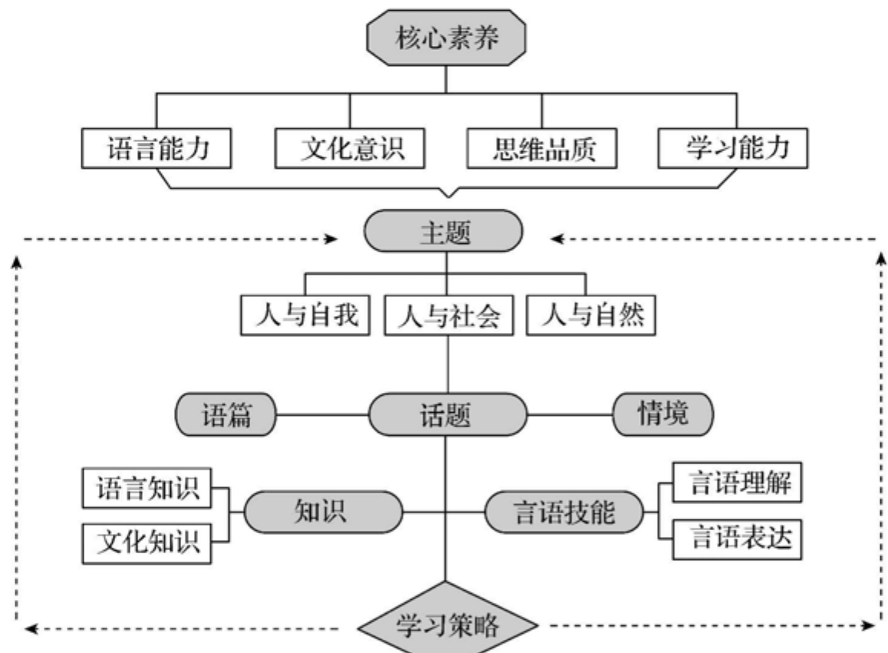
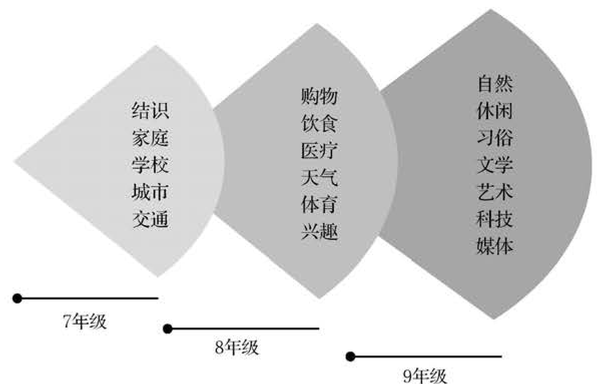
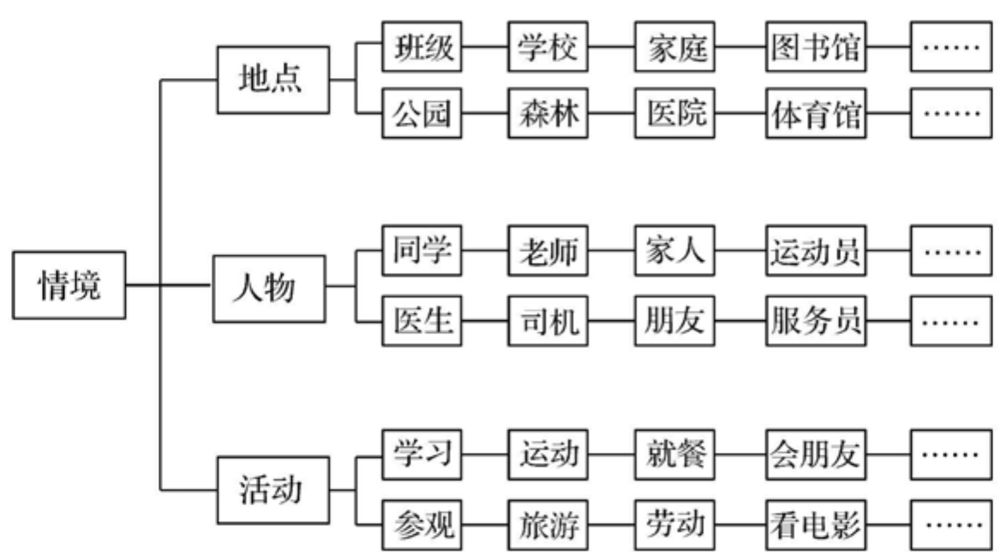
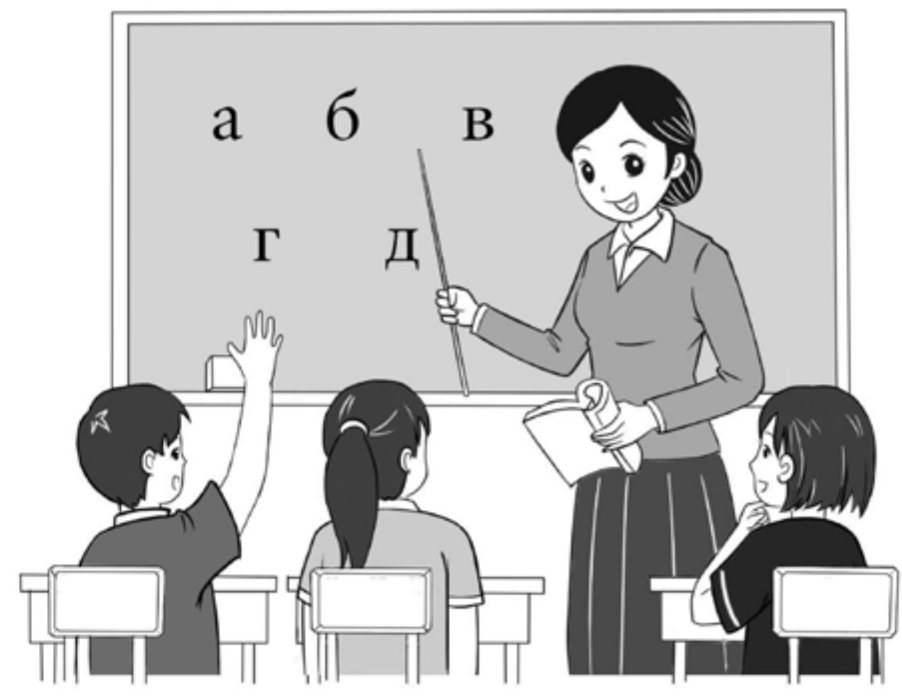
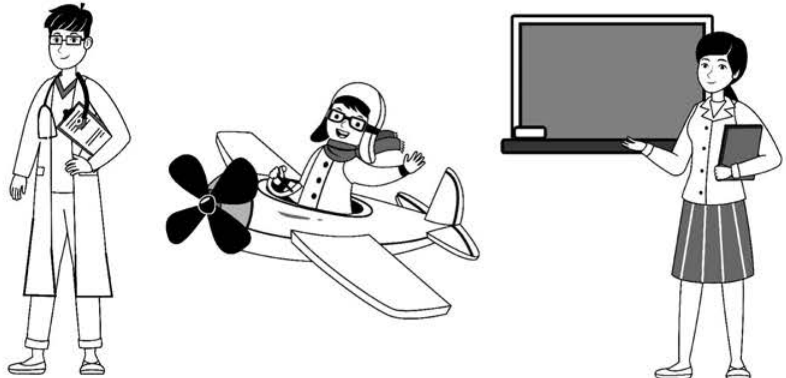

## 义务教育

# 俄语课程标准

（2022年版）

中华人民共和国教育部制定

## 前言

习近平总书记多次强调，课程教材要发挥培根铸魂、启智增慧的作用，必须坚持马克思主义的指导地位，体现马克思主义中国化最新成果，体现中国和中华民族风格，体现党和国家对教育的基本要求，体现国家和民族基本价值观，体现人类文化知识积累和创新成果。

义务教育课程规定了教育目标、教育内容和教学基本要求，体现国家意志，在立德树人中发挥着关键作用。2001年颁布的《义务教育课程设置实验方案》和2011年颁布的义务教育各课程标准，坚持了正确的改革方向，体现了先进的教育理念，为基础教育质量提高作出了积极贡献。随着义务教育全面普及，教育需求从“有学上”转向“上好学”，必须进一步明确“培养什么人、怎样培养人、为谁培养人”，优化学校育人蓝图。当今世界科技进步日新月异，网络新媒体迅速普及，人们生活、学习、工作方式不断改变，儿童青少年成长环境深刻变化，人才培养面临新挑战。义务教育课程必须与时俱进，进行修订完善。

### 一、指导思想

以习近平新时代中国特色社会主义思想为指导，全面贯彻党的教育方针，遵循教育教学规律，落实立德树人根本任务，发展素质教育。以人民为中心，扎根中国大地办教育。坚持德育为先，提升智育水平，加强体育美育，落实劳动教育。反映时代特征，努力构建具有中国特色、世界水准的义务教育课程体系。聚焦中国学生发展核心素养，培养学生适应未来发展的正确价值观、必备品格和关键能力，引导学生明确人生发展方向，成长为德智体美劳全面发展的社会主义建设者和接班人。

### 二、修订原则

### （一）坚持目标导向

认真学习领会习近平总书记关于教育的重要论述，全面落实有理想、有本领、有担当的时代新人培养要求，确立课程修订的根本遵循。准确理解和把握党中央、国务院关于教育改革的各项要求，全面落实习近平新时代中国特色社会主义思想，将社会主义先进文化、革命文化、中华优秀传统文化、国家安全、生命安全与健康等重大主题教育有机融入课程，增强课程思想性。

### （二）坚持问题导向

全面梳理课程改革的困难与问题，明确修订重点和任务，注重对实际问题的有效回应。遵循学生身心发展规律，加强一体化设置，促进学段衔接，提升课程科学性和系统性。进一步精选对学生终身发展有价值的课程内容，减负提质。细化育人目标，明确实施要求，增强课程指导性和可操作性。

### （三）坚持创新导向

既注重继承我国课程建设的成功经验，也充分借鉴国际先进教育理念，进一步深化课程改革。强化课程综合性和实践性，推动育人方式变革，着力发展学生核心素养。凸显学生主体地位，关注学生个性化、多样化的学习和发展需求，增强课程适宜性。坚持与时俱进，反映经济社会发展新变化、科学技术进步新成果，更新课程内容，体现课程时代性。

### 三、主要变化

### （一）关于课程方案

一是完善了培养目标。全面落实习近平总书记关于培养担当民族复兴大任时代新人的要求，结合义务教育性质及课程定位，从有理想、有本领、有担当三个方面，明确义务教育阶段时代新人培养的具体要求。

二是优化了课程设置。落实党中央、国务院“双减”政策要求，在保持义务教育阶段九年9522总课时数不变的基础上，调整优化课程设置。将小学原品德与生活、品德与社会和初中原思想品德整合为“道德与法治”，进行一体化设计。改革艺术课程设置，一至七年级以音乐、美术为主线，融入舞蹈、戏剧、影视等内容，八至九年级分项选择开设。将劳动、信息科技从综合实践活动课程中独立出来。科学、综合实践活动起始年级提前至一年级。

三是细化了实施要求。增加课程标准编制与教材编写基本要求；明确省级教育行政部门和学校课程实施职责、制度规范，以及教学改革方向和评价改革重点，对培训、教科研提出具体要求；健全实施机制，强化监测与督导要求。

### （二）关于课程标准

一是强化了课程育人导向。各课程标准基于义务教育培养目标，将党的教育方针具体化细化为本课程应着力培养的核心素养，体现正确价值观、必备品格和关键能力的培养要求。

二是优化了课程内容结构。以习近平新时代中国特色社会主义思想为统领，基于核心素养发展要求，遴选重要观念、主题内容和基础知识，设计课程内容，增强内容与育人目标的联系，优化内容组织形式。设立跨学科主题学习活动，加强学科间相互关联，带动课程综合化实施，强化实践性要求。

三是研制了学业质量标准。各课程标准根据核心素养发展水平，结合课程内容，整体刻画不同学段学生学业成就的具体表现特征，形成学业质量标准，引导和帮助教师把握教学深度与广度，为教材编写、教学实施和考试评价等提供依据。

四是增强了指导性。各课程标准针对“内容要求”提出“学业要求”“教学提示”，细化了评价与考试命题建议，注重实现“教—学—评”一致性，增加了教学、评价案例，不仅明确了“为什么教”“教什么”“教到什么程度”，而且强化了“怎么教”的具体指导，做到好用、管用。

五是加强了学段衔接。注重幼小衔接，基于对学生在健康、语言、社会、科学、艺术领域发展水平的评估，合理设计小学一至二年级课程，注重活动化、游戏化、生活化的学习设计。依据学生从小学到初中在认知、情感、社会性等方面的发展，合理安排不同学段内容，体现学习目标的连续性和进阶性。了解高中阶段学生特点和学科特点，为学生进一步学习做好准备。

在向着第二个百年奋斗目标迈进之际，实施新修订的义务教育课程方案和课程标准，对推动义务教育高质量发展、全面建设社会主义现代化强国具有重要意义。希望广大教育工作者勤勉认真、行而不辍，不断创新实践，把育人蓝图变为现实，培育一代又一代有理想、有本领、有担当的时代新人，为实现中华民族伟大复兴作出新的更大贡献！

## 目录

一、课程性质 1 二、课程理念 2 三、课程目标 4 （一）核心素养内涵 4 （二）目标要求 5 四、课程内容 9 （一）主题 10 （二）话题 10 （三）知识 13 （四）言语技能 20 （五）学习策略 23 五、学业质量 26 （一）学业质量内涵 26 （二）学业质量描述 26 六、课程实施 28 （一）教学建议 28 （二）评价建议 30 （三）教材编写建议 38

（四）课程资源开发与利用 41（五）教学研究与教师培训 43附录 46附录1 语音 46附录2 语法 48附录3 日常用语 51附录4 词汇表 54附录5 教学案例 94

## 一、课程性质

俄语属于印欧语系斯拉夫语族东斯拉夫语支，是俄罗斯联邦的官方语言，是多个国家、地区的通用语和联合国工作语言之一，是国际交流与合作的重要交际工具。学习和使用俄语有助于借鉴人类文明成果、增进中国和其他国家的相互理解，对推进文明互鉴具有重要作用。

义务教育俄语课程具有工具性和人文性双重性质，有利于学生掌握基本的俄语语言知识，发展基本的俄语听、说、读、写等技能，形成初步的综合语言运用能力；有利于学生了解不同文化的差异与共性，开阔国际视野，涵养家国情怀，树立正确的世界观、人生观和价值观，促进思维发展，培养创新意识，为义务教育阶段之后的俄语学习和终身发展奠定基础。

## 二、课程理念

### 1.落实立德树人根本任务，发挥俄语课程育人功能

俄语课程以习近平新时代中国特色社会主义思想为指导，全面落实立德树人根本任务，深入贯彻新发展理念，充分体现课程的育人功能和价值；引导学生在掌握语言知识、获得言语技能的过程中发展语言能力，培养文化意识，形成思维品质，提高学习能力，成为具有文化自信、国际视野和跨文化交际能力的社会主义建设者和接班人。

### 2.确定主题活动内容主线，注重课程结构层次系统

俄语课程符合核心素养的内在逻辑和学生身心发展规律，关注学生的共同基础。课程结构严谨，多学科知识融合，具有层次性与系统性。主题活动统领课程内容，语篇与情境相辅相成，知识与技能内含其中，学习策略贯穿始终。目标与内容、活动与过程、评价与反思等要素有机融合，使各结构之间密切关联。

### 3.体现以学生为主体理念，构建合理课程内容体系

俄语课程内容聚焦学生核心素养，体现以学生为主体的理念，符合学生的认知心理特点。主题聚焦“人与自我”“人与社会”“人与自然”；话题贴近生活，体现时代性与育人价值；知识传授关注素养，技能训练关注交际，策略实施关注方法。课程设计彰显课程内容结构与价值取向，培养学生综合语言运用能力。

### 4. 推动教与学方式改革，培养学生自主学习能力

俄语课程倡导活动教学，从发展学生核心素养出发，围绕主题创设真实的言语交际情境，开展多样化教学活动，激发学生的学习兴趣，提高学生的主体意识；提倡合作与探究式学习，鼓励学生在活动中自主选择学习方法，探索个性化学习策略；运用多种信息技术手段，丰富课程资源，拓宽学习渠道，提升学生学习能力。

### 5. 创新评价内容与方法，促进学生素养全面发展

俄语课程学业评价以全面提高学生核心素养为导向，推进教学高质量发展。在考查学生知识与技能的过程中，注重文化意识、思维品质和学习能力的表现；倡导形成性评价与终结性评价、定性评价与定量评价相结合，注重评价的诊断功能，体现评价目标多维化、评价主体多元化和评价方法多样化，促进学生素养全面发展。

## 三、课程目标

俄语课程围绕核心素养，体现课程性质，反映课程理念，确立课程目标。

### （一）核心素养内涵

核心素养是课程育人价值的集中体现，是学生通过课程学习逐步形成的正确价值观、必备品格和关键能力。俄语课程要培养的学生核心素养，主要包括语言能力、文化意识、思维品质和学习能力等方面。语言能力是核心素养的基础要素，文化意识体现价值取向，思维品质反映心智特征，学习能力提供发展保障，四个方面相互依存、彼此促进、协同发展，构成具有内在联系的有机整体。

### 1.语言能力

语言能力指通过俄语课程学习掌握基本的俄语语言知识，发展基本的听、说、读、写等技能，形成初步的综合语言运用能力。语言能力是获取知识，理解意义，陈述事实，表达观点、情感和态度的基础。培养语言能力能帮助学生在跨文化交际活动中树立信心，有助于提高学生的文化意识、思维品质和学习能力，为下一步学习奠定基础。

### 2.文化意识

2. 文化意识文化意识指对中外文化及其差异的认识和理解，是得体运用语言和成功进行跨文化交际的必要条件。文化意识是学生在经济全球化背景下表现出的跨文化的认知态度和行为方式。培养文化意识能使学生在中外文化比较中坚定文化自信，具有国际视野，尊重和包容文化的多样性，互学互鉴，从不同文明中寻求智慧、汲取营养，弘扬中华优秀传统文化，形成健康向上的审美情趣和正确价值观。

### 3.思维品质

3. 思维品质思维品质指人的思维个性特征，反映个体思维水平的差异。思维品质主要体现为思维的逻辑性、深刻性、独立性、灵活性、批判性、创造性等。培养思维品质能使学生从中俄文化视角观察和认识世界，学会独立思考，辩证看待事物，多角度发现问题、分析问题和解决问题，具备初步的批判、反思和创新意识。

### 4.学习能力

4. 学习能力学习能力指获取知识、运用知识、自我调控等方面的综合能力，是掌握外语知识、提升外语素养的必要条件。学习能力体现核心素养的可持续性，为学生在俄语学习过程中设定目标、监督进度、采取措施和改进学习方法提供重要保障。培养学习能力能使学生保持浓厚的学习兴趣，养成良好的学习习惯，开展自主学习、合作学习和探究学习，形成初步的终身学习意识。

### （二）目标要求

（二）目标要求俄语课程旨在落实立德树人根本任务，以语言知识和文化知识为基础，以培养和发展核心素养为导向，通过开展多种形式的言语活动，帮助学生发展俄语听、说、读、写等技能，形成用俄语与他人交流的能力。在学习中促进学生心智全面发展，提高人文素养，引导学生成为具有坚定理想信念、家国情怀和国际视野的社会主义建设者和接班人。

### 1. 语言能力

语言能力主要体现为感知与积累、习得与建构、表达与交流三个层面。

### （1）感知与积累

能识别俄语语音、常用调型的基本特征；能掌握词的书写和词形变化；能熟记词语搭配，了解一般搭配规则，辨别基本句式；能基本理解题材熟悉、语速较慢的简短口头表述和与所学内容难易程度相当的阅读文章，掌握主要信息，理解主题意义；能掌握基本的日常用语，并熟悉相应的言语礼节。

### （2）习得与建构

能掌握俄语语音、常用调型的基本意义；能分析词的构成，掌握词的基本意义；能梳理学过的语法知识，了解一般变化规则；能通过上下句理解句子含义，依据情境理解语篇主要内容；能将意义关联的词语和句子组成语篇；能正确判断听到或读到的语篇中人物和事件的主要信息。

### （3）表达与交流

能依据情境就熟悉的话题展开简单交流，表达基本思想意图，做到语音、语调、词汇和语法基本正确，语言表达较为连贯，交际基本得体，仪态、仪表自然；能选用多种形式的简单句和基本形式的复合句进行简单叙述或描写，用词恰当，语句通顺，结构合理，层次清楚。

### 2. 文化意识

文化意识主要体现为比较与判断、调适与沟通、感悟与内化三个层面。

（1）比较与判断具有主动学习中俄文化的兴趣；通过所学话题获取俄罗斯文化知识，了解传统习俗、行为规范、价值观念等文化内涵，理解文化多样性，尊重文化差异；能用俄语简单描述中俄文化内容，表达观点；具备初步的分析、比较、鉴别中俄文化异同的意识和基本能力。

（2）调适与沟通具有积极参与跨文化交流活动的兴趣；通过主题活动和跨学科实践活动初步了解中俄文化差异，学会运用跨文化交际所需的基本礼仪和方式方法；能在交际活动中理解、尊重和包容对方的行为习惯和文化传统；具备初步的用俄语进行跨文化交流的意识和基本能力。

### （3）感悟与内化

具有了解中俄优秀文化精神内涵的兴趣；能从课内、课外的学习和实践活动中领会和感悟其中蕴涵的正确价值观、高尚的道德情操和健康的审美情趣；学会理解和尊重目标语国家文化，增强文化自信；具备初步的自我完善、发展健全人格的主动意识和行动能力。

### 3.思维品质

思维品质主要体现为观察与比较、归纳与推断、批判与创新三个层面。

### （1）观察与比较

能从文字、图片、音视频等多种形式的学习内容中观察事物的发生、发展和变化，了解一般信息和主要信息，初步判断作者的观点和意图；能通过比较分析，发现中俄语言中的不同结构和表达方式，学会从不同角度观察、思考、认识和解决问题。

### （2）归纳与推断

能归纳学习内容的主要信息，理解整体意义，推断思想观点；能对学习内容中的主要信息进行简单的复述和转述，语言清晰，层次分明；能用已有信息推断关联信息，条理清晰，符合逻辑；能从中俄不同的文化视角分析学习内容，作出正确的价值判断。

### （3）批判与创新

能在理解学习内容的基础上，对表达的立场、观点等进行初步思考和分析，作出正确的判断和推理；能依据学习内容的多种信息，进行独立思考和理性分析，作出合理的解释和评价；能就熟悉的题材内容进行简单的缩写和扩写，语言通顺、恰当、得体。

### 4. 学习能力

学习能力主要体现为乐学与进取、规划与调整、合作与探究三个方面。

### （1）乐学与进取

对俄语课程保持浓厚的学习兴趣、积极的学习态度和强烈的学习愿望；能积极参与课堂活动，自觉主动地用俄语交流，勇于表达，大胆实践；能通过模拟对话、阅读课文、学唱歌曲、编演节目等方式，体会俄语语言魅力，提高用俄语交流的能力。

### （2）规划与调整

能制订明确的学习计划，合理安排学习任务，学会预习、复习课程内容，整理、归纳所学知识，抓住重点，突破难点；能有选择地收集俄语学习资源，运用多种信息技术手段辅助俄语学习；能发现问题并适时调整学习计划与学习方法，探索个性化学习策略。

### （3）合作与探究

能根据主题创设必要的交际情境，营造良好的学习氛围；能积极建立同伴关系，分享俄语学习心得，共同探讨学习经验，完成小组学习任务；能在学习实践中积极思考，主动探究，发现问题，总结规律，对所学知识进行拓展性运用，为终身学习奠定基础。

## 四、课程内容

俄语课程内容以核心素养为导向，由主题、话题、知识、言语技能和学习策略等要素构成。主题是课程内容呈现的主线，为学科育人活动和语言学习提供内容资源。话题是主题内容的载体，通过语篇与情境体现。知识是语言知识与文化知识的总和；语言知识包括语音、词汇和语法知识等；文化知识包括俄罗斯的国家概况、生活习俗和言语礼节等。言语技能是言语理解与表达的能力和手段，包括听、说、读、写等。学习策略是学习的执行和监控机制，贯穿整个学习过程，为提高学习效率提供方法指导。主题、话题、知识、言语技能和学习策略共同促进核心素养发展，形成语言能力、文化意识、思维品质和学习能力。

课程内容设计以主题为主线，围绕“人与自我”“人与社会”“人与自然”确定主题内容。话题依据学生的生活经验，遵循由近及远、由易到难、循序渐进的认知规律，在7年级、8年级和9年级依次出现。知识支撑话题内容，言语技能在学习中形成，跨学科学习依托话题内容实现。学习策略调节学习过程，贯穿学习始终。在教学中，通过主题活动培养学生的综合语言运用能力。

### （一）主题

主题是围绕人们生活、学习和工作的某一领域展开的活动类别，是组织和连接课程内容要素的主线。“人与自我”以“我”为视角，围绕“人”的家庭生活和学校学习展开活动，包括做人做事和与人交往，内容突出关爱他人、礼貌谦让、助人为乐、尊敬师长、诚实守信、自立自强等主题意义。“人与社会”以“社会”为视角，围绕“人”的社会生活展开活动，包括社会活动和社会文化，内容突出爱国主义、中华优秀传统文化、革命传统、国家安全、健康生活、社会主义核心价值观等主题意义。“人与自然”以“自然”为视角，围绕“人”与自然的关系展开活动，包括自然生态和环境保护，内容突出热爱家乡、文明行为、保护环境、科学精神、探索未来、与自然和谐共生等主题意义。主题意义体现学科育人价值，是话题内容选择的重要依据。根据学生认知能力和年龄特点，在主题范围框架下，归纳出18个话题，作为义务教育阶段学生的主要学习内容。

### （二）话题

话题是围绕“人与自我”“人与社会”“人与自然”主题展开的具体活动题目，包括做人做事、与人交往、社会活动、社会文化、自然生态和环境保护等主题内容。话题依据主题内容，以语篇与情境的方式呈现。语篇内容包含语言知识、文化知识和跨学科知识，体现话题的育人价值。学生依托语篇与情境，在听、说、读、写等言语活动中综合运用各类知识，提高言语技能，形成综合语言运用能力。依据主题内容及育人价值，18个话题在三个年级中依次出现。

语篇 语篇是实际使用的语言单位，包括口头、书面和音频等形式。语篇承载话题内容，是语言学习的内容单位。通过内容丰富、形式多样的语篇，学习语言知识、文化知识和跨学科知识，提高听、说、读、写等技能，形成综合语言运用能力。

情境 情境指具有一定情感氛围的场景，包含时间、地点、人物和活动等，是理解语篇内容的重要前提。情境依据话题内容创设，是课堂教学的基本要素，具有直观性和真实性。情境围绕18个话题，按照地点、人物和活动三个维度设计。

### 【学业要求】

能初步了解语篇结构，识别对话中的角色特点和话语转换；能借助句子结构，理解语篇主要内容，掌握语篇主题意义；能分辨句子成分，正确回答问题；能依据情境，借助题目、结合图片表达语意连贯的话语；能在情境中表达与交流，语言正确、得体。

能依据语篇内容了解俄罗斯的国家概况、生活习俗、言语礼节等，理解常用词汇的文化含义；能在语篇与情境中理解和运用文化知识，体会文化含义，感悟其中蕴涵的价值观；能初步了解中俄文化的不同特点和两种语言的差异，增强对中华文化的热爱。

能根据语篇中的人物和事件的发生、发展过程，初步了解语篇大意；能通过分析与综合，了解语篇的具体信息；能通过梳理与归纳，把握语篇内容的逻辑关系；能通过反思与评价，初步判断说话人的交际意图；能根据语篇内容进行简单缩写和扩写。

能合理分配学习时间，课前预习，课上集中注意力，课后主动复习；能依据已有知识与新学知识的联系，理解与运用新知识；乐于参与课堂学习活动，与他人合作交流；能借助多种学习资源，运用多种信息技术手段，解决学习中遇到的问题。

### 【教学提示】

教师要突出语篇内容的育人价值，重视语篇内容的思想性，引导学生树立正确的人生观和价值观；重视语篇内容的文化性，引导学生了解中俄文化异同，增进文化理解。教师要指导学生在语篇与情境中学习语言知识和文化知识，拓展跨学科知识，开展言语技能训练；在主题活动中，通过合作交流，培养学生独立解决问题的能力。

教师要引导学生依据语篇中的时间、地点、人物和事件，初步了解语篇内容；运用语篇常用句式和上下句连接方式，分析语篇内容，理解具体信息；通过回答问题、概括段落大意、归纳主题意义，掌握语篇主要信息；运用对比分析的方法，感悟中俄文化的不同特点，理解不同民族的价值观，培养学生得体地表达与交流的能力。

教师要依据语篇内容与情境创设主题活动，鼓励学生积极参与主题活动，敢于用俄语表达与交流；通过小组讨论、小组竞赛等方式，梳理、归纳语篇知识，加深对语篇知识的理解；通过看图表达、情景对话、文化对比等方式，提高言语理解与表达能力；通过角色扮演、合作探究等方式，提高综合语言运用能力。

### （三）知识

### 1. 语言知识

语言知识是用于言语交际活动的语言材料，包括语音、词汇和语法，三者构成语言的基本要素。语言知识是形成语言能力的重要基础。通过语言知识学习，提高学生听、说、读、写等言语技能，形成综合语言运用能力，为终身学习和发展奠定基础。

### 【内容要求】

语音知识 语音是由人的发音器官发出的表达意义的声音。语音知识包括字母读音、音节、重音、语调、调型、重读、连读、停顿，以及语音规则等。

词汇知识 词汇是语言中所有词的总和。词具有一个或一个以上意义；词与词在意义上具有同义或反义关系；词由词根、前缀、后缀和词尾构成。词汇知识包括词汇的基本意义、文化含义和构词方法等。

语法知识 语法包括词法和句法两个部分。词法是词形变化规则的总和，句法指遣词造句的规则。语法知识包括各词类的词形变化和用法，以及句子结构、句子成分、简单句和复合句用法等。

续表

<table><tr><td>年级</td><td colspan="2">内容描述</td></tr><tr><td rowspan="3">7～9年级</td><td>词法</td><td>5. 数词：掌握基数词、顺序数词、不定量数词的基本形式、意义和用法；了解数词与名词连用的规则；掌握基本的时间表示法和年龄表示法。 6. 副词：掌握谓语副词的意义和用法。 7. 前置词：掌握前置词的意义和用法。</td></tr><tr><td>句法</td><td>1. 掌握句子的主要成分。 2. 简单句：掌握陈述句、疑问句和祈使句的意义和用法。 3. 复合句：掌握带连接词 n、a、no、副词 的并列复合句的意义和用法；掌握带连接词 vto 的主从复合句的意义和用法。</td></tr></table>

### 【学业要求】

掌握语音、常用调型、词汇和语法基本知识。能运用分类与归类的方法，理解语言知识；能在听、说、读、写等言语活动中，巩固语言知识；能在主题活动中，综合运用语言知识；能运用已学语言知识，在熟悉的情境中表达与交流。

能运用语言知识描述中俄文化内容，具备初步的比较、分析和判断中俄文化异同的意识；能在语篇与情境中理解语言知识承载的文化含义；能在主题活动和文化专题活动中，通过表达与交流，综合运用语言知识和文化知识，拓宽文化视野。

能梳理与归纳所学语言知识；能用已知信息推断关联信息；能运用综合、分析和对比的方法，从中俄不同文化视角分析语言知识，感悟两种语言的文化差异，了解不同民族语言知识的文化内涵，形成从不同角度观察、认识和解决问题的能力。

能根据语言知识的不同特点，找到适合自己的学习方法；能在教师指导下，不断总结学习经验、找出不足；能借助多种信息技术手段扩展学习资源，辅助语言知识学习；能养成课前预习、课上积极参与活动、课后整理所学知识的习惯。

### 【教学提示】

教师要根据学生的认知能力和年龄特点，设计教学情境和任务，合理安排知识内容，由浅入深、由易到难，循序渐进，促进学生在情境中掌握语言知识。要通过语言知识讲练，使学生熟练运用语言知识描述人物和事件的发生、发展过程，分析人物和事件的特点，简要表达观点。

教师要指导学生依据语篇与情境，在运用语言知识的过程中，形成有效的学习策略。要引导学生通过模仿与操练，理解语音规则，掌握语音和常用调型，熟悉连读和停顿等；在语篇与情境中理解词汇知识，掌握词汇基本意义及文化含义；在创设的情境中感知语法，在言语活动中理解语法，将语言知识学习贯穿于活动。

教师要指导学生在主题活动中综合运用语言知识，促进语言知识的学习，有机融合语言知识与文化知识，使言语表达正确、得体；引导学生将语言知识理解与练习密切结合，提高言语技能水平，将语言知识运用与情境密切结合，完成交际任务；营造宽松、和谐的氛围，激发学生参与活动的积极性。

### 2. 文化知识

义务教育俄语课程内容的文化知识主要指俄罗斯的国家概况、生活习俗、言语礼节和中华优秀传统文化知识等。通过文化知识学习，了解俄罗斯的地理历史、风土人情、传统习俗、生活方式、文学艺术、行为规范和价值观等。通过对比中俄文化异同，加深学生对中华文化的热爱。

### 【内容要求】

### 【学业要求】

能依据语篇与情境，通过梳理与归纳，了解俄罗斯的地理、历史、文学、艺术和行为规范等方面的知识，了解俄罗斯人的生活习俗、言语礼节和交际礼仪，理解常用词汇的文化含义；能在主题活动中恰当运用文化知识表达与交流。

能在语篇与情境中，通过分析与综合，初步了解文化知识，通过对比与运用，加深对文化知识内涵的理解；能综合运用语言知识和文化知识，在文化专题活动中表达思想；能就中俄文化知识进行简单比较，提高文化理解，增强文化自信。

能借助图片、音视频等多种形式，通过观察与比较，了解俄罗斯的国家概况、生活习俗和言语礼节等；能在语篇与情境中，通过分析与对比，了解中俄两种语言中词义的文化差异，感悟不同民族的思维方式；能通过判断与推理，辩证看待中俄文化差异。

能积极参加文化专题活动，主动与他人合作，通过表达与交流，加深对文化知识的理解；能通过归类与分类，系统梳理并掌握俄罗斯文化知识；能在主题活动中，有效运用交际策略，完成交际任务；能运用多种信息技术手段，学习文化知识，拓宽文化视野。

### 【教学提示】

教师要引导学生在语篇与情境中，通过听、说、读、写等言语活动，在理解与运用过程中学习文化知识；帮助学生在主题活动中，通过交流合作、角色体验，感悟文化知识蕴涵的俄罗斯民族的性格特点、行为方式和价值观；在文化专题活动中，引导学生通过对比与运用，了解中俄文化异同，尊重俄罗斯文化，热爱中华文化。

教师要充分挖掘语篇与情境中的文化知识，引导学生在分析与比较的过程中，了解俄罗斯文化知识和中华优秀传统文化知识；指导学生系统梳理语篇与情境中的文化知识；通过举办不同内容的文化专题活动，帮助学生在分析与判断的过程中，理解中俄文化知识内涵，培养文化意识，形成国际视野。

文化知识的主题活动以文化专题活动形式呈现，具有综合性、实践性和跨学科性，包括活动准备（如查找文献、收集资料等）、活动实施（如体验活动、图片展示、视频播放、内容解说等）和活动评价（如活动效果评价与反思）三个步骤。文化专题活动要在教师指导下由学生自主组织实施。

### （四）言语技能

言语技能是语言能力的重要组成部分，包括听、说、读、写等。听、读是言语理解技能，说、写是言语表达技能。学生通过主题活动，进行听、说、读、写训练，发展言语技能。

### 【内容要求】

续表

<table><tr><td>年级</td><td>类别</td><td>内容描述</td></tr><tr><td rowspan="2">7年级</td><td>读</td><td>1.能正确认读33个字母。 2.能正确拼读音节和单词。 3.能按角色朗读对话，语音、语调基本正确。</td></tr><tr><td>写</td><td>1.能正确书写33个大小写字母。 2.初步掌握俄语书写规范。 3.能依据情境听写和仿写常用句子。</td></tr><tr><td rowspan="4">8年级</td><td>听</td><td>1.能听懂简单课堂用语和教学指令。 2.能依据情境听懂熟悉话题的对话和短文的大意。 3.能听懂并理解调型1、调型2和调型3表达的意义。</td></tr><tr><td>说</td><td>1.能依据情境进行3个轮次的会话交流，语音、语调正确。 2.能熟练运用日常用语，表达请求、赞同、祝贺、致歉等。 3.能依据情境，围绕熟悉的话题，简单复述对话与短文主要内容。</td></tr><tr><td>读</td><td>1.能按角色流利朗读对话，语音、语调正确。 2.能熟练朗读3～5首俄文短诗，初步感知俄文诗歌的韵律。 3.能依据情境读懂语篇的主要内容，并能概括主要人物特征与事件梗概。</td></tr><tr><td>写</td><td>1.能依据情境仿写简单句子。 2.能依据情境编写简单对话。 3.能就熟悉的话题简短描述图片的主要信息。</td></tr><tr><td rowspan="4">9年级</td><td>听</td><td>1.能听懂简单对话，理解交际意图，在交际情境中积极互动。 2.能听懂熟悉话题的语篇的主要内容，正确回答问题。</td></tr><tr><td>说</td><td>1.能依据情境进行4个轮次以上的会话交流。 2.能依据情境简要转述对话和短文的主要内容。</td></tr><tr><td>读</td><td>1.能读懂语篇的主要内容，概括主题意义和主要观点。 2.能借助工具书和网络资源开展课外阅读，获取有益信息。</td></tr><tr><td>写</td><td>1.能依据情境，选择恰当词语并写出符合言语规范的句子。 2.能依据情境，写出逻辑通顺的短文。</td></tr></table>

### 【学业要求】

能主动参与听、说、读、写等言语活动，通过模仿和替换，形成基本的言语熟巧；通过理解和表达，形成初步的言语技能；能依据情境理解语言材料，根据题目或提纲，正确、得体地表达与交流；能根据标题或图片写出语意连贯的短文。

能在听、说、读、写等言语活动中，通过合作与体验，了解俄罗斯的国家概况、生活习俗和言语礼节等，理解俄语常用词汇的文化含义；能在主题活动和文化专题活动中，综合运用文化知识表达思想，感悟言语表达与交流方式的差异。

能在主题活动中，注重听、说、读、写等言语技能的协调发展。通过比较与分析，了解俄语语言结构特征，理解中俄两种语言表达方式的差异，形成初步的俄语语感；通过对语篇内容表达的主题意义进行归纳与概括，提高独立分析与解决问题的能力。

能在听、说、读、写等言语活动中，积极与他人合作，完成交际任务；能克服言语理解与表达过程中的焦虑心理，提高学习自信心；能根据具体学习任务，选择可行的学习方法；能利用多种信息技术手段，辅助言语练习，提高技能水平。

### 【教学提示】

关注语言能力，注重言语训练。教师要运用语言材料设计大量言语技能训练活动，引导学生在感知、理解和运用语言知识的过程中，形成初步的言语熟巧；依据语篇情境设计形式多样的主题活动，引导学生在情境中运用听、说、读、写等方式表达思想，交流情感，使言语理解与表达有机结合，协调发展。

关注教学过程，注重言语输出。教师要鼓励学生积极参加言语技能训练活动，通过观察与体验，感悟言语表达特点；指导学生在主题活动中，通过合作与探究，提高言语技能，形成良好的言语理解与表达能力；引导学生在情境中带着问题和任务，通过听、读等方式理解语篇内容，通过说、写等方式表达思想观点。

倡导活动方式，重视直接经验。教师要引导学生通过主题活动加深对语言的感悟与理解，注重在交流中提高语言运用能力；引导学生带着问题和任务参与言语训练活动，使言语理解与表达贯穿教学全过程；根据学生的生活经验，创设丰富多样的主题活动，引导学生表达情感态度，形成正确价值观。

### （五）学习策略

学习策略是学习的执行和监控机制，是为提高学习效率展开的一系列智力活动和思维步骤，包括认知策略、调控策略、情感管理策略、交际策略和资源策略。

### 【内容要求】

续表

|  |  |
| --- | --- |
| 年级 | 内容描述 |
| 9年级 | 1.具有浓厚的俄语学习兴趣，能在主题活动中主动探究较为复杂的问题。 2.能通过对比和分析建立语言知识之间的联系，理解常用词汇的文化含义。 3.能积极参与主题活动，在话题情境中完成交际任务。 4.能适时调整俄语学习计划，反思与评价学习效果。 5.能借助多种信息技术手段进行探究学习。 |

### 【学业要求】

能主动参与课堂学习活动，学会在语篇与情境中理解语言知识，提高言语技能；能运用多种方法理解并记忆词汇和语法，建立已有知识与新学知识的联系；能主动寻求交际机会，积极与他人合作，完成主题活动任务。

能依据语篇与情境了解俄罗斯的国家概况、生活习俗和言语礼节等，理解常用词汇的文化含义；能遵守言语礼节和行为规范，对比中俄文化异同，形成初步的文化意识；能在情境中正确、恰当地表达与交流，实现交际目的。

能依据语篇与情境，通过对语言材料的分析与概括，了解语篇上下句的连接方式，理解不同类型语篇的结构和特点；能在学习过程中不断反思与总结，掌握一般学习规律，提高学习能力，形成初步的批判与创新意识。

具有浓厚的学习兴趣和良好的学习态度，能积极参与主题活动，克服焦虑心理，敢于表达与交流；能定期复习、整理所学知识，养成良好的学习习惯；能制订学习计划，反思学习问题，调整学习方法；能利用多种信息技术手段辅助学习。

### 【教学提示】

有效的学习策略是提高学习能力的主要途径，表现为学生自我控制和调整学习行为的能力。教师要引导学生根据学习任务选择相应的学习方法，逐步形成个性化学习策略；指导学生针对阶段性学习目标制订相应的学习计划，调控学习过程；指导学生运用多种信息技术手段开展自主学习，为终身学习奠定基础。

教师要将学习策略训练贯穿教学全过程，注重学生在学习过程中的行为变化。学习活动前，指导学生分析学习情境、提出相关问题、选择相应的学习方法；学习活动中，指导学生根据学习任务制订学习计划，调控学习进程；学习活动后，组织学生分享经验、反思学习策略与效果，培养学生的自主学习能力。

教师要依据语篇与情境设计主题活动，依据学生语言水平确定活动内容和形式，设计有逻辑关联的探究性问题，通过解决问题，推进活动进程；鼓励学生积极参与主题活动，在解决问题的过程中加深对语言知识和文化知识的理解，提高言语理解与表达水平；持续关注学生的学习兴趣、态度和行为变化，提供有针对性的策略指导，促进学生全面发展。

## 五、学业质量

### （一）学业质量内涵

学业质量是学生在完成课程阶段性学习后的学业成就表现，反映核心素养要求。俄语课程学业质量标准是以核心素养为主要维度，结合课程内容，对学生学业成就具体表现特征的整体刻画。

### （二）学业质量描述

|  |  |
| --- | --- |
| 类别 | 学业质量描述 |
| 义务教育阶段 | 能在熟悉的情境中，综合运用语言知识、文化知识和跨学科知识，按照要求，完成主题活动中的交际任务；能听懂简单的口头表述内容，并简要复述和转述；能读懂语篇的基本内容，归纳主要信息，明确主题意义；能依据题目、结合图片或影像画面等，用相对完整、通顺的话语简单介绍身边的事物，表达自己的意图。 能了解俄罗斯的国家概况、生活习俗和言语礼节等，正确理解常用词汇的文化含义；能通过分析和比较，了解中俄文化异同，尊重俄罗斯文化，热爱中华文化；能正确运用文化知识，恰当使用交际礼仪，进行简单的表达与交流；能用得体的方式简单介绍中华文化、风俗习惯和家乡风貌等，具备一定的跨文化沟通与交流能力。 |

续表

|  |  |
| --- | --- |
| 类别 | 学业质量描述 |
| 义务教育阶段 | 能依据语篇题目和文化知识，感知语篇大意；能通过梳理与归纳，了解语篇的主要信息；能通过判断与推理，掌握语篇的主题意义；能依据情境判断对方交际意图；能依据题目表达自己的思想，语言通顺，内容切题；能就熟悉的题目写出短文，结构合理，层次分明；能依据提纲归纳和概括主题信息，语言简练，条理清晰。 能在学习活动中提高学习兴趣，增强积极的进取精神；能与他人探讨学习中遇到的问题，乐于分享和交流经验，改进学习方法，提高学习效果；能确定学习任务，制订学习计划，定期复习与归纳所学知识，总结与反思自己的学习行为和学习过程；能选择运用学习资源和多种信息技术手段辅助学习，形成基本的学习能力。 |

## 六、课程实施

### （一）教学建议

教学是教师有目的、有计划、有组织地引导学生学习知识、获得能力、培养品格、达成目标的人才培养活动，包括教师“教”和学生“学”两个方面。俄语教学全面贯彻党的教育方针，落实立德树人根本任务，以培养和发展学生的核心素养为引领，坚持以主题为依托，以语篇为载体，运用多种手段创设教学情境，设计教学活动内容，不断探索和优化教学方法，保证学生的知识积累和言语技能的发展，提升学生的学习能力，形成跨文化意识，发展思维品质，为其终身学习和全面发展奠定基础。

### 1.聚焦核心素养，制订教学目标

教学目标指对期待达到的教学结果的明确描述。俄语课程围绕学生的核心素养，关注对学生语言能力、文化意识、思维品质和学习能力四个方面的综合培养。俄语教学要根据课程目标、学生的认知水平和年级层次，结合具体学习内容、学业质量标准和学业要求，制订明确的教学目标。目标内容以主题为引导，运用语篇情境，通过教学活动实现；要体现对全体学生的基本要求，同时兼顾学生的个体差异，既要保证共同进步，又要满足个性发展。

### 2.整合课程资源，组织教学内容

2. 整合课程资源，组织教学内容教学内容指用于教学过程、服务于教学目的、经教师动态加工而成的课程素材及信息。俄语教学以深入研究课程内容为基础，充分探究主题、话题、知识、言语技能，以及学习策略之间的内在联系；按照学业质量要求，考虑学生的认知水平和年级层次，整合编排教学内容，辅以现代教学手段，以图文、声像等多种方式呈现，形成逻辑严谨、情境恰当、内容丰富、重点突出、应用性强的教学活动方案。教学内容要将知识与技能、过程与结果、情感与价值有机融为一体，始终指向课程整体目标。

### 3.转变教学理念，创新教学方法

3. 转变教学理念，创新教学方法教学方法是为实现教学目标、完成教学任务，师生在共同活动中采用的教与学活动方式的总称。俄语课程以活动教学作为主导方法，突出教学过程的实践性和交际性。教师要从“中心”向“主导”地位转变，以培养学生的综合语言运用能力为目标，针对词汇、语法、语篇等不同教学内容，合理设置主题情境，运用对比分析、翻译比较等方法，使学生逐步理解语言知识和文化知识；运用模仿替换、扩展应用等方法，帮助学生逐步形成言语技能；运用合作交流、探究体验等方法，引导学生积极参与各种活动，在熟悉的情境中进行得体的表达与交流。

### 4.注重综合实践，开展教学活动

4. 注重综合实践，开展教学活动教学活动是教师运用恰当的教学方式完成教学任务，使学生掌握知识、形成能力、发展思维等一系列教学行为的总和。俄语课程教学活动一般包括三类：常规活动，指根据教学进度开展的课堂活动，通常采用回答问题、翻译句子、朗读课文、造句等方式；主题活动，指定成一个话题后开展的活动，通常采用游戏、竞赛、看图说话、情景对话、情境描述、角色扮演和专题讨论等方式；文化专题活动，指梳理所学文化知识与跨学科知识的活动，通常采用文化对比和专题讨论等方式。三类活动相辅相成，共同促进学生综合语言运用能力的形成。教师要引导学生全员参与、自主行动、合作完成。

### （二）评价建议

评价对有效实施课程标准具有重要的导向作用。俄语课程要树立正确的评价观念，以核心素养和学业质量标准为依据，以课程内容为参照，以知识和技能为重点，以学生在主题活动中的表现为对象，重视考查学生的价值观、必备品格和关键能力。俄语课程要充分发挥教学评价的诊断功能，准确把握学生的学习状况，适时调整教学进程和教学方法；采取多种评价手段，形成科学反馈方式，完善学生学习过程的观察、记录、分析及结果应用，利用数据分析形成基于证据的评价；要突出学业水平考试的导向性、科学性和规范性，提升考试命题质量，实现以评促学、以评促教、以评育人。

### 1. 教学评价

俄语课程评价要依据课程目标，结合学业质量标准和学业要求，有效评价学生日常学习过程，利用评价结果改进教师的教学行为和学生的学习方式。

（1）评价原则与要求评价的主要目的是改进教学，促进学生素养发展。评价的主要维度包括学生的学习态度、学习参与度、内容掌握程度、语言能力和学习能力的发展等方面。评价依据以下原则与要求。

促进学生素养发展。评价与学业质量标准和学业要求保持一致，重点评价学生能力与品格的整体表现和协调发展。具体从综合语言运用能力、科学思维与创新能力、学习方法使用与调控能力、情感态度与价值取向等方面进行全面评价。教师要指导学生通过自评发现问题，分析原因，寻找解决方法。

改进和优化教学。评价旨在考查教与学的成效，找出教与学的问题，调整教与学的方法。评价重在关注学生核心素养的培养路径和发展趋向，找出教学过程中存在的问题，改进教学方法。教师要从学生的学习行为、学业反馈和教学目标达成度上寻找问题、分析问题，针对分析结果调整教学方法，改进和优化教学。

评价主体多元化。评价要以教师为主导、学生为主体，提倡各相关方共同参与。充分发挥学校管理者、教师、学生、家长等不同角色在评价中的作用，综合利用各评价主体的评价结果，从不同角度对学生的学业水平作出全面评价，促进所有教育参与者的教育行为和教育方式的改变。

评价方式多样化。评价要综合运用定性和定量的方法，增强评价结果的全面性和科学性。将定性评价与定量评价相结合，单项评价与整体评价相结合，纸笔测试与非纸笔测试相结合，综合利用各种评价方式，发挥评价促进教学、评价促进学习、评价促进学生全面发展的作用。

### （2）评价内容与方法

俄语课程注重教学活动各环节的评价成效，重点关注课堂评价、作业评价、单元评价和期末评价，关注多次评价追踪过程中的增长性，提高各环节的评价效果。评价内容体现基础性和综合性，倡导与跨学科内容有机融合。

课堂评价。课堂评价是对学生课堂学习过程的诊断性评价。课堂评价重点关注学生在课堂学习中表现出来的素养水平。在学习态度及能力方面，评价学生是否乐于参与课堂活动，能否准确进行言语表达，能否恰当运用学习策略，以及学生发展水平与学习目标之间的差距等。在学习行为及方式方面，评价学生的学习行为和解决问题的方法，帮助学生分析不合理或不合适的学习方式，找出产生的原因并实施有效的指导策略。在学习活动及表现方面，通过学生学习活动的表现，评价教学方法的适切性，提高教学活动的有效性。在评价手段及记录方面，采用课堂观察、教师点评、学生自评、学生互评、随堂测验、作业抽查等多种形式，运用描述性或等级评定式的记录方法。

作业评价。作业评价是对学生课上和课下学习结果的诊断性评价。作业评价重点关注学生课上和课下学习的整体表现，以熟练掌握学习内容为基本要求和评价标准，对学生的语言知识和文化知识理解、言语技能水平和综合语言运用能力进行总体评价。作业形式具有多样性，可以包括知识理解类，如知识复习、课上和课下自我练习等；言语技能类，如听、说、读、写练习，情景对话等；言语活动类，如主题活动、跨学科实践活动等。作业内容具有层次性，根据课堂学习内容，教师可以有针对性地布置不同层次的作业，在强调理解与应用的基础上，加强作业内容的基础性、综合性和实践性。作业评价具有及时性，教师应认真批改作业，及时反馈学习信息，针对学生素养发展和个性特点提出反馈意见，组织学生开展互评和自评，提高自我管理能力。

单元评价。单元评价指对学生一个单元（主题）的学业质量进行的诊断性评价。单元评价重点关注学生一个单元的连续学习行为。评价问题具有基础性，充分考虑学生对单元基础知识的理解，重点考查学生“理解了什么”“理解得怎么样”，以学生需要掌握的知识为命题要素，不可偏离理解与应用目标。评价问题具有综合性，充分考虑学生的综合语言运用能力，重视考查学生的听说能力、学生“能表达什么”“表达得怎么样”，不可偏离综合语言运用能力目标。评价方式具有可操作性，为了有效评价学生的综合语言运用能力，教师可采用听力练习、情景对话、口语表述、面对面问答等方式。考查时间与题量要匹配，单元评价的目的是考查学生对单元内容的掌握程度，要整体考虑用合适的时间和任务考评学生。

期末评价。期末评价是综合运用多种评价方式对学生一个学期的学业水平进行的总体评价。期末评价要全面考查学生核心素养的发展水平，重点评价学生的综合语言运用能力。测试题目要全面考虑核心素养的发展维度，整体设计测试题目及内容结构梯度，根据学生现有水平预设测试题的难度及区分度，保证测试的信度和效度。测试内容原则上是学生学过的和熟悉的语言材料与情境。期末评价以纸笔测试方式为主，非纸笔测试方式为辅。要整体设计测试内容，合理规划考试时间，科学设置评价标准，客观评价学生成绩，避免单纯以考试成绩评价学生。课堂评价和单元评价结果在期末评价成绩中要占一定比例，要结合各种评价结果对学生的学业水平作出总体评价。

续表

|  |  |  |
| --- | --- | --- |
| 评价手段 | 操作建议 | 反馈方式 |
| 师生交流 | 通过与学生个人面对面交流，了解学生对自己学习情况的感受与看法；向学生反馈课后作业、单元学习等情况，评价学生取得的成绩，引导学生发现问题并提出解决问题的方法。 | 1. 定期评价交流 2. 学习档案记录 3. 电子反馈记录 |
| 座谈讨论 | 通过与一组学生面对面座谈的方式，了解学生的学习困难，找出共性问题，改进教学方法；为学生提供交流的机会，使他们互通有无，相互促进学习。 | 1. 师生座谈讨论 2. 学习档案记录 3. 电子反馈记录 |
| 自评互评 | 通过学生自评和小组互评等方式，对学生的知识、技能、能力和学习方法等进行评价。引导学生归纳所学内容，反思不足，探讨技巧，交流经验，分享收获。 | 1. 学生自评记录 2. 学生互评记录 3. 电子反馈记录 |
| 学习档案 | 通过书面或电子方式记录学生在学习过程中所做的努力、取得的成绩和存在的问题，为评价提供信息来源。增强学生的参与意识和学习热情。 | 1. 书面档案记录 2. 电子反馈记录 |
| 问卷调查 | 通过问卷调查方式鼓励学生进行自评和互评，帮助学生正确评价自己的学习方法，反思学习过程，达到认识自我、激励自我、调整自我的评价目的。 | 1. 书面调查反馈 2. 电子反馈记录 |

### 2. 学业水平考试

学业水平考试命题要落实立德树人根本任务，促进学生德智体美劳全面发展；要严格依据课程标准实施，不得超标命题；要发挥考试对推动教育教学改革、提高学生综合素质、促进学生核心素养发展的导向作用。

（1）考试性质和目的

（1）考试性质和目的学业水平考试是依据学业质量标准和学业要求，检验课程目标达成度的终结性考试。学业水平考试由省级教育行政部门组织实施，旨在检测学生在义务教育阶段结束时的学业成就，为判断学生是否达到规定的毕业要求提供主要依据，是高一级学校招生录取的重要依据，是评价区域教学质量和学校教学质量的重要参考，对改进教学具有重要的指导意义。

### （2）命题原则

坚持素养立意，凸显育人导向。注重素养立意，全面考查学生的语言能力、文化意识、思维品质和学习能力的发展水平；注重考查学生解决实际问题、完成交际任务的能力，重点考查学生基于主题情境的文化意识、思维能力和综合语言运用能力；命题不仅要考查学生的知识和技能，还要考查情感态度和价值观。

遵循课标要求，严格依标命题。严格遵循本课程规定的课程理念、课程目标、课程内容、学业质量标准、教学建议和评价建议，深入理解素养内涵，选取恰当的形式合理设计任务，突出情境与交际，适当体现跨学科知识，保证试题的信度和效度。命题要科学规范，内容分布均衡、难易程度适中、语言表述清晰，保证结果真实有效。

创新试题形式，引领改革方向。适当选用俄语课程传统题型，以核心素养为维度创新试题形式，重点考查学生运用所学知识和言语技能等思考问题、分析问题、解决问题的能力。试题形式注重综合性、探究性和开放性，有利于培养学生的创新精神和实践能力，有利于引领课程改革。

### （3）命题规划

内容范围。严格依据课程标准，紧密围绕主题、话题、知识、言语技能和学习策略命题，体现主题的价值导向。

水平要求。以俄语课程的学业质量标准为依据，以语言能力、文化意识、思维品质和学习能力的学业质量为维度，设定试题难易程度与比例。

考试形式。依据检验目的，考试形式可以选择纸笔考试和非纸笔考试，检验课程目标的达成度，并对教学活动作出全面评价。

试卷结构。试卷结构简明合理，题量适度，试题由易到难，难度系数适中。合理安排客观试题、开放试题和半开放试题的比例，提高综合运用型和组合型试题的比例。

### （4）题目命制

命题流程。依据核心素养，按以下流程命制试题：明确考查意图及考试指标 \(\rightarrow\) 精心选择命题人员 \(\rightarrow\) 预估试题难易程度 \(\rightarrow\) 确定试题类型 \(\rightarrow\) 创设情境和设定任务 \(\rightarrow\) 制定试题评分标准。

考查意图。明确整套试卷和每道试题的考查意图，关注主要知识点和基本技能，严格规定每道试题考查的综合语言运用能力，合理安排整套试卷考查的核心素养。

素材选取。情境素材是俄语学科命题的重要构成要素。素材选取要依据情境创设，符合学生的认知水平和实际生活经验，能够考查学生解决实际问题的能力。

任务设定。任务设定符合所要考查的核心素养，注重检测学生解决实际问题的能力，激发和引导学生独立思考，寻找路径，运用知识和技能解决问题。

评分标准。根据所考查的核心素养制定评分标准。评分标准体现一定的开放性和灵活性。

### （5）考试样题

样题1 根据情境补全对话。

1. - Aся, откуда ты приехала?

2. - Юра, в каком классе ты учишься?

3. - Максим, что ты часто делаешь в субботу? -

4. - Люба, ты была на Красной площади в Москве? -

5. - Ребята, знаете, в каком городе России находится Большой театр? -样题2 在空白处填上适当的信息。

- Извините, откуда вы приехали? -- Давайте познакомимся. Меня зовут Сун Да.

- . Меня зовут Ася.

- . Вы первый раз в Пекине?

- .

- Ну и как? Вам нравится Пекин?

- .

样题3 回答问题。

1. Кто с Виктором разговаривает?

2. Где они разговаривают?

3. Они старые друзья?

样题4 根据所给图片情景写一篇不少于15个词的叙述性短文。

### （三）教材编写建议

教材是教学活动的主要媒介和信息载体，是学生学习的重要资源，也是教师开展教学活动的主要依据。教材编写要落实课程基本理念，系统地反映课程内容，体现俄语课程性质和特点。

### 1.教材编写原则

贯彻党的教育方针，落实立德树人根本任务。俄语教材编写要以习近平新时代中国特色社会主义思想为指导，用马克思主义的立场、观点、方法观察时代、把握时代、引领时代，全面贯彻党的教育方针，落实立德树人根本任务，充分发挥俄语学科独特的育人功能，引导学生把社会主义核心价值观内化为情感认同和行为习惯，树立正确的世界观、人生观和价值观。

依据课程标准，着力发展学生核心素养。俄语教材的编写应以核心素养为导向，建构俄语教材的整体知识框架与内容体系，设计有利于促进学生积极参与、主动学习的语言活动，注重培养学生的语言能力、文化意识、思维品质和学习能力，促进学生全面发展。

弘扬优秀文化，增强文化自觉，坚定文化自信。俄语教材编写要加强中国话语体系建设，讲好中国故事，注重弘扬社会主义先进文化、革命文化和中华优秀传统文化，增强文化自觉，坚定文化自信，培养学生传播中华文化的意识和能力，引导学生关注中俄文化差异，涵养家国情怀，尊重俄语国家文化，拓宽国际视野。

立足中国实际，体现时代教育发展理念。俄语教材编写应立足中国实际，发展素质教育，认真总结我国基础教育俄语教学改革实践的宝贵经验，关注俄语学科发展前沿，反映中俄两国社会发展的新变化和科技进步的新成果，以新时代的教学理念为指导，促进教师教学方式与学生学习方式的转变。

注重学科育人，遵循学生全面发展规律。俄语教材编写注重学科育人，坚持以学生发展为本，遵循学生全面发展的规律，尊重学生学习的主体地位，关注学生多样化的学习需求，依据学生的年龄特点、心理特征和认知发展水平，为学生设计丰富多样的语言活动，激发学生的学习兴趣，为学生的终身学习奠定良好基础。

### 2. 教材内容选择

精选教材基本内容。俄语教材编写应依据核心素养与课程目标、课程内容、学业质量标准，围绕俄语学科性质和特征，注重俄语学科基础，突出核心主干内容，按照主题、话题、知识、言语技能和学习策略的学习路径确定俄语教材内容，保证教材容量适当，广度、深度和难度适宜。

重视主题活动设计。俄语教材的编写要重视对“人与自我”“人与社会”“人与自然”三大主题活动的设计。每一单元的主题活动安排需围绕相应话题和知识体系、言语技能进行构建，关注语篇的生成及情境的创设，从现实生活和学习策略出发，帮助学生获得知识、掌握技能。

促进学科融会贯通。俄语教材编写要加强和道德与法治、语文、历史、地理、科学、信息科技的横向联系，关注中华优秀传统文化、革命传统、国家安全等主题，以及科技、信息、金融、劳动等领域内容，设计富有启发性的跨学科问题与活动，引导学生主动实现学科知识之间的融会贯通，扩大学生的知识范围，促进学生跨学科能力的发展。

增强教材选学功能。俄语教材在编写必学内容的基础上，要适当安排选学内容，增强教材的弹性和适应性，便于教师安排开放性的教学活动，有利于拓宽学生视野，激发学生学习俄语和了解俄罗斯的兴趣，为因材施教提供支撑，为增强学生自主学习能力与探究拓展能力留出一定空间。

### 3. 教材内容呈现

合理构建教材架构。俄语教材的基本结构应具有整体性，内容体系设计科学合理，单元内、单元间、册次间内容有机衔接，风格统一；注重各年级间的纵向衔接，合理处理册次间内容的顺序、层次和逻辑关系，恰当分布重点和难点，由易到难、由具体到抽象、由简单到复杂，体现循序渐进原则。

精心设计教材栏目。俄语教材的栏目设计要符合俄语学科逻辑，根据学习内容特点和学生学习规律，设置功能明确、能支撑语言知识和文化知识学习、有助于提高言语理解与表达能力的栏目，注意相互协调、分布合理，以满足学生完整学习活动的需求；注重创设问题情境，引导学生积极思考和主动探索，提高学生分析和归纳的思维能力。

科学配置教材习题。俄语教材的习题配置应紧扣主题、话题、知识、言语技能和学习策略，注重从学生的实际生活出发创设真实的情境；习题用语要符合俄语表达习惯，简洁精练，便于学生正确理解设问和作答；严格控制习题数量，保证习题难度合理，注重开放探究，精选代表性习题。

协调规范教材体例。俄语教材编写体例要符合国家有关图书出版标准，按照统一规格设计，版面美观，兼顾俄文和中文排版规范，各种符号标识符合中俄通用标准；教材要确保目录、注释、单词表等助学板块的设计质量，同时注意俄文部分应充分体现字母文字的美感，中俄文字与图片的设置应符合学生的审美认知习惯。

### 4. 现代信息技术应用

俄语教材通过多种途径为教师和学生提供充分的教学信息资源，加强学生信息素养的培养，注重多媒体和信息技术的应用，尝试运用多媒体形式实现声音、文字、图形、图像等多种信息的综合呈现，充分发挥现代信息技术在教学中的重要作用，实现俄语学科知识与现代信息科学的有机结合。

### 5. 教学辅助资源

俄语教学辅助资源包括教师参考用书、音像制品、多媒体素材等材料。教师参考用书关注教学目标、教学重点和难点、教学方法、教学过程，对课时安排、学生自主探究活动给出有针对性的建议。音像制品和多媒体素材等教学辅助资源要与俄语教材相关联，制作质量和播放效果应得到充分保障，必要时应有相应的操作指南。

### （四）课程资源开发与利用

课程资源指课程要素的来源，以及实施课程必要而直接的条件，是有利于实现课程目标的一切人力、物力与自然资源。俄语课程资源是促进学生提高语言能力、发展学生核心素养的重要支撑条件，既包括教学挂图、工具书、其他印刷材料等非数字资源，也包括视频和音频、多媒体软件、网站、数据库等数字资源；既包括校内各种专用教室、学习场所、各种活动等校内资源，也包括校外图书馆、科技馆、博物馆、网络资源、家庭资源等校外资源；既包括俄语学习过程中生成的重要问题和学业成果，也包括学生在俄语学习方面的兴趣、爱好和特长等。各类资源在俄语课程中发挥着不同作用，共同促进课程目标的达成。

### 1. 坚持目标导向，精选优质课程资源

全面贯彻党的教育方针，坚持正确的政治方向和价值取向，有机融入社会主义核心价值观，体现时代特征和中国特色，彰显构建人类命运共同体的文明自信和社会责任感，聚焦俄语课程目标，精选有助于俄语学习与目标整合的优质资源，与教材有效衔接，共同构建相互协调的开放性俄语教学格局。

### 2. 落实核心素养，合理开发课程资源

整体把握教材内容，结合主题活动，以知识体系和言语技能为抓手，以培养学生核心素养为宗旨，选用真实、地道、完整、多样的语言材料及其他课程资源。要适合教学需要，结合学生的多样化学习需求和发展价值，把握好课程资源的层次和梯度，加强学习策略指导，有效实现课程目标，促进学生全面发展。

### 3. 更新教育理念，建设特色课程资源

结合本校、本地区的实际情况因地制宜，发挥区域优势，通过跨学科、跨地区协作，根据话题、语篇、情境等多角度整合和使用具有典型性和延伸性的特色课程资源，推动俄语学习面向社会、面向生活、面向自然，拓展俄语学习和实践空间，促进多学科知识的融合渗透，发挥育人合力。

### 4. 建立合作机制，共建共享课程资源

严格遵守知识产权保护的法律法规，积极引导和调动学生、社会力量参与课程资源开发，尤其要鼓励和发动学生自己动手开发课程资源，培养学生的信息素养，重视利用现代信息技术推进资源建设，努力运用课程资源促进学生学习方式的转变。增强学校、地区之间课程资源共建共享意识，构建开放、协作的课程资源平台，促进俄语教学的均衡发展。

### （五）教学研究与教师培训

教学研究即教研，指总结教学经验、发现教学问题、研究教学方法，旨在促进教师专业发展，提高学科的教育教学质量。培训是有计划、成系统的培养和训练活动，旨在提高教师队伍的业务能力和整体素质。俄语教师的教研与培训旨在落实立德树人根本任务，促进师生共同发展。教研与培训要在目标上一致、内容上融合、形式上衔接，二者协同开展，互促互进。

### 1. 课程标准培训指导

注重宏观把握，精心设计培训内容。深刻理解本次修订的重大意义、指导思想和基本思路，坚持中国特色社会主义教育发展道路，坚守为党育人、为国育才的初心和使命；重点分析课程标准各部分之间的关系，解读核心概念，把握总体要求；思考新形势下义务教育面临的挑战和应对策略，了解俄语教育教学的新趋势、新理念、新内容，坚持开拓创新，促进教育理念转变，全面贯彻落实课程标准。

加强学科指导，提高课程实施能力。关注课程标准与学校教育教学实际的对接程度，深入研讨基于核心素养、学业质量的教学实施策略与方法。通过教学案例示范教学的基本思路和方法，提高教师的课程实施能力和教学组织能力。倡导开展交际化、情境化、任务化的言语实践活动，以及跨学科主题教育教学活动，注重自主发展、合作参与和创新实践。

丰富培训方式，满足多种学习需求。充分发挥各级教研和培训的作用，实现分阶段、分专题持续深入的培训，在培训过程中注重与教师进行有针对性的对话互动。根据培训的目的和内容特点，采取专题讲座、案例研讨、工作坊等线下方式，促进深度学习；以互联网为依托，搭建“全覆盖”培训学习网络，运用网络平台和资源等打造培训学习课堂，实现培训指导的常态化、持久化。

### 2. 俄语区域教研指导

开展合作互动，构建协同教研机制。组成包括学科专家、教研员、学科带头人、一线教师在内的协同教研体系，构建合作互惠的学习共同体。创新区域教研活动模式，加强校际联动、片区联动，推动校本教研向校际教研转化，缩小学校及片区之间教研能力和教研水平的差距。加强学科专家与教师、教师与教师之间的互动与对话，提高区域教研活动的实效性。

加强整体设计，优化区域教研主题。在整体设计教研内容和活动方式的基础上，根据各区域的师资力量、课程资源等因素，规划区域教研目标和主题。注重教研目标的递进性和聚焦性、教研主题的开创性和深刻性、教研活动的主体性和实践性。注重开展跨文化、跨区域交流和研修活动，有针对性地制订跨文化能力培养目标，设计具有区域特色的跨文化任务，提高教师的跨文化适应能力。

有效整合资源，采用灵活教研方式。充分利用信息技术平台和大数据等资源，创建由多元主体共同参与的互动、协同、共享的教研环境。开展课内与课外、校内与校外、线上与线下相结合的培训活动，促进共性与个性、讲授与互动、自主与合作、探究与引导的有机结合，重视优秀经验共享，及时根据反馈问题调整培训方案，保障区域教研活动开展的可持续性。

### 3.俄语校本教研指导

聚焦核心素养，推动教研功能转型。全面落实核心素养要求，深化课程教学改革，推动育人方式变革，促进师生发展，提升教育品质，是俄语校本教研的主要方向。立足学校整体发展和俄语课程育人要求，将教研目标及内容的重点落在培养适应学生终身发展和社会发展需要的正确价值观、必备品格和关键能力上，探索有效实施课程标准的方法和策略。

突出主题研究，提高日常教研质量。围绕单元教学设计、学生学情分析、跨学科实践活动、课程资源开发等内容提炼研究主题，教师要加强关于培养学生综合语言运用能力、传播中华文化的意识和能力、融合多学科知识的能力、创新精神和实践能力等核心问题的探讨。主题教研应具有典型性、概括性、系统性、开放性、发展性等特点，按需分层推进，提高教研质量。

重视反思改进，总结校本教研成果。遵循“学习一实践一反思一改进”的循环发展模式，明确反思目的，找准反思落脚点，确立改进方向，灵活使用各种方法提高反思的理论水平和对实践的指导价值，探索义务教育俄语课程改革的中国方案，增强教育创新，推动俄语课程育人模式的逐步完善，形成具有校本特色的系列化俄语教学理论成果和实践范式。

## 附录

### 附录1 语音

### 一、基本读音

1. 33个字母读音 2. 元音和辅音、清辅音和浊辅音 3. 元音弱化、清辅音浊化和浊辅音清化

### 二、音节和重音

1. 音节 2. 单音节、双音节和多音节 3. 重读音节和非重读音节 4. 重音 5. 重音移动

### 三、语调和调型

1. 语调 2. 调型1 3. 调型2

### 4. 调型 3

### 四、连读和停顿

1. 连读 2. 停顿

### 附录2 语法

### 一、词法

### （一）名词

1. 性、数、格变化 2. 特殊复数形式 3. 特殊变格形式 4. 动物名词和非动物名词

### （二）代词

1. 性、数、格变化

2. 人称代词（я, ты, он, она, оно, мы, вы, они）

3. 物主代词（мой, твой, наш, ваш, свой, его, её, их）

4. 疑问代词（кто, что, чей, какой）

5. 指示代词（этот, тот）

6. 限定代词（весь）

7. 否定代词（никто/не, ничто/не）

### （三）形容词

性、数、格变化

### （四）动词

1. 动词不定式 2. 动词变位形式 3. 及物动词和不及物动词

4. 定向和不定向运动动词 5. 动词第一、第二、第三人称 6. 动词现在时、过去时和将来时 7. 动词未完成体和完成体 8. 动词第二人称命令式

### （五）数词

1. 基数词 2. 顺序数词 3. 不定量数词 4. 时间表示法 5. 年龄表示法

### （六）副词

1. 副词 2. 谓语副词

### （七）前置词

1. 前置词 2. 接格关系（y koro- hero、o kom- hem、k kom- hem、okolo koro- hero 等）

### （八）连接词

1. i, a, ho, iJIH 2. yTO

### 二、句法

### （一）句子成分

主语和谓语

### （二）简单句类型

1. 陈述句

2. 疑问句

3. 祈使句

### （三）复合句类型

1. 带连接词 \(H\) 、a、HO、HII的并列复合句

2. 带连接词yTO的主从复合句

### 附录3 日常用语

附录3 日常用语下列日常用语是学生语言能力的重要组成部分，不属于纸笔测试内容。建议教师在日常教学中教会学生在情境中口头使用即可，不作书写要求。

### 一、问候（Приветствие）

3apavctbyn(- te)！你（您，你们）好！ J6opoe ytpo！早上好！ J6opbii denb！下午好！ J6opbii behep！晚上好！ IpiBeb！你好！ OueHb pa（- a）Bac BideTb！见到您（你们）很高兴！

### 二、结识（3hakobmctbo）

二、结识（3hakobmctbo） DaBai（-te）3hakomitsca（no3hakomimca）！让我们认识一下！ I3o3hakombtecb！请认识一下！ OueHb pa（-a）no3hakomitsca c Bami！很高兴认识您（你们）！ OueHb npiaTHo！非常高兴！

### 三、告别（IpoaHHe）

三、告别（IpoaHHe） Joc BuaHnH！再见！ Joc 3aBtra！明天见！ Joc cKopoi BcTpeH！再见！ Joc BcTpeH！再见！ Ioka！再见！待会见！ CnoK6HOH H6H！晚安！

### 四、祝贺（Поздравление）

C праздником！节日好！ C Новым годом！新年快乐！ Желаю счастья！祝您幸福！ Удачи！祝成功！

### 五、请求（Пробьа）

Скажите, пожалуйста... 请告诉…… Будьте добры... 劳驾…… Не скажете ли вы... 您能否告诉我……

### 六、赞同（Согласие）

Да. 同意。 Хорошо. 好吧。 Да, конечно. 同意， 当然同意。

### 七、致谢与回答（Благодарность и ответ）

Спасибо! 谢谢！ Большое(Огромное) спасибо! 非常感谢！ Благодарю вас! 感谢您（你们）！ Пожалуйста! 不客气！ Не за что! 不值一提！

### 八、致歉与回答（Извинение и ответ）

Простйте, пожалуйста. 请原谅， 打扰一下。 Извините, пожалуйста. 对不起， 请原谅。

K сожалению. 非常遗憾。Пожалуйста. 不要紧。Ничего. 没关系。

### 附录4 词汇表

### 说明

1. 本词汇表依据《义务教育俄语课程标准（2011年版）》和《普通高中俄语课程标准（2017年版2020年修订）》的词表适当增删。

2. 本词汇表含必学词817个，带 \(^*\) 的选学词82个。词汇表是编写义务教育俄语教材和进行俄语课程评价的词汇依据。

3. 本词汇表主要遵循以下体例：

（1）词汇按字母顺序排列；（2）对应的未完成体动词和完成体动词列入一个词条，按未完成体、完成体顺序排列；（3）形容词及部分同根副词列入一个词条；（4）词汇标注按简写方式，如未完成体为【未】，完成体为【完】；（5）为了便于学习，对特殊词汇也做了标注，如阳性名词为【阳】，阳性不变化名词为【阳，不变】，阴性名词为【阴】，中性名词为【中】，中性不变化名词为【中，不变】，复数名词为【复】，形容词短尾形式为【短尾】，副词为【副】。

A a 而 ábryct 八月 aBTO6yc 公共汽车 \\*aBTOMO6yIb【阳】 车，小汽车 ápEc 地址 aJIO 喂（打电话用语）

angliicku 英国的；英国人的 aprbl【H】 四月 *artict 演员 aropoprt 机场 B b6yuka 祖母；外祖母 backet6o1 篮球（运动） 6eTaTb【未】 跑 6exaTb【未】 跑 6e3 没有，无 6eJbIH 白（的），白色的 6ep3a 白桦树 6ep6b【未】 爱护，爱惜 6ibJIOTeKa 图书馆 6J1eT 票 6J1aTOJapTb/1o6J1aTOJapTb 感谢 *6JIH 薄饼 6J1o0o （盘）菜，菜肴 6o1eTb【未】 疼痛 6oJbHua 医院 6oJbH6i 有病的；病人 6oJbJue 更大，更多 *6oJbJIHHCTBO 大部分，大多数 6oJbJIOi 大的boйтъся【未】 害怕брат 兄弟брать/взять 拿брюки【复】 裤子бумага 纸бывать【未】 常在，常到бйстрый 快的//бйстро【副】быть【未】 在；是

B 在……里面；到……里面bажный 重要的//бажно【副】ваш 你们的；您的вдруг 突然велйкий 伟大的велосипед 自行车вернуться【完】 回来，返回* вес 重量весёлый 快乐的，愉快的//весело【副】весённий 春天的，春季的весна 春天，春季весной（在）春天，春季（里）весь（вся，всё，все） 全部，所有вётер 风вёчер 晚上；晚会vehepoM 在晚上，晚间 veu【阴】 东西 \\*B3pOcJIbIH 成年的；成年人 bIJeTb/ ybIeTb 看见，看到 bIInka 餐叉 bIN6 酒（多指葡萄酒） bINOBaTbIH 有过错的 bIcerb【未】 悬挂 \\*bIYaI 微信 bKyCHbIH 美味的//bKyCHO【副】 bMecTe 共同，一起 bHyK 孙子；外孙 \\*bHyTpIH 在内部，在里面 bNyKa 孙女；外孙女 bOa 水 bO3JyX 空气 bOK3aJI 火车站 bOKpyT 在……周围 bOJIeIbOJI 排球（运动） \\*bOJIa 浪，波浪，波涛 bOJIbOBaTbICB/ B3bOJIbOBaTbICB 激动 bOIpOC 问题 bOCKpecHeBe 星期天 bOCTOK 东方BocTO4HbI 东方的；东部的BOT 这就是BpaH 医生，大夫BpeM【中】 时间Bcerda 永远；总是\\*BcJyX 出声地，大声地BCTaBaTb/BCTaTb 站起来；起床BCTpeHATb/BCTpeTUTb 遇见；碰见BCTpeHATbCg/BCTpeTUTbCg 相遇；会面BTOrHK 星期二BxOATb/BOTAT 走进Bpepa 昨天Bbl 你们；您BbI6paTb/B6paTb 挑选，选择\\*B6BOD 结论，论断BbIC6KIH 高的//BbICOKO【副】\\*BbICOTA 高，高度BbICTaBKa 展览会BbIXOATb/B6ATu 走出BbIXOAH6 休假的，休闲的

T gazeta 报纸\\* gazethbIH 报纸的\\* galerega 廊，回廊，游廊где 在哪里* география 地理герой 英雄глаз 眼睛говорить/сказать 说；告诉год 年；岁数голова 头* голод 饥饿голос 声音，嗓音горá 山* горло 嗓子；咽喉город 城市гостáница 宾馆гость【阳】 客人готвоить/приготвоить 准备градус 度数гриб 蘑菇грипп 流行性感冒громкий 大声的，响亮的//громко【副】* грустный 忧愁的//грустно【副】грáзный 脏的，不干净的//грáзно【副】гулять【末】 散步Дда 是，是的dавáть/дать 給dавнó 很久以前dáжe 甚至далéкий 远的，远处的//далекó【副】дари́ть/подари́ть 赠送дверь【阴】门déвочка 女孩déвушка 姑娘déдушка【阳】祖父；外祖父deкýpный 值日的；值日生dekáбpь【阳】十二月délatъ/cдélatъ 做déло 事情день【阳】白天；日déньги【复】钱deréвня 村庄；农村deréво 树* деревéнный 木制的，木头的déти【复】孩子们；儿童déтство 童年* дешéвый 便宜的//дéшево【副】дивáн 沙发дирéктор 校长，院长；经理* длинá 长度；长短长的为了日记在白天到，直到；……之前善良的；好的多雨的雨大夫；博士长久的//d6uro【副】应该房子在家里家庭的；家里的回家路，道路贵的；亲爱的（黑）板女儿朋友别的，另外的友谊想，思考；认为däjda【阳】 伯伯，叔叔；舅舅；姑父；姨父Eeró 他的eé 她的éáduitb【未】 （乘车、马、船等）乘行éclu 如果eetb 有eetb/cteetb 吃éxatb【未】 （乘车、马、船等）乘行eué 又，再；还Eélka 云杉；新年枞树Kxálko 可怜，怜惜xárkhi 热的//xárko【副】xáatb【未】 等候；期望xelábt/poXelábt 希望；祝愿* xelttbi 黄色的xena 妻子xénckhi 妇女的xénnua 女人xibói 活的；活泼的xibóthoe 动物xánnenhbi 生活的；生命的жизнь【阴】 生活；生命 жить【未】 生活 журнал 杂志33за 在……后边；在……外面；到……后边；到……外面заболеть【完】 患病забывать/забыть 忘记завод 工厂завтра 明天завтрак 早饭завтракать/позавтракать 吃早饭задание 任务；习题закрывать/закрыть 关上，合上зал 厅，大厅замечать/заметить 发现заниматься/заняться 从事；学习запад 西，西方западный 西方的，西部的запоминать/запомнить 记住засмеяться【完】 笑起来заходить/зайти 顺便到；顺路走到защищать/защитить 保卫，保护звать【未】 招呼；称呼ЗВОНЙТЬ/ПОЗВОНЙТЬ 打电话* ЗВОНОК 铃；铃声здАние 建筑物；楼房здесь 在这里здорОвье 健康，身体状况здрАвствуй(-те) 你（您，你们）好зелЕный 绿色的зимА 冬天зИмний 冬天的зимОй 在冬天，在冬季знакОмить/познакОмить 介绍，使认识знакОмиться/познакОмиться 与……结识знакОмый 熟悉的；熟人знать【未】 知道，了解*Значит 意味着золотОй 金的；金制的；金色的зоопАрк 动物园зуб 牙，齿Ии 和игра 玩耍，游戏；比赛играть【未】 玩идтА【未】 走，步行；去从……里面 著名的 学习 或者 有，具有 名字 工程师 有时候 外国的 学院；研究所 有趣的，有意思的//内特eснo【副】 感兴趣 互联网 寻找 艺术 历史；故事 他们的 七月 六月 向，朝，往 办公室，工作室 每，每个 觉得，好像kak 怎样kakói 怎样的\\*календарь【阳】 日历kanikybl【复】 假期kapycta 卷心菜karandai 铅笔karpa 地图kartina 画；电影kartofelb【阳】 土豆kataTbca【未】 （乘车、船等）游玩kwartipa 住宅\\*kac 格瓦斯\\*kefip 酸牛奶kino【中，不变】 电影；电影院kinoTear 影剧院kitaen 中国人kitaickn 中国的；中国人的klacc 年级；班；教室klactb/1o1oxkib 平）放klimat 气候klyb 俱乐部klyo 钥匙kniga 书kogda 什么时候kömnaTa 房间kompozitor 作曲家kompbioter 电脑，计算机konēu 结束；尽头konēhno 当然\\*kontpbl【阳】 检查，监督konfētbi【复】 糖果konēpt 音乐会\\*konēptnbi 音乐会的konhātb/konhutb 做完；毕业konhātbsc/konhutbsc 结束；完成koripdor 走廊korotkii 短的//korotko【副】kocmonāvt 宇航员koctiom 衣服；西装\\*kofe【阳，不变】 咖啡\\*kōuka 猫kracibbi 美丽的//kracibo【副】kracbibi 红色的krihātb【未】 叫喊kroabtb【阴】 床kropme 除……外kpyblbi 圆的kpyok 小组KTO 谁kyda 去哪里kylbtypa 文化kynatbca【未】 游泳kyxH 厨房；菜肴JIJado 好吧Jama 灯JerkH 轻的//Jerk6【副】JexaTb【未】 躺JexapctBO 药Jec 森林JetaTb【未】 飞，飞行JeteTb【未】 飞，飞行JethH 夏天的，夏季的Jeto 夏天Jetom （在）夏天，夏季（里）JetHuk 飞行员JICT 树叶*Jiteratypa 文学Jift 电梯Jiuo 脸Jodka 船JoxkHtbcx/JeHb 躺下；睡下lóška 勺子，匙子 lúhá 月亮 lúhue 更好 lúhii 比较好的；更好的；最好的 lúbih 喜爱的 lúbit【未】 爱；喜欢 lúbói 任何的

### M

maga3in 商店 mai 五月 malenbki 小的 malo 少 malbik 男孩 mama 妈妈 mart 三月 matematika 数学 mat【阴】 母亲 maHina 机器；汽车 *medb【阳】 熊 melennbi 慢的//melenn【副】 mekdy 在……之间 mecto 地方 mec 月；月份 *metr 米metpo【中，不变】 地铁 mehtatb【未】 幻想；向往 meuab【未】 打扰；妨碍 minyTa 分钟；一会儿 mJadun 年纪较小的 mhoro 许多 mokho 可以 moi 我的 *molodekhbi 青年的 molodekb【阴】 青年 molodeu 好样的 molod6i 年轻的 moloko 牛奶 *molhatb【未】 沉默 mope 海 *mopokehoe 冰激凌 most 桥 moch/coohb 能，能够 myx 丈夫 *myxck6i 男人的 myxqiha【阳】 男人 my6i 博物馆 my3ika 音乐 my3ikant 音乐家Mbl 我们 MblTb【未】 洗 MjCO 肉 MjH 球

H na 在……上面；到……上面 * naBepHoe 大概，可能 nad 在……上方 naDO 应该 nasad 向后，往后；在……以前 nasbIabTbCg【未】 叫作，称作 nakoneu 最终 naIeBO 往左 naIpaBO 往右 naIpmep 例如 napod 人民 napodHbI 人民的 nacToBIIuH 真正的；现在的 naXodIab/naIrtI 找到；发现 naXodIabCg【未】 位于 naHunab/naHab 开始，着手 naHunabCg/naHabCg 开始 naII 我们的 ne 不ne6o 天，天空neAeJIA 星期heXHbIH 温柔的//heXHO【副】\\* heKOTOpbIH 某；某个heJIb3i 不可以，不得，不能hemHO 不多；稍微heCKOJIbKO 几个net 不；不是；没有H3KHH 矮的//H3KO【副】HHKTO（ne） 谁也（不）HHKTO（ne） 什么也（没有，不）HO 但，但是HOBbIH 新的HOrA 腿；脚HOmer 号码HOpMAbIHbIH 正常的//HOpMAbHO【副】HOC 鼻子\\*HOHOIH 夜的；夜间的HOH【阴】 夜HOcHO （在）夜里HO6Opb【阳】 十一月HpaBHTCbIX/IOHpaBHTCbIX 令……喜欢HyXHO 应该

### O

O关于o 午饭o 吃饭/午饭* 云，云彩o 宿舍o 解释，说明o 通常的，平常的//o 【副】o 蔬菜* 黄瓜o 穿（衣服），穿上o 衣服，服装o 有一次* 可是，但是，然而* 同班同学o 湖o 窗户o 附近，靠近o 十月o 奥林匹克o 他o 她o 他们o 线上，在线OHO 它 opa3JbIbaTb/OnO3JbTb 迟到 opaCHbIH 危险的//onachO【副】 onTb 又，再，再一次 oceHHH 秋天的，秋季的 oceHb【阴】 秋天 oceHbIO （在）秋天，秋季（里） ocmatpIbTaTb/ocmOTpETb 细看；（医生）检查 oco6bIH 特别的，特殊的//oc6o【副】 oCTaBaTbCx/ocTaTbCx 留下，留在某处 oCTaHaBJIbTaTbCx/ocTaHOBaTbCx 停，停止 oCTaHOBKa （公共汽车、电车）车站 OT 自，从，由；离 OTBeaTb/OTBeTbTb 回答 OTbIXaTb/OTDXHUTb 休息 oTeu 父亲 OTKpbIBaTb/OTKpbITb 打开；开办 OTKpbIBaTbCx/OTKpbITbCx 打开；开办 \\*OTKpbITKa 明信片 OTKya 从哪里；从何处 OTJIaHHbIH 优秀的，出色的//OTJIaHIO【副】 OTya 从那里 oHeHb 很，非常 oKHI【复】 眼镜ошибаться/ошибиться 犯错误 ошибка 错误，过错

II пальто【中，不变】 大衣 памятик 纪念碑 память【阴】 记忆力；纪念 папа【阳】 爸爸 парк 公园 парта 课桌 партия 党，政党 * пельмени【复】 饺子 перед 在……前面；在……之前 передавать/передать 转交；转播 * перемена 课间休息 песня 歌，歌曲 петь/спеть 唱，歌唱 пешком 步行 писатель【阳】 作家 писать/написать 写，写作 письмо 信 пить/выпить 喝 плакать【未】 哭，流泪 платить/заплатить 支付，付款 платье 连衣裙nJox6i 不好的，坏的//nJoxo【副】 nJouaJka 场地 nJouaJb【阴】 广场；面积 no 沿着，顺着 no- anrJihicku 用英语 noexaTb【完】 开始跑 noBtorjTb/noBtorjTb 复习；重复 noJoa 天气 noJapok 礼物 noJoxaTb【完】 等一等 noJpyra 女友，女伴；女朋友 noe3d 火车 noexaTb【完】 （乘车、马、船等）出发 noxaJyicTa 请；不客气 * no3avhepa 前天 no3JHO 晚；迟 no3JpaBJIaTb/no3JpaBHTb 祝贺 * noJprTaTb【完】 玩一会儿；奏一会儿（乐器） noJTH【完】 （开始）走 noKa 当……时候；再见 noKa3bJBaTb/noKa3aTb 把……给……看 no- KHTaHcku 用汉语 noKyJTaTb/kyJTaTb 买 noJ 地板pOe 田野 polesHbI 有益的//nOlesHO【副】 polobHa 一半 poluyatb/noluyiitb 收到 polhacai【阳】 半小时 *nOMMIOp 西红柿 pOMHHTb【未】 记得 pomoata/b/nom6b 帮助 no- moemy 我认为，依我看 pomou【阴】 帮助 nonedebHNK 星期一 nonimata/nonatb 明白，理解 pora 时刻 no-pyccK 用俄语 nocne 在……之后 nocneAHH 最后的 nocne3aBtra 后天 nocbJata/b/nocJata 派出；寄出 notom 然后，以后 notomy 因为 nox6xH 相似的，相像的 nohemy 为什么 noy 几乎，差不多 *not 诗人po3TOMy 因此 pnB, npaB, npabbl【短尾】 正确的，对的 \\* npBBA 真理；实话 npBblHbbl 正确的//npBblHbO【副】 \\* npBbl 右边的；正义的 np3dHuk 节日 npemet 课程；物品 npckpaCHbl 非常好的//npckpaCHO【副】 npEoDABaTb【末】 教（学）；教授 npnBET 问好，问候 npnraaTaTb/npnraacTb 邀请 npne3KaTb/npnEaTb （乘车、马、船等）来到 npHnocTb/npHeCTi 拿来，带来 npnpoa 自然 npHxOaTb/npnHTi 来到 npnTbHb 令人愉快的//npnTbHO【副】 npo 关于 npOBePTb/npOBePTb 检查 npOaBaTb/npOaTb 卖 npOaBeu 售货员 npOykTb【复】 食品，食物 npocTb/npOpcTb 请，请求 npocT6i 简单的；普通的//npocTO【副】 npOTB 反对……；对着……профессия 职业 прохладный 凉快的//прохладно【副】 проходить/пройти 走过；通过 *процесс 过程；程序；手续 пройный 过去的；上次的 прямой 直的；直率的//прямо【副】 птица 鸟 *пятёрка 五分 пятница 星期五 P работа 工作 работать【未】 工作；从事……职业 рабочий 工作的；工人 *равный 相等的，相同的//равно【副】 рад, рада, рады【短尾】 高兴 радоваться/обрадоваться 高兴，喜悦 раз 一次，一回 разговаривать【未】 谈话，交谈 *разный 不同的；各种各样的 район 区；地区 рано 早 раньше 原先，从前 рассказывать/рассказать 讲，说 ребёнок 婴儿，小孩//ребята【复】

peAkuH 稀的，稀少的//peAko【副】 reka 河，江 rectoran 饭店；餐厅 reuaitb/peuutb 解答；解决 pic 稻子；大米，大米饭 picoBaitb/naipcoBaitb 画，绘画 picyHok 图画 poAina 故乡；祖国 poAiteAn【复】 父母 poAHoH 亲的，亲属的 poxdenue 出生 poMaH 长篇小说 pot 嘴，口 poAib【阳】 三角钢琴，大钢琴 py6aHka 衬衫 py6ib【阳】 卢布 pyka 手，臂 pycckui 俄罗斯的；俄罗斯人 pyHka 钢笔 p6ia 鱼 pioK3ak 背包，书包 pioom 并排；在旁边 C C 由，从；和……一起cad 花园caditbcs/cectb 坐下camolét 飞机camoctoitebHbI 独立的//camoctoitebHIO【副】cambH 最；正是caxap 糖cbeKHi 新鲜的cbetJIbH 明亮的//cbetJIo【副】cbo6JHbIH 自由的//cbo6JHO【副】cboi 自己的cdabtbc/ctabt 交出ce6i 自己ceBep 北，北方ceBepHbIH 北方的，北部的ce6JHbI 今天ceHac 现在ceIO 村庄；乡村cembI 家庭cent6bpb【阳】 九月cerdItbcs/raccerdItbcs 生气cerdIe 心脏cerb3HbIH 严肃的；郑重的//cerb3HO【副】cetrpa 姐；妹cetb【阴】 网，网络cидéть【未】 坐，坐着cйльный 有力气的；强大的//cйльно【副】cйний 蓝色的\\*скамéйка 板凳，长凳cкóлько 多少，若干cкóро 快；即将cкýчный 寂寞的；无聊的//cкýчно【副】cлáбый 弱的cлéдующий 下一个的cловáрь【阳】 词典cлóво 词；话cлóжный 复杂的//cлóжно【副】cлучáться/случáться 发生cлýшать【未】 听cлáшать/услáшать 听见\\*смартфон （智能）手机cмéлый 勇敢的//cмéло【副】cмéяться【未】 笑cмотрéть/посмотрéть 看；观看сначáла 起初，首先cнег 雪cнéжный 雪的；被雪覆盖的снóва 再次；重新собáка 狗cobipatb/copatb 收集cobipatbc/co6patbc 准备；集合cobcM 完全coglaaTbcs/coglaacTbcs 同意\\*cok 果汁\\*cogat 兵，士兵c6nue 太阳c6nb【阴】 盐copehobahue 比赛coc6d 邻居coc6dka 女邻居\\*coc6dHn 邻近的；隔壁的cocuaH3M 社会主义counhenue 作文cna6bo 谢谢cnaTb【未】 睡觉cneunTb/ocneunTb 急于cno6nHb 平静的//cno6nHO【副】cport 体育运动cportcM6n 运动员cpaHnBATb/cpocTb 问cpa3y 立刻，马上cpeda 星期三cpeHn 中等的ctaBHTb/ocTaBHTb (竖着）摆放ctaJioH 体育场ctaHOBiTbcs/ctaTb 成为ctaHIIa 车站ctaPaTeJIbHbI 努力的//ctapaTeJIbHO【副】ctapaTbcs/ocTaPaTbcs 努力，勤奋ctaocTa【阳】 班长ctapHn 年长的ctapb 年老的ctena 墙*ctHxOTBopeHue 诗ctOHTb【未】 价钱是，值cton 桌子ctonHua 首都ctonOBa 食堂ctOHTb【未】 站着ctpaHa 国家ctpaHnua （书籍、文件等的）页ctpaHHbI 奇怪的，古怪的//ctpaHHO【副】ctpoH 严厉的//ctpoHO【副】*ctpoHTeJIbCTBO 建筑；施工；建设ctpoHTb/ocTpoHTb 建设*ctyJent 大学生ctyn 椅子суббота 星期六 сўмка 袋，手提包 суп 汤，汤菜 * супермаркет 超市 счастливый 幸福的//счастливо【副】 счастье 幸福 считать【未】 认为 сын 儿子 * сыр 奶酪 сюда 到这里来 T * таблетка 药片 так 这样 такой 这样的 такси【中，不变】 出租车 там 在那里 танцевать【未】 跳舞 твой 你的 театр 戏剧；剧团；剧院 текст 课文 телевизор 电视机 * телепередача 电视节目 телефон 电话 темный 暗的temperatyra 温度 tepb 现在 tepnbi 温暖的//tenno【副】 teriht/notepiht 丢失 tetpab【阴】 练习本 tet 姨，姑；伯母，婶母 tixhi 小声的；宁静的//tixo【副】 toBapuu 同志；同学；同事 togd 那时候；当时 toxe 也，也是 tobko 仅仅，只不过 tor 蛋糕 tot 那，那个 tohnhi 确切的//toho【副】 tpancopt 运输；运输工具 *tponle6yc 无轨电车 typhhi 难的，困难的//tyho【副】 typoboi 劳动的 tyda 到那里 tyt 在这里 t 你 txe6nhi 重的，沉重的//txe6【副】 y 在……旁边yBaxaTb【未】 尊敬\\* yBne4eHue 兴致；爱好yJIBbIATbCx/ yJIBbITbCx 惊奇ye3xaTb/ yExaTb （乘车、马等）离去，离开\\* yxac 恐怖，恐惧，惊恐yx4e 已经yXH 晚饭yXHATb/ yoxHATb 吃晚饭y3HBaTb/ y3HaTb 得知；打听；认出yJIHa 街道yJIbATbCx/ yJIbHUTbCx 微笑ymETb【未】 会yMHbI 聪明的yHHeBcHTeT 大学yp6k 课yCneBaTb/ yCneTb 来得及yCneX 成绩yCTaBaTb/ yCTaTb 疲劳yCTaJIbI 疲劳的，疲倦的//yCTaJIO【副】yTpo 早晨yTpOM （在）早晨yXOdITb/ yITa 离开；走开；到……去yHCTBOBaTb【未】 参加y4e6Huk 教科书yчебный 教学的；学习的 ученik （中小学的）学生 ученiца （中小学的）女学生 * ученый 学者 учитель【阳】 （中小学的）教师，教员 учительница （中小学的）女教师，女教员 учить/вбучить 教；学；背诵 учиться/научиться 学习

### Φ

фамiлия 姓 февраль【阳】 二月 фiзика 物理 физкультура 体育 фильм 电影 фотография 照片 фрукты【复】 水果 футбол 足球（运动）

### X

xимия 化学 хлеб 面包 ходить【未】 走，步行；去 хозяин 主人 хозяйка 女主人 * хоккей 冰球（运动）

\\*xoлoдйльник xoлoдный xopoший xoтeть【未】 xoTй xydoжник冰箱冷的；凉的//xoлoднo【副】好的//xopoшo【副】想，要既然，虽然画家；艺术家IIцветцветнойцветы【复】

цeльйцeнáцeнтр\\*цeнтрáльный颜色彩色的，有色的花整的，完整的价格

中心中心的；中央的Ччай

часчáсточасá【复】

чейчеловéкчéрезчéрный

чéстный茶小时经常地

钟，表谁的人//люди【复】

经过黑色的诚实的//чéстнo【副】

<table><tr><td>четвёрг</td><td /><td>星期四</td></tr><tr><td>число</td><td /><td>数； (日) 号</td></tr><tr><td>чӑстыӑ</td><td /><td>干净的//чӑсто【副】</td></tr><tr><td>читӑть/прочитӑть</td><td /><td>读</td></tr><tr><td>что</td><td /><td>什么</td></tr><tr><td>чтӧбы</td><td /><td>为了</td></tr><tr><td>чӱвствовать/почӱвствовать</td><td /><td>觉得， 感觉</td></tr><tr><td>чуть</td><td /><td>一点儿， 稍微</td></tr></table>

### III

IIIшапка 帽子шахматы【复】 国际象棋широкий 宽的//широко【副】школа 学校школьник (中小学的) 学生школьница (中小学的) 女学生шоколад 巧克力шофёр (汽车) 司机шӱмный 吵闹的， 嘈杂的//шӱмно【副】

### III

这 是 这个 10 南，南方 南方的，南部的 * [ ] 少年 少年的 * [ ] 我 苹果 是 语言 一月 清楚的；晴朗的// [ ]

### 基数词

一 二 三 四 五 六 七 八dévatt 九 décatt 十 odinnaadatt 十一 dvenadatt 十二 trinadatt 十三 chtirnadatt 十四 pntnadatt 十五 iestnadatt 十六 cemnadatt 十七 vocemnadatt 十八 devntnadatt 十九 dvdatt 二十 tridatt 三十 copok 四十 pttdsecit 五十 iestdsecit 六十 cemdsecit 七十 vocemdsecit 八十 devn6cto 九十 cto 一百 tisca 一千

### 顺序数词

|  |  |
| --- | --- |
| первый | 第一 |
| второй | 第二 |
| третий | 第三 |
| четвёртый | 第四 |
| пятый | 第五 |
| шестой | 第六 |
| седьмой | 第七 |
| восьмой | 第八 |
| девтый | 第九 |
| десятый | 第十 |

### 专有名词

|  |  |
| --- | --- |
| Америка | 美国 |
| Англия | 英国 |
| Китай | 中国 |
| Россия | 俄罗斯 |
| Москва | 莫斯科 |
| Пекин | 北京 |
| Волга | 伏尔加河 |
| Хуанхэ | 黄河 |

### 附录5 教学案例

### 案例1 主题活动

【活动名称】Чем вы интересуется? 属于“人与自我”主题范畴，主要描写人们的“兴趣爱好”。

【适用年级】8年级

【活动时长】2课时【活动时长】2课时【活动设计】主题活动是完成一个话题学习任务后开展的综合性言语实践活动，活动题目根据话题内容确定。主题活动以促进学生综合语言运用能力为目标，引导学生在轻松愉快的活动中，通过听、说、读、写等言语活动，提高言语表达与交流水平。主题活动可以采取分组方式进行，确保每个学生都能参与其中，可以采用游戏、竞赛、看图说话、情景对话、情境描述、角色扮演和专题讨论等活动方式。本案例提供9个活动类型供选择运用，各学校可根据学情自行确定活动时长、活动内容与形式。

### 【活动目标】

【活动目标】通过主题活动，使学生在情境中学会运用заниматься чем、интересоваться чем、любить что/что делать、работать кем、стать кем、быть кем等词组，培养学生在情境中正确使用俄语进行交际的能力。

### 【活动内容】

【活动内容】1. 语言知识：词组заниматься чем、интересоваться чем、любить что/что делать、работать кем、стать кем、быть кем在主题活动中的运用。2. 文化知识：了解俄罗斯人的兴趣爱好、职业理想、生活方式等。

3. 言语技能： 能在主题情境中正确运用语言知识和文化知识表达与交流。

4. 学习策略： 能积极参与主题活动， 主动与同学合作， 敢于表达与交流。

### 【活动过程】

活动1 看图描述。(活动前学生按照活动主题收集相关图片。活动中由教师或活动主持人用 PPT 播放图片， 学生分组抢答。学生自评或互评。)

Посмотрите на картинки и скажите, чем эти люди интересуются?

活动2 依据情境， 按照示例完成任务。(活动前学生准备好相关图片。活动采用小组形式， 两人一组开展小组活动， 最后通过角色扮演完成活动任务。小组成员互评。)

### A. Чем они интересуются/занимаются?

Образец: - Чем Антон интересуется/занимается? - Он интересуется/занимается историей.

Слова для замены:

(1) Маша, музыка

(2) Витя, физика

(3) Дима, математика

(4) Света, география

(5) Боря, футбол

(6) Саша, спорт

### B. Что они любят делать в свободное время?

Образец: - Что Ван Ли любит делать в свободное время? - В свободное время она любит слушать музыку.

Слова для замены:

(1) Чжан Минь, Ли Лань, Ду Сян, Го Юаньюань, Ма Фан, Наташа, Володя, Миша, Коля, Оля...

(2) читать, петь, танцевать, писать, рисовать, слушать, играть, смотреть, готовить, бегать...

### B. Посмотрите на картинки и составьте диалоги по образцу.

Образец: – Мой брат работает инженером.

– Я думаю, что он любит свою профессию.

**活动3 听对话，说一说情境中的主人公在做什么。(教师或活动主持人播放录音，小组内讨论所听录音的内容并推选代表发言，描述情境。小组之间互评。)**

(1) – Саша, чем ты здесь занимаешься?

– Я смотрю фотографии.

– Какие?

– Фотографии своего брата.

(2) – Юра, вот наш стадион.

– Он очень большой. Что вы делаете на стадионе?

– Здесь мы занимаемся спортом. Летом мы играем в футбол, а зимой... в хоккей. Наши ребята очень любят спорт.

**活动4 根据下列情境进行表达交流。(首先两人一组合作，然后小组活动，通过角色扮演完成活动任务。小组成员互评。)**

**A. Кем работают ваши родители? Чем они занимаются в свободное время?**Oбразцы:

(1) Мой папа — инженер, мама — учитель. В свободное время папа играет в баскетбол, а мама слушает музыку.

(2) Мои родители — врачи. В свободное время они любят танцевать.

### B. Чем ты занимаешься в свободное время? Почему?

Oбразцы:

(1) Я часто читаю книги о детях, потому что я люблю детей и хочу стать учительницей.

(2) Я бегаю или играю в футбол, потому что люблю спорт.

活动5 听录音，根据情境回答问题，转述短文内容。(教师播放录音，组内成员之间针对短文回答问题，概括短文内容，分组转述。小组之间互评。)

Это мой друг. Его зовут Боря. Он учится в восьмом классе. Боря часто думает о том, кем станет. Раньше он хотел быть художником, потому что любил рисовать. Теперь Боря полюбил литературу. Он хочет стать писателем, как папа.

Боря говорит, что это хорошая профессия. Она даёт людям много нового и интересного. Чтобы стать хорошим писателем, нужно много читать и много учиться, поэтому теперь он много читает и старательно учится.

### Ответьте на вопросы по тексту.

(1) В каком классе учится Боря?

(2) Кем он хотел быть раньше? Почему?

(3) Кем он хочет быть теперь?

(4) Что думает Боря о профессии писателя?

(5) Что он делает, чтобы стать писателем?

活动6 阅读短文， 了解这一家人的兴趣爱好， 按照情境表达或交流。(教师展示短文， 学生以人物为线索， 在组内交流并简要表达。小组成员互评。)

### B hanlei cembe y kaXdorO cboe ybIeHHeHHe

Men3 3oyT BoJIOJ. Y Men3 6oJIbIIa3 cemb3: JeyyIIKa, 6a6yIIKa, IIaIIa, mMa, mJaIJIIa3 cecTpa HaTaIIa 3 3. Mbl Bce JIO6IM JpyT JpyTa, HO Mbl Bce pa3HbIe 3 ybIeHeHn3 y HaC BceX ToXke pa3HbIe. MoI JeyyIIKa oYHeIb JIO6IT My3bIky. On He ToJIbKO cJyIIaet My3bIky, HO 3 xopouo noet hapoJHbIe pecHn. Mo3 6a6yIIKa JIO6IT 1HITaTb pa3HbIe KHHn. Ona JymaeT, YTO KHHnTa - HaII JyIyIIHn JpyT. YbIeHeHne mamb - pucOBaTb. Ona JIO6IT pucOBaTb npupoy. Ha cTenaX y HaC Joma BicT KaPTnHbI moei mamb. BeyeapaM B cBO6JIOe BpeM3 Mbl c IIaIOI OYHeIb JIO6IM HrpaTb B IIaXMaTb. HaTaIIa yHnTca B IIeCTOM KJIaCCe. E3 HpaBHTca IIOMOraTb 6a6yIIke 3 mame roTOBHTb BKyCHbIe 6JIoJa. YbIeHeHn3 JelaIOt HaIIy K3H3b HHTepecHe 3 cIaCTJIbIe!

### OTBTeTbTe Ha BOIpOcbl no TeKCTy.

(1) KaKoe ybIeHeHne y JeyyIIKbl BoJIOJ? YTO on Jelaet? (2) Yem HHTepecyTeT3 6a6yIIKa BoJIOJ? YTO JymaeT o6 ybIeHeHnI 6a6yIIKa? (3) YTO JIO6IT mamb BoJIOJ? (4) Yem BeyeapaM 3aHHMaTeT3 BoJIOJ3 c IIaIOI? (5) KaKoe ybIeHeHne y HaTaII? YTO HpaBHTca JelaTb HaTaIIe?

活动7 观看系列图片， 讲述主人公的兴趣爱好。(活动前学生讨论确定主人公。学生自行收集图片， 并按照图片情境， 确定言语表达。首先在小组内展示， 介绍图片信息， 然后推选代表在全班展示。小组之间互评。)

活动8 描述家庭成员的业余生活， 引导健康的生活方式。(活动前学生自行准备图片或文字资料， 组内互相介绍家庭成员的业余生活。小组成员互评。）

（1）Что ты делаешь в свободное время? Что ты любишь делать больше всего в свободное время?

（2）Ты знаешь, чем занимаются твои родители (мама и папа) в свободное время? Что делает твой дедушка в свободное время? А бабушка?

活动9 描述家庭成员的兴趣爱好、工作情况，加深对家庭成员的了解，增强学生对家庭的责任感，形成尊亲敬长的家庭氛围。（活动前学生自行准备图片、视频等资料，组内互相介绍家庭成员的业余生活、职业和工作状况，推选代表在全班展示。小组之间互评。）

（1）Что любит твой дедушка? Что любит твоя бабушка?

（2）Кем работает (работала) твоя бабушка? Кем работает (работал) твой дедушка?

（3）Чем они любят заниматься в свободное время?

### 案例2 文化专题活动

【活动名称】我们一起庆祝“三八妇女节”！

【适用年级】8年级

【活动时长】2课时【活动设计】文化专题活动是梳理所学文化知识专题内容，通过多种方式展示的专题活动，体现学科育人价值，具有综合性、实践性和跨学科性的特点。文化专题活动以培养学生的核心素养为导向，以促进学生掌握文化知识、提高文化意识为目标，在教师的指导下，由学生自主组织实施。活动可以分为三个步骤：活动准备（查找文献资料、收集资料、走访了解等）、活动实施（图片展示、视频播放、情境展示、内容解说等）和活动评价（活动效果评价与反思）。同一文化专题，可根据学生的语言水平，侧重不同内容，多次循环进行。各学校可根据学情自行确定活动时长，选择活动形式。

### 【活动目标】

该项活动是文化专题活动中的一项内容，目的在于运用所学的语言和文化知识，通过开展丰富多彩的文化活动，帮助学生了解俄罗斯“三八妇女节”的各种庆祝活动。通过让学生对比中国的“三八妇女节”庆祝活动，表达对母亲的爱，进而培养学生尊敬女性和爱戴母亲的意识，增强学生对家庭和社会的责任感。

### 【活动要求】

1. 学生收集和整理中国与俄罗斯赞美女性的歌曲、诗歌、舞蹈、图片、手工制作等，学习并掌握俄罗斯人庆祝该节日的相关礼仪、习俗，提升信息技术应用能力和文化素养。

2. 通过活动主持人（学生）和表演者（学生）的互动，将唱歌、朗诵、舞蹈、图片、手工制作等编排成内容连续的活动，增进对两国“三八妇女节”庆祝活动的理解，培养学生的文化对比意识和跨文化理解能力。

3. 通过学生自我评价和教师评价，总结活动方法，感悟文化内涵，学会正确自我评价和相互评价。

### 【活动准备】

### 1. 任务布置

此任务由教师布置。“三八妇女节”是一个国际节日，世界上许多国家都庆祝该节日。学生将通过文化专题活动的方式，感受这一温馨节日在中俄两国的节日气氛，总结两国相关的庆祝活动。学生将通过小组合作方式，收集相关素材，并通过朗诵、情景剧、歌曲、舞蹈、手工制作、诗歌创作等形式汇报展演，了解两国的节日活动，感受节日氛围。

### 2. 人员分配

教师根据学生具体情况进行分组，选出活动主持人、活动负责人和各小组组长。基于学生的语言能力、信息收集能力、协调组织能力、言语表达能力，合理分配小组成员。各小组选定 \(2 \sim 3\) 项目并准备相关素材。

### 3. 小组准备

小组接到活动任务后，在组长的组织下，通过合作协商，分配个人任务：借助图书、刊物、网络等媒介，收集文字、音视频、图片，教唱歌曲，排练舞蹈等。小组成员汇总各自成果，确定汇报形式和节目，并进行排练。教师可给出建议或跟进指导。

### 【活动实施】

### 1. 情境导入，烘托气氛

（1）播放以Mama为主题的俄罗斯歌曲和视频，俄罗斯中学生庆祝“三八妇女节”的活动视频，以及该节日其他活动视频等（可在网上搜索相应视频资料播放），展示俄罗斯“三八妇女节”当日鲜花市场上男士购买鲜花的景象，以及家庭和工作单位对女士的关爱和祝福。

（2）视频播放中穿插提问“三八妇女节”的来历、中国和俄罗斯庆祝节日的方式，以及有哪些礼仪习俗。（根据学生语言水平可选择用俄语或汉语表达）

2. 小组展示，祝贺节日（可在网上搜索相应图片、音视频）

（1）短剧表演 （2）诗歌朗诵 （3）歌曲比赛 （4）舞蹈表演

### 3. 交流感想，表达感情

（1）展示手工作品：学生每人给自己的妈妈制作礼物，如贺卡、绘画、花朵、小布偶等。

（2）共同讨论分享：我们应该怎样表达对妈妈、奶奶和姥姥的爱，在家里怎样帮助妈妈做家务，男女同学在班里怎样和谐相处、互相关心、互相学习等。

(3) 演唱俄语歌曲： 按角色演唱或合唱歌曲《Песенка о маме》。

Первый школьник (Первая школьница).

Лучше моей мамочки

Нет на белом свете.

Очень маму я люблю,Счастье ей всегда дарю.

Второй школьник (Вторая школьница).

Мама, мама, мамочка,Как с тобою радостно,

Как с тобой тепло!

Без тебя в душе моей

Не цветут цветы.

Буду счастлива тогда,Если рядом ты.

Третий школьник (Третий школьник).

Когда я вижу маму,

Хочу поцеловать.

Хочу обнять так крепко,

Чтоб нежность перенять.

До чего красивы мамыВ этот солнечный денёк!

Пусть они гордятся нами:Мама, здесь я, твой сынок!

Все вместе. Поздравляем с Женским днём!

### 【活动评价】

【活动评价】文化专题活动应综合运用多种评价方式，通过评价学生课堂表现、课后作业完成情况以及开展文化专题测试等，对学生进行全面合理的评价，积极发挥学生自我评价的作用。

### 1.评价量表

1. 评价量表发放评价量表。各小组通过讨论，基于各小组、各成员在活动中的表现，给小组及小组中包括自己在内的每一位同学打分。最终评出本次活动中表现最佳的小组和个人。

教师（或组长）

日期

### 2.作业布置

2. 作业布置活动后，学生提交与本主题有关的手抄报一份，鼓励内容自选、自编、自创。

### 【实施建议】

（1）本文化专题活动可在7、8、9年级依次进行，基于学生掌握语言文化知识的实际情况逐步展开，针对各年级学生合理设置语言和内容难度，必要时可以借助母语。

（2）活动使用的素材应尽可能贴近学生生活，创设或还原完整的语言情境，选择整体性强、贴合实际的语篇材料。

（3）文化专题活动应有计划、有梯度地定期开展，在同一专题框架下循环进行、层层递进，形成体系。

（4）文化专题活动可结合本校、本地实际，设置贴近学生生活的主题内容，便于学生理解和参与。