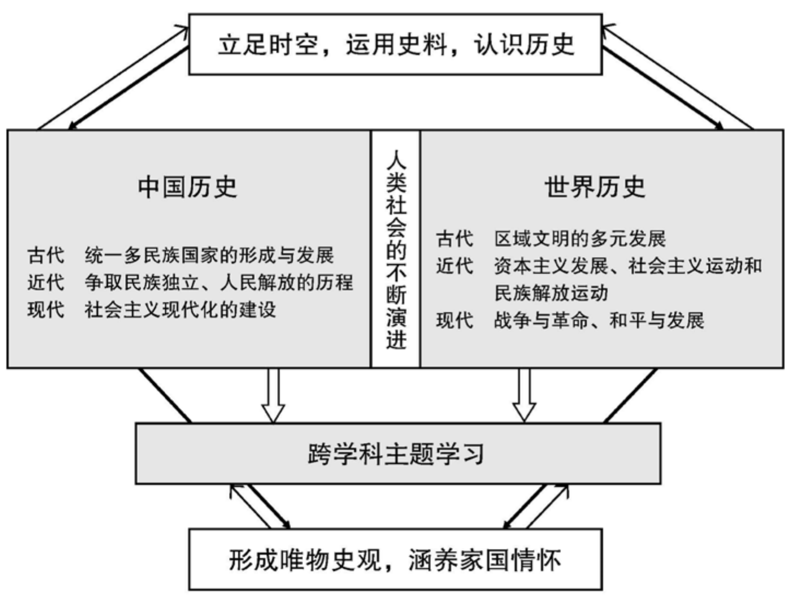

### 义务教育

# 历史课程标准

（2022年版）

中华人民共和国教育部制定

### 前言

习近平总书记多次强调，课程教材要发挥培根铸魂、启智增慧的作用，必须坚持马克思主义的指导地位，体现马克思主义中国化最新成果，体现中国和中华民族风格，体现党和国家对教育的基本要求，体现国家和民族基本价值观，体现人类文化知识积累和创新成果。

义务教育课程规定了教育目标、教育内容和教学基本要求，体现国家意志，在立德树人中发挥着关键作用。2001年颁布的《义务教育课程设置实验方案》和2011年颁布的义务教育各课程标准，坚持了正确的改革方向，体现了先进的教育理念，为基础教育质量提高作出了积极贡献。随着义务教育全面普及，教育需求从“有学上”转向“上好学”，必须进一步明确“培养什么人、怎样培养人、为谁培养人”，优化学校育人蓝图。当今世界科技进步日新月异，网络新媒体迅速普及，人们生活、学习、工作方式不断改变，儿童青少年成长环境深刻变化，人才培养面临新挑战。义务教育课程必须与时俱进，进行修订完善。

### 一、指导思想

以习近平新时代中国特色社会主义思想为指导，全面贯彻党的教育方针，遵循教育教学规律，落实立德树人根本任务，发展素质教育。以人民为中心，扎根中国大地办教育。坚持德育为先，提升智育水平，加强体育美育，落实劳动教育。反映时代特征，努力构建具有中国特色、世界水准的义务教育课程体系。聚焦中国学生发展核心素养，培养学生适应未来发展的正确价值观、必备品格和关键能力，引导学生明确人生发展方向，成长为德智体美劳全面发展的社会主义建设者和接班人。

### 二、修订原则

### （一）坚持目标导向

认真学习领会习近平总书记关于教育的重要论述，全面落实有理想、有本领、有担当的时代新人培养要求，确立课程修订的根本遵循。准确理解和把握党中央、国务院关于教育改革的各项要求，全面落实习近平新时代中国特色社会主义思想，将社会主义先进文化、革命文化、中华优秀传统文化、国家安全、生命安全与健康等重大主题教育有机融入课程，增强课程思想性。

### （二）坚持问题导向

全面梳理课程改革的困难与问题，明确修订重点和任务，注重对实际问题的有效回应。遵循学生身心发展规律，加强一体化设置，促进学段衔接，提升课程科学性和系统性。进一步精选对学生终身发展有价值的课程内容，减负提质。细化育人目标，明确实施要求，增强课程指导性和可操作性。

### （三）坚持创新导向

既注重继承我国课程建设的成功经验，也充分借鉴国际先进教育理念，进一步深化课程改革。强化课程综合性和实践性，推动育人方式变革，着力发展学生核心素养。凸显学生主体地位，关注学生个性化、多样化的学习和发展需求，增强课程适宜性。坚持与时俱进，反映经济社会发展新变化、科学技术进步新成果，更新课程内容，体现课程时代性。

### 三、主要变化

### （一）关于课程方案

一是完善了培养目标。全面落实习近平总书记关于培养担当民族复兴大任时代新人的要求，结合义务教育性质及课程定位，从有理想、有本领、有担当三个方面，明确义务教育阶段时代新人培养的具体要求。

二是优化了课程设置。落实党中央、国务院“双减”政策要求，在保持义务教育阶段九年9522总课时数不变的基础上，调整优化课程设置。将小学原品德与生活、品德与社会和初中原思想品德整合为“道德与法治”，进行一体化设计。改革艺术课程设置，一至七年级以音乐、美术为主线，融入舞蹈、戏剧、影视等内容，八至九年级分项选择开设。将劳动、信息科技从综合实践活动课程中独立出来。科学、综合实践活动起始年级提前至一年级。

三是细化了实施要求。增加课程标准编制与教材编写基本要求；明确省级教育行政部门和学校课程实施职责、制度规范，以及教学改革方向和评价改革重点，对培训、教科研提出具体要求；健全实施机制，强化监测与督导要求。

### （二）关于课程标准

一是强化了课程育人导向。各课程标准基于义务教育培养目标，将党的教育方针具体化细化为本课程应着力培养的核心素养，体现正确价值观、必备品格和关键能力的培养要求。

二是优化了课程内容结构。以习近平新时代中国特色社会主义思想为统领，基于核心素养发展要求，遴选重要观念、主题内容和基础知识，设计课程内容，增强内容与育人目标的联系，优化内容组织形式。设立跨学科主题学习活动，加强学科间相互关联，带动课程综合化实施，强化实践性要求。

三是研制了学业质量标准。各课程标准根据核心素养发展水平，结合课程内容，整体刻画不同学段学生学业成就的具体表现特征，形成学业质量标准，引导和帮助教师把握教学深度与广度，为教材编写、教学实施和考试评价等提供依据。

四是增强了指导性。各课程标准针对“内容要求”提出“学业要求”“教学提示”，细化了评价与考试命题建议，注重实现“教—学—评”一致性，增加了教学、评价案例，不仅明确了“为什么教”“教什么”“教到什么程度”，而且强化了“怎么教”的具体指导，做到好用、管用。

五是加强了学段衔接。注重幼小衔接，基于对学生在健康、语言、社会、科学、艺术领域发展水平的评估，合理设计小学一至二年级课程，注重活动化、游戏化、生活化的学习设计。依据学生从小学到初中在认知、情感、社会性等方面的发展，合理安排不同学段内容，体现学习目标的连续性和进阶性。了解高中阶段学生特点和学科特点，为学生进一步学习做好准备。

在向着第二个百年奋斗目标迈进之际，实施新修订的义务教育课程方案和课程标准，对推动义务教育高质量发展、全面建设社会主义现代化强国具有重要意义。希望广大教育工作者勤勉认真、行而不辍，不断创新实践，把育人蓝图变为现实，培育一代又一代有理想、有本领、有担当的时代新人，为实现中华民族伟大复兴作出新的更大贡献！

### 目录

一、课程性质 1

二、课程理念 2

三、课程目标 4

（一）核心素养内涵 4 （二）目标要求 6

四、课程内容 9

（一）中国古代史 10 （二）中国近代史 17 （三）中国现代史 23 （四）世界古代史 27 （五）世界近代史 31 （六）世界现代史 35 （七）跨学科主题学习 39

五、学业质量 52

（一）学业质量内涵 52 （二）学业质量描述 52

六、课程实施 55

（一）教学建议 55

（二）评价建议 61 （三）教材编写建议 70 （四）课程资源开发与利用 73 （五）教学研究与教师培训 75

### 一、课程性质

历史学是在一定的历史观指导下叙述和阐释人类历史进程的学科。马克思主义指导下的历史学，以探寻历史真相、总结历史经验、认识历史规律、认清历史发展趋势为其重要功能。

义务教育历史课程是学生在马克思主义唯物史观指导下，了解中外历史发展进程、传承人类文明、提高人文素养的课程，具有思想性、人文性、综合性、基础性特点，具有鉴古知今、认识历史规律、培养家国情怀、拓宽国际视野的重要作用。

### 二、课程理念

### 1. 立足学生核心素养发展，充分发挥历史课程的育人功能

历史课程是落实立德树人根本任务的重要课程，注重培育学生核心素养。通过发掘人类优秀文化遗产的育人功能，使学生树立正确的历史观、民族观、国家观、文化观，增强责任意识和社会担当，成为德智体美劳全面发展的社会主义建设者和接班人。

## 2. 以中外历史进程及其规律为基本线索，突出历史发展的阶段性特征

历史课程内容主要包括中国历史、世界历史和跨学科主题学习。中外历史采用“点一线”结合的方式呈现。“点”是具体的历史事实，“线”是历史发展的基本线索。通过以“点”连“线”、以“线”穿“点”，使课程内容依照人类历史发展的时序，循序渐进地展开叙述，使学生在掌握历史事实的时候避免时序的混乱，把握历史发展的阶段性特征。跨学科主题学习板块的设计，旨在加强学生对中外历史进程及其发展特征的总体性把握和比较性认识，并体现历史课程与其他课程学习的有机结合。

### 3. 精选和优化课程内容，突出思想性、基础性

历史课程内容的选择坚持正确的思想导向和价值引领；精选基本的、重要的、典型的史事，注重吸收史学研究的新成果；充分反映人类文明的灿烂成就、社会主义先进文化、革命文化、中华优秀传统文化，以及世界其他国家和地区的优秀文化；增强课程内容的生动性。

## 4. 树立以学生为主体的教学观念，注重学生自主探究的学习活动，鼓励教学方式的创新

历史课程的教学以学生为本，充分考虑学生学习历史、认识历史的特点，通过学生自主探究的学习活动，体现学生在教学中的主体地位，实现历史课程育人方式的变革。提倡选择多样化的教学资源，探索多样化的教学方式和方法，鼓励将现代信息技术与历史教学深度融合。培养学生学会学习、发现和解决问题的能力，为创新型人才成长奠定基础。

## 5. 综合运用多种评价方式和方法，发挥评价促进学习和改进教学的功能

历史课程评价以考查学生核心素养的发展状况为目标；综合运用诊断性评价、形成性评价、终结性评价等多种方式；注重评价主体多元化，让学生在自评、互评的过程中学会反思和自我改进；倡导将评价融入教学设计，实现“教—学—评”一体，发挥评价促进学习和改进教学的功能。

### 三、课程目标

历史课程围绕核心素养，体现课程性质，反映课程理念，确立课程目标。

### （一）核心素养内涵

核心素养是学生通过课程学习逐步形成的正确价值观、必备品格和关键能力，是课程育人价值的集中体现。通过核心素养的培育，落实立德树人根本任务。

历史课程要培养的核心素养，主要包括唯物史观、时空观念、史料实证、历史解释、家国情怀五个方面。

### 1. 唯物史观

唯物史观是揭示人类社会历史客观基础及发展规律的科学的历史观和方法论。

人类对历史的认识是由表及里、逐渐深化的，要透过历史的纷杂表象认识历史的本质，必须以科学的历史观和方法论为指导。唯物史观使历史学成为一门科学，只有运用唯物史观的立场、观点和方法，才能对历史有全面、客观的认识。

在义务教育阶段，要求学生初步学会在唯物史观的指导下看待历史。

### 2.时空观念

时空观念是在特定的时间联系和空间联系中对事物进行观察、分析的意识和思维方式。

任何事物都是在特定的、具体的时间和空间条件下存在的，只有在特定的时空框架中，才可能对史事有准确的理解。

在义务教育阶段，要求学生学会在具体的时空条件下考察历史。

### 3.史料实证

史料实证是指对获取的史料进行辨析，并运用可信史料努力重现历史真实的态度与方法。

史料是认识历史的主要依据。要形成对历史的正确、客观的认识，必须重视史料的搜集和解读，并在学习和探究活动中加以运用。

在义务教育阶段，要求学生初步学会依靠可信史料了解和认识历史。

### 4.历史解释

历史解释是指以史料为依据，客观地认识和评判历史的态度和方法。

所有历史叙述本质上都是对历史的解释，即便是对基本事实的陈述也包含了陈述者的主观认识。只有通过对史料的搜集、整理和辨析，辩证、客观地描述历史，揭示历史表象背后的深层因果关系，才能不断接近历史真实。

在义务教育阶段，要求学生初步学会有理有据地表达自己对历史的看法。

### 5.家国情怀

家国情怀是学习和探究历史应具有的人文追求与社会责任。

学习和探究历史应充满人文情怀并关注现实问题，热爱家乡，热爱祖国，放眼世界，以服务于国家富强、中华民族伟大复兴和人类命运共同体的构建。

在义务教育阶段，要求学生形成对家乡、国家和中华民族的认同，具有国际视野，有理想、有担当。

上述五个方面是不可分割的有机整体。其中，唯物史观是历史学习的理论指引，是其他素养得以达成的理论保证；时空观念是历史学科本质的体现，是其他素养得以达成的基础条件；史料实证是历史学习的必备技能，是其他素养得以达成的必要途径；历史解释是对历史思维与表达能力培养的基本要求，是其他素养得以达成的集中体现；家国情怀体现了历史学习的价值追求，是其他素养得以达成的情感基础和理想目标。

### （二）目标要求

历史课程的目标是落实立德树人根本任务，体现历史课程的育人功能，培养学生的核心素养，引导学生初步树立正确的历史观、民族观、国家观、文化观，明理、增信、崇德、力行。

### 1. 初步学会在唯物史观的指导下看待历史

能够认识劳动在人类社会发展中的重要作用，知道物质生产是人类生存和人类社会发展的基础；知道人民群众是物质生产的主要承担者和历史的创造者；知道生产力发展的重要性，知道生产力和生产关系的矛盾运动、经济基础和上层建筑的矛盾运动是社会历史发展的根本动力；知道在阶级社会中存在着阶级矛盾和阶级斗争，阶级斗争是推动历史发展的直接动力；初步了解人类社会形态从低级到高级的发展趋势。能够将唯物史观运用于历史学习，结合史实进行阐述和说明。

### 2. 学会在具体的时空条件下考察历史

了解历史发展的时间顺序和空间要素，初步掌握计算历史时间和识别历史地图的方法，并能够在历史叙述中运用这些方法；能够将事件、人物、现象等置于历史发展的特定或总体进程及具体的地理空间中加以考察，并从历史发展的角度认识其地位和作用。

### 3. 初步学会依靠可信史料了解和认识历史

了解史料的主要类型，初步学会从多种渠道获取历史信息，提高对史料的识读能力；能够尝试运用史料说明历史问题，学会根据可信史料对历史进行论述；初步形成重证据的意识和处理历史信息的能力。

### 4. 初步学会有理有据地表达自己对历史的看法

能够初步区分历史叙述中的史实与解释；能够客观叙述和分析历史，有理有据地表达自己的看法；在理解和辨析相关史料的基础上，尝试发现和提出新的问题，加以论证，形成自己的历史认识。

## 5. 形成对国家和中华民族的认同，具有国际视野，有理想、有担当

能够从历史的角度认识中国国情，认识中华民族多元一体的历史发展趋势，增强热爱家乡、热爱祖国的情感，铸牢中华民族共同体意识；了解并认同社会主义先进文化、革命文化、中华优秀传统文化，认识中华文明的历史价值和现实意义，增强民族自尊心、自信心和自豪感；了解中国历史上的英雄人物，崇尚英雄气概，传承民族气节；培育和践行社会主义核心价值观，把握习近平新时代中国特色社会主义思想的核心要义，树立中国特色社会主义道路自信、理论自信、制度自信、文化自信。

了解人类文化的多样性，理解和尊重世界各国、各民族的文化传统，认识中国历史与世界历史相互关联；了解中华文明对世界文明进步作出的突出贡献，体现立足中国、面向世界的视野和胸怀，初步树立构建人类命运共同体的意识。

逐步确立积极进取的人生态度，形成健全的人格，具有为家乡、国家和世界发展贡献力量的远大理想和责任担当。

### 四、课程内容

历史课程以马克思主义唯物史观的基本观点为指导，按照历史时序，展示中外历史发展的基本过程。马克思主义根据人类社会生产力与生产关系基本矛盾的运动规律和趋势，把人类社会发展分为原始社会、奴隶社会、封建社会、资本主义社会和共产主义社会五种社会形态。它们构成了一个从低级到高级的发展序列。不是所有民族、国家的历史都完整地经历了这五个阶段，但是这个发展总趋势具有普遍性、规律性意义。

学生通过学习不同历史时期各个方面的史实，了解人类社会从分散到整体、从低级到高级的发展历程，初步把握中外历史发展的基本线索，认识不同历史时期的时代特征。根据通史叙事的结构和 \(7\sim 9\) 年级的学段要求，历史课程内容包括中国古代史、中国近代史、中国现代史、世界古代史、世界近代史、世界现代史，以及跨学科主题学习，共七个板块。

### (一) 中国古代史

中国古代史始于中国境内早期人类活动，止于1840年鸦片战争，重点叙述5000多年中华文明的演进，以及统一多民族国家的起源、建立、巩固和发展的历程。

在一百多万年前，中华大地上就有人类活动。考古学发现的旧石器时代遗址为研究中国古人类提供了可靠的依据。

中华文明诞生于考古学上的新石器时代。中国是世界上原始农业产生最早的地区之一。

大约在公元前21世纪，中国历史上第一个王朝——夏朝建立。夏朝带有奴隶制特征。迄今发现有文字记载的历史从商朝开始。商朝的青铜冶炼技术和甲骨文代表了早期中华文明的辉煌成就。西周取代商朝后分封诸侯，对疆域的控制更加稳固。

东周分为春秋、战国两个阶段。春秋时期，王室衰微，诸侯争霸，分封制度渐趋瓦解。战国时期，铁农具和牛耕的推广，促进了农业发展。各诸侯国的变法推动了社会进步，思想文化出现了“百家争鸣”的繁荣局面。

秦始皇建立了中国历史上第一个统一的多民族的封建国家，创立了专制主义中央集权的国家体制。秦朝因暴政短命而亡，但它的一些制度对以后历代王朝具有深远影响。继起的西汉王朝在汉武帝时国力达到鼎盛，是当时世界上的大国。东汉的版图大致与西汉相当，但政局较为混乱。三国两晋南北朝的绝大部分时间都处于分裂割据状态。北方少数民族大量内迁，推动了民族交往交流交融。此时农业技术不断进步，中医学已形成系统的理论和独特的治疗方法，天文学、数学也都取得了重要成就。

隋朝的建立结束了数百年的政权分立状态，它创建的科举制度逐渐成为后世选拔官员的主要途径。唐初统治者改良政治，发展生产，形成了“贞观之治”的太平局面。到开元年间，唐朝经济繁荣，社会稳定，文化发达，中外交流活跃，国力达到顶峰。此后，“安史之乱”爆发，唐朝盛世景象结束。

北宋的建立，结束了五代十国的分裂局面。与此同时，周边民族的相继崛起又在更大范围内形成了民族政权并立的格局。宋朝实行重文轻武的政策，利弊兼得。女真族建立的金朝，先后灭亡了辽和北宋。占据江南的南宋与金朝形成南北对峙。两宋时期，社会经济蓬勃发展，城市和国内外贸易空前繁荣，四大发明技术的成熟对人类文明的进步具有重大意义。

蒙古族建立的元朝结束了中国境内长期割裂的局面，重建了大一统国家，对西藏实施行政管辖，版图超出汉、唐，并为东西方的交流创造了条件。

明朝大力加强君主专制，一度出现强盛局面。郑和下西洋成为中国乃至世界航海史上的壮举。但明朝政治上的僵化和腐败，东南沿海倭寇的骚扰，导致统治危机不断加深。明朝最终在农民大起义和东北满族进逼的双重夹击下崩溃。

清朝入关后，经过一百多年的励精图治，发展为幅员辽阔、人口众多、国力强大的统一多民族国家。面对世界形势的剧变，清朝统治者仍旧固守旧有的对内对外政策，古老的中国已落后于世界潮流。吏治腐败加剧了社会矛盾，人口增长使人均可耕地面积减少。从18世纪末到19世纪前期，内部民众起事不断，外部资本主义列强虎视眈眈，清朝已经走向衰亡的边缘。中国封建社会到1840年鸦片战争爆发后逐步解体。

中华文明源远流长，绵延不断，成就辉煌，对人类进步作出了伟大贡献。

### 1. 内容要求

### 1.1 史前时期

通过了解元谋人、蓝田人、北京人等旧石器时代的人类及其文化遗存，知道中国境内原始社会时期的人类活动；通过了解河姆渡、半坡、良渚、陶寺等新石器时代的文化遗存，知道中国的原始农耕生活；了解私有制、阶级和早期国家的产生；知道考古发现是了解原始社会的重要依据；通过古代文献中记述的黄帝、炎帝等神话传说，了解其中蕴含的历史信息。

### 1.2 夏商西周与春秋战国时期

知道甲骨文是已知最早的汉字；通过了解甲骨文、青铜铭文、其他文献记载和典型器物，知道具有奴隶制特点的夏、商、西周王朝的建立与发展，了解西周分封制等重要制度；知道老子、孔子的生平与思想；通过了解这一时期的生产力水平和社会关系的变化，初步理解春秋时期诸侯争霸局面的形成、战国时期商鞅变法等改革和“百家争鸣”局面的产生；通过《黄帝内经》和名医扁鹊，了解这一时期的医学成就；通过都江堰工程，感受古代劳动人民的智慧和创造力。

### 1.3秦汉时期

1.3 秦汉时期通过了解秦朝统一、陈胜和吴广等领导的秦末农民起义、西汉“削藩”和尊崇儒术，知道统一多民族封建国家建立和早期发展的过程；通过了解休养生息政策、“文景之治”、张骞通西域、“丝绸之路”的开辟、汉武帝的大一统，知道西汉从建立之初的社会残破发展到国力强盛的变化及原因；通过了解西汉末到东汉的政治、社会动荡，了解佛教传入和道教产生的背景；知道这一时期的重要文化和科技成就，如司马迁与《史记》、蔡伦与造纸术、张仲景与《伤寒杂病论》、华佗的故事等。

### 1.4三国两晋南北朝时期

1.4 三国两晋南北朝时期通过了解三国两晋南北朝时期的政权更迭和北魏孝文帝改革、人口迁徙和区域开发，认识这一时期民族交往交流交融的历史特点及其对中华民族发展的意义；通过了解这一时期的科技和艺术成就，如祖冲之的数学成就，认识传统文化的继承与创新。

### 1.5隋唐五代十国时期

1.5 隋唐五代十国时期通过了解隋朝的兴亡、“贞观之治”与“开元盛世”，知道隋朝速亡和唐朝兴盛的原因；了解科举制度创建、大运河开通、文成公主入藏、鉴真东渡、玄奘西行等史事，从制度、经济、文学艺术、民族交往、中外文化交流等方面认识隋唐王朝在世界历史上的重要地位；通过了解“安史之乱”后藩镇割据和五代十国的局面，认识唐末五代的社会危机。

### 1.6辽宋夏金元时期

1.6 辽宋夏金元时期认识北宋面临的新形势，了解辽、宋、西夏的并立与北宋强化中央集权和重文轻武的政策；通过了解宋金之战、南宋偏安和南方地区的经济繁荣，知道中国古代经济重心的进一步南移；通过了解蒙古兴起和元朝统一，设立行省、宣政院等制度，知道西藏在元代正式纳入中国版图，理解元朝统一对中华民族进一步交融的重要意义；通过了解这一时期的城市和商业发展、科技创新、文学艺术成就和对外交流，认识宋元时期繁荣的经济、文化在中国历史上的重要地位；通过岳飞、文天祥等人的英雄事迹，体会中华民族英勇不屈的精神；通过印刷术、指南针、火药的应用和外传，认识中国古代的重要发明对世界文明发展的贡献。

### 1.7明清时期（至鸦片战争前）

通过了解明清时期加强皇权的举措，初步认识君主专制带来的社会弊端；通过了解明清时期的经济改革和全球性经济互动，初步认识这一阶段中国经济发展的内因和外因；通过郑和下西洋、戚继光抗倭等史事，了解明朝的对外关系；通过了解郑成功收复台湾、清朝在台湾的建制、册封达赖和班禅以及设置驻藏大臣等中央政权在边疆地区的各种举措，认识西藏地区、新疆地区、南海诸岛、台湾及其包括钓鱼岛在内的附属岛屿是中国的领土，理解统一多民族国家版图奠定的重要意义；通过了解《本草纲目》《天工开物》《农政全书》，认识明朝的科技成就及其影响；通过了解小说、戏曲的繁荣，知道明清时期文学艺术的特色；通过明末李自成起义，清中叶以来的政治腐败、故步自封和19世纪的国际局势，认识当时中国社会面临的严重危机。

### 2.学业要求

2.1能够了解中国古代历史的基本线索和重要的事件、人物、现象，知道重大史事发生的时间和地点、原因和结果，初步养成历史时序意识和历史空间感。（唯物史观、时空观念）

2.2能够知道中国古代遗留至今的各类史料是了解和认识中国古代历史的证据，能结合语文、地理、艺术等课程的学习，初步理解古代史料的含义，尝试运用史料说明历史问题。（史料实证、历史解释）

2.3能够对中国古代历史上的重要事件、人物、现象等形成合理想象，进行初步分析，认识其意义和影响。（唯物史观、历史解释、家国情怀）

2.4能够通过中国古代的经济、科技成就，了解生产力发展对政治、社会、文化变革的推动作用；通过古代历史上治乱兴衰的史事，认识阶级社会中阶级斗争在历史发展中的作用。（唯物史观、历史解释、家国情怀）

2.5 能够通过了解中国古代历史发展的总体趋势，认识统一多民族国家形成、巩固和发展的重要历史意义；通过中国古代历史上各民族的交往交流交融，认识中华民族共同体的形成是中国历史发展的必然结果，树立正确的中华民族历史观；通过了解中国古代文明的辉煌成就，认识中华优秀传统文化的独特价值和突出优势，提高民族自尊心、自信心和自豪感，增强民族凝聚力。（唯物史观、家国情怀）

### 3. 教学提示

学生初学历史，需要培养兴趣，调动学习积极性。在教学过程中，教师要通过情境再现、问题引领、故事讲述和多样化的资源运用等方式，激发学生的求知欲，促进学生积极、主动地学习历史。

要注重对学生历史学习方法的指导，从帮助学生学会阅读、理解教材，概括所学内容入手，进而指导学生解读史料，使学生逐步学会对史事进行分析。

中国古代史的教学，要通过把握中国古代历史发展的基本线索及相关重要史事，围绕统一多民族国家形成、巩固和发展的过程展开。教师要把历代政权的分立与统一、中华民族的发展演变，理解为从区域到整体、从碰撞到交融的过程，引导学生初步学会分析重要史事间的因果关系，初步学会对史事进行评判。

中国古代史距离今天极为遥远，却又是学生学习历史最先接触的内容。因此，教师要尽可能以感性的、易于理解的、多种多样的呈现方式开展教学。教师不仅应在课堂上尝试创设帮助学生感同身受的历史情境，还应充分利用博物馆、档案馆、图书馆、历史遗址、古代建筑、古村落，以及爱国主义教育基地、历史文化名城等，尽量发掘和利用网络资源及乡土历史资源。

学生在学习中国古代史的过程中，可通过下列活动提升核心素养。

·学会计算历史年代，了解中国古代纪年的主要方法，制作中国古代历史发展时间轴，编写简要的历史大事年表。

·观察并识读中国古代各时期的疆域图，从历史地图中辨识、获取重要的历史地理信息，并将历史地图中的信息与所学内容建立起联系。

·尝试阅读古代的文献材料、图像材料，观察实物材料，并加以分析，概括并提取其中的历史信息；通过中华文明探源工程等重大考古工程，认识中华文明的起源；知道考古发掘的成果是研究人类起源和了解古代社会的重要依据。

·尝试运用可靠的、典型的史料对历史问题进行论证，有根据地说明自己对历史问题的看法。

·搜集与所学历史时期相关的图片，将历史图片进行分类，配上文字说明。在此基础上，开展“图说历史”的活动，以板报、电子信息报、历史图集等方式进行交流。

·查阅、整理中国古代历史上对社会生产起促进作用的技术发明和技术创新的相关材料，组织一场微型的古代科技图片展，从而更好地理解科学技术对促进生产力发展的作用，树立科技报国的崇高理想。

·查阅相关材料，开展绘制历史人物画像、制作历史文物模型和历史文创作品等活动。在此基础上，布置相关的展览，同学之间进行交流、评比。

·查阅、整理中国古代历史上商鞅变法、王安石变法、张居正改革等重大革新，以及屈原、卫青、霍去病、张衡、岳飞、文天祥、戚继光等杰出人物的相关材料，组织开展故事会。

·选择一个重要的历史事件或历史人物，在查阅史料的基础上，编写历史剧的脚本，分配角色，进行排练，成熟后在班级或校内演出。

- 开展“中国传统节日溯源”的专题活动，搜集材料，了解传统节日如春节、清明节、端午节、中秋节等是怎样形成并演化的，探讨这些传统节日所蕴含的文化观念以及相关的风俗习惯，通过传统节日认识中华民族的文化特色。

- 围绕中国古代历史上重大的、综合性的问题进行探究并展开讨论，如“中华文明5000多年历史的起源”“统一多民族封建国家建立与巩固的重要意义”“中华民族多元一体格局的形成与发展”“中国古代历史上各民族之间的交往交流交融”“中国古代史上历代中央政权对边疆地区的有效治理”“中华优秀传统文化在各历史时期的具体表现”等。通过探究与讨论，强化国家认同、民族认同、文化认同。

### （二）中国近代史

中国近代史始于1840年鸦片战争，止于1949年中华人民共和国成立，重点叙述列强侵略中国，中国逐渐成为半殖民地半封建社会；中华民族对外反抗列强侵略，对内反对封建专制统治，最终由中国共产党团结带领全国各族人民实现了民族独立、人民解放，夺取了新民主主义革命的伟大胜利。

19世纪中期，英、法等西方列强接连发动侵略中国的战争，中国的主权独立和领土完整不断遭到破坏，西方列强与中华民族的矛盾激化。19世纪70年代以后，列强对华侵略加剧，中华民族危机日益深重。

中国人民为反抗列强侵略，争取民族独立，进行了英勇的斗争，开始了救亡图存的探索。太平天国起义沉重打击了清王朝统治和外国侵略势力。提倡“自强”“求富”的洋务运动，客观上刺激了中国资本主义的产生和发展。资产阶级维新派为了挽救民族危亡，进行了维新变法运动。义和团运动是中国人民郁积多年反抗列强侵略义愤的总爆发，其英勇斗争客观上打乱了列强企图瓜分中国的步骤。

辛亥革命推翻了清王朝的统治，结束了在中国延续几千年的君主专制制度，建立了中华民国，拉开了完全意义上的近代民族民主革命的序幕，但未能改变中国半殖民地半封建的社会性质和中国人民的悲惨命运。新文化运动冲击了旧的思想、道德和文化，开启了思想解放的闸门。中国在艰苦的环境中，不断进行着经济、政治和思想文化的变革。

1919年爆发的五四爱国运动，标志着中国旧民主主义革命的结束和新民主主义革命的开始。马克思主义在中国先进分子中广泛传播，1921年中国共产党成立，中国革命的面貌从此焕然一新。第一次国共合作推动了国民革命运动的高涨。国共合作破裂后，中国共产党为反抗国民党的反动统治，进行工农武装革命，在农村建立根据地，探索中国革命的新道路。

1931年日本帝国主义发动九一八事变，中华民族面临严重的民族危机，全国抗日救亡运动不断高涨。1937年日本帝国主义发动七七事变，以国共两党第二次合作为基础的中华民族全面抗战从此开始。中国共产党在抗战中发挥着中流砥柱的作用，中国战场也是世界反法西斯战争的东方主战场。中国人民经过浴血奋战，终于第一次取得了近代以来反抗外敌入侵的完全胜利。

抗日战争胜利后，中国面临着两种命运、两个前途的决战。中国共产党为争取和平民主作出很大努力，但是国民党坚持独裁统治，悍然发动内战。中国共产党领导人民进行了三年多的解放战争，推翻了国民党在大陆的统治，取得了新民主主义革命的伟大胜利。

在革命斗争中，以毛泽东同志为主要代表的中国共产党人，把马克思列宁主义基本原理同中国具体实际相结合，创立了毛泽东思想，这是马克思主义中国化的第一次历史性飞跃，为夺取新民主主义革命的胜利指明了正确方向。

### 1. 内容要求

### 1.1晚清时期的内忧外患与救亡图存

1.1晚清时期的内忧外患与救亡图存通过了解林则徐虎门销烟、英法联军火烧圆明园、俄国割占中国北方大片领土等两次鸦片战争期间的主要史事，以及《南京条约》等不平等条约的签订，初步认识鸦片战争对中国近代社会的影响；了解太平天国运动的兴衰；了解洋务运动的主要内容，初步认识洋务运动的作用和局限性；了解19世纪中后期的边疆危机和中法战争，知道甲午中日战争的主要战役和《马关条约》的主要内容，初步认识《马关条约》与中国民族危机加剧的关系；了解戊戌变法的主要史事，认识变法的意义和局限性；知道义和团运动和抗击八国联军侵华的史事，结合《辛丑条约》的主要内容，认识《辛丑条约》对中国民族危机全面加深的影响。

### 1.2辛亥革命与中华民国的建立

1.2辛亥革命与中华民国的建立通过了解孙中山等民主革命先行者早年的革命活动、武昌起义及中华民国成立的史事，认识辛亥革命的历史意义及局限性；知道民国初期北洋军阀的统治；了解新文化运动的基本内容，知道陈独秀、李大钊、胡适、鲁迅等新文化运动的代表人物，认识新文化运动在中国近代思想解放运动中的地位和作用。

### 1.3近代社会生活变化

1.3近代社会生活变化通过了解张謇兴办实业的典型事例，知道近代中国民族工业发展的艰辛历程；通过了解开办京师大学堂、废除科举制度等近代新式教育发展的主要史事及民国以来社会生活的变化，知道中国走向现代化的曲折过程。

### 1.4中国共产党成立与新民主主义革命的兴起

1.4中国共产党成立与新民主主义革命的兴起通过了解五四运动的基本史事，理解五四精神的内涵，认识五四运动是中国新民主主义革命的开端；通过了解陈独秀、李大钊传播马克思主义和中国共产党第一次全国代表大会的召开等史事，认识中国共产党成立的历史意义，理解伟大建党精神；了解第一次国共合作和北伐战争等国民革命的主要内容；知道南京国民政府的成立及性质；通过了解南昌起义、八七会议、秋收起义、毛泽东与朱德井冈山会师、古田会议等基本史事，认识中国共产党创建人民军队和农村革命根据地的意义；认识遵义会议在中国革命史上的地位；通过了解长征途中红军爬雪山过草地等艰难历程的史事，感悟长征精神。

### 1.5 中华民族的抗日战争

通过了解九一八事变、东北抗联、一二·九运动、西安事变、七七事变、南京大屠杀、正面战场和敌后战场的抗战等史事，认识日本侵华的罪行，认识中国人民十四年抗战的艰苦历程，认识中国共产党是全民族抗战的中流砥柱，知道中国战场是世界反法西斯战争的东方主战场，体会中国军民在抗日战争中孕育的抗战精神，认识抗日战争胜利在中华民族伟大复兴中的重要历史意义；通过了解中共七大，认识确立毛泽东思想作为党的指导思想的重大意义。

### 1.6 人民解放战争

知道重庆谈判，理解中国共产党为争取和平民主作出的努力；了解全面内战的爆发、中共中央转战陕北和刘邓大军挺进大别山等史事；通过了解解放区的土地改革，辽沈、淮海、平津三大战役，中共七届二中全会，知道国民党反动统治的覆灭和人民解放战争迅速胜利的主要原因，以及中国共产党领导人民取得新民主主义革命胜利的意义。

### 2. 学业要求

2.1 能够了解中国近代历史的基本线索，以及中国近代历史上重要的事件、人物、现象等，知道这些史事发生的时间和地点、原因和结果，初步养成历史时序意识和历史空间感。（唯物史观、时空观念）

2.2 能够初步阅读和理解中国近代史的史料，并运用这些史料分析近代中国逐步成为半殖民地半封建社会的原因；认识中国近代史是中国人民对外反抗列强侵略、对内反对封建专制统治的历史；知道争取民族独立和人民解放是近代中国的历史任务。（唯物史观、史料实证、历史解释）

2.3认识捍卫国家主权和民族尊严是中华民族的优良传统；认识和感悟五四精神、伟大建党精神、长征精神、抗战精神等，继承革命传统，培养优良作风。（历史解释、家国情怀）

2.4通过学习近代历史，知道民族民主革命的艰巨性，认识没有中国共产党就没有新中国，学习仁人志士为救国救民而英勇斗争的精神，坚定为中华民族伟大复兴而奋斗的信念。（历史解释、家国情怀）

### 3.教学提示

在中国近代史的教学过程中，需要进一步培养学生的分析、概括、归纳等方面的能力，使学生逐步形成正确的历史判断。

中国近代史的教学，要使学生掌握中国人民反抗列强侵略和争取民族独立解放的基本史事，引导学生认识中国近代史不仅是中国遭受列强侵略的历史，也是中国人民为了民族独立、人民解放而不屈不挠斗争的历史，更是中国人民在中国共产党领导下最终取得新民主主义革命胜利的历史。

近代的史料更为丰富多样。在教学过程中，要通过运用近代的文字资料、影像资料等再现历史的情境，如历史的场景、人物的活动等，使学生观察、感受近代历史的真实情况；要充分利用各种课程资源，如历史报刊、历史论著、历史照片、历史绘画、历史影片、历史实物等，特别是用好红色资源，如革命遗址遗迹、纪念馆、博物馆、展览馆等；要重视与近代历史有关的乡土资源和口述史资源的利用。

学生在学习中国近代史的过程中，可通过下列活动提升核心素养。

·观察并绘制近代历史地图。根据不同的学习主题，观察形势图（如第二次鸦片战争形势图），绘制示意图（如19世纪末列强在华划分势力范围示意图）、路线图（如红军长征路线图），展示绘制出的历史地图，解说图中的历史信息。

- 举办革命故事会，讲述中国近代历史上英雄人物的故事，弘扬革命精神。

- 观看近代历史题材的影视作品，撰写观后感，进行交流。

- 举办近代革命歌曲演唱会，通过演唱，感受近代革命历史发展的脉动，讴歌革命精神，陶冶革命情操。

- 进行近代历史的实地调查，如参观考察革命遗址遗迹，通过走访、调查，搜集与近代历史事件、历史人物相关的材料等，整理信息，形成调查报告，汇报并交流。

- 围绕近代历史上的革命精神，如五四精神、伟大建党精神、井冈山精神、长征精神、延安精神、抗战精神、红岩精神、西柏坡精神等，举办革命精神研讨会，探讨革命精神的内涵、意义及影响，交流学习体会。

- 比较近代历史上的同类史事并绘制图表，用板报等形式展示。比如，比较分析《南京条约》《马关条约》《辛丑条约》的主要内容，认识列强通过不平等条约使中国逐步成为半殖民地半封建社会的过程，探讨其对中国社会造成的危害。又如，比较分析近代历史上的洋务派、维新派、革命派代表人物提出的主张及活动，探讨他们对历史发展作出的努力，分析其历史局限性。再如，比较中国共产党历史上具有转折意义的会议，如八七会议、古田会议、遵义会议、中共七大、七届二中全会，探讨这些会议对中国革命发展的重要意义。

- 围绕中国近代重要的史事，采用个人与小组相结合的方式，搜集相关史料，深入研讨，撰写历史小论文。所选史事主要包括如下类型：（1）历史事件，如太平天国运动、洋务运动、左宗棠收复新疆、五四运动、中共一大、遵义会议、七七事变、中共七大等；（2）历史人物，如近代史上的林则徐、康有为、梁启超、张謇、孙中山等，中共党史上的陈独秀、李大钊、毛泽东等，文艺界的鲁迅、茅盾、齐白石、徐悲鸿、聂耳、洗星海等。

- 查找、阅读毛泽东的重要著作，开展多种形式的研讨活动，认识毛泽东对中国革命的伟大贡献。

### （三）中国现代史

中国现代史自中华人民共和国成立至今，叙述全国各族人民在中国共产党领导下，进行社会主义革命、建立社会主义制度、推进社会主义建设、进行改革开放、走中国特色社会主义道路、建设社会主义现代化国家、开创中国特色社会主义新时代的历程，展现了中华民族从站起来、富起来到强起来的伟大飞跃。

中华人民共和国成立初期，中国共产党领导开展土地改革运动、镇压反革命运动，进行抗美援朝战争，巩固了人民民主专政的国家政权，恢复了遭受多年战乱破坏的国民经济。

从1953年开始，中国共产党有计划地推进社会主义工业化，并对个体农业、手工业和资本主义工商业进行社会主义改造。1956年，社会主义基本制度得到确立，中国进入社会主义初级阶段。在探索社会主义建设道路的过程中，取得了经济文化建设等重大成就，丰富和发展了毛泽东思想。但是，也发生了“大跃进”运动等错误和“文化大革命”的内乱。

1978年，中国共产党十一届三中全会实现了历史性的伟大转折，中国进入改革开放和社会主义现代化建设的新时期。中国共产党开辟了中国特色社会主义道路，形成了中国特色社会主义理论体系，实现了马克思主义中国化新的飞跃，经济社会各方面都取得了巨大成就，综合国力大幅度增强，人民生活水平显著提高。

中共十八大以来，中国特色社会主义进入新时代，创立了习近平新时代中国特色社会主义思想，实现了马克思主义中国化新的飞跃。中国在经济建设、政治建设、文化建设、社会建设、生态文明建设等领域取得巨大成就，全面建成小康社会，综合国力和国际影响力不断提高。中国朝着中华民族伟大复兴的宏伟目标继续前进。

### 1. 内容要求

1.1 中华人民共和国成立及向社会主义过渡了解中国人民政治协商会议召开、开国大典，认识中华人民共和国成立对中国和世界历史的伟大意义；知道抗美援朝、土地改革，理解其对巩固人民民主政权的意义；通过《中华人民共和国宪法》的制定，以及人民代表大会制度、中国共产党领导的多党合作和政治协商制度、民族区域自治制度的确立，认识当代中国政治制度的内涵及意义；了解“一五”计划、“三大改造”、开创独立自主的和平外交，理解建立社会主义制度的重要意义。

1.2 社会主义革命和社会主义建设道路的探索知道中共八大；了解“大跃进”运动、人民公社化运动等错误与调整国民经济的“八字方针”；认识这一时期取得的政治、经济、外交、国防、科技等成就及其具有的开创性、奠基性意义；了解毛泽东对中国社会主义革命和社会主义建设的贡献，认识毛泽东思想的重要指导意义；了解以王进喜、雷锋、钱学森、邓稼先、焦裕禄等为代表的广大干部群众艰苦奋斗的事迹；了解“文化大革命”的严重危害及主要教训。

### 1.3 改革开放与中国特色社会主义建设

知道中共十一届三中全会，了解农村改革、城市改革、经济特区建设、沿海港口城市开放、上海浦东开发开放、加入世界贸易组织等史事，认识邓小平对改革开放所起的重要作用，认识改革开放对中国社会发展的重大意义和对世界的重要影响；了解社会主义市场经济体制的建立与完善；知道“一国两制”对实现祖国完全统一的意义；了解改革开放后的外交成就；了解邓小平理论、“三个代表”重要思想、科学发展观对社会主义现代化建设的重要指导意义。

### 1.4中国特色社会主义进入新时代

1.4 中国特色社会主义进入新时代知道中共十八大以来，中国特色社会主义进入新时代，党和人民面临的主要任务是，实现第一个百年奋斗目标，开启实现第二个百年奋斗目标新征程；了解习近平新时代中国特色社会主义思想；通过新时代中国在经济建设、政治建设、文化建设、社会建设、生态文明建设等领域取得的成就，以及综合国力和国际影响力不断提高的史事，特别是取得脱贫攻坚的伟大胜利、全面建成小康社会的史事，认识中国特色社会主义建设对中国社会发展的意义及对世界的贡献；认识中国共产党百年奋斗的历史意义和历史经验。

### 2.学业要求

2.1能够了解中国现代史发展的基本线索和重要事件、人物、现象；能够理解中国走社会主义道路的历史必然性和探索这条道路的艰巨性和曲折性。（唯物史观、时空观念、历史解释）

2.2能够搜集、分析重要的历史文献资料，学会社会调查的方法，加强对所学内容的理解与解释。（史料实证、历史解释）

2.3能够知道中国社会主义初级阶段的基本国情，认识社会主义现代化建设是一个漫长而曲折的过程，了解“两个一百年”奋斗目标；认识毛泽东思想、邓小平理论、“三个代表”重要思想、科学发展观、习近平新时代中国特色社会主义思想对社会主义现代化建设和实现中华民族伟大复兴的重要指导意义。（唯物史观、历史解释、家国情怀）

2.4能够通过改革开放以来中国在各个领域取得的成就、家乡的巨大变化和综合国力的不断提高，增强爱祖国、爱家乡的情感，培育和践行社会主义核心价值观，坚定中国特色社会主义道路自信、理论自信、制度自信和文化自信。（历史解释、家国情怀）

### 3.教学提示

3. 教学提示中国现代史即中华人民共和国的历史，是距离学生最近的历史。教师要努力从历史课程本身的特点出发，将中国现代历史的发展历程置于整个中国历史长河中去理解，引导学生认识中国特色社会主义道路源于中国特色的历史发展道路。要通过适当的教学设计，既以古代、近代的历史帮助学生理解现代史，又以现代史帮助学生理解古代、近代的历史。

由于中国现代史教学承载社会主义核心价值观教育、社会主义先进文化教育、革命文化教育、中华优秀传统文化教育、法治教育、国家安全教育、民族团结进步教育、生态文明教育等方面的任务，教师在教学过程中要特别注意寓论断于叙事，将相关理念和内容有机地融入历史过程的讲述。

在教学中，教师要注意选取贴近社会、贴近生活、贴近学生的情境素材，以加深学生的情感体验和实际感受；要开发和利用多种多样的课程资源，如重要的会议文献、历史著述、口述材料、英模事迹、有重要意义的建筑和场所、反映社会生活变化的物品，以及图像影视材料等；要引导学生积极、主动地搜集和运用身边的学习资源。

学生在学习中国现代史的过程中，可通过下列活动提升核心素养。

·开展社会调查。通过实地考察和访谈，获取多方面信息，深入了解改革开放以来人民生活和社会的变化，形成调查报告，进行交流。

·搜集、整理英雄事迹和劳动模范的史料，为社会主义建设英模立传，叙述他们的嘉言懿行和精神风貌。在此基础上，举办英模事迹展览、报告会等活动。

·开展口述史的学习活动。通过对家庭中的长辈进行访谈，搜集家庭的老照片和老物件，查阅相关的历史记载，形成口述史的材料集。在此基础上，选择一个主题，撰写口述史文章。

- 进行有关中国现代史的数据检索和统计。通过互联网、图书馆、博物馆等，搜集与国计民生有关的统计数据，如中华人民共和国成立以来国内生产总值、国家财政收入、国家外汇储备、进出口总额、城乡居民储蓄等方面的统计数据，绘制成统计表，运用统计表中的数据说明现代中国社会发展的情况。

- 搜集、整理有关抗美援朝精神、铁人精神、雷锋精神、“两弹一星”精神、改革开放精神、抗疫精神、脱贫攻坚精神，以及杂交水稻、载人航天等方面的图文材料，以制作展板，设计墙报，举行讨论会、报告会等多种方式，宣传并交流。

- 进行专题研究。选定研究的主题，如“新中国外交事业的发展”“中华民族大团结和铸牢中华民族共同体意识”“军队建设与国防力量的增强”“社会主义文化事业的繁荣”“大国重器”“从基础建设看国家的现代化发展”等，通过搜集、整理相关的图文、影视材料，撰写研究报告，举办专题论坛，交流研究成果。

- 开展项目学习，特别是围绕党史、新中国史、改革开放史、社会主义发展史中的重要内容，如“社会主义革命和建设的伟大历史成就”“中国综合国力增强的具体表现”“中国的国际影响力不断提高”“中国特色社会主义进入新时代以来的新发展”等，尝试搜集身边的直接而鲜活的资料，形成项目学习的研究报告或小论文，举办项目学习成果研讨会、报告会。

### （四）世界古代史

世界古代史从早期人类的出现到15世纪，展现古代文明的产生、发展与多元面貌。其间大体经历了原始社会、奴隶社会和封建社会，但有一些民族、国家未经过奴隶社会、封建社会的连续发展过程。

文明出现以前，人类经历了漫长的史前时期。随着生产力的发展，阶级分化的加剧，国家产生了。大约在公元前4千纪后期，西亚的两河流域、北非的尼罗河流域、中国的黄河流域和长江流域、南亚的印度河流域、欧洲的爱琴海地区，诞生了多姿多彩的古代文明。

公元前800年以后，希腊各地建立了城邦国家。罗马则在公元前1世纪后建立了一个地跨欧、亚、非三洲的大帝国。希腊罗马古典文明对后来的西方文明有很大影响。

5世纪以后，随着古典文明的衰落和日耳曼民族的迁徙，在罗马帝国的废墟上形成了法兰克王国等新国家。法兰克王国信奉基督教，并发展出以庄园为基础的封建制度。罗马帝国分裂后，在东部建立了拜占庭帝国。拜占庭文化对东欧各国和俄罗斯的文化产生过重大影响，并为西方文化的复兴提供了许多素材。从14世纪起，西欧各国在政治、经济和文化方面萌发了新的生机，近代西方文明的曙光开始浮现。

7世纪，日本通过向中国学习和一系列改革，使社会政治经济获得发展。7世纪初，穆罕默德创立了伊斯兰教，推动了阿拉伯半岛的统一和阿拉伯国家的建立。8世纪中期，阿拉伯人建立起地跨欧、亚、非三洲的阿拉伯帝国。阿拉伯一伊斯兰文化有自己的特色，并在保存、传播古典文明，沟通东西方文化方面作出了重要贡献。

在古代世界相对孤立闭塞的状况下，随着经济、政治的发展，在欧洲、亚洲和非洲的国家与国家之间，地区与地区之间，逐渐出现较多的交往，既有战争的暴力形式，也有商旅往来、文化交流的和平形式，而后者对推动人类进步起着更为重要的作用。正是由于这些交往，儒家文化、印度文化、希腊罗马的古典文化、阿拉伯一伊斯兰文化都在向外扩散，佛教、基督教、伊斯兰教成为古代世界的三大宗教。世界历史的发展是不平衡的，这种不平衡在古代尤为突出。

### 1.内容要求

### 1.1古代文明

初步了解原始社会时期的人类活动；通过金字塔、《汉谟拉比法典》，以及种姓制度和佛教的创立，了解亚非古代文明及其传播；知道建立在奴隶制基础上的希腊城邦和罗马共和国，了解希腊、罗马的古典文化成就，以及亚历山大帝国、罗马帝国对文化传播和交流的作用。

### 1.2中古世界

通过封君封臣制、庄园生活、基督教的传播，以及欧洲城市和大学的兴起，了解中世纪西欧封建社会的发展变化；知道《查士丁尼法典》，初步了解拜占庭帝国的历史地位；通过伊斯兰教的创立、阿拉伯帝国的崛起、日本大化改新，以及非洲、美洲的社会发展概况，初步了解中古世界历史发展的多样性。

### 2.学业要求

2.1能够知道世界古代史上重要的事件、人物、现象，知道史事发生、存在的时间和地点，原因和结果；知道古代世界文明的多元特点；能够在具体的时空条件下认识古代世界各个文明的发展状况和代表性成果。（时空观念、历史解释）

2.2能够梳理教材的叙述，了解史事发生的背景和意义，对世界古代史的一些问题提出自己的看法。（史料实证、历史解释）

2.3能够认识劳动人民的生产实践在古代、中古文明发展中的作用。（唯物史观）

2.4能够了解古代文明之间的交流、互动；初步理解、尊重各个文明之间的差异。（唯物史观、时空观念、历史解释、家国情怀）

### 3.教学提示

世界古代史的学习内容，尤其是一些历史地点、历史人物、历史事件、历史制度等，对于学生来说相对陌生。因此，在教学中要注意充分运用直观材料，拉近学生与所学内容的距离。要注意对世界古代史上典型的文明成果、重要历史人物和历史事件进行具体、形象的讲述，注重对重要历史概念的解读。同时，要加强对学生学习世界史的学法指导，注重学生对世界古代史材料的阅读理解。

在教学过程中，要重点概括世界各个区域文明的主要特征，梳理各区域文明互动的过程及其结果。要注意引导学生认识人类文明的起源具有多源性，各大文化区域的文明成果构成了人类文明的多元性特点。同时，要引导学生回顾、联系中国古代史的学习内容，了解中国古代文明在世界文明中的地位。

教学中要充分利用考古发掘的实物材料、典型的图片材料和文字材料等，有选择地运用有关世界古代史的影视作品，进行情境创设，加强教学的直观性；联系地理课程，引导学生掌握世界古代历史地图的要素，认识古代世界不同区域的地理范围，加深对古代多元文明的理解。

学生在学习世界古代史的过程中，可通过下列活动提升核心素养。

·绘制包括中国在内的世界古代文明中心的地理范围示意图，加深对世界古代文明多元特征的理解。

·识别世界古代史上大帝国版图的示意图，如亚历山大帝国、罗马帝国、拜占庭帝国、阿拉伯帝国等统治范围的示意图，并与今天的世界地图进行对比，了解古代大帝国在今天的地理位置和范围，加强时空观念。

·搜集、整理世界古代史上著名建筑的图文、影视材料，以板报、电子报等形式展出。

- 绘制欧洲中世纪庄园的平面图，并据此解说庄园的布局和农民的日常生活。

- 查找、汇集世界古代人物的材料，如汉谟拉比、苏格拉底、亚里士多德、亚历山大、斯巴达克、恺撒、查理曼等，编写世界古代人物小传，并对他们进行评说。

- 组织讨论会，探讨古代世界各文明的特点。

### （五）世界近代史

世界近代史的起讫时间大约从16世纪初至19世纪末，重点展现资本主义的产生、发展与全球扩张，社会主义从空想到科学的发展，以及殖民地半殖民地人民争取民族解放的斗争历程。在这一历史阶段中，世界各地区前资本主义文明的相对孤立和相互隔绝状态，被日益发展的资本主义世界市场和血腥的殖民扩张打破，人类逐渐步入相互联系、相互依赖的阶段，进而产生了真正意义上的世界历史。

从14世纪到17世纪，地中海和大西洋沿岸地区出现了资本主义手工工场和租地农场，而文艺复兴运动、新航路开辟和早期殖民掠夺，则促进了资本主义经济的发展。

从17世纪到19世纪，资产阶级通过革命或改革，相继在欧美主要国家和亚洲的日本取得政权，资本主义制度得以确立。在此期间，以牛顿、达尔文等为代表的科学巨匠的产生，极大地丰富了人类的自然科学知识，为工业革命和其他科技创新提供了重要前提。从18世纪中叶开始，主要资本主义国家先后开始或完成的工业革命，一方面使生产力获得迅猛发展，社会面貌发生翻天覆地的变化，文学艺术空前繁荣；另一方面，工业化在带来经济大发展的同时，对人类生存环境的破坏问题已经显现。到19世纪末，随着拥有先进技术的欧美人对大洋洲和太平洋岛屿的殖民，世界完全联系成一个整体，以西方资本主义国家为核心和主宰地位的世界市场不断扩大，初步形成了西方先进、东方落后的局面。

资本的残酷剥削和列强疯狂的殖民扩张，使资产阶级和无产阶级的阶级矛盾、资本主义列强与殖民地半殖民地国家的民族矛盾空前激化，工人运动、社会主义运动和民族解放运动蓬勃发展，19世纪中叶马克思主义的诞生为国际共产主义运动指明了方向。

### 1. 内容要求

1.1 近代早期西欧经济和社会变化通过了解资本主义性质的手工工场和租地农场的出现，初步理解近代早期西欧社会经济的重要变化；通过了解欧洲兴起的文艺复兴运动及其代表人物和作品，如《神曲》、莎士比亚的戏剧，初步理解“人文主义”的发展及其对人的思想解放的意义。

### 1.2 新航路的开辟

通过哥伦布、麦哲伦等航海家的探险活动，以及新航路开辟后的殖民扩张、物种交换和全球贸易，了解资本原始积累的野蛮性和残酷性，认识新航路开辟的世界影响，理解世界逐渐形成一个整体。

### 1.3 英、美、法资产阶级革命

知道英国1640年革命、美国独立战争和法国大革命的进程，了解《权利法案》《独立宣言》、1787年宪法和《人权宣言》《拿破仑法典》等文献的主要内容，初步认识这些资产阶级革命的历史意义。

### 1.4 第一次工业革命和马克思主义的诞生

通过了解珍妮机、蒸汽机、铁路和现代工厂制度，初步理解第一次工业革命的影响；通过了解早期工人阶级的斗争，马克思、恩格斯的革命活动和《共产党宣言》的发表，理解马克思主义诞生的历史意义；通过了解第一国际成立、巴黎公社，理解马克思主义的传播和国际工人运动的发展。

### 1.5 殖民地人民的反抗与资本主义制度的扩展

通过了解拉丁美洲独立运动与印度民族大起义等史事，理解殖民地民族解放斗争的正义性和艰巨性；通过了解美国内战、日本明治维新、俄国1861年改革等史事，初步认识资本主义世界体系的形成。

1.6科学技术的发展与第二次工业革命通过了解第二次工业革命的主要领域和代表性成果，初步理解科学技术发展带来的社会进步和社会问题。

### 1.7近代科学与艺术成就

通过了解牛顿、达尔文、巴尔扎克、贝多芬等人的成就，初步理解科学和文化在近代社会发展中的重要作用。

### 2.学业要求

2.1能够了解世界近代史上的重要事件、人物和现象，找出重要史事之间的关联，以及历史发展的基本线索。（唯物史观、时空观念、历史解释）

2.2能够利用并分析可信史料，初步理解近代世界政治、经济和思想文化之间的关系。（唯物史观、史料实证、历史解释）

2.3能够认识劳动人民的生产实践对推动科学技术发展的重要作用，理解人民群众是历史的创造者。（唯物史观）

2.4能够认识无产阶级革命和殖民地半殖民地人民反抗斗争的曲折、艰苦过程，理解其正义性，并树立正义必胜的信心。（唯物史观、历史解释、家国情怀）

### 3.教学提示

世界近代史的教学，要注重引导学生运用唯物史观认识世界近代历史发展的规律；引导学生从全球视角把握近代以来世界整体发展的脉络和重要的历史发展节点，理解世界逐渐形成一个整体。要使学生通过具体的史事，认识工业革命的进步性及带来的问题。在教学过程中，要重点把握世界近代史发展的三条基本线索，即资本主义的产生与发展、社会主义运动的兴起、殖民地半殖民地人民的反抗斗争，使学生认识资本主义发展的历史进步性和局限性，以及野蛮性、残酷性和扩张性；认识马克思主义诞生的伟大历史意义；认识殖民地半殖民地人民反抗资本主义侵略扩张斗争的正义性和合理性。要注意引导学生对同类史事进行比较、概括和综合。

教学中，要充分利用历史读物、历史影像、美术音乐作品、图书馆和数字博物馆等资源，创设历史情境。将世界近代历史的重要事件与历史地图中的信息结合起来，提高学生识图用图的能力。

学生在学习世界近代史的过程中，可通过下列活动提升核心素养。

·绘制历史地图，如新航路开辟示意图、“三角贸易”示意图等，并说明地图中的信息。

·编制英国、美国、法国等资本主义政权结构示意图，并运用图表初步分析资本主义政体的历史进步性和局限性。

·开展深度阅读活动，如阅读《共产党宣言》、世界近代著名人物的传记等，撰写读后感，举行读书会，与同学交流心得。

·举行讨论会，对世界近代史上的一些问题进行讨论，如各国资产阶级革命的不同特点、资本主义殖民扩张的世界影响等。

·举行辩论会，如围绕“工业革命带来的利与弊”等辩题，分小组查找材料，形成辩论各方的论点和论据，在班级开展辩论活动。

·开展项目学习，深入探讨世界近代史上的重要问题，如“新航路的开辟对整个世界有哪些影响？”“资产阶级是如何进行原始积累的？”“马克思主义诞生的世界影响”“世界资本主义体系的形成对世界格局的影响”“近代科学和文化对人类社会发展的作用”等，以个人学习、小组讨论的方式，搜集、辨析史料，撰写研究报告，举办专题研讨会。

### （六）世界现代史

世界现代史主要叙述的是20世纪初以来世界历史发展的基本进程，主要涉及两次世界大战、“冷战”与国际格局的新发展，社会主义从理想变为现实，社会主义力量从壮大到遭遇挫折，殖民体系的崩溃与发展中国家的发展，以及和平、发展、合作、共赢成为时代潮流。进入20世纪以来，世界日益成为一个密不可分的整体，构成世界各国既相互依存又相互竞争的复杂局面，完整意义上的世界历史终于形成。

20世纪上半期，发生了两次世界大战。第一次世界大战期间爆发的俄国十月革命，在世界上建立了第一个社会主义国家，将社会主义的理想变成现实。第一次世界大战结束后，战胜国对战后世界的安排为第二次世界大战埋下了祸根。资本主义在经历了短暂的和平与繁荣之后，于1929年爆发了空前的经济大危机。在应对危机的过程中，美国实行了以国家调控经济为主要内容的罗斯福“新政”；德国、意大利、日本等国家则力图以对外扩张寻求出路，并最终发动了第二次世界大战。战争以法西斯国家的彻底失败而告结束。

第二次世界大战后，社会主义从一国发展到多国，开创了世界历史的新局面。人类维护世界和平的意识和能力大大提高。尽管第二次世界大战结束后不久便进入“冷战”时期，但是世界在整体上保持了和平状态。在这种和平环境中，现代资本主义国家通过一系列自我调节措施，经济在高科技的推动下迅速发展，社会生活发生巨大变化。苏联和其他社会主义国家的建设也在改革中曲折前进。东欧剧变和苏联解体，只是社会主义一种已经僵化的模式的失败，并非整个社会主义制度的失败，中国特色社会主义继续发展。世界殖民体系在民族民主运动的冲击下最终全面崩溃，这是人类历史的巨大进步。独立后的民族国家在维护国家主权，振兴民族经济，促进社会发展和改变旧的、不合理的国际政治经济秩序方面进行着不懈的努力。

持续近半个世纪的“冷战”，以苏联解体为标志而结束。当今世界正处在大发展大变革大调整时期。世界多极化和经济全球化的趋势在曲折中发展，和平与发展仍然是时代的主题，成为世界人民的共同追求。联合国在维护世界和平、发展全球经济中发挥着重要作用。中国作为联合国安理会常任理事国，积极参与联合国的活动。

人类在享受高科技带来的丰富多彩的、多元文化的现代社会生活的同时，也面临着各种日益严重的全球性问题。这些问题只有通过国际合作才能得到克服和解决。中国倡导并积极践行构建人类命运共同体，这是中国提出的进一步促进全球治理体系变革的一个可供选择的、理性可行的行动方案。

### 1. 内容要求

1.1 第一次世界大战与俄国十月革命通过了解“三国同盟”和“三国协约”、萨拉热窝事件、凡尔登战役等，分析第一次世界大战爆发的原因，了解其基本进程以及给人类社会带来的巨大灾难；知道列宁领导的十月革命的背景与过程，理解十月革命胜利的重要历史意义；知道凡尔赛体系、华盛顿体系和国际联盟，了解战后战胜国建立的世界秩序及其局限性。

1.2 两次世界大战之间的世界政治与经济通过了解新经济政策、社会主义工业化、农业集体化等举措，认识苏联社会主义建设的重要成就和主要问题；通过了解印度的非暴力不合作运动、埃及的华夫脱运动、墨西哥的卡德纳斯改革，分析两次世界大战期间亚非拉民族民主运动的特点；通过了解经济大危机和罗斯福“新政”，初步理解国家干预政策对西方经济的影响。

### 1.3 第二次世界大战

通过了解日本对中国的侵略、意大利法西斯和纳粹德国的对外扩张，知道德国、意大利、日本侵略集团是发动第二次世界大战的罪魁祸首；知道第二次世界大战的主要进程和主要战场，知道《联合国家宣言》和开罗会议、雅尔塔会议、波茨坦会议等重要国际会议，了解世界人民反法西斯战争的艰巨性和胜利原因。

1.4第二次世界大战后世界的新变化通过了解杜鲁门主义、马歇尔计划、德国分裂、“北约”与“华约”的建立，认识美苏“冷战”对崎局面的形成；通过了解美国和日本经济的发展，欧洲联合趋势的发展以及社会保障制度的建立，初步理解战后资本主义发展的新特点；了解社会主义从一国到多国的实践，知道社会主义阵营的形成和苏联的改革，了解东欧剧变和苏联解体，认识中国特色社会主义建设的意义；通过万隆会议、“非洲年”、巴拿马收回运河主权等史事，知道战后殖民体系的崩溃和亚非拉国家为捍卫国家主权、发展经济所进行的斗争。

### 1.5当今世界的主要发展趋势

通过世界多极化、经济全球化、社会信息化和文化多样化，了解现代世界的基本特点；知道人口、资源、环境、传染病、社会治理等人类发展面临的共同问题；通过了解联合国、世界贸易组织等，认识世界各国为解决全球性问题所作出的努力；知道和平、发展、合作、共赢是时代潮流，了解构建人类命运共同体理念的重要意义。

### 2.学业要求

2.1能够了解世界现代史上重要的事件、人物、现象，了解世界现代历史发展的基本进程。（唯物史观、时空观念、历史解释）

2.2能够结合语文、外语、地理等课程的学习，初步理解相关史料的含义；能够通过多种途径搜集史料，运用史料进行论证，以实事求是的态度分析历史问题和现实问题。（唯物史观、史料实证、历史解释）

2.3能够理解和尊重世界各国、各民族的文化传统，逐步形成面向世界的视野和意识，并认识中华文明的世界价值。（历史解释、家国情怀)

2.4 能够坚定和平理念，增强忧患意识，认识和平与发展仍然是时代的主题；能够从历史的演变中认识保护生态环境的重要性；增强社会责任感和历史使命感，为构建人类命运共同体贡献自己的力量。（历史解释、家国情怀）

### 3. 教学提示

在教学中，教师要注意展现典型史事，引导学生了解资本主义的发展变化，社会主义从理论变为现实并在曲折中发展，殖民地半殖民地人民的民族民主斗争和发展中国家的发展，以及国际体系的变迁等几条主要线索，帮助学生把握现代国际关系和国际格局的演变，认识中国的发展与世界的发展息息相关，理解世界历史的长期发展走向。

要开发和利用与学习内容相关的多种素材，如档案文献、书籍、地图、图片、影视作品等；可浏览图书馆、博物馆等相关网页，获取更丰富的历史信息。

学生在学习世界现代史的过程中，可通过下列活动提升核心素养。

- 运用第一次世界大战前后的欧洲示意图、第二次世界大战前后的世界历史地图，概括说明其中显示的国际关系的变化，进一步提高运用历史地图的能力，提升时空观念。

- 开展深度阅读活动，如阅读、理解论述革命领袖的资料，在读书会上阐述革命领袖在历史转折关头的重大作用。

- 进行资料搜集活动，如搜集和整理德国、意大利、日本法西斯反人类暴行的资料，选择典型资料设计板报或展板，举行“勿忘历史，珍爱和平”的主题班会。

- 查阅、整理某一国际问题的相关资料，并采取模拟联合国会议的方式，就该问题展开讨论。

- 举行辩论会，如围绕“人类能否避免世界大战的爆发”“经济全球化的利与弊”等辩题展开辩论，阐述自己的观点，与不同的观点交锋，提高对历史和现实问题的认识水平。

·进行中外历史相联系的学习活动，将世界史的学习内容与中国史的学习内容结合起来，建立起联系，形成整体认识。比如，关于台湾及其包括钓鱼岛在内的附属岛屿的历史由来与变化，应将中国古代史、近代史和世界现代史中的相关内容结合起来学习，加深对台湾及其包括钓鱼岛在内的附属岛屿是中国固有领土的认识。又如，将中国人民抗日战争与世界反法西斯战争联系起来，加深对中国战场是世界反法西斯战争东方主战场的认识。再如，将当今中国的发展与世界多极化、经济全球化、社会信息化和文化多样化的当代世界发展基本特点联系起来，初步理解构建人类命运共同体的必要性和重要性。

·开展项目学习，深入探讨世界现代史上的重要问题，如“比较两次世界大战”“比较国际联盟与联合国”“冷战”的起源”“发展中国家的发展成就与问题”“20世纪国际格局演变”“战争与和平”“和平与发展”“科学社会主义产生和发展的历程”“世界处于百年未有之大变局”等。通过查阅资料、调查访问、观看纪录片、撰写报告、撰写小论文，围绕主题进行自主、合作、探究学习，形成项目研究成果，进行交流。

### （七）跨学科主题学习

为进一步发展学生核心素养，促进学生历史学习方式的转变，加强学生运用多学科知识与技能进行综合探究的能力，历史课程设计了跨学科主题学习活动，引导学生围绕某一研究主题，将所学历史课程与其他课程的知识、技能、方法以及课题研究等结合起来，开展深入探究、解决问题的综合实践活动。

跨学科主题学习活动各个主题涉及的内容，都来自中国历史和世界历史六个板块，从特定的问题意识出发，将分散在不同地方的内容整合在一起，有助于学生形成既在时段上纵通又在领域上横通的通史意识；同时借助不同课程所学的知识和方法，培养学生多角度分析问题和解决问题的能力。课程内容中的前六个板块是历史学习的基础，跨学科主题学习活动板块是学习的提升和拓展。跨学科主题学习活动的设计思路、情境素材和教学策略应聚焦发展学生解决问题的能力，并秉持以下原则。

(1)综合性。跨学科主题学习活动要体现不同学习领域的知识整合，多种方法的综合利用，历史学习与现实探究有机联系，史料研习与社会实践有机配合，校内学习与校外活动有机结合，将培育学生的正确价值观、必备品格和关键能力有机融合。

(2)实践性。跨学科主题学习活动要注重历史与现实的关系，以学生的自主性、合作性、探究性学习为主，促使学生将学科知识与社会问题的解决联系起来，实现学习的有效迁移，促进学生的全面发展。

(3)多样性。跨学科主题学习活动借助历史资源的丰富多样性，为学生提高创新精神和实践能力搭建多维度的平台，提供多样化的学习途径，以历史与社会的多领域、跨阶段为视角提出问题，探索多种解决问题的方案，通过多种途径，运用各种手段，使学生在解决问题的过程中得到多方面的发展。

(4)探究性。跨学科主题学习活动的探究主题要具有一定开放性和延伸性，提倡深度学习、项目式学习和课题式学习，形成研究性学习成果。

(5)可操作性。跨学科主题学习活动设计，要考虑地区、学校、教师、学生等实际情况，在路径选择、材料获取、活动方式、评价方式等方面要具有可操作性。

历史课程在总课时中专门规划出 \(10\%\) 的课时，设计了若干个活动主题，并提出了具体的活动目标、任务与方法，活动过程，活动延伸等，供教师在教学中选用。教师也可以根据教学的实际情况，与学生一起设计学习活动。

表1历史课程跨学科主题学习活动设计参考示例

|  |  |
| --- | --- |
| 学习主题 | 设计思路说明 |
| 中华英雄谱 | 传承民族气节，崇尚英雄气概，是历史课程的重要育人功能之一。本主题的设计，旨在引导学生通过历史剧的编演等文艺形式，了解中国各个历史时期的英雄人物，把不同时期的英雄人物具体化、形象化，使学生切实体验、感受各个历史时期英雄人物的业绩，从中获取精神力量。在查找资料、编写剧本、演出历史剧的过程中，进一步培育唯物史观、时空观念、史料实证、历史解释和家国情怀等素养，以及运用跨学科知识完成相关任务的能力。 本主题学习活动属于项目式学习，项目产品包括历史剧本、作品解读、艺术构思和文艺展演。学生需要尽可能全面地查找史料，使文本内容和演出场景符合当时的历史情境，需要运用语文、艺术等知识进行创作和文艺展演。在这一过程中，学生之间、师生之间需要互相合作交流，共同完成任务。该项目式学习，既体现了以学生为主体的教学观念，又充分发挥历史课程的育人功能，使学生形成责任担当意识，增强家国情怀。 |
| 小钱币，大历史 | 货币是商品交换和经济发展的产物，从古至今在社会发展和人们的经济生活中起着重要作用。本主题的设计，旨在引导学生整理中外历史上货币的发展情况，使学生对中外货币发展史形成基本认识。 学生需要结合道德与法治、数学、艺术等知识，进行这一主题的学习活动，初步了解经济史和金融知识，提升实践能力和金融素养。 |

续表续表

|  |  |
| --- | --- |
| 学习主题 | 设计思路说明 |
| 历史上的中外文化交流 | 文化交流与人类的产生相伴而生，对历史发展和社会进步产生了重要影响。随着中国与世界的关系日益密切，中外文化交流越来越重要。本主题的设计，旨在引导学生在历史课程学习的基础上，对中外文化交流进行梳理和研究，不仅有助于学生学习历史，而且有助于学生树立正确的世界观和文化观。 学生需要结合语文、地理、艺术、科学等知识，进行这一主题的学习活动，通过可信史料，了解中外文化交流的途径、内容、作用、影响，强化时空观念，认识物质文明与精神文明的关系，理解中华优秀传统文化的世界意义和借鉴外国优秀文化的重要性，感受中华优秀传统文化的伟力，增强文化自信。 |
| 历史上水陆交通的发展 | 水陆交通的建设与发展，是国家基础建设和国家有效治理的一个方面，其发展水平体现了综合国力的发展程度。本主题的设计，旨在引导和组织学生梳理、概括不同历史时期水陆交通的建设与发展，对历史上水陆交通发展的问题进行综合探究，有助于培养学生勇于探究、合作交流、沟通表达、实践创新等共通性素养。 本主题学习活动，既聚焦一个具体的历史问题，又是一个开放性的探究活动。学生需要结合人文与社会、科学与技术等领域的相关知识，从多个角度进行探讨，创造性地分析和解决问题。 |
| 生态环境与社会发展 | “我们既要绿水青山，也要金山银山。”18世纪中叶以来，世界各国先后进入工业时代，在社会生产力得到迅猛发展的同时，也造成了一系列环境问题。本主题的设计，旨在引导学生对工业革命后的环境问题进行探究，通过模拟新闻演播等方式，加深对环境问题的认识，增强环保意识。 学生需要结合地理、生物学、道德与法治、科学等知识，通过搜集整理资料、编写新闻稿、录制新闻等活动，加强唯物史观、时空观念、史料实证、历史解释等核心素养，涵养家国情怀，并发展共通性素养。 |

续表

|  |  |
| --- | --- |
| 学习主题 | 设计思路说明 |
| 在身边发现历史 | 在每个学生身边，既有丰富的现实生活，也有无处不在的历史。本主题的设计，旨在从物质文化遗产和非物质文化遗产入手，引导学生从身边的生活探寻其中反映的历史，拉近学生生活与历史之间的距离，提升学生对历史的认知，发展历史思维。 本主题学习活动，不仅要求学生对历史课程所学内容进行梳理，还要创新探究方式，要深入社区、走进家庭，将资料解读与实地调研结合起来，综合运用跨学科的知识和方法。学生从身边的生活着手，通过博物馆、街道、建筑、老照片、老物件、口述采访等，了解人们在衣、食、住、行、用等方面的变化，切身感受人民生活水平的提高，铸牢建设中国特色社会主义的理想信念。 |
| 探寻红色文化的历史基因 | 红色文化是由中国共产党人和广大人民群众共同创造的、极具中国特色的先进文化，蕴含着丰富的革命精神和厚重的历史内涵。它不仅是中国历史的重要组成部分，也是激励中国人民自强不息、不断进取的力量源泉。本主题的设计，旨在引导学生通过学习中国近现代史的相关内容，加深理解中国共产党领导中国人民进行革命斗争和社会主义建设的艰苦历程，深切感受中国共产党人的大无畏牺牲精神和人民群众的无私奉献精神，认识中国共产党人的不懈努力是历代仁人志士追求民族独立、人民解放理想的延续。 本主题学习活动的开展，需要综合运用历史、道德与法治、语文、地理等知识，特别是要利用本地的红色文化资源，了解红色文化中的“人、物、事、魂”。通过办板报、故事会、实地参观等形式，开展红色文化精神之旅，发掘红色文化的教育价值，体认革命精神，弘扬革命传统，传承红色基因。 |

|  |  |
| --- | --- |
| 学习主题 | 设计思路说明 |
| 看电影,学历史 | 电影是近代产生的一种人们喜闻乐见的文艺形式,电影作品是不同时代的产物,反映不同时代的内容。看电影不仅能愉悦人们的身心,也能使人获得历史教育,直观地感受历史上的重大事件、人物情感、社会百态和时代变迁。本主题的设计,旨在引导学生加深对所学历史内容的理解,发现课堂教学没有涉及的历史信息,了解电影的主创者对历史的理解和解释,学会将看电影当成学习历史的一种方式。 本主题学习活动的开展,需要结合语文、艺术等知识,既可以选择以重大历史事件、人物为题材的影片,也可以选择以社会、生活、自然环境为题材的影片,引导学生学会发现方方面面的历史细节,通过写影评、举行研讨会等方式,在交流观看电影的感受的过程中提升核心素养。 |
| 历史地图上的世界格局 | 历史地图是历史学习与研究过程中经常使用的资料,具有直观性,是学生了解史事发生与变化的时空环境的重要媒介。本主题的设计,旨在引导学生通过识读不同时期的历史地图,比较并发现世界格局发生的变化,从而加强时空观念、史料实证等核心素养。 本主题学习活动的开展,需要综合运用地理、道德与法治等知识,通过历史地图,梳理、总结古代、近代和现代的世界格局演变,了解中国国际地位的变化,分析当今世界发展的新趋势。 |
| 古代典籍中的中华优秀传统文化 | 中国古代留传下来的典籍是中华优秀传统文化的传播载体,包含了中华优秀传统文化的丰富内容,是世界文化的宝库。本主题的设计,旨在让学生通过不同学科的解读角度和方法,增进对中国古代典籍的了解,深化对其中蕴含的中华优秀传统文化内容的认识。 本主题学习活动的开展,需要结合语文、道德与法治等知识,了解古代典籍的概貌和特点,节选《论语》《史记》,以及诗词歌赋、古典小说中的经典名篇,了解不同学科对同一经典作品的不同解读角度和方法,并将其置于具体的历史情境中加以理解,从多维度认识中华优秀传统文化。 |

### 示例1：历史上水陆交通的发展

水陆交通是指通过陆路和水路进行的交通运输方式，包括道路、港口等交通设施，不同动力的交通工具，以及人们在交通、运输、管理等方面的活动。水陆交通的建设与发展，是国家基础建设和国家有效治理的一个重要方面，其发展水平体现了综合国力的发展程度。

本主题活动设计的出发点，是通过引导和组织学生梳理、概括不同历史时期水陆交通的建设与发展情况，并结合人文与社会、科学与技术等领域的相关知识，对历史上水陆交通发展的问题进行综合探究，促进学生共通性素养的养成。

### 1.目标、任务与方法

（1）目标：通过对与水陆交通发展相关的技术进步、制度完善、经济保障的了解，进一步发展勇于探究、合作交流、沟通表达、实践创新等共通性素养。

（2）任务：在搜集、整理材料的基础上，尝试通过历史、地理、道德与法治、科学等课程的学习，综合认识不同历史时期水陆交通发展的情况，并探讨水陆交通发展与国家治理、经济交流、社会生活等方面的关系，认识水陆交通发展的重要作用。

（3）方法：围绕历史上的地理环境、交通工具、交通设施、制度保障、科技水平等方面，通过查阅材料、归纳概括、专题研讨、交流总结等多种活动方式，将自主学习、合作学习和探究学习结合起来。

### 2. 跨学科主题学习活动知识图谱示例

<table><tr><td rowspan="2">领域</td><td colspan="4">相关课程内容</td></tr><tr><td>历史</td><td>地理</td><td>道德与法治</td><td>科学</td></tr><tr><td>秦的统一</td><td>驰道 灵渠</td><td>自然环境 交通路线</td><td>政治制度 国家治理</td><td>畜力、风力</td></tr><tr><td>汉唐时期</td><td>张骞通西域 丝绸之路 玄奘西行 鉴真东渡</td><td>自然环境 人文环境 交通路线 文化传播</td><td>综合国力 外交</td><td>车船技术 测量技术</td></tr><tr><td>明清时期</td><td>郑和下西洋 私人海上贸易</td><td>海洋知识 气象知识 地图绘制</td><td>政治制度 综合国力 商品经济</td><td>风力 罗盘 造船技术</td></tr><tr><td>晚清民国时期</td><td>火车、铁路、轮船、汽车等交通工具与设施的引入</td><td>传统交通路线的改变 绘图技术现代化 地球知识的更新</td><td>民主与科学的建设</td><td>蒸汽机 传动装置 钢铁冶炼</td></tr><tr><td>中华人民共和国成立以来</td><td>汽车制造、高速公路、高速铁路、远洋轮船、大飞机的发展</td><td>交通干线的分布</td><td>社会主义现代化建设 中国特色社会主义的理论与实践 中国特色社会主义进入新时代</td><td>汽车制造技术 高速铁路技术 远洋轮船制造技术 飞机制造技术新能源</td></tr><tr><td>大航海时代</td><td>新航路开辟 海外殖民地 奴隶贸易</td><td>地球知识的更新 地图绘制 交通路线 文化传播</td><td>资本主义产生、发展 追求商业利润</td><td>造船技术与航海技术 风力</td></tr><tr><td>工业革命</td><td>火车、轮船、汽车的发明与使用</td><td>交通路线的丰富和扩展 自然资源的开发与消耗</td><td>生产力的决定作用 科技也是生产力</td><td>蒸汽机 传动装置 钢铁冶炼 电力</td></tr></table>

续表

<table><tr><td rowspan="2">领域</td><td colspan="4">相关课程内容</td></tr><tr><td>历史</td><td>地理</td><td>道德与法治</td><td>科学</td></tr><tr><td>世界大战与战后世界</td><td>陆上交通、水上交通与航空业发展的作用</td><td>交通路线的丰富和扩展自然资源的开发与消耗</td><td>战争与和平综合国力制度保障</td><td>电力技术发动机技术新能源数字化技术</td></tr></table>

### 3. 活动过程

（1）提出问题：在人类社会发展历程中，经济交流、人口流动、军队调动等都涉及交通问题。在中外历史上，水陆交通的具体情况是怎样的？水陆交通的建设对社会发展起了什么作用？

（2）全班学生以自学的方式，整理历史上有关水陆交通的内容及历史地图，把握历史上水陆交通的基本情况。

（3）全班分为若干小组，分别对中国秦汉、隋唐、元明清、社会主义建设和改革开放，以及罗马帝国、近代工业革命和现代等时期的水陆交通建设进行探究学习。

（4）要求每个小组在研究中搜集有关这一时期水陆交通的文字、图像材料，并在地图上标出水陆交通的主要路线；利用相关课程的知识与方法，了解这一时期新技术对交通工具和交通设施的改进，分析水陆交通建设对国家治理、经济交流、社会生活的作用，并从国家巩固以及世界从分散到整体发展的角度思考水陆交通的重要意义。

（5）各小组在研究的基础上，集思广益，形成共识，归纳本组研究的重点内容，以墙报、研究报告汇编、网页制作等形式展示研究成果，扩大交流和宣传活动。

（6）在全班举行“从水陆交通看统一多民族国家的巩固与发展”“从水陆交通看世界从分散到整体的趋势”等专题论坛，各小组总结与该专题有关的成果，派代表进行演讲。每位代表演讲后，回答其他小组同学提出的问题，共同探讨问题，提高认识。

### 4. 活动延伸

可在探讨水陆交通发展的基础上，对现代以来航空事业的发展进行多方面的探究学习；还可以从大交通的视角，综合研究各种交通方式的合理配置、整合优化，将历史与现实结合起来，展望交通发展的宏图远景。

### 示例2：在身边发现历史

在每个学生身边都有大量的历史遗存和信息，如博物馆的藏品，街道、建筑、家中的老照片或老物件，以及亲历者的回忆等。

本主题活动设计的出发点，是通过引导学生从身边的生活出发，探寻其中反映的历史，拉近学生生活与历史之间的距离，提升学生对历史的认知，发展历史思维。

### 1. 目标、任务与方法

（1）目标：在探寻身边历史的过程中，体会中华文明的伟力，认同走中国特色社会主义道路是历史的必然，树立道路自信、理论自信、制度自信和文化自信。

（2）任务：综合运用地理、道德与法治、语文、艺术等知识，搜集、整理身边的不同时期留存下来的物品和亲历者的回忆，探究其历史背景，了解各个时期人们在衣、食、住、行、用等方面的生活状况及其变化。

（3）方法：通过物品搜集、资料编排、汇编装帧等活动，进一步提升实践能力，增强对历史的理解。例如，可以结合文字记载和亲历者的口述，搜集曾经使用过的票证（粮票、布票、棉花票、油票、工业券、粮本、副食本等）、邮票等，按时间、地区或专题进行分类、整理、汇编，识别其中的历史信息。

### 2. 跨学科主题学习活动知识图谱示例

<table><tr><td rowspan="2">知识</td><td colspan="6">相关课程内容</td></tr><tr><td>历史</td><td>地理</td><td>道德与法治</td><td>语文</td><td>音乐</td><td>美术</td></tr><tr><td rowspan="3">中国 古代史</td><td>长城</td><td>农牧交错带</td><td>中华优秀传统文化符号、统一多民族国家</td><td>边塞诗、孟姜女传说等</td><td>长城题材的音乐作品</td><td>长城题材的美术作品</td></tr><tr><td>大运河</td><td>水系与水路交通网</td><td>中华优秀传统文化符号、家乡风景名胜</td><td>大运河题材的文学作品，如运河文学、船工号子等</td><td>大运河题材的音乐作品</td><td>大运河题材的美术作品</td></tr><tr><td>传统节日</td><td>自然节令与农业生产</td><td>中华传统节日</td><td>关于传统节日的诗词、歌谣、春联等</td><td>有关节日民俗的戏曲、音乐表演</td><td>年画等民间美术作品</td></tr><tr><td rowspan="2">中国 近代史</td><td>城市与城市生活的变化</td><td>建筑景观</td><td>家乡风景名胜</td><td>晚清民初的批判小说</td><td>西洋音乐的传入</td><td>近代摄影作品和美术作品</td></tr><tr><td>抗日战争</td><td>中国行政区划图</td><td>九一八事变、七七事变纪念日</td><td>抗战文学</td><td>抗战歌曲</td><td>抗战宣传画、抗战时期的木刻和漫画等</td></tr></table>

续表

<table><tr><td rowspan="2">知识</td><td colspan="6">相关课程内容</td></tr><tr><td>历史</td><td>地理</td><td>道德与法治</td><td>语文</td><td>音乐</td><td>美术</td></tr><tr><td rowspan="3">中国现代史</td><td>抗美援朝</td><td>中国疆域</td><td>革命斗争中的领袖与英雄人物</td><td>抗美援朝时期的家与作品</td><td>抗美援朝歌曲</td><td>抗美援朝题材的绘画作品</td></tr><tr><td>交通设施与交通工具的巨大改善</td><td>交通运输网、区域自然环境</td><td>社会主义建设的伟大成就</td><td>各类当代文学作品中展现交通条件改善的情节</td><td>交通设施与交通工具改善等相关题材的音乐作品</td><td>绘画作品中的交通设施与交通工具</td></tr><tr><td>人民生活水平的极大提高</td><td>人口、民族分布，认识家乡</td><td>社会主义建设的伟大成就</td><td>歌颂社会主义建设的文学作品</td><td>展现人民生活水平的提高的音乐作品</td><td>展现人民生活水平的提高的美术作品</td></tr></table>

### 3. 活动过程

（1）提出问题：历史的变迁与人们的生活息息相关。在不同时期，人民的生活水平发生了怎样的变化？从我们成长的家庭、社会生活中可以找到哪些物证反映这些变化？寻找这些物证能给我们带来什么感受和启示？

（2）全班分为若干小组，各小组从衣、食、住、行、用等方面选择一项，搜集身边的或博物馆、规划馆中陈列的不同时期的相关物品资料。

（3）各小组成员分工合作，对物品进行拍照，并做好照片处理和保存；查找物品反映的时代背景、生活状况等资料，对物品照片进行解释说明，并对照片和文字说明按照历史时序进行编排，形成各部分的历史图册初稿。

（4）各小组之间进行交流，互相学习，修改完善初稿。（5）各小组组长通过协商，确定各部分历史图册的编排顺序，将其汇编成《寻找身边的历史》图集，进行编辑校对、装帧设计和印制。（6）举办《寻找身边的历史》图集发布会，各小组派代表宣讲本组的研究成果，将图片上传到学校网站，将印制的图集上架班级图书角，与其他同学进行交流。

### 4. 活动延伸

学生可在研究身边的物质文化遗产的基础上，继续探寻非物质文化遗\(\mathrm{II}\)中蕴含的具体历史信息，如传说、故事、歌谣、民间工艺、戏曲等，并认识这些信息反映的时代特点，知道个人生命史和社会生活史也是历史的重要组成部分。

### 五、学业质量

### （一）学业质量内涵

学业质量是学生在完成课程阶段性学习后的学业成就表现，反映核心素养要求。学业质量标准是以核心素养为主要维度，结合课程内容，对学生学业成就具体表现特征的总体刻画。

### （二）学业质量描述

学业质量标准依据学习内容的不同层次，综合评定学生面对真实情境，在完成相应的学习任务过程中所表现出的解决问题的正确价值观、必备品格和关键能力，由此体现核心素养的发展水平和课程目标的实现程度。

历史课程 \(7\sim 9\) 年级的学习为一个学段。

表2义务教育学业质量标准

|  |  |
| --- | --- |
| 学段 | 学业质量描述 |
| 7～9年级 | 1.掌握历史发展过程中的重要史事 能够运用记录历史年代的基本方式，掌握识读历史地图的基本方法，将重要历史事件、人物、现象置于正确的时间和空间之中。（时空观念） 能够准确理解教材和教学活动中所提供的可信史料，如不同历史时期的实物材料、文献材料、图像材料和口述材料等，辨识其中的含义；能够尝试运用这些史料对重要史事进行简要说明，有理有据地表达自己的看法，表现出正确的价值判断和人文情怀。（史料实证、历史解释、家国情怀） 能够初步从物质生产活动是人类生存和人类社会发展的基础、生产力与生产关系、人民群众是历史的创造者等方面，理解重要史事的意义，如对中国历史上的江南开发、西欧封建社会的兴衰、活字印刷术的发明等，运用唯物史观作出合理的解释与简要评价。（唯物史观、历史解释、家国情怀） 2.了解历史发展过程中的各种联系 能够了解并初步认识四种重要的历史联系：（1）历史发展的古今联系。如以中国的疆域为例，能够从古今联系与变化的角度，对其进行简要论述。（2）不同史事的因果联系。如以工业革命为例，能够从生产力发展的角度，初步分析生产力对政治、经济、文化等方面发展的推动作用；通过历史上治乱兴衰的史事，如以秦统一中国、秦末农民大起义、西汉建立、“文景之治”为例，简要说明在阶级社会中阶级斗争是历史发展的动力。（3）不同领域的横向联系。如以唐太宗和“贞观之治”为例，能够对一定时空条件下的政治、经济、文化等之间的相互关系与相互影响作出合理的解释。（4）中国与世界的联系。如以近代中国为例，能够分析中国成为半殖民地半封建社会的外部原因和内部原因，理解民族独立和人民解放是近代中国的历史任务，认识捍卫国家主权和民族尊严是中华民族的优良传统；能够感悟五四精神、伟大建党精神、抗战精神等。（唯物史观、时空观念、史料实证、历史解释、家国情怀） 3.认识历史发展的基本规律和大趋势 能够在了解历史发展的重要史事和各种联系的基础上，简要说明不 |

续表

|  |  |
| --- | --- |
| 学段 | 学业质量描述 |
|  | 同历史时期的时代特征，进一步了解人类社会从低级到高级、从分散到整体的发展历程，初步把握中外历史发展的基本线索和规律，并在自己的叙述中加以体现。例如：能够通过了解中国古代历史发展的具体史实，了解统一多民族国家巩固和发展的重要历史意义；能够通过中国近代史上争取民族独立、人民解放的斗争历史，知道民族民主革命的艰巨性，认识没有中国共产党就没有新中国的道理，能够体认仁人志士为救国救民而英勇斗争的精神；能够通过我国改革开放以来各个领域取得的成就、家乡的巨大变化和综合国力的不断提高，增进爱祖国、爱家乡的情感，铸牢中华民族共同体意识，认同社会主义核心价值观，坚定中国特色社会主义道路自信、理论自信、制度自信和文化自信。（唯物史观、时空观念、史料实证、历史解释） |
|  | 能够通过学习世界历史，了解世界文明的多元性、差异性及其发展的不平衡性，知道资本主义、社会主义和殖民地半殖民地民族解放运动的发展，了解世界历史的形成过程，初步具有国际视野和全球意识，初步理解和平与发展的时代主题，形成构建人类命运共同体的意识。（时空观念、史料实证、唯物史观、历史解释、家国情怀） |

### 六、课程实施

### （一） 教学建议

历史课程的教学要力求体现课程的基本理念，以发展学生的核心素养为目标，并依据目标对教学内容进行适当的选择与整合，精心设计以学生为主体的教学过程和教学活动，组织学生参与探究历史的实践活动，使学生在特定的历史情境下发现问题、解决问题，形成自己对历史的正确认识。

### 1.以正确的思想统领历史课程的教学

历史教学要坚持以唯物史观为指导，引导学生正确认识人类历史的发展，落实立德树人根本任务，充分发挥历史课程的育人功能。

在历史教学过程中，客观分析历史事件、人物和现象，对历史问题进行实事求是的解释和评述。坚持论从史出的原则，力求体现历史教学的思想性、科学性、民族性、时代性、系统性和基础性。在叙述和评价史事时，坚持正确的价值引领，使学生逐步树立正确的历史观、民族观、国家观、文化观。

### 2.确立基于核心素养的教学目标

教师应从发展学生核心素养的角度制订教学目标，将核心素养的培育作为教学的出发点和落脚点，使教学目标在培育学生核心素养方面起到指引性、规定性的作用。

在设计教学目标时，教师要注意以下几点：（1）根据学生现有的认知水平确定其经过学习后在核心素养方面的达成度，避免以单纯识记知识作为教学目标；（2）确定核心素养五位一体的综合性教学目标，改变以往机械地分别列出知识、能力、方法、情感态度与价值观的目标表述；（3）教学目标的制订要以课程目标、学业要求和学业质量标准为依据，聚焦问题解决的实际程度，尤其是学生探究问题和解决问题的正确价值观、必备品格和关键能力；（4）教学目标要具有可操作性和可检测性，使之指向学生通过学习表现出来的进步程度。

### 3. 以核心素养为导向整合教学内容

历史课程内容的基本结构是按照历史发展的时序，以学习主题的方式依次呈现历史的发展进程，要求学生在掌握历史发展基本线索的基础上，了解和认识重要事件、人物、现象，对重要的历史问题进行分析。教师在进行教学设计时，应准确把握内容要求和学业要求，分析教材，整体梳理教学内容，把握每一学习主题涉及的范围、层次、要点，以及核心概念、重要问题，使教材的内容转化为有利于学生学习的教学内容。

在分析课程内容结构的基础上，教师需要从有利于发展学生核心素养的角度对教学内容进行有效整合。

（1）基于单元主题学习整合教学内容历史课程内容由若干个学习专题组成，这些专题是教材中学习单元的组成部分。教师在分析教材时，应将教材中的单元作为一个整体通盘考虑。单元的主题是围绕某个历史时期的核心内容或关键问题确定的，它构成了一个完整的学习情境和学习范围，为学生具体学习历史、认识历史提供了路径，搭建了平台。单元内容的整合，需要将单元中的相关专题内容连为一条教学线索，并明确单元下各课的侧重和关联， 尤其要发掘和梳理单元主题学习内容中蕴含的具有培育核心素养意义的要素， 从而整体发挥单元学习的教育效果。

(2) 把握教学内容中的关键问题， 确定教学重点在教材中， 每一学习单元分为若干节课。教师在梳理和整合每一课时， 要在明确其所涉及的范围及重要史事的基础上， 概括和确定该课中最关键的问题， 并将这些关键问题的解决与学生核心素养的发展建立联系， 围绕关键问题对教学内容进行整合。

在分析和整合教学内容的基础上， 需要将教学的重点提炼出来。历史课程的内容涵盖古今中外， 涉及的具体史事较多， 需要突出核心要点， 通过重点内容的突破， 以点带面， 促进学生对整体内容的有效学习。

(3) 运用大概念对教学内容进行整合大概念是指那些能够将分散的知识、技能、观念等联结成为整体， 并且赋予它们意义的概念、观念。教学中的大概念是课程内容所要围绕的核心和基石， 处于教学内容的核心位置， 对学生学习具有引领作用。教师要根据大概念建构学习内容的框架， 设计教学过程及环节， 组织和开展教学活动， 以大任务、大问题来统领整个学习过程， 引领学生建构合理的历史知识结构， 避免碎片化， 促进学生掌握探究历史的方法和路径， 拓宽学生认识历史的视野。

历史教学中的大概念可以从多层面进行整合和提炼： 一是能够统领整个学习板块的大概念， 如中国古代史中的“统一多民族国家”, 中国近代史中的“民族独立、人民解放”, 中国现代史中的“社会主义现代化”, 世界古代史中的“多元文明”, 世界近代史中的“资本主义发展、社会主义运动、民族解放”, 世界现代史中的“战争与革命、和平与发展”; 二是学习单元中的大概念， 即能够成为单元主题学习重要抓手的大概念， 如中国古代史中的三国两晋南北朝， 可将“民族交往交流交融”作为这一学习单元的大概念； 三是每课中的大概念， 即课时教学内容中的核心概念或重要观念， 如有关春秋战国时期的历史，可将“社会变革”作为大概念，使学生从这一视角认识这一时期在政治、经济、民族、文化等多方面的发展与变化。

### 4. 设计有助于核心素养形成和发展的教学过程

要将传统教学设计中基于知识授受的教学过程，转变为基于学生核心素养发展的教学过程，这就不仅要考虑教学内容的逻辑、教学过程的环节和学生的认知特点等，还要在教学理念上以学生的学习与发展为本，注重学生的自主探究活动，调动和发挥学生学习历史的积极性、主动性和创造性。因此，教师需要从以下几个方面重点设计教学过程。

### （1）创设历史情境

历史是过去的事情，为了促进学生了解、感受、体会历史的真实境况和当时人们面临的实际问题，需要拉近学生与历史之间的距离。因此，在教学过程的设计中，教师要先设法引领学生在历史情境中展开学习活动。

创设历史情境有多种方式，如通过展示历史文献、历史影像，参观历史遗址、历史博物馆、纪念馆等再现历史情境；通过当前国内外发生的事件回溯历史的源头，即从现实情境中探寻历史问题；通过衣食住行、言谈话语等日常生活情境，使学生感受与之相关的历史由来，切入所要认识的历史问题。

### （2）明确学习任务

为使学生开展自主的探究学习，需要确定并提出明确的学习任务。学习任务的确定应以课程标准中的内容要求、学业要求和学业质量标准为依据，以具体的任务引领学生去认识历史和解决探究的问题。

### （3）提出探究问题

学生的核心素养是在解决问题的过程中发展的。因此，教师在分析教学内容的基础上，要以问题为引领开展教学。无论单元学习，还是每课学习，都要结合教学内容的逻辑层次，设置需要解决的问题，并形成递进性的问题链，构成教学过程的逻辑层次，使学生在解决问题的过程中掌握知识，发展思维，形成新的迁移，获得新的认识。教师不仅要在教学设计中注重探究问题的设置，而且要将教学过程的实际操作转化为学生解决问题的活动过程；同时，要注重培养学生的问题意识，提升学生的批判性思维。

### （4）开展史料研习

学生学习历史不是简单地接受和记忆现成的答案，而是通过自己对相关史事的了解，以及运用有价值、可信的史料来判明历史事实，形成历史认识。因此，教师在设计教学过程时，要考虑如何构建基于史料研习的教学方式。这种教学方式不仅要求教师在教学中运用史料阐释历史，还要求教师引导学生学会搜集、整理、辨析史料，运用史料解释历史。在运用史料上，要考虑以下几点：一是明确运用史料的目的；二是选择典型、可信、有价值、有说服力的史料，考虑史料反映的立场、观点；三是所选史料要包含与学习有关的关键信息；四是考虑学生对史料的理解水平，帮助学生克服阅读史料的障碍；五是将史料展示与问题解决相结合；六是考虑如何根据史料的运用来组织学生的学习活动。

### （5）组织历史论证

在教学设计和教学实施中，要组织学生对历史问题进行论证，引导学生对史料进行分析、比较、综合、概括等，形成自己的看法。在活动中，教师不仅要引导学生围绕关键问题进行论证，还要从培育核心素养的角度，引导学生理解历史叙述的内在含义，分析历史的多种联系，有根据地评述史事。

### 5.采用多种多样的历史教学方式方法

在历史教学过程中，教师应根据课程标准的要求、教学内容的特点、学生的认知水平和学习状况，采用多样的、适宜的教学方式和教学方法。

（1）教师应进行必要的讲述在历史课堂教学中，教师进行必要的讲述是不可或缺的。教师的讲述包括对具体的历史事件、人物和现象的叙述，对重要历史问题的讲解等。教师讲好相关的历史故事，有助于学生提高学习兴趣，体验历史情境，了解史事的基本情况，加深对历史的思考和理解。

（2）开展以学生为主体的多种多样的教学活动要实现历史课程育人方式的变革，很重要的方面是改变以教师传授知识为主的教学方式，突出学生在教学中的主体地位，组织以学生为主体、以师生互动和生生互动为特征、以探究历史问题为目的的教学活动。在活动中，学生通过亲身参与，表达自己的观点，交流不同的看法，吸纳合理的意见，完善自己的认识；教师要及时引导学生概括总结，达成共识。

教学活动的类型应丰富多样，可开展课堂讨论，组织辩论会，编演历史剧，举办故事会、诗歌朗诵会、成语比赛、讲座、专题论坛、读书交流会、学习经验交流会等，进行历史方面的社会调查，采访历史见证人，参观博物馆、纪念馆及爱国主义教育基地，考察历史遗址和遗迹，观看并讨论历史题材的影视作品，制作历史文物模型，撰写小论文，编写家庭简史、社区简史和历史人物小传，编写历史题材的板报、通讯等，举办小型历史专题展览，设计历史学习园地的网页，等等。

（3）将现代信息技术与历史教学深度融合现代信息技术的发展，为历史教学提供了新型的教学技术和教学手段。在历史教学中运用现代信息技术，能够拓宽有关历史的信息源，扩展历史视野，有助于更好地突出教学重点和解决教学难点。信息技术的运用能够有效地改变传统的教学方式，适应信息时代人们个性化、多样化的学习习惯和学习方式，促进教与学的互动和交流。

在教学中，教师要努力将现代信息技术与历史教学内容的展现相结合，通过多媒体手段呈现具体的、形象的、动态的、多维度的历史情境；恰当运用现代信息技术的优势，组织学生开展各种学习活动，促进学生的自主学习、合作学习和探究学习。随着现代信息技术与历史教学的深度融合，教师要积极探索线上教学的模式，并将线上教学与线下教学有机结合。

（4）对学生进行有针对性的指导要突出和发挥学生在教学中的主体地位，引导学生掌握学习方法，使学生有明确的学习策略和学习规划，学会学习，这需要教师对学生进行学习方法指导。学法指导包括很多方面，例如：指导学生学会梳理教材，阅读有关历史资料，解析历史概念，概括所学的历史事实，对历史进行分析，初步形成自己的历史认识，学会与他人交流合作，等等。教师要根据学生的不同情况，有针对性地进行个性化指导。

### （二）评价建议

历史课程的评价要以历史课程目标、课程内容、学业要求和学业质量为依据，以培育学生核心素养为出发点和落脚点，综合发挥评价与考试命题的导向、鉴定、诊断、激励、调控和改进功能，准确判断学生核心素养的达成度。

### 1. 教学评价

历史课程的评价主要是评价学生在学习过程中表现出的核心素养水平，并用评价结果改进教师的教学行为和学生的学习方式，使教、学、评相互促进，共同服务于学生核心素养的发展。

### （1）评价原则

历史课程的评价要以课程目标和课程内容为依据，确定符合学业质量标准的评价目标；要从社会、学校、教师、学生等不同评价主体的视角进行评价；倡导过程评价的校内外结合，对学生校外的学习情况进行评价，并将这方面的评价与校内进行的多种评价结合起来；倡导跨学科评价、增值评价，关注学生经历多次评价后展现的进步程度；注重评价目标与教学目标的一致性，教学和评价围绕学生学习这一中心展开，以过程评价促进学生核心素养的发展。

### （2）评价内容

评价内容包括学生学习态度、学习参与程度、学习内容掌握程度、核心素养的发展状况等；要对学生核心素养五个方面的综合发展状况进行评价，主要评价学生将所学历史知识与技能运用于解决具体问题时所体现的核心素养水平。

### （3）评价方法

评价要进行整体规划和设计，重点关注课堂评价、作业评价、单元评价、跨学科主题学习评价和期末评价。

课堂评价主要运用观察等方法测评学生在课堂上的学习方式和学习表现。教师要观察、记录学生的学习过程，对学生参与学习活动的状态、进展与成效等作出评判，根据课堂评价的结果优化教学，提高教学活动的有效性。

作业评价主要通过各种形式的作业任务的完成情况评价学生的学习表现。任务形式包括完成课后练习、制作历史模型、撰写历史调查报告或历史小论文等。作业评价要紧扣课堂学习的内容和目标，在注重理解和应用的基础上，加强综合性、探究性和创新性，体现层次性；针对不同学生的特点，布置不同层次的作业，供学生选择。评价时，教师和学生一起设计可行的量规，注意考查学生在完成历史作业过程中的心理感受和收获，对学生的作业进行公正、合理的评价。

单元评价主要运用纸笔测试和作业，对学生完成一个单元的学习后达到的学业成就进行评价。要制订单元评价指标，从课程内容、核心素养等维度来评价学生。纸笔测试要尽可能覆盖单元所学内容和目标，作业要根据单元内容特点以及要考查的核心素养侧重点进行设计；测试体量或作业任务量要适当。

跨学科主题学习评价需要历史教师与相关课程教师合作，对学生的学习进行评价。评价的主要内容：一是对学生参与跨学科主题学习活动的表现，以历史学科为本位，兼从多学科的角度进行评价；二是对学生在语文、道德与法治、地理、艺术等课程的学习过程中表现出来的历史素养进行评价，如时空观念、史料实证、历史解释；三是对学生表现出来的具有各学科共同特征、共通性素养进行评价，如唯物史观、家国情怀。

要完善学生综合素质档案建设，并将上述评价的结果纳入其中，作为期末评价的重要组成部分。

期末评价要综合运用多种方式评价学生一个学期的学习情况。期末评价以纸笔测试为主，日常教学中课堂评价、作业评价、单元评价、跨学科主题学习评价的结果在期末评价中也应占一定比例。纸笔测试要设计完整的多维细目表，即将课程内容体现的核心素养分解为若干维度，并以此设计试题；试题应该尽可能覆盖学期所学内容，重点考查学生运用所学知识解决新情境下的历史问题的能力，确保测评的信度和效度；试题创设情境所用资料尽可能贴近生活，贴近现实，易于理解。

### （4）评价结果的使用

对于评价结果的解释与反馈，要更多地关注学生的进步，注重学生在掌握知识、运用方法、解决问题、论证及表述等方面的提高，以及在学习过程中的合作交流、情感态度等方面的变化；评价结果要及时通过适当渠道向学生反馈，对学生给予适当的、有针对性的鼓励、指导和帮助，使学生在了解自己学习结果的基础上，总结经验，扬长补短，建立自信，激发学习动力，更积极地投入历史学习中。教师要充分利用评价发现教学中存在的问题，根据评价结果及时调整教学进度和内容，改进教学策略。要建立师生对话交流的沟通途径，共同解读和分析过程评价结果信息，提高评价结果的使用效率。

### 2.学业水平考试

2. 学业水平考试历史课程学业水平考试，是依据内容要求、学业要求和学业质量标准，对学生完成历史课程后的课程目标达成度进行终结性评价的考试。考试结果是衡量学生是否达到毕业标准和高一级学校招生录取要求的重要依据，也可以为评价区域和学校的教学质量提供参考，为教师改进教学提供指导。

### （1）命题原则

导向性。坚持立德树人，牢记为党育人、为国育才使命，确保教育正确方向；注重考试命题的素养导向，通过设置开放的、与所学内容有关的真实问题情境，考查学生的核心素养水平。

科学性。命题要体现课程目标、课程内容和学业质量标准的要求；试题在立意、材料选择、语言组织、问题设置、参考答案和评分标准等方面要做到科学合理，符合教育测量与评价学的指标，保证考试的信度和效度。

规范性。系统规划命题流程、制定命题规范，严格按照命题规范命制试题，确保命题框架合理、内容准确无误、情境符合事实、问题设计恰当、语言表述清晰、考试结果有效。

### （2）命题规划

第一，研制命题框架。考试命题框架主要包括：考试目标、考试内容、核心素养五个方面在试题中的分布、试题类型与数量、考试时长、试题样例及参考答案等。在研制考试命题框架时，内容范围、核心素养的体现程度等要符合课程标准的规定和要求，保证学业水平考试能够准确考查学生历史课程目标的达成度。

第二，规划试卷结构和试题要求。一是试题要坚持素养立意，能力类型分布合理，符合核心素养的总体考查要求，同时顾及素养的不同方面、不同层次的考查要求；二是试卷考查的内容要注意各板块以及政治、经济、文化等领域的比例，也要兼顾各板块、各领域间的纵横联系；三是要注意解决问题的能力水平，包括阅读理解、知识应用、问题探究等。可以利用多维细目表，确定试卷的总体难度、试题类型比例等指标。要减少简单考查机械记忆能力的题型，提高探究性、开放性、综合性、创新性题型的比例。

（3）题目命制题目命制一般包括以下流程：确定试题考查目标，寻找试题素材，设计试题情境和问题、任务，预估试题难度，制定评分标准和参考答案。

命题时要注意以下几点。

第一，明确题目的考查意图。明晰每个题目考查的课程内容、核心素养的达成度等维度。试题既要考查学生对所学知识的记忆和理解能力，又要考查学生运用历史学科思想方法和所学历史知识简要分析历史问题的能力，还要考查学生综合运用各种方法初步解决比较复杂的历史问题的能力。

第二，创设问题情境。题目命制时要创设新情境，可以从学习、生活、社会等方面选取素材。所选素材要与学生所学内容、具备的关键能力具有一定关联。设置的问题、任务要与新情境高度融合，指向明确，符合学生的认知水平。

第三，确定试题的评分标准。要预估学生的作答情况，对可能出现的各种合理答案进行分类和相应水平划分；对评分标准要点进行细化，提供不同等级得分的参考答案或参考示例。鼓励制定分层次的评分标准，尽量减少“点对点”式的硬性机械赋分方式，适当增加探究性与创新性题目的分值，有效衡量学生核心素养水平。建议使用百分赋分制，以便于细化对学生核心素养的考查；注意赋分分数值与学业质量标准的对应关系。

### （4）考试样题

### 样题1

唐朝诗人刘禹锡的诗作“礼闹新榜动长安，九陌人人走马看。一日声名遍天下，满城桃李属春官。自吟白雪诠词赋，指示青云借羽翰。借问至公谁印可，支郎天眼定中观。”描写的是（）

A.开放的社会风气 B.三省六部制的实施C.科举考试后的盛况 D.长安城的节日气氛参考答案 C

### 试题说明

本题为选择题，材料是一首古诗，涉及隋唐时期制度创设的相关内容，考查学生核心素养中史料实证的水平达成度，即考查学生能否从史料中提取有效信息，并作出正确判断。

### 样题2

根据表3所示的大事年表，解答下列问题。

续表

|  |  |
| --- | --- |
| 时间 | 事件 |
| 1942年1月 | 26个国家的代表签署《联合国家宣言》 |
| 1942年2月 | 中国远征军进入缅甸作战 |
| 1943年11月 | 美国、英国、中国三国政府首脑举行开罗会议 |
| 1944年6月 | 美英等国军队在诺曼底登陆，开辟欧洲第二战场 |
| 1945年2月 | 雅尔塔会议 |
| 1945年5月 | 德国战败 |
| 1945年7月 | 波茨坦会议 |
| 1945年8月 | 日本天皇发布诏书，宣布无条件投降 |
| 1945年9月 | 日本正式签署投降书，第二次世界大战结束 |

（1）从上述材料中找出世界反法西斯同盟形成的标志性事件。

（2）选择材料中相互关联的事件，结合所学自定一个你想论述的观点，加以阐述或说明。（要求：观点正确，史论结合，条理清楚）

参考答案

（1）26个国家的代表签署《联合国家宣言》。

（2）评分标准

|  |  |  |
| --- | --- | --- |
| 水平等级 | 拟定的观点 | 材料运用与论述 |
| 4 | 明确，有新意或有思想深度 | 紧扣自己的观点加以论述，运用材料中两个以上的史实，能够做到史论结合，逻辑清晰 |
| 3 | 明确 | 能够围绕观点论述，运用了材料中的史实，但不够充分或不够典型，条理基本清楚 |
| 2 | 不够明确 | 有论述或说明，但材料不充分，或史论结合不充分 |
| 1 | 没有凝练出观点 | 观点、论述与材料无关，或仅仅重复材料中的史实 |

### 【示例一】

观点：全民族抗战是中国抗战胜利的根本原因。

选择的史事：九一八事变，中国共产党提出建立抗日民族统一战线主张，西安事变和平解决，七七事变，八路军打响百团大战，等等。

论述：九一八事变后，中华民族危机日趋严重；中国共产党于1935年提出建立抗日民族统一战线主张，1936年促成西安事变和平解决。七七事变后，国共两党合作，建立抗日民族统一战线，掀起了全民族抗战；中国军民在台儿庄战役、百团大战等战役中沉重打击了日本侵略军。1945年，中国战场对日寇最后反攻，取得抗日战争胜利。

在全民族抗战的旗帜下，中华儿女共赴国难、团结抗战，是中国抗战胜利的根本原因。

### 【示例二】

观点：只有世界各国人民团结协作反对侵略战争，才能赢得和平。

选择的史事：26个国家的代表签署《联合国家宣言》；美国、英国、中国三国政府首脑举行开罗会议；美英等国军队在诺曼底登陆，开辟欧洲第二战场；等等。

论述：九一八事变后，日本侵占中国东北三省；七七事变后，日本发动全面侵华战争，中国大片领土沦陷；在其他战场上，法西斯国家疯狂进攻。

1942年，美国、英国、苏联、中国等26国签署了《联合国家宣言》，结成世界反法西斯同盟；各国相互配合，相互支持，如美苏对中国抗战的援助，美英等国联军在诺曼底登陆、开辟欧洲第二战场等，才最终打败法西斯，取得了战争的胜利。由此可见，只有世界各国人民团结协作反对侵略战争，才能赢得和平。

### 【示例三】

观点：中国战场是世界反法西斯战争的东方主战场。

选择的史事：九一八事变，中国共产党提出建立抗日民族统一战线主张，七七事变，八路军打响百团大战，26个国家的代表签署《联合国家宣言》，中国远征军进入缅甸作战，美国、英国、中国三国政府首脑举行开罗会议，等等。

论述：九一八事变后，中国揭开了世界反法西斯战争的序幕；中国共产党提出建立抗日民族统一战线主张，促成西安事变和平解决。七七事变后，在抗日民族统一战线的旗帜下，中国军民在台儿庄战役、百团大战等战役中沉重打击了日本侵略军。中国疆域辽阔，地形复杂，全民族艰苦抗战，牵制日军兵力最多。

1942年，美国、英国、苏联、中国等26国签署了《联合国家宣言》，中国成为世界反法西斯同盟的重要成员国；1942年，中国远征军入缅作战；1943年，美国、英国、中国三国政府首脑举行开罗会议。中国与其他反法西斯国家相互配合，相互支持，保障了世界反法西斯战争的胜利。

由此可见，中国战场是世界反法西斯战争的东方主战场。

### 试题说明

本题为非选择题，考查中国史中的抗日战争和世界史中的第二次世界大战相关内容，侧重综合考查学生的核心素养。试题运用中国抗日战争和第二次世界大战的中外历史大事年表创设问题情境。

第一小题要求学生在理解、辨别材料的基础上，结合所学，指出世界反法西斯同盟形成的标志性事件，侧重考查学生史料实证和历史解释的素养。

第二小题要求学生在理解材料的基础上，选择材料中相互关联的事件，自主提炼出一个观点，结合所学加以论述。本小题旨在通过考查学生的材料选择、概括和历史阐释能力，展现学生的核心素养达成度，包括以下方面：将事件、人物、现象等置于历史发展的总体进程和地理空间的具体环境中加以考察，并从历史发展的角度认识其地位和作用；提高对史料的阅读理解能力，初步形成处理历史信息的能力和重证据的意识；能够尝试运用史料说明历史问题，学会根据可信史料对历史进行论述；在了解历史事实的基础上，逐步学会发现、提出有价值的历史问题；体验探究历史问题的过程，初步学会对历史进行分析和评价，尝试反思历史，汲取历史的经验教训；了解并认同革命文化，传承红色基因，增强民族自信心和自豪感；认识中国历史与世界历史是相互关联的；逐步形成立足中国、面向世界的视野和胸怀，初步树立构建人类命运共同体的意识。

本小题采用开放式设问，有利于学生展示自己的学业优长和创新能力。本小题采用等级评分标准，将学生表现分为观点与论述两个维度，每个维度分为四个水平等级，并提供了答案示例，为具体衡量学生通过答题所表现的核心素养达成度提供了量规和标尺。

### （三） 教材编写建议

### 1.编写原则

（1）坚持正确的政治方向和价值导向明确教材建设是国家事权。坚持唯物史观的指导地位，贯彻习近平新时代中国特色社会主义思想，坚定“四个自信”;全面贯彻党的教育方针，充分发挥历史课程的立德树人功能，落实核心素养要求；树立中华民族共同体意识，扩展国际视野，引导学生树立正确的历史观、民族观、国家观、文化观。

（2）坚持系统性和科学性系统性主要是指在历史叙述中要准确阐述基本史事，体现“点一线”结合原则，系统揭示人类社会从古至今、从分散到整体、社会形态从低级到高级的发展历程，并通过对政治、经济、文化等多方面的叙述，勾勒中国历史和世界历史发展的主要线索和大趋势，努力构建具有中国特色的义务教育历史教材的学术体系和话语体系。

科学性主要是指史事的选择和叙述应有代表性和典型性，无科学性、常识性错误；要实事求是地解释和评述历史，做到论从史出，史论结合；原始文献等资料及数据的引用要准确、权威和可信，符合学术规范，注明出处和来源。

（3）坚持适宜性和可操作性遵循学生身心发展规律，注重教材的适宜性。教材内容的难易程度应以学业质量为标准，符合初中不同年级学生的年龄特征和接受能力，容量适当，既无结构性缺失，又避免难、繁、偏、旧的知识和抽象的概念，使学生通过努力能够掌握。

充分考虑教材的可操作性。在遵循课程标准的基本理念与要求的前提下，通过单元、专题来设计教学内容，使知识结构化，以利于教师按规定课时完成教学任务；要考虑不同地区的经济、文化等差异，增强内容弹性，满足不同水平学生学习的需求。

（4）进一步提高教材的可读性，激发学生的学习兴趣教材在内容编排与呈现方式上，要能促进学生核心素养的发展。课文正文的叙述和辅助栏目的设置都要符合学科知识逻辑和学生学习逻辑，与核心素养的培育形成有机的、内在的联系；内容要线索清晰、层次分明、重点突出、概念准确，图文并茂，文字生动，可读性强，使学生了解历史是鲜活的、生动的，激发学生的学习兴趣和求知欲望，使他们主动感知、感悟、理解历史。

### 2. 内容选择

（1）从发展学生核心素养出发，精选内容教材要精选具有典型性、关键性的真实可信的史事，使学生掌握中外历史的基本知识和基本的时空线索，初步掌握史料实证的基本方法与技能，形成正确的历史思维，为进一步学习与发展打下基础。

（2）有机融入重大主题教育教材内容要有机融入社会主义核心价值观，注重加强革命传统、法治、中华优秀传统文化、中华民族共同体意识、爱国主义、国防与国家安全、生态文明等重大主题教育。

（3）反映时代发展和史学研究的新成果教材内容要尽可能体现时代性，反映经济社会发展的新变化和科学技术进步新成就，也要及时吸收学界公认的史学研究新成果。

（4）促进跨学科学习能力的培养教材内容要体现与语文、道德与法治、地理、艺术等的有机联系，选择富有启发性的跨学科问题设计各类探究活动，并通过跨学科主题学习的方式，使学生的历史学习立体化。

### 3.内容编排与呈现

（1）注重整体设计对历史教材的结构和内容进行整体设计，各分册的基本框架一致；注重各单元、各课、各目之间的逻辑关系和内容之间的关联；目录能清晰显示内容结构和编排逻辑；各课内容的子目数量、内容要点应相对均衡和适量。

（2）注重每课内容的合理安排教材的内容分为课文部分和课文辅助部分。课文部分为基本内容，呈现主干知识；课文辅助部分的设计应与课文部分相呼应，功能明确、数量适宜、形式多样、分布合理，同时包括促进学生学习方式变革的内容。历史地图应符合国家的有关规定。

（3）注意与教学实际有机衔接历史教材要清晰呈现历史发展的逻辑线索和学生学习的逻辑线索，引导教学方式和学习方式变革：一是要使单元和课的编排有利于教师教学，有助于教师依据课程标准进行教学设计，有效组织教学，同时为教师教学留有创造性的发挥空间；二是教材提供的学生活动，要与教学内容紧密结合，注重情境创设和问题设计，适当安排一些自学或拓展学习的内容，为学生主动学习创造条件，以利于循序渐进地提升学生的核心素养。

（4）装帧美观大方，符合绿色标准教材应按照统一开本规格设计，纸张选择符合国家标准，版面设计美观大方，体现学科特色；文字排版疏密得当，字体、字号符合学生用眼健康要求；教材印刷符合绿色印刷产品质量要求，图片清晰；装订质量良好，易于阅读和保存。

### （四）课程资源开发与利用

历史课程资源是指有利于历史课程目标实现、服务于历史课程的一切可资利用的物质和非物质资源的总和。历史课程资源的开发与利用，应有利于提升历史教师的专业素养和教学能力，有助于学生核心素养的培育。

历史课程资源的种类是多样的：既包括物质的，也包括人力的；既包括校内的，也包括校外的；既包括传统的纸质资料，也包括现代的网络资源等。在历史课程的实施中，教师要强化历史课程资源意识，合理开发与有效利用各种课程资源，精选、整合有助于开展历史学习活动的优质资源，配合教材共同构建开放式、立体化的教学资源和平台。教师要重视资源开发的政治导向和知识产权的保护，综合评估资源的介入时机、使用形式，促进教学目标的实现及教学效益最大化的达成。

### 1. 创造性地使用教材资源

教材是课程资源的核心组成部分，是教师开展教学的基本材料。历史教材是学生学习历史知识的主要载体，是教师开展历史教学活动的重要依据。教师要充分领会教材的内在逻辑与思想方法，准确理解和把握唯物史观的基本理论，将唯物史观贯穿始终，坚持用唯物史观阐释历史的发展与变化，做到思想性和科学性的统一。

教师要注意挖掘社会主义先进文化、革命文化、中华优秀传统文化、中华民族共同体意识，以及世界其他国家和地区的优秀文化等历史内容与现实生活的联系，适当拓展与调整教学内容，通过课程资源的设计开发，使教学过程成为教材内容的持续生成与意义建构的过程，成为学生学会学习和形成正确价值观的过程，共同构建适宜学生发展的学习内容。

### 2. 重视对学校图书馆资源的利用

学校图书馆资源是课程资源的重要组成部分。学校图书馆中的原始文献资料、学术著作、通俗读物、报刊、音像制品等，是师生开展历史学习活动所需要的重要课程资源。学校应尽量为图书馆配置各种人文社会科学方面的书籍，为师生的历史阅读与探究提供丰富的课程资源。教师应鼓励学生学会利用图书馆寻找合适的学习素材，合理安排时间，认真阅读，自主解决学习上的问题。

### 3. 充分开发与利用网络资源

现代信息技术的发展，使互联网成为人们的重要信息来源之一。要注重利用互联网开发多种多样的课程资源。通过专业数据库、历史教育网站等平台，获取文档、图像、音频、视频等有助于教学的网络资源；教师要提高信息筛选能力，依据教学需要，筛选丰富多样的教学资源，结合学情进行恰当的组合加工，增强线上与线下资源的融合利用，培养和发展学生的历史思维能力。

有条件的学校还可以建立专有的“历史教室”、历史课程主题学习网站、历史学习网络互动平台等，鼓励教师将平台提供的优质课程资源，进行有机组合或创造性加工，拓宽学生学习视域。

### 4.多方面开发与利用社会资源

4. 多方面开发与利用社会资源在历史教学活动中，应积极开发利用社会资源。社会资源是校内课程资源的必要补充，既包括物质资源，如历史遗址遗迹、博物馆、纪念馆、展览馆、档案馆、爱国主义教育基地及乡土历史文化资源等，又包括人力资源，如社会各方面的人员。社会资源的开发利用可以拓宽学生视野，引导学生关注历史与现实的联系。学校和教师可以利用历史遗址遗迹、名人故居等资源开展学习活动，让学生在行走中了解家乡，了解中华文化，将课堂知识与社会实际生活相联系，真实地感知历史，切实提高学生的核心素养。

### 5.加强教师间的资源共享与交流合作

5. 加强教师间的资源共享与交流合作在不断提高教师自身的课程资源意识和开发运用能力的同时，应注意加强课程资源建设过程中学校之间、教师之间的交流与合作，发挥教师群体的合力作用，鼓励教师在资源开发与利用方面共同参与、交流互助、优势互补、合作创新，形成良好的教学资源共享与交流合作机制，最大化地发挥优质教育资源共享的效益。课程资源的共享应注意保护资源开发者的知识产权，尊重其劳动成果。

### （五）教学研究与教师培训

### 1.培训建议

（1）培训内容建议

\(①\) 着眼新理念。课程标准强调以学生为本的教育理念，落实立德树人根本任务，特别是突出培养学生的核心素养，这对历史教师提出了新要求。为此，需要帮助教师认识课程改革的背景、意义、思路和要求等，深刻领会课程改革的顶层设计意图，深刻认识历史课程要以唯物史观为指导，认识核心素养的内涵及其相互关系，着重思考历史课程“培养什么人、怎样培养人、为谁培养人”的问题，加深理解学史明理、学史增信、学史崇德、学史力行，将核心素养的落实变成教学中的自觉行动。

\((2)\) 强化整体性。要帮助教师整体认识义务教育课程的定位、目标和育人价值，对历史课程性质、课程设计理念等进行综合解读，把握课程的整体设计框架与结构化的内容体系，了解素养导向的课程理念如何落实在课程目标、课程内容、学业质量等方面。

\((3)\) 突出重点难点。针对核心素养、学业质量、跨学科主题学习、大概念教学等课程改革的重点难点开展专题培训，如“核心素养的理解与落实”“基于核心素养的学业质量标准、学业要求和考试评价”“素养导向的教、学、评一致性”“教学方式的改革创新”“基于主题的整体单元教学设计”“跨学科主题学习活动的开展”等。

\((4)\) 注重实践性。结合具体教学内容，针对教师在教学实践中的困惑，重点关注核心素养导向的教学实施路径和策略，有计划地组织典型案例示范、课例研究及教学展示交流等活动，提升历史教师的教育教学能力。

### （2）培训实施建议

\((1)\) 建立完善有效的培训体系。加强培训制度机制建设，发挥教研系统的作用，逐步建立完善各级教研组织管理机构和管理制度，通过对口支援等方式促进区域合作，积极获取高等院校、研究机构的支持，形成由高校课程和学科教育专家、教研员、骨干教师构成的教研共同体，逐步建立省、市、县、学校四级培训体系，面向全体历史教师开展课程理念全员培训，为教师专业发展提供长效支持。

\((2)\) 优先强化培训者培训。坚持“培训者先培训”的原则，从研修方案制订、研修课程规划、工作坊设计与组织、课程实施关键问题的理解和解决等方面开展培训者培训，重点培育适应各级各类培训需求的培训者团队，特别要注重培养本区域专家，发挥一线专家的课程引领能力。

\((3)\) 注重培训的整体设计和系统规划。各级教研部门要根据本地实际制订完整的培训计划，既要关注共性问题的解决，又要关注个性化的培训需求，统筹安排，分步骤、分阶段、分专题、分层次、有针对性地实施培训。要组织教师多参加学科实践探究，关注教师的问题意识、研究意识、反思意识和探索创新意识，促使教师角色转变，促进教师专业知识的更新升级和教学能力的持续发展。

\((4)\) 注重培训方法多样化。根据培训目的与内容，可采用专家引领、全员参与、分级培训、集中培训与远程培训相结合等形式，通过案例示范、专题研讨、工作坊研修、跟岗研修、现场教学等方式，将教师自主学习与集中培训、集体备课相结合，专题研讨与跟岗研修相结合。倡导参与式、体验式、研究式培训，充分发挥现代信息技术对教师培训的支持和服务功能，创新移动学习环境，积极探索混合式培训模式，促进培训效果精准化、培训管理数据化、培训学习泛在化，提高培训活动的参与度，扩大培训活动的受益面。

\((5)\) 加强培训过程的管理和效果反馈。培训前开展调研，找准培训需求；培训中开展实时展示、交流、指导、反馈，促进专家与教师、教师与教师的多方深度对话，同时多渠道、全方位实现数据管理；培训后持续跟踪反馈，进行效果调查，收集整理培训意见及建议，注重培训效果的延伸。

### 2. 教学研究建议

（1）区域教研指导建议

\(①\) 重视顶层设计，加强区域示范引领，整体推进本地区历史课程的实施。地方教研部门要根据本地区课程实施情况，从制订教研目标、主题、方式等方面统筹设计和规划教研活动。同时，要加强校际合作，开展区域联动，实施优势互补。依据“中心辐射、示范引领、区域联动、均衡推进”原则，建立一批历史课程实施的示范学校，引领带动本地区历史课程的整体实施，加强对薄弱学校教师的培训与指导。

\((2)\) 树立研究意识，聚焦实际问题，开展关键课题研究和主题教研。要以素养为导向，以问题为主轴，以实践为取向，关注历史教育教学中具有共性和全局性的关键问题，以课题和主题教研的形式开展系统、深入的研究。如“历史教育育人价值的实施路径”“结构化的单元主题教学模式研究”“大概念与历史教学内容的整合”“跨学科主题式学习活动的设计与实施”“学业质量标准与考试评价”等。在开展主题教研时，要以问题为中心，以案例为载体，依托优质、丰富、立体化的课例资源，通过专家引领、案例解析、现场诊断示范、研讨与总结反思，帮助教师理解，促进教学实施。

\((3)\) 倡导参与式、体验式、研究式教研，倡导利用现代信息技术的多种手段提升教师参与的实际效果。区域教研要根据教师学习的特点，强化基于教学现场、走进真实课堂的教研体验，强化教师的互动参与提升教学经验，增强教研的吸引力和感染力。同时积极探索信息技术支持下的教研模式改革，发挥技术支持下的智慧教研和跨区域教研的优势，多维度汇聚对重要问题的教学反馈，使教研从基于经验走向基于证据，分享教研资源和教研智慧，促进教师个性化、精准化的学习与提升。

### （2）校本教研指导建议

\(①\) 加强教研组、备课组建设，形成有效的课程管理和教研机制，构建校本教研共同体。要强化备课组的建设，制定切实有效的教研制度，发挥集体智慧，及时解决教师在教学实践中遇到的问题。

\((2)\) 开展小课题研究，以研促学，以研促教。树立教学研究意识，善于在教学实践中发现问题，围绕核心素养，开展实证研究，总结研究结论，提出优化和改进教学实践的合理化建议。

（3）注重提升教师教育理论水平的培训在培训中要引导历史教师树立终身学习的理念，努力提升理论水平。要始终把思想政治理论学习摆在首位，坚持历史教育正确的政治方向和价值取向；完善自身历史学科知识结构，不断提升搜集、分析史料，运用史料解释历史的能力；加强课程教学、学习科学、测量评价等相关理论的学习，关注国内外历史教育改革发展趋势。