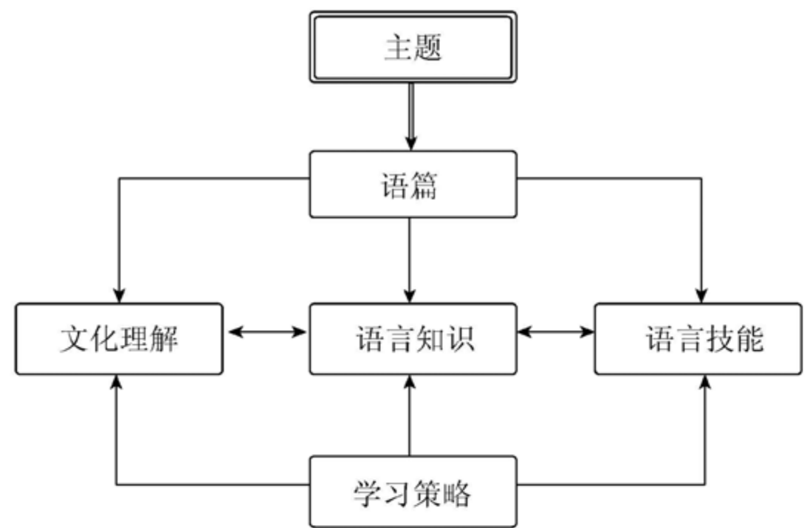
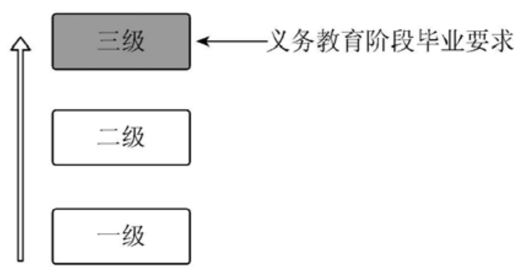
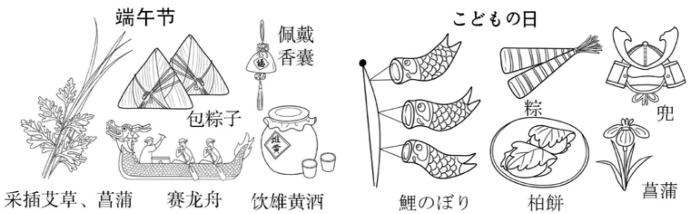
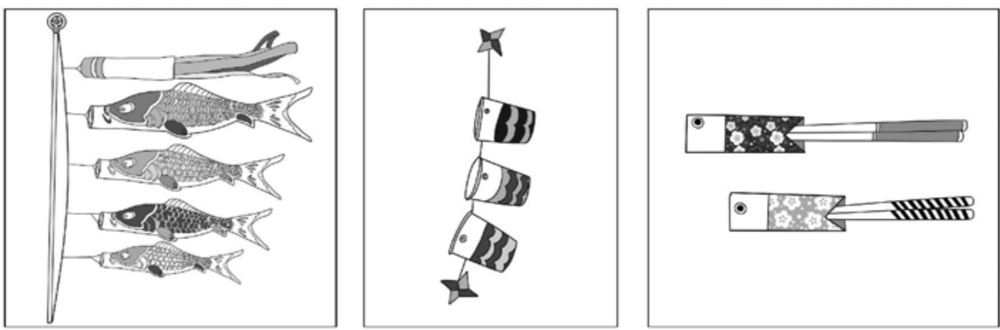
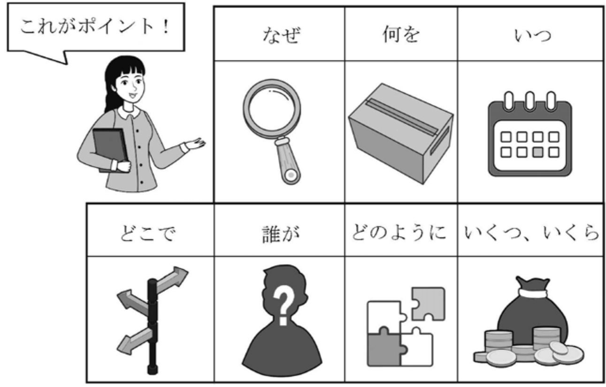
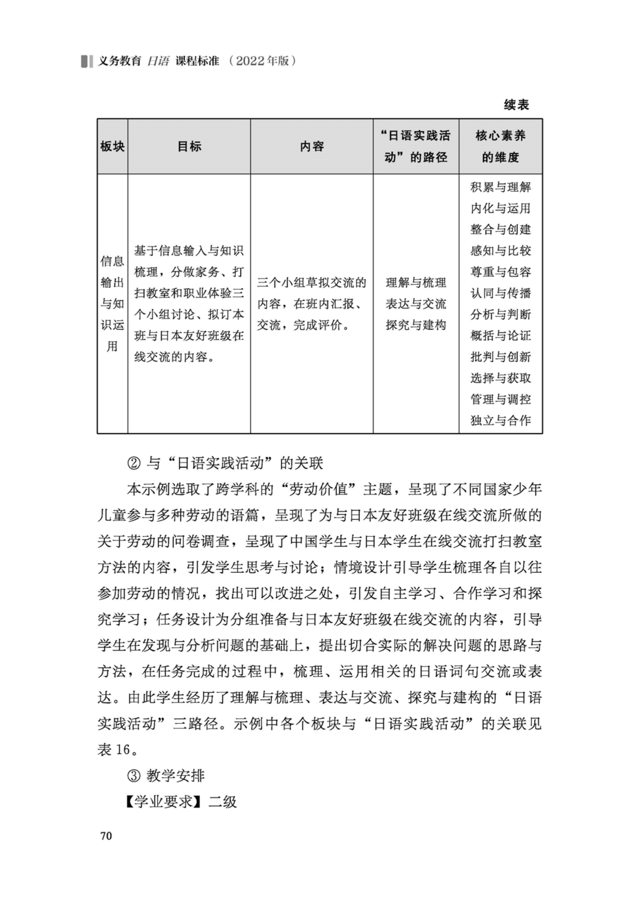
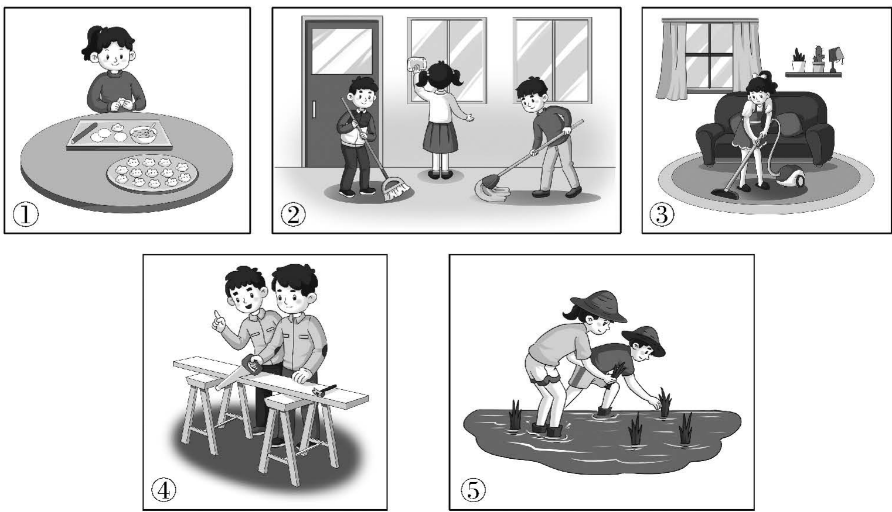
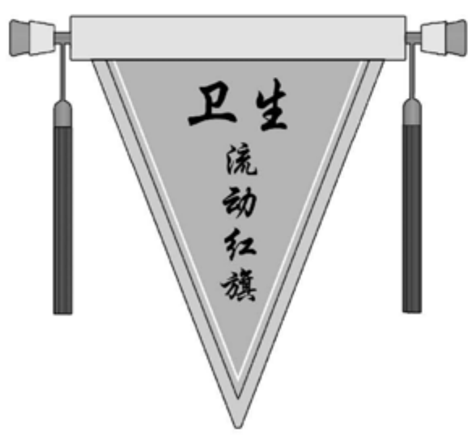

## 义务教育

# 日语课程标准

（2022年版）

中华人民共和国教育部制定

## 前言

习近平总书记多次强调，课程教材要发挥培根铸魂、启智增慧的作用，必须坚持马克思主义的指导地位，体现马克思主义中国化最新成果，体现中国和中华民族风格，体现党和国家对教育的基本要求，体现国家和民族基本价值观，体现人类文化知识积累和创新成果。

义务教育课程规定了教育目标、教育内容和教学基本要求，体现国家意志，在立德树人中发挥着关键作用。2001年颁布的《义务教育课程设置实验方案》和2011年颁布的义务教育各课程标准，坚持了正确的改革方向，体现了先进的教育理念，为基础教育质量提高作出了积极贡献。随着义务教育全面普及，教育需求从“有学上”转向“上好学”，必须进一步明确“培养什么人、怎样培养人、为谁培养人”，优化学校育人蓝图。当今世界科技进步日新月异，网络新媒体迅速普及，人们生活、学习、工作方式不断改变，儿童青少年成长环境深刻变化，人才培养面临新挑战。义务教育课程必须与时俱进，进行修订完善。

### 一、指导思想

以习近平新时代中国特色社会主义思想为指导，全面贯彻党的教育方针，遵循教育教学规律，落实立德树人根本任务，发展素质教育。以人民为中心，扎根中国大地办教育。坚持德育为先，提升智育水平，加强体育美育，落实劳动教育。反映时代特征，努力构建具有中国特色、世界水准的义务教育课程体系。聚焦中国学生发展核心素养，培养学生适应未来发展的正确价值观、必备品格和关键能力，引导学生明确人生发展方向，成长为德智体美劳全面发展的社会主义建设者和接班人。

### 二、修订原则

### （一）坚持目标导向

认真学习领会习近平总书记关于教育的重要论述，全面落实有理想、有本领、有担当的时代新人培养要求，确立课程修订的根本遵循。准确理解和把握党中央、国务院关于教育改革的各项要求，全面落实习近平新时代中国特色社会主义思想，将社会主义先进文化、革命文化、中华优秀传统文化、国家安全、生命安全与健康等重大主题教育有机融入课程，增强课程思想性。

### （二）坚持问题导向

全面梳理课程改革的困难与问题，明确修订重点和任务，注重对实际问题的有效回应。遵循学生身心发展规律，加强一体化设置，促进学段衔接，提升课程科学性和系统性。进一步精选对学生终身发展有价值的课程内容，减负提质。细化育人目标，明确实施要求，增强课程指导性和可操作性。

### （三）坚持创新导向

既注重继承我国课程建设的成功经验，也充分借鉴国际先进教育理念，进一步深化课程改革。强化课程综合性和实践性，推动育人方式变革，着力发展学生核心素养。凸显学生主体地位，关注学生个性化、多样化的学习和发展需求，增强课程适宜性。坚持与时俱进，反映经济社会发展新变化、科学技术进步新成果，更新课程内容，体现课程时代性。

### 三、主要变化

### （一）关于课程方案

一是完善了培养目标。全面落实习近平总书记关于培养担当民族复兴大任时代新人的要求，结合义务教育性质及课程定位，从有理想、有本领、有担当三个方面，明确义务教育阶段时代新人培养的具体要求。

二是优化了课程设置。落实党中央、国务院“双减”政策要求，在保持义务教育阶段九年9522总课时数不变的基础上，调整优化课程设置。将小学原品德与生活、品德与社会和初中原思想品德整合为“道德与法治”，进行一体化设计。改革艺术课程设置，一至七年级以音乐、美术为主线，融入舞蹈、戏剧、影视等内容，八至九年级分项选择开设。将劳动、信息科技从综合实践活动课程中独立出来。科学、综合实践活动起始年级提前至一年级。

三是细化了实施要求。增加课程标准编制与教材编写基本要求；明确省级教育行政部门和学校课程实施职责、制度规范，以及教学改革方向和评价改革重点，对培训、教科研提出具体要求；健全实施机制，强化监测与督导要求。

### （二）关于课程标准

一是强化了课程育人导向。各课程标准基于义务教育培养目标，将党的教育方针具体化细化为本课程应着力培养的核心素养，体现正确价值观、必备品格和关键能力的培养要求。

二是优化了课程内容结构。以习近平新时代中国特色社会主义思想为统领，基于核心素养发展要求，遴选重要观念、主题内容和基础知识，设计课程内容，增强内容与育人目标的联系，优化内容组织形式。设立跨学科主题学习活动，加强学科间相互关联，带动课程综合化实施，强化实践性要求。

三是研制了学业质量标准。各课程标准根据核心素养发展水平，结合课程内容，整体刻画不同学段学生学业成就的具体表现特征，形成学业质量标准，引导和帮助教师把握教学深度与广度，为教材编写、教学实施和考试评价等提供依据。

四是增强了指导性。各课程标准针对“内容要求”提出“学业要求”“教学提示”，细化了评价与考试命题建议，注重实现“教—学—评”一致性，增加了教学、评价案例，不仅明确了“为什么教”“教什么”“教到什么程度”，而且强化了“怎么教”的具体指导，做到好用、管用。

五是加强了学段衔接。注重幼小衔接，基于对学生在健康、语言、社会、科学、艺术领域发展水平的评估，合理设计小学一至二年级课程，注重活动化、游戏化、生活化的学习设计。依据学生从小学到初中在认知、情感、社会性等方面的发展，合理安排不同学段内容，体现学习目标的连续性和进阶性。了解高中阶段学生特点和学科特点，为学生进一步学习做好准备。

在向着第二个百年奋斗目标迈进之际，实施新修订的义务教育课程方案和课程标准，对推动义务教育高质量发展、全面建设社会主义现代化强国具有重要意义。希望广大教育工作者勤勉认真、行而不辍，不断创新实践，把育人蓝图变为现实，培育一代又一代有理想、有本领、有担当的时代新人，为实现中华民族伟大复兴作出新的更大贡献！

## 目录

一、课程性质 1

二、课程理念 2

三、课程目标 4

（一）核心素养内涵 4 （二）目标要求 6

四、课程内容 7

（一）主题 8 （二）语篇 10 （三）文化理解 12 （四）语言知识 14 （五）语言技能 18 （六）学习策略 20

五、学业质量 23

（一）学业质量内涵 23 （二）学业质量描述 23

六、课程实施 25

（一）教学建议 25 （二）评价建议 34

（三）教材编写建议 65 （四）课程资源开发与利用 71 （五）教学研究与教师培训 72

### 附录 75

附录1 核心素养水平划分 75 附录2 教材设计、教学与评价示例 78 附录3 语音 91 附录4 词汇 94 附录5 语法 122 附录6 交际用语 138

## 一、课程性质

日语属于黏着语，是日本的官方语言，也是世界上使用人口较多的语种之一。中国与日本同处东亚，拥有两千多年的交往历史，两国的语言和文化有密切的联系。学习和使用日语对于促进中日两国交流，推动文明互鉴，构建人类命运共同体具有重要作用。

义务教育日语课程体现工具性和人文性的统一，具有基础性、实践性与综合性的特征。学生在学习和使用日语的过程中进一步学会学习，提升思辨能力，了解日本及其他国家的文化，传播和弘扬中华优秀传统文化，形成跨文化意识，坚定文化自信，努力成为有理想、有本领、有担当的时代新人。

## 二、课程理念

### 1.突出育人导向

1. 突出育人导向日语课程以习近平新时代中国特色社会主义思想为指导，全面贯彻党的教育方针，落实立德树人根本任务。围绕学生核心素养的形成与发展细化课程目标，统筹课程内容、学业质量标准，明确课程实施要求，培养学生的家国情怀、国际视野及跨文化沟通与交流能力，实现课程的育人价值。

### 2.注重课程适应性

2. 注重课程适应性依据日语学习规律及学生认知发展水平，构建分级的日语课程，以适应不同地区、学校依据学生实际水平选择开设相应级别日语课程的需求，适应学生不同起点、不同兴趣等多样化的学习需求。

### 3.体现课程时代性

3. 体现课程时代性课程内容的选择注重反映经济社会新发展、科技进步新成果，符合当下社会生活、生产劳动、国际交往等需要，围绕生活、人文、社会和自然等主题，采用适宜的载体，融入文化理解、语言知识、语言技能和学习策略等，确保思想性和科学性。

### 4.促进学生转变学习方式

4. 促进学生转变学习方式突出实践育人，坚持“用中学”“做中学”，发挥学生在学习中的主体作用。通过主题为引领、情境为依托、语篇为载体、任务为驱动的“日语实践活动”组织课程内容与教学过程，指导学生经历理解与梳理、表达与交流、探究与建构的学习过程，有效开展自主学习、合作学习和探究学习，积累日语实践经验。

### 5.坚持发展性评价

5. 坚持发展性评价以促进学生与教师发展为评价的出发点和落脚点，坚持评价即学习，引导教师积极开展教学反思、学生开展学习自我监控，促进教师与学生自主成长。把评价作为教与学的重要组成部分，统筹教学目标、过程、评价一体化设计。坚持评价主体与评价方式多元化，善于运用观察、测量等手段，注重定性评价与定量评价相结合、过程性评价与终结性评价相结合，综合发挥教师、学生、家长等评价主体的作用。

## 三、课程目标

日语课程围绕核心素养，体现课程性质，反映课程理念，确立课程目标。

### （一）核心素养内涵

核心素养是课程育人价值的集中体现，是学生通过课程学习逐步形成的正确价值观、必备品格和关键能力。

日语课程要培养的学生核心素养，主要包括语言能力、文化意识、思维品质、学习能力等方面。语言能力是基础，文化意识主要体现价值观，思维品质反映对事物本质的把握，学习能力提供发展保障，彼此相互联系、相互融通。

学生通过日语课程的学习，逐步获得日语的理解与表达能力，提升思辨能力，培养尊重与包容人类文化多样性的意识，促进终身学习能力的发展，成为具有家国情怀、国际视野以及能够开展跨文化沟通与交流的人。

### 1. 语言能力

语言能力指学生在具体情境中综合运用语言的能力。通过理解与表达意义、观点及情感态度，不断积累、内化、整合知识。语言能力可以促进学生运用日语开展跨文化沟通与交流。

语言能力主要包括积累与理解、内化与运用、整合与创建三个维度。

### 2. 文化意识

文化意识指对不同文化的感知和认识。通过对比中外文化的异同，加深对中华文化的理解和认同，坚定文化自信。文化意识可以培养学生的家国情怀以及尊重与包容不同文化的态度。

文化意识主要包括感知与比较、尊重与包容、认同与传播三个维度。

### 3. 思维品质

思维品质指学生的思维在条理性、概括性、独创性等方面表现出的特质。通过梳理、归纳、推断等方式，培养思辨与创新的意识。思维品质的发展可以提高发现问题、分析问题和解决问题的能力。

思维品质主要包括分析与判断、概括与论证、批判与创新三个维度。

### 4. 学习能力

学习能力指获取知识与学习资源、管理与调控自身学习的能力。通过保持学习兴趣，积极运用和主动调适学习策略、拓展学习方法，提高自主学习与合作学习的意识，学会学习。学习能力的培养有助于形成可持续发展、终身学习的品质。

学习能力主要包括选择与获取、管理与调控、独立与合作三个维度。

核心素养的维度是对核心素养内涵的具体化，是设计日语课程内容、编写日语教材、组织日语课堂教学、设计评价与命题的基本出发点。核心素养维度的提出有助于改变单一的、以知识为中心的碎片化教学模式，有助于学生获得理解知识、研究和解决问题的思路及路径，有助于促进核心素养的有效形成。核心素养的维度如表1所示。

### （二）目标要求

在语言能力方面，能理解日语语篇的具体信息，大体把握其意义、观点及情感态度；能用日语陈述事实、表达观点和情感态度；能在相关的情境中完成学习任务，不断建构语言知识框架，促进日语沟通与交流能力的提升。

在文化意识方面，能从所接触的语篇或现象中发现中日两国及其他国家的文化元素，了解其特点，拓宽文化视野；在比较过程中加深对中华文化的理解与认同，尝试用相对简单的日语、以对方易于理解的方式讲好中国故事。

在思维品质方面，能通过梳理、归纳和推断等方式获取语篇的信息，把握其逻辑关系，理解其中所承载的文化内涵；在发现问题和分析问题的过程中，能有条理地表达所见所闻、阐述自己的观点，尝试解决问题。

在学习能力方面，能努力保持日语学习兴趣，选择并逐渐形成适合自己的学习方法，养成良好的学习习惯；能主动搜集并开发学习资源，有效开展自主学习与合作学习，总结、反思自己的学习行为和学习过程，为培养终身学习能力奠定基础。

## 四、课程内容

日语课程内容由主题、语篇、文化理解、语言知识、语言技能和学习策略六个课程要素组成，各要素相互交织、有机融合。

主题是日语课程内容的核心，在课程内容六要素中处于引领地位，具有跨学科的特征，统领教材编写、教学设计中的语篇选取、情境创设与任务设计。学生在学习主题明确的语篇过程中，通过理解、梳理、内化、表达、交流等一系列基于日语的体验与实践，在具体情境中发现问题、分析问题和解决问题，促进核心素养的形成与发展。

语篇是日语课程内容的载体，承载了语言知识、文化信息、情感态度及思维方式等。学生在语篇的学习过程中，积累语言及文化知识，培养语言技能和学习策略，促进文化理解，提升思维能力。

文化理解是培养“文化意识”的重要基础。学生在语篇的学习过程中，了解日本及其他国家的文化，加深对中华文化的理解与认同，学会以对方易于理解的方式讲述身边的人和事、介绍熟悉的中华文化现象等。同时，文化理解也是“思维品质”形成的重要途径。

语言知识是“语言能力”的基础，是语言技能形成的前提。学生在语言知识的理解、积累与运用过程中，不断提升文化理解能力。

语言技能是“语言能力”的重要表现形式。学生在不断增强语言技能的过程中，提升跨文化沟通与交流的能力。

学习策略是“学习能力”形成的重要支撑，贯穿于主题、语篇、文化理解、语言知识和语言技能等日语课程内容学习的全过程。

日语课程内容六要素的相互关系如图1所示。

日语课程将学生的日语学业水平分为一至三级（见图2），与高中阶段的四至六级衔接。

### （一）主题

### 1. 内容要求

日语课程将主题分为生活、人文、社会和自然四个范畴，每个范畴分为若干领域。

日语课程的主题不分级。主题范畴、领域如表2所示，其中每个范畴例举八个领域（每个领域提供两个主题示例），供教材编写与课堂教学设计参考。

### 2.教学提示

2. 教学提示主题内容的选择应紧密结合核心素养的培养，涵盖中国、日本及其他国家的相关内容。起始阶段可以更多地选择贴近学生日常生活的相关主题，如校园生活、劳动价值、传统文化、社会服务、卫生健康等；随着学习的推进，可适当选择国际交流、法治社会、国家安全、生态保护、科学技术等主题。主题的选择，既要充分考虑日语课程的育人功能，也要充分考虑情境和任务设计的可操作性、可评价性，以及语篇的难度与容量。

在教材编写和课堂教学中，通过创设与主题内容密切相关的情境，充分挖掘特定主题所承载的育人价值，设计与主题相关的任务，激发学生的主动性，帮助学生提升对主题内容的理解和表达能力，拓宽视野，提高跨文化沟通与交流能力，增强思维能力；要关注各个主题范畴之间的合理搭配，并根据实际情况做适当调整，将同样的主题设计为不同复杂程度的学习内容。“任务群的设计方案”（见表8）提供了同一主题下不同复杂程度的学习内容和任务要求的示例。

### （二）语篇

### 1.内容要求

1. 内容要求语篇包含口语、书面等不同类型，涵盖听、读、看、说、写和展示等生活中常见的交际方式。在教学中语篇既可以通过教材的文本获得，也可以利用信息技术从其他渠道获取。接触和学习不同类型的语篇，有助于学生把握不同类型的语篇结构和语言表达特点，有效获取、理解不同类型日语语篇的信息，运用恰当的语篇形式与他人展开有效交流、表达自己的观点。学习与教学过程中的情境创设、任务设计等均需基于语篇。

### 2. 学业要求

语篇的学业要求、类型及示例如表3所示，其中语篇类型不分级。

### 3. 教学提示

语篇的选择应充分体现所选主题内容，尽可能涵盖生活中不同的语篇类型，关注人文性与实用性，使学生能够接触真实、多样的语篇。起始阶段可选择日常会话、口头陈述、邮件信函、日记等形式的语篇，随着学习的推进，可以选择更丰富的语篇形式。

语篇的选择、改编与编写应满足情境创设、任务设计的需求；创设的情境、设计的任务应能充分发挥语篇所承载的主题、内容和育人价值。

在教材编写和课堂教学中，通过对语篇结构及语言表达特点的探讨，帮助学生形成语篇意识，了解不同语篇的结构和特点，提高理解信息、表达观点和情感态度的能力；通过理解与梳理语篇所承载的语言信息和文化意义，提高学生对不同语篇内涵的感知能力，丰富学生的情感与生活体验，促进学生树立正确的世界观、人生观和价值观。

### （三）文化理解

### 1. 内容要求

文化涵盖物质和精神两个方面。物质文化主要包括饮食、服饰、建筑和交通等，精神文化主要包括科学、文学、艺术和习俗等。

文化理解的内容要求基于“文化意识”的感知与比较、尊重与包容、认同与传播三个维度提出。

### 2. 学业要求

文化理解的学业要求分为一至三级，具体要求如表4所示。

### 3. 教学提示

文化理解应结合主题，关注语篇所承载的文化内涵和价值取向。

文化理解的教学要切实基于语篇素材，引导学生正确地认知、分析与判断文化现象。设计有关文化理解的产出性任务时，要充分考虑学生的现有水平，使学生获得学以致用的成就感。

在教材编写中，要引导学生通过体验、探究、分析等多种形式的学习环节，提高对不同文化的感知、比较与理解能力，加深对中华文化的理解与认同；要引导学生用所学的日语，以对方易于理解的方式讲述身边的人和事，初步探讨中外文化的内涵，培养学生尊重与包容不同文化的意识。在对比不同文化现象时，应适当引导学生关注相关词语、表达方式和表达习惯。

### （四）语言知识

### 1. 内容要求

语言知识主要包括语音、文字词汇和语法三个部分。

语音是语言的外在形式，是意义的载体，与理解和表达有着密切的关系。文字是记录语言的工具，词汇是一种语言中所有词的总和，词是语言的建构材料。语法通常指构词、造句、连句成篇的规则，包括词法、句法、句子以及语段的连接方式等。词法关注词的构成及形态变化，句法关注句子的组织和结构，句子、语段的连接方式关注语句的衔接与连贯。

### 2. 学业要求

语言知识中文字词汇、语法的学业要求分为一至三级；语音的学业要求贯穿语言知识学习的全过程，不分级。语言知识的学业要求如表5所示。

续表续表续表

|  |  |  |  |
| --- | --- | --- | --- |
| 级别 | 语音 | 文字词汇 | 语法 |
| 二级 |  | (如～方、～さ等),理解其意义。 | (3) 理解与运用部分表达形式,如Vてください(要求)、Vないでください(禁止、制止)等。 (4) 理解与运用表示思考、表述等内容的表达形式,如Sと思う等。 (5) 掌握しかし(转折)、そして(事物连续性的进展或推进)、それから(衔接前后发生的事项)、だから(原因)等连词的用法。 (6) 掌握名词句、动词句、形容词句的简体形式。 |
| 三级 |  | (1) 学习1000个常用词,掌握其中800个词的基本词义和用法。 (2) 掌握部分后缀(如～間、～人、～中等)的构词规则,理解其意义。 (3) 了解词的词性、基本的构词方法和词语的基本搭配,学习在语境中理解和运用词语。 | (1) 了解日语语序和句子结构的特点。 (2) 理解部分助词的意义与功能并在表达中运用,如ずつ(等量)、な(禁止)、ほど(概数)等。 (3) 理解与运用条件的表达方式,如Vたら、Vば等。 (4) 掌握授受动词あげる、くれる、もらう的基本用法。 (5) 理解与运用部分表达方式,如Vたい(愿望)、V(よう)と思う(意志)、Vたことがある(经历)、Vたほうがいい(建议)等。 (6) 理解与运用部分连词,如けれども(转折)、それに(累加)、それで(由于前项的原因导致后项结果的自然发生)等。 |

|  |  |  |  |
| --- | --- | --- | --- |
| 级别 | 语音 | 文字词汇 | 语法 |
| 三级 |  |  | (7)初步掌握Vてくる、Vていく (由远及近的移动、由近及远的移动)等的语法表达形式。 (8)理解与运用“こそあど”系列词中指示方向、场所或人的名词用法(こちら、こっち等);理解与运用指示限定事物的连体词用法(こんな等);理解与运用指示程度、状态、动作方式的副词用法(こう、こんなに等)。 |

注：表中N表示名词，V表示动词（包含三种类型的动词及其词形变化形态），A表示形容词（包含两种类型的形容词及其词形变化形态），S表示句子。

### 3. 教学提示

语言知识的教学应基于语篇、情境和任务，应有利于学生学会理解和运用语言知识、表达意义；要引导学生根据情境及任务，有选择、有层次地学习及运用语言知识，运用学习策略建构自己的知识体系，避免死记硬背，避免知识碎片化。

在教材编写中，要引导学生在具体的语境中感悟语义、语法功能；理解中日同形词、日语的汉语词、和语词、外来词的意义及使用条件并在表达中运用；感知语音、语调的表意功能，培养语感；通过理解与梳理、表达与交流、探究与建构等路径，有效地理解和掌握语言知识，为培养日语沟通与交流能力打下基础。

### （五）语言技能

### 1. 内容要求

语言技能包括理解性技能与表达性技能。理解性技能主要指听、读、看，表达性技能主要指说、写、展示。这些技能在日语学习过程中相辅相成、相互促进。要通过培养学生的语言技能，使学生能理解意义、陈述事实、表达观点与情感态度，能在中日语言和文化之间转换，完成口头和书面交流。

### 2. 学业要求

语言技能的学业要求分为一至三级，具体要求如表6所示。

续表

<table><tr><td>级别</td><td colspan="2">学业要求</td></tr><tr><td rowspan="2">二级</td><td>理解</td><td>(1) 在教师的引导下,根据简单语篇中的标题、语句、图表和图像等提取所需信息;通过预测、推断等学习策略,大体把握语篇的基本内容。 (2) 在教师的引导下,根据语篇中表示并列、递进、因果和转折等的表达方式,理解语篇中简单的逻辑关系。 (3) 在教师的引导下,根据语气、语调等,知晓作者或说话人的观点、情感态度。 (4) 大体理解说话人的表情、动作和手势等非言语行为所表达的意思。</td></tr><tr><td>表达</td><td>(1) 根据所学语篇的信息和内容做简单的复述。 (2) 运用表示并列、递进、因果和转折等的表达方式,就非常熟悉的主题做简单的陈述。 (3) 运用所学的情感表达方式,就非常熟悉的主题大致表达自己的情感态度。 (4) 在口头交流中,借助表情、动作和手势等非言语手段,辅助意义的表达。</td></tr><tr><td rowspan="2">三级</td><td>理解</td><td>(1) 根据语篇中的标题、语句、图表和图像等提取所需信息;通过预测、推断等学习策略,大体把握语篇的基本内容。 (2) 在教师的引导下,根据语篇中表示并列、递进、因果和转折等的表达方式,理解语篇的逻辑关系。 (3) 在教师的引导下,根据语气、语调等,大体理解作者或说话人的观点、情感态度。 (4) 理解说话人的表情、动作和手势等非言语行为所表达的意思。</td></tr><tr><td>表达</td><td>(1) 根据语篇的信息和内容,运用已有知识,做简短的表述与交流。 (2) 运用表示并列、递进、因果和转折等的表达方式,就非常熟悉的主题做简单的描述。 (3) 运用所学的情感表达方式以及适当的语气、语调,就非常熟悉的主题大致表达自己的情感态度。 (4) 在口头交流中,借助表情、动作和手势等非言语手段,尝试补充意义的表达。</td></tr></table>

### 3.教学提示

语言技能的培养不仅要关注信息的理解和表达，还要关注各项技能的综合运用。

要增强语言技能训练的真实性，注重引导学生在探讨主题意义、解决问题和完成任务的过程中有效提升学生的日语语言技能。语言技能的训练要根据语篇内容及语言的难度循序渐进，采取不同的引导方式。

在教材编写中，要根据学生的生活经验和认知水平，设计接近真实的情境和任务，通过理解与梳理、表达与交流、探究与建构等路径，帮助学生在分析问题、解决问题的过程中提高理解能力和表达能力，促进文化意识、思维品质和学习能力的提升。汉语与日语之间的转换，要以帮助学生察觉和领悟两者之间的异同为主要目的。

### （六）学习策略

### 1.内容要求

学习策略包括认知策略、调控策略、资源管理策略和交际策略等。认知策略指学生为完成具体的学习任务而采用的方法与步骤；调控策略指学生为提高日语学习效率，计划、监控、评价、反思、调整自己学习过程及学习行为的方法与步骤；资源管理策略指学生为更有效地评估、应对外部环境，积极有效利用外部资源而采取的方法与步骤；交际策略指学生为积极、有效、得体地交流而采取的方法与步骤。学习策略具有主动性、程序性、灵活性和可教性，有效的学习策略有助于提高学生的学习效率和学习能力。

### 2.学业要求

学习策略贯穿课程学习的全过程。学习策略的学业要求不分级，具体要求如表7所示。

### 3. 教学提示

学习策略应根据教学内容、学生特点有针对性地培养。有效学习策略的形成是循序渐进的过程，应贯穿日语学习过程的始终。

在教材编写和课堂教学中，应基于“学习能力”的选择与获取、管理与调控、独立与合作三个维度，有机融入学习策略，有效指导学生了解、运用学习策略。学生在学习日语过程中遇到问题时，教师应帮助学生借助学习策略，寻找克服困难、提高学习效率的有效方法。教师还可以根据学生的实际情况，择机引导学生交流使用学习策略的感受和经验，适当梳理、归纳有效的学习方法，更好地助力核心素养的形成与发展。

## 五、学业质量

### （一）学业质量内涵

学业质量是学生在完成课程阶段性学习后的学业成就表现，反映核心素养要求。

学业成就表现指学生通过日语课程的学习，在语言能力、文化意识、思维品质和学习能力等核心素养诸方面的综合表现，是应对各种复杂、不确定的现实生活情境时所反映出的知、行、意统一的学习结果。

学业质量标准是以核心素养为基础，结合课程内容，对学生学业成就具体表现特征的整体刻画，是日语教学与评价、日语教材编写以及日语考试命题的依据。

### （二）学业质量描述

学业质量标准以核心素养的水平划分（见附录1）为依据，结合课程内容，参照学生日语学习的阶段性发展规律，总体描述大多数学生在学习日语课程之后形成的正确价值观、必备品格和关键能力等方面的典型表现特征。

学业质量标准通过行为动词描述学生在一定复杂程度或难度条件下所表现出的学习行为的典型特征，确定学生在完成义务教育阶段的学习时应达到的学业水平。

学业质量标准分别描述学生在核心素养“语言能力”“文化意识”“学习能力”三个方面的学业成就表现，“思维品质”的学业成就表现贯穿其中，具体要求如下。

1. 围绕非常熟悉的主题，能调动已有知识与策略，理解语篇的基本信息，大体把握其意义、观点及情感态度。通过梳理、归纳、推断等方式掌握语篇的主要内容，大体把握语篇的基本逻辑关系。能从语篇中发现中日两国语言的明显差异，学习建构语言知识体系，促进语言运用能力的提升。能用相对完整、顺畅的话语有条理地与他人交流，简单介绍身边的事物，表达自己的意图、观点和情感态度等。

2. 能从所接触的语篇或现象中感知与发现日本或其他国家的文化元素，能联系相关的中华文化元素，分析和比较不同文化之间的异同，对不同文化采取尊重与包容的态度，有选择、有批判地借鉴，增强对中华文化的认同。能基于自身的体验，用得体的表达方式交流，简单介绍中华优秀传统文化、风俗习惯等，具备一定的跨文化沟通与交流能力。

3. 能运用资源管理策略，根据情境、任务，有效搜集、选择学习资源，分析、概括并处理相关信息。能运用调控策略，反思和调整自己的学习行为和学习过程，在自主学习过程中保持学习兴趣。在合作学习中，能倾听不同意见，听取合理建议，有理有据地表达个人观点，达成共同的学习目标，具备自主学习与合作学习的能力。

## 六、课程实施

### （一）教学建议

日语课程倡导通过“日语实践活动”组织课程内容与学习过程。课程实施要遵循主题为引领、情境为依托、语篇为载体、任务为驱动四个原则，要通过理解与梳理、表达与交流、探究与建构三个路径，有机融入日语课程内容的主题、语篇、文化理解、语言知识、语言技能和学习策略等六要素，有效培养学生的核心素养。

### 1.“日语实践活动”原则与路径

（1）“日语实践活动”的四原则主题为引领指要以生活、人文、社会和自然等主题范畴为核心内容选择语篇、创设情境、设计任务，开展教学活动；情境为依托指日语的学习与教学要基于真实生活中需要解决的问题，要体现用日语解决问题的现实需求；语篇为载体指日语的学习与教学要基于具有相对完整语境的语篇展开；任务为驱动指日语的学习与教学要落实到解决问题的任务上，整合学习情境、学习内容、学习方法和学习资源，引导学生在运用日语的过程中提升核心素养。

基于“日语实践活动”的思路设计教学时应体现自主学习、合作学习和探究学习等学习方式与学习过程，要注意改变单纯体现语言知识而缺少生活基础的教学内容，改进单纯解释语言知识而缺乏语境的以词、句为单位的教学方式，减少单一的、以简单的机械训练为主的教学活动，改变逐词逐句翻译文本的教学习惯。

（2）“日语实践活动”的三路径理解与梳理学生通过日语语篇获取和分析信息的过程。教师要引导学生运用所学语言知识，带着问题在具体的语境中听、读、看，判断意义，理解与梳理语篇中的事实、观点和情感态度等。

表达与交流指学生运用日语完成口头或书面的语言交际过程。教师要引导学生调动已有语言知识和背景知识，归纳、陈述语篇信息或个人观点；引导学生在互动中提出问题、陈述观点、列举事实、交换意见等。

探究与建构指学生发现问题、分析问题和解决问题的过程。教师要引导学生通过发现式学习、探究式学习等，围绕主题拓宽视野、加深理解，逐步建构自己的知识体系，提升思维能力。

### 2.“日语实践活动”实施建议

（1）基于“日语实践活动”确定教学目标日语课程内容的组织与学习过程的设计要遵循“日语实践活动”的四原则与三路径。

教学目标要围绕有效实施“日语实践活动”来确定；要关注学生语言知识、语言技能、学习策略、文化意识与思维品质的养成；要结合各阶段的具体学习内容、学业质量标准制订学年教学目标、单元教学目标和课时教学目标；要充分考虑义务教育阶段学生的认知水平、能力差异，着力培养学生在具体情境中发现问题、分析问题和解决问题的能力，通过合作学习、互动交流等方式，提高学生综合运用语言的能力。

（2）围绕教学目标整合教学内容教师要基于教学目标精心筛选、研读语篇，设计情境与任务，以学生的知识经验和思维水平为基础，参照学业质量标准，设计适合学生发展的教学内容；加强日语学习与现实生活之间的联系，实现学生在真实情境中对课程内容的深度理解与灵活运用。

（3）精心设计丰富多彩的学习活动学习活动的设计要基于学情和认知差异，确定合理的学习进度，既要为学生提供独立自主的学习空间，也要促进学生之间的合作学习。教学过程的设计要创设适切的、贯穿学习始终的情境，有利于学生掌握更多的日语课程和跨学科的知识、技能，激发学生的学习兴趣，提高学生的自主学习能力；要在活动中挖掘学生潜能，促进学生形成良好的日语理解、表达和展示能力。

（4）基于情境开展评价设定教学目标的同时要考虑评价的实施，确保“教一学一评”的一致，确保所设计的教学目标、教学过程可操作、可评价。要将学生的学习行为表现作为评价要素，关注学生在具体情境中运用日语知识和技能解决问题能力的提升。

### 3.以“日语实践活动”为思路的学习活动设计示例

本示例呈现基于“日语实践活动”思路设计学习活动的过程，不是具体课时内容的教案。教师可以根据教学实际情况选择、调整任务的数量、顺序及难度，确定线上与线下、课前与课后具体的学习内容及时间分配。

本示例围绕“传统节日”这一主题，结合美术课的活动安排，以探讨中国端午节对日本儿童节（こどもの日）的影响为情境，通过制作或绘制日本儿童节悬挂的鲤鱼旗（鯉のぼり），查找其中的中国传统文化元素，完成展板制作或基于网络平台的成果展示。

本示例的整体设计方案如下。

【主题】传统节日【情境】探讨中国端午节对日本儿童节的影响（日语课），了解日本儿童节鲤鱼旗的意义，以及其中的中国传统文化元素（美术课）。

【总任务】通过展板或网络平台展示自己制作或绘制的鲤鱼旗，简介其中的中国文化元素，简述中国端午节文化对日本的影响。

为完成上述总任务，本示例选择由若干子任务构成的任务群设计方案（见表8），呈现具体任务与“日语实践活动”三路径的关联、与核心素养的关联，以及与美术课的协调和配合。表中“一级”“二级”“三级”呈现的是根据不同学业要求设计的不同复杂程度的任务要求。教材编写团队、一线教师可以根据实际情况，选取子任务的数量或调整子任务的顺序及复杂程度。

续表

<table><tr><td>任务群</td><td>“日语实践活动”的路径</td><td>与核心素养的关联</td></tr><tr><td>任务2 ·搜集手工制作鲤鱼旗的信息，可以是文字的、图片的或音视频的(信息技术的运用)。 一级：可以在中国网站上查找。 二级：可以尝试在中国、日本网站上一并查找。 三级：可以在中国、日本网站上查找，并将查找到的信息做综述。 ·通过小组讨论确定制作方式。</td><td>理解与梳理探究与建构</td><td>思维品质：对所搜集的信息做有条理的梳理和归纳。 能以思辨的方式就所搜集的信息内容提出问题。 针对所提出的问题，思考并探究解决方案。</td></tr><tr><td>任务3 ·查找鲤鱼旗的简介，了解鲤鱼旗的要素。 一级：可以在中国网站上查找。 二级：可以尝试在中国、日本网站上一并查找。 三级：可以在中国、日本网站上查找，并将查找到的信息做综述。 ·通过小组讨论确定本组作品可以或需要体现的要素。</td><td>理解与梳理探究与建构</td><td rowspan="2">学习能力： 用已掌握的知识独立完成信息搜集。 能主动参与小组合作学习。 在与同学的互动和合作中完成任务。</td></tr><tr><td>任务4 ·确定制作或绘画的程序、工具。 ·确定制作分工。 ·确定本组作品的亮点。 ·确定作品的复杂程度。可以根据完成时间的长短、手工制作或绘画水平的高低、是否会带来过多的负担等因素确定。 ·完成制作或绘画。</td><td>探究与建构</td></tr></table>

续表

<table><tr><td>任务群</td><td>“日语实践活动”的路径</td><td>与核心素养的关联</td></tr><tr><td>任务5 ·分组查找鲤鱼旗中包含的中国元素。 一级：可以在中国网站上查找。 二级：可以尝试在中国、日本网站上一并查找。 三级：可以在中国、日本网站上查找，并将查找到的信息做综述。 ·通过小组讨论确定本组介绍的主要内容、方式和分工。</td><td>探究与建构表达与交流</td><td rowspan="3" /></tr><tr><td>任务6 ·分组完成对作品的口头介绍(含作品的特点以及其中的中国传统文化元素)。 一级：主要通过日语词语呈现，可以穿插汉语的表述。 二级：主要通过简单的语句呈现，适当使用汉语。 三级：用相对完整的日语呈现。 ·分组完成对其他组介绍的评价。</td><td>理解与梳理表达与交流探究与建构</td></tr><tr><td>任务7 ·根据其他组的评价，结合任务1和任务6，通过展板或网络平台展示等方式，以鲤鱼旗为例，简单介绍中国传统文化对日本的影响。 ·确定本组可以用日语简述、其他组同学可以听懂的内容和讲述的方式。 一级：主要通过日语词语呈现，可以穿插汉语的表述。 二级：主要通过简单的语句呈现，适当使用汉语。 三级：用相对完整的日语呈现。</td><td>表达与交流探究与建构</td></tr></table>

注：评价可参见“评价建议”中的评价量规（表 \(12\sim\) 表14）。

以下提供部分图文信息，提示设计任务时如何参考、选用相关资源与信息。设计学习活动时，此类信息可以由教师指导学生搜集、整理，也可以由学生自主搜集、整理，为完成相应的任务做准备；编写教材时，应考虑此类信息中哪些可以作为语篇素材、哪些可以编入任务。学生对这些信息的处理，既是解决问题的过程，又是发展思维与学习策略等的过程。

（1）中国端午节与日本儿童节的主要信息续表

|  |  |  |
| --- | --- | --- |
| 项目 | 中国的“端午节” | 日本の「こどもの日」 |
| 風習 | 1. 包粽子 2. 采插艾草和菖蒲 3. 赛龙舟 …… | 1. 菖蒲湯に入る (菖蒲⇒「勝負」) 2. 鯉のぼりを上げる (子供が元気になる) …… |
| その他 | …… | …… |

（2）日本鲤鱼旗的相关信息

（3）鲤鱼旗制作的要素鲤鱼旗制作的要素可以参考表10。

注：以上内容可根据实际情况增减、调整难度，需要时也可转为汉语。

### （4）与中国传统文化的关系

注：以上内容可根据实际情况增减、调整难度，需要时也可转为汉语。

### （二）评价建议

评价对于有效实施日语课程具有重要的导向作用。要明确核心素养立意，以学业质量标准为依据，根据日语课程内容要求，以学生在学习过程中的行为表现为对象，重视对正确价值观、关键能力和必备品格的考查；充分发挥评价的引导和诊断功能，及时、准确把握学生的学习状况和问题，调整教学进度和教学方法；加强过程性评价，完善对学生学习过程的观察、记录、分析及结果应用；有效利用信息技术搜集与课程内容相关的信息，增强评价内容的真实性和全面性；突出评价的导向性、科学性，提升评价的质量，实现以评促学、以评促教、以评育人。

### 1. 教学评价

日语课程注重学习过程与学习结果评价有机结合，重视过程性评价。过程性评价主要评价学生在日常学习过程中表现出的核心素养水平。教师要结合学业质量标准与教学目标，实施对学生日常学习的有效评价，并利用评价结果反馈不断改进教学，帮助学生成为成功的学习者。

### （1）总体要求

评价的主要目的是促进学生学习方式的转变，促进教师教学行为的转变，使教学按照“日语实践活动”的四原则与三路径设计、组织和实施，有效提高学生核心素养水平。过程性评价的内容包括学生的学习态度、学习内容掌握程度、学习参与程度和贡献度、认知能力和学习能力等。评价基本原则和要求如下。

\(①\) 以评价促进学生转变学习方式要关注学生在学习过程中各方面的学习行为表现，依据日语课程的学业要求和学业质量标准，引导学生明确日语课程内容的学习目标，用自评、互评等方式发现自己学习过程中的进步与存在的问题，分析问题形成的原因，通过自我反思有效改进学习方法。

\((2)\) 评价方式多样化要将定性评价与定量评价相结合，单项评价与整体评价相结合，纸笔测试与表现性评价相结合，综合利用多种方式，发挥评价促进学生发展、促进教师优化教学的作用。

\((3)\) 评价主体多元化要充分发挥学校、教师、学生和家长等不同角色的作用，从不同的视角组织评价，综合利用各评价主体的互动作用。

\((\widehat{\Delta})\) 以评价改进和优化教学要利用评价的结果找出教学过程中存在的问题，研究有针对性的改进方法；要寻找影响教学目标达成度的原因，从教学目标、教学方式或教学策略的合理性以及教学实施与调控方法的有效性等方面综合评估与分析，改进教学方法、优化教学过程，有效引导学生学习方式的转变。

### （2）评价的实施

学生的学习效果主要体现在课堂参与、合作学习、完成作业、单元及期末评价等环节。

\(①\) 课堂评价重视学生的学习行为与方式，适时评价学生的表现。要注重了解学生在学习过程中采用的学习方式和解决问题的思路与办法；要发现学生在分析问题与解决问题的过程中有效的方法和学习策略，引导学生与他人分享；要评价与分析学生学习过程中不合理的学习方式、思维方法，分析发生错误的原因；根据学生的表现，评估教学方法的有效性，调整教学内容和方法，以提高教学效果。例如，可以根据学生在理解与梳理、表达与交流、探究与建构中的表现，判断学生对课堂任务的兴趣和投入程度、对任务的适应程度和解决问题的能力等，基于学生在完成具体任务中的表现评估教学内容与教学方法的适宜程度，做出相应的调整。

表12至表14为评价学生学习行为表现的评价量规示例。

表12适用于评价小组合作中的个人表现（如表8中的任务 \(1\sim\) 7)，既可以用于自评，也可以用于互评。

续表表13适用于评价小组合作学习（如表8中的任务 \(1\sim 7\) ），既可以用于小组自评，也可以用于小组间的互评。

<table><tr><td rowspan="2">要素</td><td colspan="4">水平</td></tr><tr><td>超越目标</td><td>达到目标</td><td>接近目标</td><td>尚需努力</td></tr><tr><td>结构设计</td><td>结构清晰，布局合理，版面设计清楚、新颖。</td><td>结构清晰，布局比较合理，版面设计清楚。</td><td>结构不够清晰，布局不够合理，版面设计不够清楚。</td><td>没有结构设计，布局不合理。</td></tr><tr><td>语篇叙述</td><td>语篇完整，听者能够完全理解叙述的内容。</td><td>语篇基本完整，听者能够基本理解叙述的内容。</td><td>语篇不够完整，影响听者理解叙述的内容。</td><td>语篇不完整，听者不能理解叙述的内容。</td></tr><tr><td>汇报表现</td><td>仪表大方，声音清晰，表达生动、流畅，能够吸引听者。</td><td>声音清晰，个别地方表达不够流畅，能够让听者感觉到汇报人的努力。</td><td>态度不够自信，声音不够清晰，表达有多处断续，用词单调。</td><td>态度不自信，声音过小，叙述不流畅，用词过于简单。</td></tr></table>

续表表14用于评价学生自主学习的行为表现。表中只列出了“达到目标”的水平描述，另外三项的水平描述可以根据教学需要和学生的实际情况灵活设计。

<table><tr><td rowspan="2">要素</td><td colspan="4">水平</td></tr><tr><td>超越目标</td><td>达到目标</td><td>接近目标</td><td>尚需努力</td></tr><tr><td>阐述</td><td /><td>运用所学日语，将归纳和整理的信息、自己的观点、依据及结论清楚地介绍给听者。</td><td /><td /></tr></table>

\((2)\) 作业评价作业主要指在学生课堂学习过程中和课堂学习之后，教师设计的学习材料和学习诊断材料，用以促进或检验学生的学习效果，把握学生的学习状况。作业评价要关注以下几点。

·作业内容要紧扣课堂学习的目标和内容，以掌握课堂学习内容为基本要求和评价标准，重视对学生的知识理解和应用能力的评价。

·作业形式要多样化，可以有书面作业、视听说作业、视频录制和海报制作等，要注意单项训练与综合训练相结合。

·作业评价要体现层次性，根据学生对学习内容的认知程度大致可以将作业分为识记性练习、理解性练习、应用性练习和综合性练习等。要针对不同学生的认知特点和能力差异，布置不同水平的作业；要在注重理解和应用的基础上，加强综合性、探究性和创新性，并注意控制难度与容量。

\((3)\) 单元评价与期末评价单元评价与期末评价都是对学生阶段性学习情况的评价，要坚持核心素养导向，有机结合过程性评价与终结性评价。

单元评价是在完成一个单元的学习之后，对学生所达到的学业水平做出的评价。单元评价应参照学业质量标准，注意以下几点。

·要将单元学习过程中多种活动的成果纳入评价的内容，例如，体现学习过程和结果的档案袋，平时所做的学习日志，根据表12至表14所做的表现性评价等。

·要具有基础性，关注学生对本单元基础知识的理解和掌握程度。重点考查学生理解了什么和会表达什么。

·要以运用知识解释与解决问题作为评价学生学业水平的要求。在知识理解的基础上，要考查学生解释问题和解决问题的能力。要利用具有实践性的任务有效测评学生完成任务的能力。

·要围绕单元学习过程中表现出来的主要问题展开评价，不必面面俱到，以增强单元评价的针对性。

期末评价是一个学期学习之后，对学生所达到的学业水平做出的评价。期末评价应参照学业质量标准，注意以下几点。

·要将本学期学习过程中的多种活动成果纳入期末评价的内容。除此之外，还可以包括学生完成某一项目的综合评价。

·要参照“学业水平考试”的要求命制试题。

·要适度匹配一般性考查与本学期重点、难点考查的比例。

·纸笔测试中，主观题与客观题的比例要适当，避免设置过量的客观题。主观题要坚持素养导向，综合考查学生核心素养的达成度（具体示例参见“学业水平考试”中的典型试题）。

### 2. 学业水平考试

日语学业水平考试是以学业质量标准、课程内容的学业要求为依据，由省级教育行政部门组织实施的统一测试，旨在检测和衡量学生在义务教育阶段结束时的学业成就及其表现水平，为判断学生是否达到国家规定的毕业要求提供主要依据，为高一级学校招生录取提供重要依据，为评价区域和学校教学质量提供参考，为提升教育质量、改进教学方式提供有效信息。

学业水平考试是日语课程评价的重要组成部分，也是日语课程的终结性评价。学业水平考试应着眼于学生核心素养的达成度，真实呈现学生核心素养的发展过程与现有水平，并以此为依据，分析学生核心素养提升过程中取得的成效、存在的问题及其原因。

（1）命题原则

\(①\) 导向性试题的命制应坚持核心素养立意。在命题过程中要基于情境、问题导向，重视深度思维，以利于引导学生开展自主、合作和探究学习，充分发挥考试对推动教育教学改革、提高学生综合素质、促进学生全面健康成长的重要导向作用。

\((2)\) 科学性严格依据学业质量标准，保证命题框架、试题情境和任务难度等准确体现学业质量标准的要求。测试目标应指向核心素养的维度，根据测试内容，选择恰当的评价方法，设计相应的问题、任务，有效考查学生在解决真实问题、完成任务的过程中综合、整体运用知识的表现，考查学生核心素养的水平。试题要符合教育测量学的指标，保证考试的信度和效度。

\((3)\) 规范性以国家教育法律法规和课程标准为依据，精心筛选命题人员，强化命题流程规范，严格试题质量评估，确保命题框架合理、试题内容准确、问题情境真实、容量难度恰当、考试指令清晰、考试结果有效。

（2）命题依据

\(①\) 日语学业质量标准试题的设计要符合学业质量标准的要求，真实反映学生核心素养发展的过程与水平。

\((2)\) 学生核心素养表现特征以核心素养的各个维度为测试的目标指向，收集学生的核心素养表现特征。

\((3)\) 语言运用的真实情境设定符合学生认知特点、贴近学生生活的情境。试题的情境设计要具有一定的复杂性，以便能够充分收集学生核心素养的表现特征。

\((4)\) 日语课程内容六要素以主题、语篇、文化理解、语言知识、语言技能和学习策略为测试内容，通过口语表达、听力理解、阅读与写作等形式实施测试。

### （3）命题规划

积极探索和制订核心素养导向的命题规划，以支持和引导课程标准的实施。制订命题规划要明确内容范围、水平要求、考试形式、试卷结构和试题命制要求等。

\((1)\) 科学制订命题框架确定以情境为依托、任务为驱动、表现特征为观测点、任务达成度为水平划分的命题框架，根据达标要求规划试题的比例和难度。

\((2)\) 合理选择测评形式选择与测评内容相适应的测评形式，以便能够考查学生综合运用日语理解和表达意义、解决问题的过程和结果，观测学生的核心素养水平。对于语言能力的测评，要设计能够体现学生在真实情境中综合运用日语理解和表达的试题；对于文化意识的测评，要设计能够体现学生基于对中外文化的正确理解而表现出的跨文化认知、态度和价值取向的试题；对于思维品质的测评，要设计能够体现学生理解、分析、比较、推断、评价、批判、创新等思维过程和方法的试题；对于学习能力的测评，要设计能够体现学生独立或合作运用学习方法及策略的试题。

\((3)\) 整体规划测评结构要根据命题依据确定试卷中的任务类型（如分项任务、综合任务等）、题型（如选择题、填空题、判断题、匹配题、简答题、写作题等）及比重，确定听、读、看、说、写和展示等语言理解、表达的形式和比例。积极采用综合应用知识和技能、体现能力与情感态度水平的试题，减少机械记忆类试题，控制答案唯一试题的数量，摒弃单纯语言形式转换类的试题，提高综合性、探究性、开放性试题的比例。重视日语听说能力的同步发展，创造条件组织听力考试和口语考试，合理调整并逐步加大听力测试题和口语测试题的比例。

### （4）命题要点

考查重点为学生的日语理解能力和表达能力。日语理解能力指学生基于语篇获取信息与处理信息的能力，包括对信息的领悟及解释。因此，指向理解能力的命题应主要考查学生对语篇中的事实、观点和情感态度的理解。日语表达能力指学生完成口头或书面表达的能力。因此，指向表达能力的命题应主要考查学生传递与沟通信息、表达观点与意图以及情感态度等的水平。口头表达主要考查学生表达的实际效果，兼顾表达的正确性、流利性和得体性；书面表达主要考查学生所完成语篇的达意程度、逻辑性与连贯性。

语音、词汇和语法等语言知识的考查应融入对理解能力和表达能力的考查中，减少单纯考查学生对知识的机械记忆的试题。要以语篇为载体，综合考查学生在具体语篇情境中对所学语音、词汇和语法的辨识与掌握程度。

测试形式要根据不同的考查内容和考查目的设计。要设计真实、贴近学生生活的问题情境，可以采用典型的听、读、看、说、写和展示等分项任务，或听、读、看、说、写和展示相结合的综合任务等形式，给学生提供运用日语的机会。题型应以综合性测试为主，分项测试为辅。试题的内容选择以及题型的设计要与学生的认知水平相适应，设计要有利于实现考查的目的，使测试结果准确反映学生的实际水平。

要根据题型的考查目的和考查重点，科学、合理地制订评价标准。例如，听力测试主要考查学生的听力理解能力，评价标准应以学生在具体情境下是否听懂并解决问题为依据。如果听力理解的测试需要以书写形式呈现答案，评价标准则要合理对待书写的准确性问题。再如，书面表达的测试主要考查学生以书面形式传递与沟通信息，表达观点、意图和情感态度等方面的能力，评价标准则要着重体现上述考查点。

考查学生的理解能力与表达能力，可以采用以下方式。

·听力理解的测试主要考查学生从口语语篇中获取信息和观点的能力。语言素材可以是日常对话或简短的叙事、发言、演讲、报告、通知、语音记录等。主要考查方式有：学生在听的过程中或听完之后，根据所提供的信息完成某项任务，如根据对话或口头表述回答问题，根据音频内容填空、判断正误或匹配信息等。

·口语表达的测试主要考查学生的口头表达能力，包括表达的流利程度、准确性和得体性。口语测试可以采用面试的方式，也可以采用计算机辅助方式。主要考查方式有：学生默读或朗读语篇中的部分或全部内容，口头回答有关语篇内容的问题；学生听录音，复述其主要内容或回答有关问题；学生就所给话题按照要求完成口头表达。

·阅读理解的测试主要考查学生理解书面语篇的能力，包括对语篇内容、语篇结构的理解和把握，也包括对语篇内容的分析、阐释和评价。主要考查方式有：学生阅读语篇，以考查学生对信息的获取和意义的理解；学生还原被打乱顺序的语篇段落，以考查学生对上下文逻辑关系的理解；学生阅读语篇，根据要求完成信息匹配，以考查学生对关键信息、逻辑关系的把握等。

·书面表达的测试主要考查学生的写作能力，其中包括写作的准确性和得体性。书面表达的试题要明确写给谁、为什么写和怎么写等问题情境。主要考查方式有：故事续写和改写、看图写说明、归纳概要和命题作文等。

### （5）命题步骤与典型试题

基于命题原则、命题依据和命题规划，提供以下测试学生核心素养达成度的样题。试题的难度对应学生在义务教育阶段学习结束时学业质量标准的要求。试题命制的大致步骤如下。

步骤一：选择核心素养的若干维度为试题命制的目标指向。如“文化意识”中的感知与比较，“思维品质”中的分析与判断、概括与论证等。

步骤二：依据学业质量标准确定试题内容的难度。如主题的熟悉程度、理解的深浅度、思维与表达的逻辑性、任务的达成度。

步骤三：选择包含实际问题的语篇，设计问题情境与任务。

步骤四：依据试题的测试目标和任务，设计完整的评分标准。例如，给出每道试题“超过标准”“达到标准”“未达标准”等质性评价描述，基于对学生作答的预判给出相应的参考答案（参见典型试题分水平评价标准）。

### 样题1：以“语言能力”为主要目标指向

主题 生态环境核心素养 语言能力（维度：积累与理解、整合与创建）

说明 本题主要测试核心素养中的“语言能力”，基于积累与理解、整合与创建两个维度命题，同时考查“思维品质”中的分析与判断、概括与论证。本题涉及的日语课程内容主要包括主题、语篇、语言知识和语言技能。

### 【試題内容】

情境 日语课上，学生阅读一篇关于参加“530”活动感想的文本。 教师组织学生围绕这项活动展开讨论。

先週の土曜日、僕は「ごみゼロ運動」に参加した。「ごみゼロ運動」は5月30日に行われるイベントで、ごみを拾うことで、住んでいる街をきれいにしようという意識を育てることが目的である。「ごみゼロ」というのは、「5=ご、3=み、0=ゼロ」の語呂合わせである。

朝の7時半ごろ、公園にはもうたくさんの人が集まっていた。 子供連れの人もいた。みんなは駅まで歩きながら落ちているごみ を拾って、分類をして、それぞれの袋に入れていた。

いつもあまり気がつかなかったが、バス停などの所に、空き缶 やお菓子の袋などのごみがたくさん落ちていた。途中で、5歳ぐ らいの女の子が「お兄さん、まだそれだけ？わたし、こんなにた くさん拾ったよ。半分分けてあげるよ。」と言って、僕の袋に空き 缶をいっぱい入れてくれた。

5月の青空の下、たくさん歩いて運動もできた。それに、街も きれいになって、ほんとうに気持ちがよかった。

注語呂合わせ（ごみあわせ）：谐音

### 【質問】

(1)「ごみゼロ運動」が行われたのは何月何日ですか。それはどんな運動ですか。

(2) あなたが考えるごみを減らす方法を3つ挙げて、書いてください。

【分水平评价标准及答案示例】

<table><tr><td colspan="2">项目</td><td>超过标准</td><td>达到标准</td><td>未达标准</td></tr><tr><td rowspan="2">第(1)小题</td><td>评价标准</td><td>能根据语篇信息，用自己的语言有条理地总结“ごみゼロ運動”的时间、内容和目的。日语表达正确。</td><td>能从语篇中获取信息，归纳“ごみゼロ運動”的时间和内容。日语表达基本正确。</td><td>答非所问或只回答出一个信息。日语表达不正确之处较多。</td></tr><tr><td>答案示例</td><td>5月30日です。ごみを拾うことで、住んでいる街をきれいにしようという意識を育てることが目的です。</td><td>5月30日です。ごみを拾う運動です。</td><td>5月30日です。</td></tr><tr><td rowspan="2">第(2)小题</td><td>评价标准</td><td>能结合语篇信息和生活实际情况，提出3种减少垃圾的方法；方法合理，且至少有1种不来自语篇。日语表达正确。</td><td>能结合语篇信息和生活实际情况，提出3种减少垃圾的方法；方法有一定的合理性，且至少有1种不来自语篇。日语表达基本正确。</td><td>提出的方法少于3种或方法合理性不足。日语表达不正确之处较多。</td></tr><tr><td>答案示例</td><td>·ごみを拾います。 ·ごみを分類して、それぞれの袋に入れます。 ·必要がないものを買いません。例えば、買い物するとき、袋を持って行きます。</td><td>·ごみを拾います。 ·ごみを分類して、それぞれの袋に入れます。 ·必要がないものを買いません。</td><td>·ごみを拾います。 ·ごみを分類して、それぞれの袋に入れます。</td></tr></table>

### 样题2：以“文化意识”为主要目标指向

主题 礼仪礼节核心素养 文化意识（维度：感知与比较、尊重与包容、认同与传播）

说明 本题主要测试核心素养中的“文化意识”，基于感知与比较、尊重与包容、认同与传播三个维度命题，同时考查“思维品质”中的分析与判断、概括与论证。本题涉及的日语课程内容主要包括主题、语篇、文化理解、语言知识和语言技能。

### 【试题内容】

情境 田中老师在中国的一所中学任教。办公室里有来自德国、法国、韩国等不同国家的外籍教师，他们都比田中老师的任教时间长。日语课上，她将亲身经历的一件事分享给学生，并与学生展开讨论。

(2)「男性のマナー違反」とは、具体的にどんなマナーですか。 (3)田中先生の話を聞いて、あなたはどんなことを考えましたか。

<table><tr><td colspan="2">项目</td><td>超过标准</td><td>达到标准</td><td>未达标准</td></tr><tr><td rowspan="2">第(1)小題</td><td>评价标准</td><td>能从性别和“先輩·後輩”的角度叙述。 日语表达正确。</td><td>能回答出相关礼仪的基本信息。 日语表达基本正确。</td><td>只能照搬语篇中的原句回答。 日语表达不正确之处较多。</td></tr><tr><td>答案示例</td><td>日本では男性や先輩より先には通ることができません。</td><td>先に「どうぞ」と言って、ドアを開けることです。</td><td>先に手を伸ばして、ハンスのためにドアを開けてあげます。</td></tr><tr><td rowspan="2">第(2)小題</td><td>评价标准</td><td>能理解、尊重不同国家的礼仪、礼节。 日语表达正确。</td><td>能回答出相关礼仪的基本信息。 日语表达基本正确。</td><td>相关礼仪的信息提取不完整或不正确。 日语表达不正确之处较多。</td></tr><tr><td>答案示例</td><td>「女性より先には通れない」というマナーです。できるだけ「変だ」と思わないで、相手の国のマナーを理解した後で、受け入れたほうがいいと思います。</td><td>「女性より先には通れない」というマナーです。</td><td>女性のほうからドアを開けてあげます。</td></tr><tr><td>第(3)小題</td><td>评价标准</td><td>能从文化差异的角度阐述礼仪的不同。阐述的内容既有对不同文化的理解，也有对自己国家文化的解释。 日语表达正确。</td><td>能从文化差异的角度阐述礼仪的不同。 日语表达基本正确。</td><td>阐述的内容与文化无关。 日语表达不正确之处较多。</td></tr></table>

续表

<table><tr><td colspan="2">项目</td><td>超过标准</td><td>达到标准</td><td>未达标准</td></tr><tr><td>第(3)小题</td><td>答案示例</td><td>それぞれの国には違うマナーがあります。文化が違うからです。ですから、違う文化を理解する必要があります。また、相手に自分の国の文化を説明する必要もあります。</td><td>それぞれの国には違うマナーがあります。文化が違うからです。</td><td>外国人といっしょに仕事をするのは大変です。</td></tr></table>

### 样题3：以“文化意识”为主要目标指向（非纸笔测试）

主题 衣食住行核心素养 文化意识（维度：感知与比较、尊重与包容、认同与传播）

说明 本题主要测试核心素养中的“文化意识”，基于感知与比较、尊重与包容、认同与传播三个维度命题，同时考查“思维品质”中的分析与判断、概括与论证。本题涉及的日语课程内容主要包括主题、语篇、文化理解、语言知识和语言技能。

### 【试题内容】

情境 你作为日语班的代表出席了本地举办的中日学生交流会。会上，来自日本的学生铃木洋子做了关于中日饮食文化的发言。请回答铃木的问题，会后向本班同学概述铃木发言的主要信息。

听力录音稿：みなさん、こんにちは。鈴木洋子です。中国は初めてです。先週から今日まで、様々な中華料理を食べました。中華料理はいろいろな種類がありますね。さすが広い国だなあと思います。日本はそんなに広くないですが、それでも、寿司や刺身など、おいし料理がたくさんあります。

中華料理は調味料をたくさん使いますが、日本料理は食材そのものの味を大切にしています。みなさん、機会があったら、ぜひ日本に行って日本料理を食べてみてください。

注種類 (しゅるい): 种类調味料 (ちょうみりょう): 调料食材 (しょくざい): 食材

### 【質問】

(1) 交流会で、鈴木さんはあなたに「せっかく中国に来たので中国文化を体験したいんですが、何かアドバイスをお願いできませんか」と聞きました。あなたはどんなアドバイスをしますか。また、その理由も説明してください。(準備時間: 1分間)

(2) 鈴木さんの話について、クラスメートに何を伝えたいと思いますか。(準備時間: 1分間)

### 【分水平评价标准及答案示例】

<table><tr><td colspan="2">項目</td><td>超过标准</td><td>达到标准</td><td>未达标准</td></tr><tr><td rowspan="2">第(1)小题</td><td>评价标准</td><td>能明确提出建议, 并能具体、有逻辑地陈述理由。 日语表达正确。</td><td>能明确提出建议, 并能陈述具体的理由。 日语表达基本正确。</td><td>仅提出了建议, 但未能陈述理由。 日语表达不正确之处较多。</td></tr><tr><td>答案示例</td><td>故宫博物馆仁行くのがいいと思います。世界でとても有名ですから。ええと、故宫は600年ぐらいの長い歴史があります。それに、故宫には美術品や</td><td>故宫博物馆仁行くのがいいと思います。故宫は世界でとても有名で、とても長い歴史があります。故宫にはたくさんの珍しいものがあります。中国の歴史</td><td>故宫博物馆仁行くのがいいと思います。</td></tr></table>

续表

<table><tr><td colspan="2">項目</td><td>超過标准</td><td>达到标准</td><td>未达标准</td></tr><tr><td>第(1)小題</td><td>答案示例</td><td>芸術品などが180万以上もあります。故宮で中国の歴史と伝統文化を感じることができます。ぜひ行ってみてください。</td><td>と伝統文化を感じることができます。ぜひ行ってみてください。</td><td /></tr><tr><td rowspan="2">第(2)小題</td><td>评价标准</td><td>能有逻辑地概述鈴木发言的主要内容,且能概述鈴木总结的中国和日本饮食特点,并解释原因。日语表达正确。</td><td>能概述鈴木发言的主要内容,且能概述鈴木总结的中国和日本饮食特点。日语表达基本正确。</td><td>对鈴木发言的内容概述不完整或不正确。日语表达不正确之处较多。</td></tr><tr><td>答案示例</td><td>鈴木さんは中華料理と日本料理の違いを話しました。中国は広いので中華料理も種類が多いですが、日本は料理の種類がそんなに多くないです。でも、日本にもおいしい料理がたくさんあります。また、中華料理には調味料をよく使いますが、日本料理は食材そのものの味を大切にしています。だから、日本に行って日本料理を食べてみてくださいと言っていました。</td><td>鈴木さんは中華料理と日本料理の違いを話しました。あと、中華料理は日本料理より種類が多いです。日本料理は食材の味を大切にしています。日本料理を食べてみてくださいと言っていました。</td><td>鈴木さんは中華料理と日本料理の話をしました。中華料理の種類が多いと言いました。</td></tr></table>

### 样题4：以“思维品质”为主要目标指向

### 主题 卫生健康

核心素养 思维品质（维度：分析与判断、概括与论证、批判与创新）

说明 本题主要测试核心素养中的“思维品质”，基于分析与判断、概括与论证、批判与创新三个维度命题，同时考查“学习能力”中的选择与获取，“语言能力”中的整合与创建。本题涉及的日语课程内容主要包括主题、语篇、文化理解、语言知识、语言技能和学习策略。

### 【试题内容】

情境 课堂上，日语教师引导学生阅读一篇有关蔬菜的短文，并组织学生就相关问题发表各自的看法。

昨日の朝、母といっしょに市場へ野菜を買いに行った。その市場は広くて露店がたくさんある。ほとんどの露店の前はお客でいっぱいだった。それで、わたしたちはお客が少ない奥の店へ行った。その店の野菜はとても新鮮だった。ただ、野菜の葉には穴があちこち空いていた。ほかの店に並んでいる野菜とはぜんぜん違う。そこで、店の人に聞いてみた。「農薬を使っていないから虫がよく付くんです。見た目はよくありませんが、おいしくて体にいいですよ」と、店の人はまじめに答えた。値段はほかの店の野菜より少し高かったが、わたしたちはその露店で何種類かの野菜を買った。

昼ご飯のとき、父は「今日の野菜はいつもと違って、おいしいな」と言った。「見た目はよくないけど、体にいいのよ。虫もよく食べるんだから」と、母は笑いながら答えた。

野菜があまり好きではない僕も、昨日は野菜をたくさん食べた。

注露店（うてん）：商摊

奥（おく）：里面

穴（あな）：小窟窿

### 【質問】

(1) 「父」はなぜ、今日の野菜はいつもと違うと言ったのですか。

(2) 農薬を使った野菜と農薬を使っていない野菜の、それぞれのいいところと悪いところを挙げてください。

(3) あなたは、野菜を栽培するとき農薬を使うことに賛成ですか、反対ですか。その理由を言ってください。

### 【分水平评价标准及答案示例】

<table><tr><td>項目</td><td /><td>超过标准</td><td>达到标准</td><td>未达标准</td></tr><tr><td rowspan="2">第(1)小題</td><td>评价标准</td><td>能准确理解语篇的主要内容, 把握语篇的内在逻辑关系, 并有条理地阐述信息的内在联系。日语表达正确。</td><td>能理解语篇的主要内容, 根据要求归纳基本信息。日语表达基本正确。</td><td>不能准确理解语篇的主要内容, 未能把握语篇的内在关系。日语表达不正确之处较多。</td></tr><tr><td>答案示例</td><td>野菜の葉には穴があちこち空いていますが、これは農薬を使っていないからです。おいしくて新鮮です。</td><td>農薬を使った野菜は穴がありませんが、新鮮ではありません。農薬を使っていない野菜は穴がありますが、とても新鮮です。</td><td>その店の野菜はとても新鮮です。</td></tr><tr><td rowspan="2">第(2)小題</td><td>评价标准</td><td>能理解语篇的主要内容及内在逻辑关系, 根据要求梳理、归纳主要信息, 并做一定的阐述。日语表达正确。</td><td>能理解语篇的主要内容, 根据要求梳理、归纳主要信息。日语表达基本正确。</td><td>能理解语篇的基本内容, 未能根据要求归纳主要信息。日语表达不正确之处较多。</td></tr><tr><td>答案示例</td><td>・農薬を使った野菜いいところ 値段が安くて、お客でいっぱいでよく売れます。虫が付かないから野菜の葉には穴がなくて、きれいです。</td><td>・農薬を使った野菜虫が付きません。でも、おいしくないです。体に悪いです。・農薬を使わない野菜穴があちこち空いています。</td><td>野菜の葉は穴があちこち空いています。</td></tr></table>

\\*此处“野菜是新鲜可寸”“体仁可寸”为不正确的日语表达。

### 样题5：以“思维品质”为主要目标指向（非纸笔测试）

主题 卫生健康核心素养 思维品质（维度：分析与判断、概括与论证、批判与创新）

说明 本题主要测试核心素养中的“思维品质”，基于分析与判断、概括与论证、批判与创新三个维度命题，同时考查“学习能力”中的选择与获取、管理与调控，“语言能力”中的积累与理解。本题涉及的日语课程内容主要包括主题、语篇、文化理解、语言知识、语言技能和学习策略等。

### 【试题内容】

情境 由于新型冠状病毒肺炎疫情，经历一段时间的居家学习后，学校复课。在一次班会上教师组织学生一起交流、分享抗击新型冠状病毒肺炎疫情的经历或感受。请你听完李想同学的发言之后，概述其主要内容，并简述自己的感受和收获。

听力录音稿：

### 【質問】

(1) 李想さんは、コロナの影響についていろいろ話しました。その内容をまとめてください。(準備時間: 1分間)

(2) あなたのコロナからの影響は何ですか。例を挙げながら話してください。(準備時間: 1分間)

### 【分水平评价标准及答案示例】

<table><tr><td colspan="2">項目</td><td>超过标准</td><td>达到标准</td><td>未达标准</td></tr><tr><td rowspan="2">第(1)小題</td><td>评价标准</td><td>能条理清晰、全面地归纳李想同学所陈述的内容，并举出主要事例。日语表达正确。</td><td>能比较清晰地归纳李想同学所陈述的内容。日语表达基本正确。</td><td>只能归纳李想同学所陈述的部分内容。日语表达不正确之处较多。</td></tr><tr><td>答案示例</td><td>悪い影響は、どこにも行くことができなくなったことです。学校の授業もオンライン授業になってしまって、とても不便でした。良い影響は、父と母がいつもそばにいたことです。とても幸せでした。あと、家にいる時間が長くなって、自分のやりたいことに集中することができました。</td><td>悪い影響は、どこにも行くことができなくて、オンライン授業を受けたことです。良い影響は、父と母はいつもいっしょにいたので、幸せだったということです。</td><td>どこにも行くことができませんでした。とても不便でした。</td></tr><tr><td>第(2)小題</td><td>评价标准</td><td>能结合个人具体事例，清晰地表达自己的感受，且能给出较为充分的理由。日语表达正确。</td><td>能结合个人具体事例，基本清晰地表达自己的感受。日语表达基本正确。</td><td>未能结合个人具体事例表达自己的感受。日语表达不正确之处较多。</td></tr></table>

续表

<table><tr><td colspan="2">项目</td><td>超过标准</td><td>达到标准</td><td>未达标准</td></tr><tr><td rowspan="2">第(2)小 题</td><td>答案示例</td><td>口口十の影響で、わたしの生活は大きく変わりました。ずっと家にいましたので、友達や先生に会うことができませんでした。とても寂しかったです。会いたい人に会うことができることがとても幸せで大切だと分かりました。あと、家にいる時間がとても長かったので、やりたいことをたくさんやりました。それはとてもうれしかったです。今は、以前よりもっと日常生活を大切にしています。</td><td>口口十のとき、ずっと家にいましたから、友達や先生に会うことができませんでした。とても寂しかったです。今は会いたい人に会うことができて、とても幸せだと思います。でも、家にいる時間がとても長かったですから、やりたいことをたくさんやりました。とてもうれしかったです。</td><td>口口十のときは本当に気分が悪かったです。大変でした。</td></tr></table>

### 样题6：以“学习能力”为主要目标指向

主题 学习生活核心素养 学习能力（维度：管理与调控）

说明 本题主要测试核心素养中的“学习能力”，基于管理与调控维度命题，同时考查“语言能力”中的内化与运用、整合与创建，“思维品质”中的分析与判断。本题涉及的日语课程内容主要包括主题、语篇、语言知识、语言技能和学习策略。

### 【试题内容】

情境 临近期末，你需要统筹安排好自己的日程。下表是你用日语做的一份日程表，但内容安排过满，难以保障复习时间，需要调整。

### 【質問】

（1）期末試驗準備のため、予定を一つ削除するなら、あなたは何を削除しますか。その理由も説明してください。（2）スケジュールを合理的に立てることはとても大切です。次の表を利用して、今夜のスケジュール表を作ってみてください。そして理由も書いてください。

<table><tr><td>時間</td><td>内容</td></tr><tr><td /><td /></tr><tr><td /><td /></tr><tr><td /><td /></tr><tr><td /><td /></tr><tr><td colspan="2">理由</td></tr></table>

\\*此处“老”的使用不正确。

|  |  |  |  |
| --- | --- | --- | --- |
|  | 超过标准 | 达到标准 | 未达标准 |
| 6:00~ 7:00 | 晩ご飯を食べて 少し休む | 6:00~ 7:00 | 晩ご飯を食べて ちょっと休む | 6:00~ 7:00 | 晩ご飯を食べる |
| 7:00~ 8:00 | 勉強する | 7:00~ 7:30 | 勉強する | 7:00~ 7:30 | テレビを見る |
| 8:00~ 8:10 | 少し休む | 7:30~ 8:30 | 自分でテストを する | 8:00~ 9:30 | 期末試験の勉強 をする |
| 8:10~ 9:10 | 本を読む、自分 でテストをする | 8:30~ 9:00 | 果物を食べなが らちょっと休む | 9:30~ 10:30 | 期末試験の勉強 をする |
| 9:10~ 9:30 | あしたの授業の 予習をする | 9:00~ 9:30 | 分からない問題 を友達に聞く | 10:30~ 11:30 | 寝る |
| 10:00 | 寝る | 9:30~ 10:00 | 最後に単語、文 型、作文を見て から、寝る |  |  |
| 理由 |  | 理由 |  | 理由 |  |
| 勉強と休みは大切です。 勉強のあと、少しの休み は体にいいです。目も少 し休むことができます。 本を読むのはいいことで す。本からいろいろなこ とを知ることができま す。気分もよくなると思 います。 予習をすれば、あしたの 授業の内容がよく分かる と思います。 |  | 復習は少しずつするのが いいです。一回に全部す るのは無理です。自分が できるだけの勉強をする のがいいのです。 |  | 期末試験の復習時間がた くさんあります。 |  |

### 样题7：以“学习能力”为主要目标指向（非纸笔测试）

主题 学习生活核心素养 学习能力（维度：管理与调控）

说明 本题主要测试核心素养中的“学习能力”，基于管理与调控维度命题，同时考查“语言能力”中的内化与运用、整合与创建，“思维品质”中的概括与论证。本题涉及的日语课程内容主要包括主题、语篇、语言知识、语言技能和学习策略。

### 【试题内容】

情境 班里正在召开学习经验分享会，教师邀请日本留学生佐藤同学给大家分享自己中文学习取得进步、成功“逆袭”的经验。请你概述佐藤同学有效的学习方法，并反思自己的日语学习以及在遇到问题时所采取的方法。

听力录音稿：皆さん、こんにちは。佐藤直樹です。今学期の留学生として、9月1日に東京から来ました。最初は中国語をあまり話すことができなくて、成績もあまり良くありませんでした。成績を上げるためには、中国語の勉強が必要だと分かりました。その後、毎日中国語の本や雑誌を読んだり、中国語で日記を書いたりしましたが、効果はありませんでした。それで、クラスメートの王さんに悩みを相談しました。それから毎日、王さんと会話の練習をしました。王さんのおかげで成績が上がり、会話も前より上手になりました。本当にありがとうございます。これからもよろしくお願いします。

注劲果（こうか）：效果恼み（なやみ）を相談（そうだん）する：倾诉烦恼

### 【質問】

(1) 佐藤さんは成績を上げるために、何をしましたか。佐藤さんの一番効果的な勉強方法は何ですか。(準備時間: 1分間)

(2) 自分の最近の勉強を考えてみてください。日本語で分からないこと、難しいと思っているところは何ですか。また、日本語のテストで、よくできたところとあまりできなかったところは何ですか。(準備時間: 1分間)

(3) 日本語の勉強で分からないことがあるとき、いつもどうしていますか。(準備時間: 1分間)

### 【分水平评价标准及答案示例】

<table><tr><td colspan="2">項目</td><td>超过标准</td><td>达到标准</td><td>未达标准</td></tr><tr><td rowspan="2">第(1)小题</td><td>评价标准</td><td>能概述佐藤同学最有效的学习经验。回答完整,无信息遗漏,且表达逻辑清晰。 日语表达正确。</td><td>能概述佐藤同学最有效的学习经验。回答完整,无信息遗漏。 日语表达基本正确。</td><td>未能概述佐藤同学最有效的学习经验,回答信息不完整。 日语表达不正确之处较多。</td></tr><tr><td>答案示例</td><td>佐藤さんはいろいろな勉強方法を使って勉強しました。まず、中国語の本や雑誌を読む方法です。次に、中国語で日記を書く方法です。そして、クラスメートの王さんと会話を練習する方法です。この中で、佐藤さんの一番効果があった勉強方法は会話練習でした。</td><td>佐藤さんはいろいろな勉強方法を考えました。中国語の本や雑誌を読んだり、中国語で日記を書いたりしました。佐藤さんの一番効果のある勉強方法は、中国人のクラスメートと会話を練習することです。</td><td>佐藤さんはいろいろな勉強方法を考えました。会話を練習して、成績が上がりました。</td></tr></table>

续表

<table><tr><td colspan="2">项目</td><td>超过标准</td><td>达到标准</td><td>未达标准</td></tr><tr><td rowspan="2">第(2)小题</td><td>评价标准</td><td>能客观反思、总结自己的学习,对自己的问题有精准的把握,对自己的优势与不足有准确的认知与判断。 日语表达正确。</td><td>能客观反思、总结自己的学习,对自己的问题有比较准确的了解,对自己的优势与不足有比较准确的认知。 日语表达基本正确。</td><td>不能清晰反思、总结自己的学习,对自己的问题没有察觉,未能具体分析自己的优势与不足。 日语表达不正确之处较多。</td></tr><tr><td>答案示例</td><td>日本語の勉強は面白いですが、難しいと思います。特に「で」や「に」などが難しいです。「で」と「に」は意味が似ていて、間違いやすいです。また、中国語や英語の形容詞は形の変化がありません。でも、日本語の形容詞には形の変化があってびっくりしました。今回の日本語のテストはまあまあでした。でも、「で」や「に」などの問題は、単語や聞いて答える問題より悪かったです。</td><td>日本語の「で」や「に」などが難しいと思います。意味が似ていますから、間違いやすいです。今回のテストのとき、日本語の成績はまあまあでした。単語や聞いて答える問題はよくできました。でも、「で」や「に」などの問題はよくできませんでした。</td><td>日本語は難しいでした。でも、今回のテストはまあまあでした。もっと勉強します。</td></tr><tr><td>第(3)小题</td><td>评价标准</td><td>能主动寻求他人的帮助,对如何克服困难有自己的见解。 日语表达正确。</td><td>能主动寻求他人的帮助。 日语表达基本正确。</td><td>未能采用主动学习的方法,或采用的方法未能解决问题。 日语表达不正确之处较多。</td></tr></table>

### （三）教材编写建议

日语教材要有效促进学生核心素养的形成与发展，促进学生学习方式的转变。

### 1.教材内容的选择

日语教材内容的选择与设计要把握思想性、科学性、时代性、趣味性、系统性和适宜性相结合的原则。

·教材内容要合理选择主题，有效设置情境和任务，合理制订教学目标，有利于学生家国情怀、国际视野及跨文化沟通与交流能力的形成。

·教材语篇的形式要多样化，合理匹配语篇类型。语篇的内容要呈现比较完整的交际背景，要有利于情境的创设、有利于任务的完成；要客观反映外国政治、经济、社会等各方面的历史和现状，有助于引导学生辩证地对待其发展成就与不足。

·要加强教材中各个环节内在的逻辑联系，所设计的任务、练习等要相辅相成、相互支撑。

·教材内容的难易程度要与学生的学习能力水平相适应，为继续学习提供支撑。教材的容量要合理、适中。

·教材编写要合理运用信息技术，提供必要的音视频、网络平台等多种形式和载体的课程资源，为教、学、评提供立体支撑。

·教材的插图等设计要为语篇内容服务，要符合义务教育阶段学生的兴趣和认知特点。

### 2.教材结构的设计

日语教材可以设置导入、信息输入、知识梳理、练习、信息输出等板块，体现“日语实践活动”的理解与梳理、表达与交流、探究与建构路径，进一步促进学生学习方式的转变。

### （1）设计思路示例

依据义务教育阶段课时要求和规定（每周3～4课时），示例中拟订每课约8课时完成。日语教材设计思路示例见表15。

表15 日语教材设计思路示例

|  |  |  |  |
| --- | --- | --- | --- |
| 板块 | 目标 | 内容 | “日语实践活动”的路径 |
| 导入 | 引发兴趣，激活背景知识，明确学习目标。 | 提供与主题相关的信息。 | 表达与交流 |
| 信息输入(1) | 引导初步体验，形成感性认识，带着问题接触语篇。 | 以对主题内容的理解与梳理为出发点创设情境，围绕主题编排有利于学生体会、观察、理解与思考的语篇内容。语篇形式和数量可以灵活处理，建议提供多样化的、偏向口语类型的语篇，如情景对话的音频、图片、视频等。信息输入板块要设计有效问题，引导学生个体主观感受的输出。 | 理解与梳理表达与交流 |
| 信息输入(2) | 拓宽视野，加深理解，形成多视角立体化的认知。 | 以对主题意义的追问或思考为线索创设情境。围绕主题，提供帮助学生拓宽视野、加深理解、有利于形成多视角立体化认知的语篇内容，设计有效问题，引导学生加深理性认识。语篇形式和数量可以灵活处理。 | 理解与梳理表达与交流 |
| 知识梳理 | 梳理语篇中的语言及背景知识。 | 梳理语篇中的主要新知识（词汇、语法、背景知识等），建构学生自己的知识体系。有条件时，可利用信息技术等对相关的日语知识加以细化和重难点分类。 | 理解与梳理探究与建构 |
| 练习 | 巩固所学知识和技能。 | 设计多样化的练习，巩固所学知识和技能。 | 表达与交流 |

续表

|  |  |  |  |
| --- | --- | --- | --- |
| 板块 | 目标 | 内容 | “日语实践活动”的路径 |
| 信息输出 | 形成并交流学习成果，及时评价。 | 设计核心素养导向、贴近学生实际生活、需要合作完成的任务，培养学生分析问题、解决问题的能力。要依据课程标准的评价建议，结合信息输出任务，体现对学习过程和成果的评价。 | 探究与建构表达与交流 |

（2）教材编写示例（见附录2）

\(①\) 主题的选取本示例从主题领域（见表2）中选取“劳动价值”，设计有关做家务、参加校园劳动、学工学农等内容，体现日语学习与劳动教育的结合，属于跨学科主题。

本示例依据核心素养的维度设计（见表1），表16呈现了示例中各个板块与核心素养维度的关联。

续表【课时安排】45分钟/课时 \(\times 8\) 课时

|  |  |  |  |  |
| --- | --- | --- | --- | --- |
| 板块 | 目标 | 内容 | “日语实践活动”的路径 | 核心素养的维度 |
| 信息输入与知识梳理 (1) | 通过问卷调查，梳理自己所参加的家务劳动、校园劳动和职业体验，为完成信息输出与知识运用板块的任务做准备。 | 1. 语篇：调查问卷。 2. 通过阅读，梳理相关的日语词汇和表达方式。 3. 思考相关内容。 4. 小组讨论哪些原本是自己可以做但没有做的事情，并说明理由。 | 理解与梳理表达与交流探究与建构 | 积累与理解内化与运用整合与创建感知与比较分析与判断概括与论证独立与合作 |
| 信息输入与知识梳理 (2) | 了解“八年级（3）班”与日本某友好班级的学生分别如何快速高效地打扫教室，梳理打扫教室的要点。 | 1. 语篇：两段听力（对话）、表格信息。 2. 通过听对话，了解两个班级打扫教室的方法，尤其是他们独特的方法，了解分工的具体内容。 3. 通过听与阅读，梳理相关的日语词汇和表达方式。 4. 思考这两个班学生采取特殊方法的原因，梳理高效打扫教室的要点，思考本班是否有提升打扫教室效率的空间。 | 理解与梳理表达与交流探究与建构 | 积累与理解内化与运用感知与比较尊重与包容分析与判断概括与论证选择与获取独立与合作 |

### 3.信息技术的应用

教材编写应重视数字资源的运用，引导学生正确、合理使用信息技术学习日语。例如，在可能的条件下，通过建设配套教学数字资源，为师生之间、生生之间的互动、交流和共享提供便利。

为保证教育公平，结合我国各地区学校教学硬件配置现状，教材配套数字资源的开发既要考虑信息技术的发展趋势，又要兼顾教学对传统资源类型和载体的需求。

### （四）课程资源开发与利用

日语课程资源是培养学生核心素养的重要支撑条件。课程资源一般可以分为有形资源、无形资源和数字资源等。有形资源包括教材、教具、仪器设备等有形的物质资源；无形资源一般包括学生已有的知识和经验、家长的支持等；数字资源主要指各种与日语学习相关的数据库、电子期刊、电子图书、网页和多媒体资料等。各类资源在日语课程中发挥着不同的作用，共同促进课程目标的达成。

### 1.精选优质课程资源

日语课程资源的开发与利用要聚焦课程目标，结合教材和教学实际需求精选优质资源；要立足学生学习实际选择课程资源，指导学生积极利用课外读物、报刊、多媒体信息和网络平台等学习资源。

### 2.多方位共建共享资源

各地区、各学校应增强课程资源共建共享的意识，树立动态的资源观念，有计划地建设课程资源系统，重视利用信息技术推进资源建设。充分发挥学生、教师、家长及其他社会人士等人力资源的作用，使其生活经历、情感体验和知识积累成为学生学习过程中有效、有益的信息。教育行政部门和学校要统筹各方力量，完善日语课程实施条件和环境，开发课程实施所需的资源，为学生提供丰富、便利的实践体验机会，为教师提供充足的教学资源。

### （五）教学研究与教师培训

### 1. 建立健全日语教师的教学研究机制

为提高义务教育日语教学的质量与水平，提升教师专业素养，教育行政部门应尽快完善教研员管理机制，探索多语种合作教学研究的新路径。应关注并加强对一线日语教师教研工作的指导，加强教育发展程度不同地区之间的合作，加强与高校、研究机构的合作，建立由高校课程和学科教育专家、各级教研员、名师和骨干教师等组成的教研共同体。要制订相关的培训计划，有步骤、有层次地展开培训、教研活动，既要关注共性问题的解决，又要关注个性化的需求，注重培训、教研活动的过程管理、效果反馈和辐射推广。

### 2. 课程标准培训建议

精心设计培训内容。培训要突出对日语课程育人价值的理解和落实，明确课程标准各部分之间的关系，特别是要明确核心素养、课程内容要求以及学业质量标准之间的关系，明确依据“日语实践活动”的思路与组织方式创设情境、组织与安排语篇、设计任务，明确评价与试题命制等应坚持素养导向，明确课程标准、教材、教学以及评价之间的关系，将核心素养的培养变成教学中的自觉行动，落实立德树人根本任务。

培训方式多样化。根据培训目的和特点，突出培训的实践性，采用专家讲座、教学案例共享、工作坊、说课、线上与线下结合等多样化培训方式，切实解决一线教师在教学过程中遇到的困惑与问题。

课程标准培训可以分地区开展，也可以邀请相关专家跟踪指导，确保日语教师全员参与、集体受益，提高日语教师对课程标准的认识与理解，促进教师专业发展。

### 3. 教学研究建议

（1）落实课程标准的理念与要求，设计有针对性的教研活动

各级教育行政部门要组织有针对性的教研活动，重视顶层设计，在所辖范围做好示范引领、整体推进；要通过开展学科调研活动，深入了解教师在理解与实施课程标准过程中存在的问题，确定教研活动的目的，整体设计教研活动的内容与形式。

（2）采用多样化教研方式，提高教研实效以解决教学中的实际问题为教研目的，采用网络教研、专题讲座、课例分享及研讨、现场观课指导等方式，准确诊断教学中的真实问题，多方面收集教学反馈意见，促进教研活动从基于经验走向基于教师行动研究、叙事研究和个案研究等，提高教研工作的实效性。

（3）促进教师专业发展教研活动既要关注通过课程标准的学习与研究，促进教师教育、日语教学等相关理论的不断更新，促进对课程改革背景、日语课程发展趋势的理解，更好地把握日语课程的育人价值，也要关注教师日语学科知识的建构、教学观念的更新、教学思路与方式的改善，更好地把握日语教学的特点，提高教师教学的自主性、有效性，使教师成为学生日语学习的引领者、促进者和帮助者。

### 4. 校本研修建议

（1）结合学校情况，开展校本研修发挥学校教学备课组的职能，研读课程标准，交流教学的设计、实施和评价，在活动中生成问题、聚焦问题，探究落实课程标准的实施策略及方案。

（2）校本研修活动课题化在开展校本研修活动中，善于发现课程标准实施中的问题，结合问题加以探讨和研究，获取有效数据及资源，在实践中反复论证，进而生成课题。

（3）建立校本研修机制各校应依据区域校本研修计划，制订本校日语教师的研修计划，结合日常教学考核要求，评价与提升日语教师的专业素养。

## 附录

### 附录1 核心素养水平划分

素养1：语言能力（积累与理解、内化与运用、整合与创建）

|  |  |
| --- | --- |
| 一级 | 能在教师指导下调动已有知识与策略，理解简单语篇的基本信息，掌握其中基本词语的含义。通过学习日语的发音、词汇和简单的表达方式，建构相应的语言知识结构并将其转化为自己的语言运用能力。能就日常生活中十分熟悉的主题，用基本的、简短的词句与他人交流，有时借助手势、表情等非言语手段，相互介绍或陈述身边事物的基本信息，简单表达自己的意图、观点和情感态度等。能在与自身密切相关的情境中完成学习任务。 |
| 二级 | 能在与同学的互动学习中调动已有知识与策略，理解简单语篇的基本信息，掌握其主要内容。通过学习日语的发音、词汇和表达方式，建构相应的语言知识结构并将其转化为自己的语言运用能力。能就日常生活中十分熟悉的主题，用简单的、相对完整的语句与他人交流，相互讲述身边的事物，简单表达自己的基本意图、观点和情感态度等。能在与自身密切相关的情境中完成学习任务。 |
| 三级 | 能调动已有知识与策略，理解语篇的具体信息，掌握其主要内容，大体把握其意义、观点及情感态度。通过学习日语的词汇、表达方式，能注意到中日语言的明显差异，建构相应的语言知识结构并将其转化为自己的语言运用能力。能就非常熟悉的主题，用相对完整、顺畅的话语与他人交流，讲述身边的事物，表达自己的意图、观点和情感态度等。能在与自身密切相关的情境中完成学习任务。 |

素养2：文化意识（感知与比较、尊重与包容、认同与传播）

|  |  |
| --- | --- |
| 一级 | 在教师的引导下，能从简单语篇或常见事物中感知日本或其他国家的文化元素；联想与理解相关的中华文化元素。能尝试用简短词句介绍身边的人和事。 |
| 二级 | 在教师的引导下，能从简单语篇或常见事物中感知日本或其他国家的文化元素；联想与理解相关的中华文化元素；通过文化比较，加深对中华文化的理解。能尝试用简单的语句介绍身边的人和事。 |
| 三级 | 能从所接触的语篇或现象中感知与发现日本或其他国家的文化元素；找出文化元素之间的异同；对不同文化采取理解和包容的态度；通过文化比较，加深对中华文化的理解。能尝试用相对完整、顺畅的话语简单介绍身边的人和事。 |

素养3：思维品质（分析与判断、概括与论证、批判与创新）

|  |  |
| --- | --- |
| 一级 | 能对所接触的简单语篇，基于已有信息和经验，通过梳理、归纳、推断等方式，大体把握其意义、观点及情感态度。能基于客观事实，用简短的词句有条理地讲述身边事物，尝试解决问题。 |
| 二级 | 能对所接触的简单语篇，基于已有信息和经验，通过梳理、归纳、推断等方式，掌握其主要内容，大体把握其意义、观点及情感态度。能基于客观事实，用简单的、相对完整的语句有条理地讲述身边事物，尝试解决问题。 |
| 三级 | 能对所接触的语篇，基于已有信息和经验，通过梳理、归纳、推断等方式，掌握其主要内容，大体把握语篇的基本逻辑关系。用简单的话语有条理地叙述情况、说明理由和原因、展开交流，尝试解决问题。 |

素养4：学习能力（选择与获取、管理与调控、独立与合作）

|  |  |
| --- | --- |
| 一级 | 能在教师指导下，根据语篇的情境搜集相关的学习资源；初步了解日语学习方法，培养日语学习兴趣。尝试自主学习，参与合作学习，体会与同伴互动和分享的快乐。 |

续表

|  |  |
| --- | --- |
| 二级 | 能在教师指导下，根据语篇的情境搜集相关的学习资源，理解语篇的基本信息；与教师、同学交流学习的体会和经验，汲取有效学习方法，提升学习兴趣，增强自信心。尝试自主学习，参与合作学习，与同伴共同完成学习任务。 |
| 三级 | 能根据情境、任务等搜集相关的学习资源，大体把握其意义、观点及情感态度。能总结自己的学习行为和学习过程，保持学习兴趣。能开展自主学习，参与合作学习，在与同伴的互动中共同完成学习任务。 |

### 附录2 教材设计、教学与评价示例

本示例呈现了通过“日语实践活动”的思路组织课程内容与学习过程，是集教材设计、教学、评价为一体的例子。

たしたちにもできること目标：观察不同国家、地区的青少年做家务以及参加学校组织的各项劳动的不同场景，分析自己参与劳动的现状，通过交流和反思，提升劳动意识，学会改进劳动方法，展示劳动成果，设计完成与日本友好班级的交流方案。

### 考文

次の絵を見て、質問に答えてみましょう。

1. 上の絵の人たちは、それぞれ何をしていますか。ペアで話しましょう。

2. 上の絵を見て、( ) に適当な番号を書き入れましょう。

(1) ( ) は、家事をしています。

(2) ( ) は、学校で掃除などをしています。

(3) ( ) は、職業体験をしています。

3. 上の絵から気付いたことをクラスで話し合ってください。

### ステップ1 読みましょう

某校八年级（3）班学生准备在“五一”国际劳动节来临之际与日本某友好班级举办在线交流，互相介绍平时参与劳动的相关情况。为此，大家制作了一份问卷调查表，用该问卷在本班开展一次调查并做分析。

### アンケート

みなさんは自分のことや家事の手伝いはしていますか。また、教室の掃除などだけではなく、ボランティア活動や職業体験イベントにも参加していますか。次のアンケートはそれぞれどのぐらいしているかについてのものです。そうだと思うものに「○」をつけてチェックしてみましょう。

<table><tr><td>種類</td><td>項目</td><td>よくする</td><td>時々する</td><td>あまりしない</td><td>全然しない</td></tr><tr><td rowspan="4">家事</td><td>・引き出し、たんすなどを片付ける</td><td /><td /><td /><td /></tr><tr><td>・本棚の本を並べる/整理する</td><td /><td /><td /><td /></tr><tr><td>・自分の部屋を片付ける</td><td /><td /><td /><td /></tr><tr><td>・その他 ( )</td><td /><td /><td /><td /></tr><tr><td rowspan="3">掃除</td><td>・自分の部屋を掃除する</td><td /><td /><td /><td /></tr><tr><td>・居間やトイレなどを掃除する</td><td /><td /><td /><td /></tr><tr><td>・その他 ( )</td><td /><td /><td /><td /></tr></table>

续表续表

<table><tr><td>種類</td><td>項目</td><td>よく する</td><td>時々 する</td><td>あまり しない</td><td>全然 しない</td></tr><tr><td rowspan="10">家事</td><td rowspan="4">洗濯</td><td>・汚れた服を洗濯かごに入れる</td><td /><td /><td /></tr><tr><td>・自分の服を洗う</td><td /><td /><td /></tr><tr><td>・洗濯物を干したり、畳んだりする</td><td /><td /><td /></tr><tr><td>・靴を洗う/磨く</td><td /><td /><td /></tr><tr><td rowspan="5">料理</td><td>・その他( )</td><td /><td /><td /></tr><tr><td>・食卓の用意や片付けをする</td><td /><td /><td /></tr><tr><td>・食器を洗う</td><td /><td /><td /></tr><tr><td>・簡単な(一人分の)料理を作る</td><td /><td /><td /></tr><tr><td>・その他( )</td><td /><td /><td /></tr><tr><td rowspan="4">世話</td><td rowspan="3">裁縫</td><td>・ボタンをつける</td><td /><td /><td /></tr><tr><td>・その他( )</td><td /><td /><td /></tr><tr><td>・家族(弟/妹/祖父母)の世話をする</td><td /><td /><td /></tr><tr><td>・その他( )</td><td /><td /><td /></tr><tr><td>その他</td><td>・( )</td><td /><td /><td /><td /></tr><tr><td rowspan="4">学校 での 活動</td><td rowspan="3">掃除</td><td>・教室や廊下を掃除する</td><td /><td /><td /></tr><tr><td>・トイレや構内を掃除する</td><td /><td /><td /></tr><tr><td>・その他( )</td><td /><td /><td /></tr><tr><td>ボランティア活動</td><td>・ごみ拾いをする</td><td /><td /><td /></tr><tr><td /><td /><td>・老人ホームに行く</td><td /><td /><td /></tr><tr><td /><td /><td>・その他( )</td><td /><td /><td /></tr></table>

<table><tr><td>種類</td><td colspan="2">項目</td><td>よく する</td><td>時々 する</td><td>あまり しない</td><td>全然 しない</td></tr><tr><td rowspan="4">職業 体験</td><td>農業</td><td>・野菜を作る/育てる ・その他 ( )</td><td /><td /><td /><td /></tr><tr><td>製造業</td><td>・大工の作業をする ・その他 ( )</td><td /><td /><td /><td /></tr><tr><td>伝統 産業</td><td>・( )</td><td /><td /><td /><td /></tr></table>

### ★言葉の勉強

アンケートの項目を参考に、「V1たりV2たりする」と「Vことができる」を使って自分のアンケート結果をまとめましょう。

例 いつも家事の手伝いをしています。自分の部屋を片付けたり、洗濯の手伝いをしたりします。料理は苦手ですが、チャーハンなど簡単なものは自分で作ることができます。裁縫はまったくできません。

### ★内容を考えましょう

1. アンケートの項目以外に何かあれば、「その他」の ( ) に書き入れましょう。

2. アンケート調査の結果をまとめましょう。

(1) アンケート用紙に記入した「○」の数をそれぞれ次の表に書き入れましょう。

|  |  |
| --- | --- |
| 頻度 | 個数 |
| よくする | 個 |
| 時々する | 個 |

续表

|  |  |
| --- | --- |
| 頻度 | 個数 |
| あまりしない | 個 |
| 全然しない | 個 |

(2) 上の表で「○」が一番多いのはどれですか。

(3) この結果についてどう思いますか。グループで話し合いましょう。

【参考】誇りを持つ 恥ずかしい すばらしい 羨ましい

3. 「よくする」ことから1つ選んで、その体験や感想を話し合いましょう。

|  |  |
| --- | --- |
| どんなことか |  |
| どのぐらいするか |  |
| どのように |  |
| 感想 |  |

【参考】細かい 疲れる 楽しむ 大切にする うれしい

4. 「あまりしない」あるいは「全然しない」ことを挙げてみましょう。また、その理由を話し合いましょう。

|  |  |
| --- | --- |
| あまりしないこと | その理由 |
| 全然しないこと |  |

【参考】できるがしない したいがしていない

### ステップ2 聞きましょう

王同学所在的八年级（3）班与田中同学所在的日本友好班级开展了在线交流。阅读、听取两个班级的情况，思考本班的现状并提出改善建议。以下是关于打扫卫生的交流内容。

### 王さんのクラスの掃除のルール

ほうき担当 床を掃いて、ごみをちりとりに集めて捨てましょう。

モップ担当 床をきれいに掃いてからモップをかけましょう。

雑巾担当 バケツの水で雑巾をすすぎ、絞ってから窓や机や椅子などを拭きましょう。

黒板担当 集まったチョークの粉を捨て、黒板消しの粉も落としましょう。

1. 王さんのクラスの掃除のルールを読みながら、会話（1）を聞いてください。そして、内容と合っているものには「○」を、合っていないものには「×」をつけましょう。

(1) 田中さんは自分のクラスの掃除の写真を王さんに見せた。（×）

(2) 中国も日本も、クラスの掃除の役割分担があります。（○）

(3) 王さんのクラスの掃除のルールは細かいですが、とても大事です。（○）

(4) 王さんの学校では掃除したら、みんな旗をもらうことができます。（×）

2. 会話（1）をもう一度聞いて、王さんのクラスの掃除のルールについて整理しましょう。

<table><tr><td>掃除の分担</td><td>掃除の対象</td><td>道具</td><td>行為</td><td>気を付けること</td></tr><tr><td>(ぼうき) 担当</td><td>床</td><td>ぼうき</td><td>掃く</td><td>ごみをちりとりに集めてから捨てる</td></tr><tr><td>(モップ) 担当</td><td>床</td><td>モップ</td><td>かける</td><td>きれいに掃いてから、床にモップをかける</td></tr><tr><td>(雑巾) 担当</td><td>窓・机・椅子</td><td>雑巾</td><td>拭く</td><td>バケツの水で雑巾をすすぎ、絞ってから拭く</td></tr><tr><td rowspan="2">(黒板) 担当</td><td>黒板消しの粉</td><td>-</td><td>落とす</td><td rowspan="2">-</td></tr><tr><td>チョークの粉</td><td>-</td><td>集めて捨てる</td></tr></table>

注： 斜体字部分为参考答案。

3. 会話 (2) を聞いて、田中さんのクラスの掃除のルールについて考えましょう。それから、会話の内容について下の表に書きましょう。

|  |  |
| --- | --- |
| 以前、田中さんたちが直面した問題 | おしゃべりをしながら掃除したので集中力がなくなって、効率が悪かったです。 |
| 田中さんたちが考えた解決方法 | おしゃべりをしないというルールを決めました。 |
| その方法の効果 | ①周りをよく見るようになりました。 ②何をすればいいかよく気づくようになりました。 |

4. あなたたちのクラスの掃除について考えましょう。解決したい問題、解決方法とその理由を下の表に書きましょう。

|  |  |
| --- | --- |
| あなたたちが解決したい問題 |  |
| あなたたちの解決方法 |  |
| その方法に決めた理由 |  |

### やってみましょう

假设你们班近期也将和日本的友好班级围绕劳动展开交流。分组准备与对方交流的内容，并完成班内汇报。

一、グループで相談して、紹介する内容を次の3つから1つ選んで準備を進めましょう。

### 1. 家事

(1) アンケートの項目以外に、よくしていることはありますか。それはどんなことですか。グループで紹介し合いましょう。

|  |  |  |
| --- | --- | --- |
| 項目 | ポイント (道具、やり方) | 感想 |
|  |  |  |
|  |  |  |
|  |  |  |

(2) みんなの紹介を聞いて、自分はまだしていないですが、これからしてみたいことについて話し合いましょう。

【参考】どんなこと なぜ どのくらい どのように

(3) 紹介する項目を1つに絞って、みんなで紹介文を書きましょう。

メモ

### 2. 教室清掃

(1) グループ4~5人でいっしょに教室を掃除するときのいいところとよくないところをまとめましょう。

|  |  |
| --- | --- |
| 今までのやり方のいいところ | 今までのやり方のよくないところ |
|  |  |

(2) 改善案を書きましょう。

|  |  |
| --- | --- |
| 改善案 | その理由 |
|  |  |

【参考】効率を上げる 徹底的に みんなが分かりやすい

### 3. 職業体験

(1) 今までどんな職業体験イベントに参加しましたか。

・ ・ ・

|  |
| --- |
|  |

(2) 紹介する項目を1つに絞って話し合いましょう。

|  |  |
| --- | --- |
| どんなこと |  |
| いつ |  |
| どこ |  |
| 誰と |  |
| どのように |  |
| 感想 |  |

二、発表しましょう。

各グループの代表者がクラスで発表します。

|  |  |
| --- | --- |
| ポイント | そのテーマに決まった理由、メンバーたちの役割、まとまった内容など |
| 形式 | 実物や写真、絵などの利用 |

三、みんなの発表を聞いて、次のポイントで評価しましょう。

<table><tr><td rowspan="2">评价要素</td><td colspan="4">水平</td></tr><tr><td>超越目标</td><td>达到目标</td><td>接近目标</td><td>尚需努力</td></tr><tr><td>项目的选取</td><td>所选取的项目适于向日本学生介绍且具有中国(地域)特色。</td><td>所选取的项目适于向日本学生介绍。</td><td /><td /></tr></table>

续表注：表中列出了"超越目标""达到目标"的水平描述，其他水平描述可根据教学需求和学生的实际情况设计。另外，评价要点可参考表12\\~表14,根据教学需要调整。如果时间允许，学生可以在完成互评之后，参考其他组对本组的评价做修改，然后再汇报、交流。这样，评价的作用将得以进一步发挥。

<table><tr><td rowspan="2">评价要素</td><td colspan="4">水平</td></tr><tr><td>超越目标</td><td>达到目标</td><td>接近目标</td><td>尚需努力</td></tr><tr><td>内容的完整性与逻辑性</td><td>汇报的内容完整，结构清晰，逻辑性比较强，行文连贯。</td><td>汇报的内容比较完整，结构清晰，有一定条理，行文通顺。</td><td /><td /></tr><tr><td>表达的清晰易懂程度</td><td>表达清晰、流畅、生动，语言准确易懂，合理借助实物或图片、照片展示或补充。</td><td>表达清晰、比较流畅，语言简明易懂，有实物或图片、照片作为辅助。</td><td /><td /></tr><tr><td>组内合作情况</td><td>组内成员分工明确，主动性强，共同高质量地完成任务。</td><td>组内成员分工明确，互相协助，完成任务。</td><td /><td /></tr></table>

四、各グループの発表をまとめて、日本の友好クラスに紹介する案を作りましょう。

### 会話(1)のスクリプト

王(男):田中さん、これは、わたしたちが教室を掃除するときの写真です。

田中(女):うわあ、すごいですね。みんなでいっしょに掃除するのはいいですね。

王:ええ、みんなでいっしょにするのはとても楽しいです。田中：日本の場合、ほうき担当や、雑巾担当や、黒板担当などの役割分担があります。

王： 中国も同じですよ。ほら、わたしたちの教室の壁に掃除のルールが書いてあります。例えば、ごみをちりとりに集めて捨てるとか、黒板消しの粉を落とすとか。

田中: いいですね。とても細かいことですが、どれも大事なことですね。

王: そして、きれいに掃除したクラスは旗がもらえるんですよ。これです。旗をもらったら、みんなすごくうれしいです。

田中: その赤い旗ですか。いいですね。羨ましいです。

### 会話 (2) のスクリプト

王： 田中さん、わたしたちのクラスでは、掃除のルールをはっきり書くほかに、「できるだけごみを作らない」、「ごみを作ったらできるだけ持ち帰る」などを呼び掛けています。

田中: そうですか。ごみの持ち帰りは大切ですからね。日本でもそうやっている人が多いです。

王: そうですか。田中さんのクラスでは、掃除するとき、何かルールがありますか。

田中: ああ、わたしたちは、「おしゃべりをしない」というルールがあります。

王: へえー、黙って掃除するんですか。それはなぜですか。

田中： 今までは、おしゃべりをしながら掃除していたので集中力がなくなって、効率が悪かったんです。

王: そうですか。じゃあ、新しいルールになった後の効果はどうですか。

田中： 今はおしゃべりをしないので、みんな周りをよく見るようになりました。そして、何をすればいいかよく気づくようになりました。

王: そうなんですか。確かに、掃除は集中力が必要ですからね。

### ★新出語彙 (一部)

|  |  |  |
| --- | --- | --- |
| かじ① | 家事(名) | 家务 |
| そうじ① | 掃除(名・动3他) | 打扫 |
| しょくぎょう② | 職業(名) | 职业 |
| たいけん① | 体験(名・动3他) | 体验 |
| イベント① | (名) | 活动 |
| てつどう③ | 手伝う(动1他) | 帮忙、协助 |
| かたづける④ | 片付ける(动2他) | 收拾、整理 |

### ★言語知識 (一部)

### 1. それぞれ

上の絵の人たちは、それぞれ何をしていますか。

“それぞれ”是副词， 意思是“各自、各个、分别、每一个”, 表示很多人中的每一个人， 或很多事物中的每一样东西、每一件事。

・それぞれ好きな本を選んでください。

・これからそれぞれ自由に行動してください。

### 2. V1たりV2たりする

干したり、畳んだりする举出一个以上示例性的动作或行为， 暗示还有其他。

・先週の土曜日は、テレビを見たり、音楽を聞いたりしました。

・朝は歯を磨いたり顔を洗ったり、服を着替えたりします。

・図書館で本を読んだり資料を調べたりする人が多いです。

......

### ★練習 (略)

### 附录3 语音

### 一、日语字母（平假名、片假名）与罗马字母

注：表中的假名，横排称为“行（ぎょう）”，竖排称为“段（だん）”，“んン”除外。本表以及表18、表19中的罗马字母以“训令式”拼写法为基础，兼顾实际发音以及计算机语言文字输入的需要，部分采用了其他拼写法。

|  |  |  |  |  |
| --- | --- | --- | --- | --- |
| きゃ キャ | kya | きゅ キュ | kyu | きょ キョ kyo |
| しゃ シャ | sha | しゅ シュ | shu | しょ ショ sho |
| ちゃ チャ | cha | ちゅ チュ | chu | ちょ チョ cho |
| にゃ ニャ | nya | にゅ ニュ | nyu | にょ ニョ nyo |
| ひゃ ヒャ | hya | ひゅ ヒュ | hyu | ひょ ヒョ hyo |
| みゃ ミャ | mya | みゅ ミュ | myu | みょ ミョ myo |
| りゃ リャ | rya | りゅ リュ | ryu | りょ リョ ryo |
| ぎゃ ギャ | gya | ぎゅ ギュ | gyu | ぎょ ギョ gyo |
| じゃ ジャ | ja | じゅ ジュ | ju | じょ ジュ jo |
| ぴゃ ビャ | bya | ぴゅ ビュ | byu | ぴょ ビョ byo |
| ぴゃ ビャ | pya | ぴゅ ビュ | pyu | ぴょ ビョ pyo |

### 二、拔音、促音与长音

拔音：あんしん、こんにちは、せんえん

促音：サッカー、行ってきます、きっぷ长音：おかあさん、ちいさい、くうこう、おねえさん、えいご、おおきい、さようなら、きょう、エレベーター

### 三、声调和语调

### 1. 声调

(1) 平板型：がくせい（です）、ともだち（です）

(2) 头高型：えき（です）、パス（です）

(3) 中高型：ろくじゅう（です）、いっせんまん（です）

(4) 尾高型：いち（です）、ごひゃく（です）、ろっぴゃく（です）

### 2. 语调

（1）平调：おはよう（ございます）。きようなら。

（2）升调：郵便局はどこですか。{↗} これは日本語で何と言いますか。{↗}

（3）降调：上手です。{↘} すみません。{↘}

### 附录4 词汇

### 一、词表

本词表包含1000词，基于生活、人文、社会和自然四个主题范畴选取。其中800词为“掌握词汇”，即需要掌握其基本词义和用法，另外200词为“理解词汇”，用“\\*”标出。

词表中的日语汉字主要依据日本政府2010年11月30日公布的《常用汉字表》确定。

ああ あさい [浅い] あいさつ [挨拶] あさって あいだ [間] あし [足] あいて [相手] あじ [味] アイディア アジア あう [会う] [遭う] あした あおい [青い] \\*あじわう [味わう] あかい [赤い] \\*あずける [預ける] \\*あかちゃん [赤ちゃん] あせ [汗] あかるい [明るい] あそこ あき [秋] あそぶ [遊ぶ] \\*あきらか [明らか] あたえる [与える] \\*あきる [飽きる] あたたかい [温かい] [暖かい] あく [開く] [空く] あたま [頭] あける [開ける] あたらしい [新しい] あげる [上げる] [挙げる] あたり [辺り] \\*あこがれる [憧れる] \\*あたりまえ [当たり前] あさ [朝] あたる [当たる]

あちら ＊いかす ［生かす］ あつい ［熱い］［暑い］ いきる ［生きる］ あつい ［厚い］ いく ［行く］ アップロード いくつ あつまる ［集まる］ いくら あつめる ［集める］ いけ ［池］ あと ［後］ いし ［石］ ＊アナウンサー いしゃ ［医者］ あなた いす ［椅子］ あに ［兄］ いそがしい ［忙しい］ アニメ ＊いそぐ ［急ぐ］ あね ［姉］ いたい ［痛い］ ＊アパート いためる ［妙める］ あぶない ［危ない］ いち ［一］ アプリ いちばん ＊あふれる いつ あまい ［甘い］ いつか ［五日］ あまり いっしょに ＊あまる ［余る］ ＊いったい あめ ［雨］ いつつ ［五つ］ あらう ［洗う］ ＊いつのまにか ［いつの間にか］ ＊ありがたい いっぱい ある いつも あるく ［歩く］ いなか ［田舎］ アルバイト いぬ ［犬］ あれ いま ［今］ いい いみ ［意味］ いう ［言う］ いもうと ［妹］ いえ ［家］ いや ［嫌］*いよいよ うれしい いりぐち [入口] *うわぎ [上着] いる うんどう [運動] いる [要る] え [絵] いれる [入れる] エアコン いろ [色] えいが [映画] いろいろ えいご [英語] インターネット えき [駅] ウーロンちゃ [ウーロン茶] *エスカレーター うえ [上] *エネルギー うえる [植える] えらぶ [選ぶ] うける [受ける] エレベーター うし [牛] えんぴつ [鉛筆] うしろ [後ろ] おいしい うすい [薄い] おおい [多い] うた [歌] おおきい [大きい] うたう [歌う] おおみそか [大晦日] うつ [打つ] おかあさん [お母さん] うつくしい [美しい] おかげ うどん おかし [お菓子] *うなずく おかね [お金] うま [馬] おきる [起きる] うまれる [生まれる] おく [置く] うみ [海] おくる [送る] *うめる [埋める] おくれる [遅れる] うら [裏] おこる [怒る] うりば [売り場] おじいさん うる [売る] おしえる [教える] *うるさい おじさんおそい [遅い] ＊おもて [表] ＊おそらく [恐らく] ＊おもわず [思わず] ＊おちつく [落ち着く] おや [親] おちゃ [お茶] およぐ [泳ぐ] ＊おっしゃる ＊オリンピック ＊おつり オレンジ おてあらい [お手洗い] おわる [終わる] おと [音] おんがく [音楽] おとうさん [お父さん] おんな [女] おとうと [弟] がいこく [外国] おとこ [男] かいしゃ [会社] おととい かいだん [階段] おととし かいもの [買い物] おとな [大人] かいわ [会話] おどる [踊る] かう [買う] おなか かえす [返す] [帰す] おなじ [同じ] かえる [変える] おにいさん [お兄さん] かえる [帰る] [返る] おにぎり かお [顔] おねえさん [お姉さん] かがく [科学] おばあさん かがく [化学] おばさん ＊かがやく [輝く] おぼえる [覚える] かかる おみまい [お見舞い] ＊かき [柿] おみやげ [お土産] かぎ [鍵] ＊おも [主] ＊かぎる [限る] おもい [重い] かく [書く] [描く] おもう [思う] かける [掛ける] おもしろい ＊かける [欠ける]

* かける [駆ける] * ガラス かさ [傘] からだ [体] かしゅ [歌手] かりる [借りる] かす [貸す] かるい [軽い] かず [数] かれ [彼] かぜ [風邪] かわ [川] かぜ [風] かわいい かぞえる [数える] かわる [変わる] [替わる] かぞく [家族] かんがえる [考える] * ガソリン * かんこし [看護師] * かた [方] かんじ [漢字] かたい [固い] [硬い] かんじる [感じる] かたかな [片仮名] * かんどう [感動] かたち [形] がんばる [頑張る] * かたる [語る] * かんばん [看板] かつ [勝つ] き [気] がっこう [学校] き [木] * かつて [勝手] きいろい [黄色い] かなしい [悲しい] * きかい [機会] かのじょ [彼女] きく [聞く] かばん きこえる [聞こえる] かぶる * きず [傷] かべ [壁] きせつ [季節] かみ [紙] きた [北] かみ [髪] * ギター かみなり [雷] きたない [汚い] カメラ きっかけ かようび [火曜日] * きって [切手] からい [辛い] きっときっぷ ［切符］ くだもの ［果物］ きのう ［昨日］ くち ［口］ きびしい ［厳しい］ くつ ［靴］ きまる ［決まる］ くつした ［靴下］ きめる ［決める］ くに ［国］ きもち ［気持ち］ くび ［首］ きゃく ［客］ ＊くふう ［工夫］ きゅう ［九］ くも ［雲］ ＊きゅうけい ［休憩］ くり きゅうしょく ［給食］ くらい ［暗い］ ぎゅうにゅう ［牛乳］ ＊クラスメート きゅうり くらべる ［比べる］ きょう ［今日］ くる ［来る］ きょうしつ ［教室］ ＊グループ ＊きょうだい ［兄弟］ くるしい ［苦しい］ きよねん ［去年］ くるま ［車］ きらい ［嫌い］ くれる きる ［着る］ くろい ［黒い］ きれい ＊くわしい ［詳しい］ ＊きわめて けいたいでんわ ［携帯電話］ ＊きんちょう ［緊張］ ケーキ きんゆう ［金融］ ゲーム きんようび ［金曜日］ けしき ［景色］ きんろう ［勤労］ けしゴム ［消しゴム］ ＊ぐあい ［具合］ けす ［消す］ くうき ［空気］ けって ［決して］ くうこう ［空港］ けっせき ［欠席］ くさ ［草］ げつようび ［月曜日］ くすり ［薬］ けんかげんかん [玄関] ことば [言葉] ＊けんとう [検討] こども [子供] ＊けんぶつ [見物] ごはん [ご飯] げんき [元気] コピー こ [子] ＊こまる [困る] ご [五] ごみ ＊こい [濃い] ＊コミュニケーション こう こむ [混む] [込む] こうえん [公園] ＊こめ [米] ＊ごうかく [合格] これ こうじょう [工場] これから ＊こうちゃ [紅茶] ころ [頃] こうはい [後輩] こわい [怖い] こうばん [交番] こわれる [壊れる] こえ [声] コンサート こおり [氷] コンテスト こくばん [黑板] こんど [今度] ここ コンビニ ごご [午後] さいふ [財布] ここのか [九日] ＊さいわい [幸い] ここのつ [九つ] さがす [探す] こころ [心] さかな [魚] ごぜん [午前] さきに [先に] こたえる [答える] さく [咲く] ごちそう さくぶん [作文] こちら さくら [桜] コップ さしみ [刺身] こと [事] さす [指す] ことし [今年] さそう [誘う]

サッカー しち [七] さっき しちごさん [七五三] ＊ざっし [雑誌] ＊じつげん [実現] さっそく ＊じっと さとう [砂糖] しつもん [質問] ＊さまざま しつれい [失礼] さむい [寒い] じてんしゃ [自転車] ＊さめる [覚める] じぶん [自分] ＊さめる [冷める] ＊しばる [絞る] さら [皿] しま [島] サラダ しめる [閉める] サラリーマン ＊しめる [占める] さん [三] ＊しや [視野] ＊ざんぎょう [残業] シャーペン さんせい [賛成] しゃしん [写真] ＊サンドイッチ ＊しゃべる し [四] じゃま [邪魔] しあい [試合] ＊シャワー しあわせ [幸せ] しゅう [週] しお [塩] じゅう [十] じかん [時間] ジュース しけん [試験] ＊じゅうたい [渋滞] じこしょうかい [自己紹介] ＊じゅうどう [柔道] しごと [仕事] じゅぎょう [授業] じしょ [辞書] しゅくだい [宿題] しずか [静か] しゅっせき [出席] した [下] ＊しゅっちょう [出張] したしい [親しい] しゅっぱつ [出発] ＊したしむ [親しむ] しめみ [趣味]

しょうがつ [正月] ＊すくう [救う] ＊しょうがっこう [小学校] すくない [少ない] じょうず [上手] ＊すぐれる [優れる] じょうぶ [丈夫] スケート しょくじ [食事] すこし [少し] ＊しょくどう [食堂] ＊すごす [過ごす] ＊しょき [食器] すずしい [涼しい] ＊ショッピング ＊スタート しらせる [知らせる] ＊すっかり しらべる [調べる] ずっと しる [知る] ＊すてき しろい [白い] すてる [捨てる] しんかんせん [新幹線] すばらしい ＊しんけん [真剣] ＊スピード しんごう [信号] スポーツ ＊しんさつ [診察] ズボン しんせつ [親切] ＊スマートフォン ＊しんせん [新鮮] すむ [住む] しんぶん [新聞] すむ [済む] ＊す [酔] する ＊すいえい [水泳] すわる [座る] すいようび [水曜日] せいかつ [生活] すう [吸う] せいせき [成績] スーパー せいと [生徒] スカート せかい [世界] すき [好き] ＊せき [席] すぎる [過ぎる] せまい [狭い] すく [空く] せわ [世話] すぐ せん [千]

せんげつ [先月] ＊たかめる [高める] せんしゅう [先週] たくさん せんせい [先生] タクシー せんぜん [全然] ＊たしかめる [確かめる] せんたく [洗濯] だす [出す] せんばい [先輩] ＊たすかる [助かる] せんぶ [全部] たすける [助ける] そう ただしい [正しい] ぞうきん [雑巾] ＊たちば [立場] そうじ [掃除] ＊たちまち そこ たつ [立つ] [建つ] そちら ＊たっきゅう [卓球] そつぎょう [卒業] たてもの [建物] そと [外] たてる [建てる] ＊そのうち たとえば [例えば] そば [（蕎麦）] たのしい [楽しい] ＊ソフト たのむ [頼む] そら [空] ＊たび [旅] それ たぶん たいいく [体育] たべもの [食べ物] ＊たいいん [退院] たべる [食べる] だいじょうぶ [大丈夫] たまご [卵] たいせつ [大切] ＊だまる [黙る] だいどころ [台所] だめ ＊だいぶ ＊たよる [頼る] たいへん [大変] ＊だるい ダウンロード だれ [誰] タオル たんじょうび [誕生日] たかい [高い] だんだん* たんにん [担任] つき [月] ちいさい [小さい] つぎ [次] ちかい [近い] * つぎつぎ [次々] ちがう [違う] つく [着く] ちかく [近く] つく [付く] ちから [力] つくえ [机] チケット * つくす [尽くす] * ちしき [知識] つくる [作る] ちず [地図] つける [付ける] ちち [父] つごう [都合] * チャレンジ つたえる [伝える] * チャンス つづく [続く] ちゃんと つづける [続ける] ちゅうがくせい [中学生] * つながる ちゅうがっこう [中学校] * つま [妻] ちゅうかりょうり [中華料理] つまらない ちゅうごく [中国] つめたい [冷たい] * ちゅうし [中止] * つもる [積る] ちょうど つよい [強い] チョコレート つれる [連れる] ちょっと て [手] * つい * であう [出会う] ついたち [一日] * ていあん [提案] * つうがく [通学] * データ * つうきん [通勤] でかける [出かける] * つうじる [通じる] てがみ [手紙] * つうやく [通訳] テキスト つかう [使う] できる つかれる [疲れる] * できるだけテスト ＊とける ［溶ける］ てつだう ［手伝う］ どこ デパート ところ ［所］ ＊てまえ ［手前］ とし ［年］ ＊てもと ［手元］ としょ ［図書］ でる ［出る］ とちゅう ［途中］ テレビ どちら てん ［点］ とても てんき ［天気］ どなた でんき ［電気］ となり ［隣］ ＊でんしけっさい ［電子決済］ とぶ ［飛ぶ］［跳ぶ］ でんしゃ ［電車］ トマト ＊ドア とまる ［止まる］ トイレ とまる ［泊まる］ どう ともだち ［友達］ どうして どようび ［土曜日］ どうぶつ ［動物］ とり ［鳥］ とお ［十］ ＊とりくむ ［取り組む］ とおい ［遠い］ とる ［取る］［撮る］ とおか ［十日］ どれ とおく ［遠く］ ない とおす ［通す］ なおす ［直す］ とおり ［通り］ なか ［中］［仲］ とおる ［通る］ なかい ［長い］ ＊とかい ［都会］ なかま ［仲間］ とき ［時］ ながれる ［流れる］ ときどき なく ［泣く］［鳴く］ とくい ［得意］ ＊なくなる ［無くなる］ とけい ［時計］ ［亡くなる］なぜ にゅうがく [入学] なつ [夏] ニュース なな [七] * にゅうりょく [入力] ななつ [七つ] にわ [庭] なに [何] にんぎょう [人形] なのか [七日] にんげん [人間] なまえ [名前] にんじん なみだ [涙] ぬぐ [脱ぐ] ならう [習う] * ぬれる [濡れる] ならぶ [並ぶ] ねがう [願う] ならべる [並べる] ねこ [猫] なる ねだん [値段] なる [鳴る] ねつ [熱] * なれる [慣れる] ねむい [眠い] なん [何] ねる [寝る] * なんとか ノート * なんとなく のこる [残る] に [二] * のぞく [除く] におい のど [喉] * にがて [苦手] のびる [伸びる] にぎやか のぼる [登る] [昇る] にく [肉] のみもの [飲み物] * にこにこ のむ [飲む] にし [西] のる [乗る] にちようび [日曜日] は [歯] にっき [日記] は [葉] にほん [日本] ばあい [場合] にもつ [荷物] パーセント * にゅういん [入院] * バイオリンはいる ［入る］ はらう ［払う］ はく ［履く］［穿く］ はる ［張る］［貼る］ はくさい ［白菜］ はる ［春］ はこ ［箱］ バレーボール はこぶ ［運ぶ］ はれる ［晴れる］ はさみ ばん ［晩］ はし ［箸］ パン はし ［橋］ ばんぐみ ［番組］ はじまる ［始まる］ ばんこう ［番号］ はじめ ［初め］［始め］ パンダ はじめて ［初めて］ はんたい ［反対］ はじめる ［始める］ ＊ハンバーガー ばしょ ［場所］ はんぶん ［半分］ はしる ［走る］ ひ ［日］ バス ひ ［火］ はずかしい ［恥ずかしい］ ピアノ バスケットボール ひがし ［東］ ＊はたけ ［畑］ ひかり ［光］ はたらく ［働く］ ＊ひきうける ［引き受ける］ はち ［八］ ひく ［引く］ はつおん ［発音］ ひく ［弾く］ はっきり ひくい ［低い］ はな ［鼻］ ひこうき ［飛行機］ はな ［花］ ＊ビジネス はなし ［話］ ひだり ［左］ はなす ［話す］ びっくり バナナ ひっこす ［引っ越す］ はは ［母］ ひと ［人］ はやい ［早い］［速い］ ひとつ ［一つ］ひとり [一人] ふべん [不便] * ひにち [日にち] ふゆ [冬] ひま [暇] プラス ひゃく [百] ふる [降る] びょういん [病院] ふるい [古い] びょうき [病気] * ふるさと * ひょうじょう [表情] プレゼント ひらがな [平仮名] * ふろ [風呂] ひらく [開く] ふんか [文化] ひる [昼] ふんしょう [文章] * ひるね [昼寝] ふんぼうぐ [文房具] ひろい [広い] へいわ [平和] ひろう [拾う] ページ * ひろば [広場] へた [下手] ふかい [深い] ベッド * ふかめる [深める] * ベット ふく [拭く] へや [部屋] ふく [吹く] * ベル ふく [服] * へんか [変化] * ふくめる [含める] べんきょう [勉強] ふくろ [袋] へんじ [返事] * ぶじ [無事] べんとう [弁当] ぶた [豚] べんり [便利] ふたつ [二つ] * ほうこく [報告] ふたり [二人] ほうし [帽子] ふつう [普通] ほか [外] [他] ふつか [二日] ほく [僕] ふとい [太い] ほし [星] ふね [船] ほしい [欲しい]

* ほす [干す] まんが [漫画] ポスター * マンション ほそい [細い] * まんなか [真ん中] ほとんど みえる [見える] ほん [本] みがく [磨く] * ほんだな [本棚] みかん ほんとう [本当] みぎ [右] * ほんやく [翻訳] * みごと マイナス みじかい [短い] まいにち [毎日] みず [水] まえ [前] みずうみ [湖] まける [負ける] みせ [店] * まさか みそしる [みそ汁] まじめ みち [道] まず みっか [三日] * マスター みつつ [三つ] また みどり [緑] まだ みなさん まち [町] [街] みなみ [南] まちがう [間違う] みみ [耳] まつ [待つ] みる [見る] まっすぐ みんな まど [窓] むいか [六日] まなぶ [学ぶ] むかえる [迎える] まにあう [間に合う] むかし [昔] * まもなく むこう [向こう] まもる [守る] * むしあつい [蒸し暑い] まいる [丸い] むずかしい [難しい] まん [万] むすこ [息子]

むすめ [娘] やくそく [約束] むっつ [六つ] やくだつ [役立つ] むら [村] やさい [野菜] ＊むりょう [無料] やさしい [易しい] め [目] やさしい [優しい] メーカー やすい [安い] メール やすむ [休む] めがね [眼鏡] やっつ [八つ] ＊めしあがる [召し上がる] やま [山] めずらしい [珍しい] やめる [止める] [辞める] ＊メニュー やる メモ やわらかい [柔らかい] もう ゆ [湯] ＊もうしこむ [申し込む] ゆういぎ [有意義] もくようび [木曜日] ゆうがた [夕方] もちかえり [持ち帰り] ＊ゆうき [勇気] もつ [持つ] ゆうしょく [夕食] もっと ゆうべ ＊もどす [戻す] ゆうめい [有名] もどる [戻る] ＊ゆうりょう [有料] もの [物] [者] ゆき [雪] もらう ＊ゆたか [豊か] もり [森] ＊ゆだん [油断] もんだい [問題] ゆっくり やおや [八百屋] ゆでる やきそば [焼きそば] ゆび [指] やきゅう [野球] ゆめ [夢] やく [焼く] よい [良い] ＊やくす [訳す] ようか [八日]

よこ [横] ＊レジよっか [四日] ＊レベルよっつ [四つ] ＊レポート＊よなか [夜中] れんしゅう [練習]＊よのなか [世の中] ろうか [廊下]よぶ [呼ぶ] ろく [六]よむ [読む] ＊ロビーよる [夜] ロボットよろこぶ [喜ぶ] ＊わかい [若い]よわい [弱い] わかる [分かる]よん [四] わかれる [別れる]＊ラジオ ＊わずか＊リズム わすれもの [忘れ物]りょうり [料理] わすれる [忘れる]りょこう [旅行] わたしりんご わたる [渡る]れい [礼] わらう [笑う]＊れい [例] わるい [悪い]れきし [歴史]

### 二、构词表

本表所列项目主要为前缀、后缀及复合动词等有规律的常用构词成分以及连体词，原则上与词汇表不重复。

续表续表

|  |  |  |  |
| --- | --- | --- | --- |
| 序号 | 形式 | 构词成分 | 例词 |
| 3 | 今 | 前缀 | 今日、今晚、今週、今月 |
| 4 | 毎 | 前缀 | 毎日、毎月、毎年 |
| 5 | 来 | 前缀 | 来週、來月、來年 |
| 6 | 大(おお) | 前缀 | 大口、大声、大通り |
| 7 | 大(だい) | 前缀 | 大好き、大嫌い |
| 8 | この | 连体词 | この本、この人、このあたり、この前、この間 |
| 9 | その | 连体词 | その時、その話、そのページ |
| 10 | あの | 连体词 | あのところ、あのへん、あの写真 |
| 11 | どの | 连体词 | どの人、どのかばん、どの国 |
| 12 | こんな | 连体词 | こんな色、こんな映画、こんなゲーム |
| 13 | そんな | 连体词 | そんな話、そんな考え、そんな服 |
| 14 | あんな | 连体词 | あんな帽子、あんな本、あんな道 |
| 15 | どんな | 连体词 | どんなこと、どんな時、どんな場合 |
| 16 | 大きな | 连体词 | 大きな箱、大きな池、大きな違い |
| 17 | 小さな | 连体词 | 小さな家、小さな旅、小さな親切 |
| 18 | いろんな | 连体词 | いろんなところ、いろんな人、いろんなもの、いろんなこと |
| 19 | 主な | 连体词 | 主な意味、主な仕事、主な料理 |
| 20 | さん | 后缀 | 山田さん、八百屋さん、写真屋さん |
| 21 | くん | 后缀 | 鈴木くん、田中くん |
| 22 | たち | 后缀 | わたしたち、生徒たち、社員たち |

续表

|  |  |  |  |
| --- | --- | --- | --- |
| 序号 | 形式 | 构词成分 | 例词 |
| 23 | ら | 后缀 | 僕ら、これら、子供ら |
| 24 | 語 | 后缀 | 中国語、日本語、英語、フランス語、ドイツ語、ロシア語、スペイン語、外国語 |
| 25 | 人(じん) | 后缀 | 中国人、日本人、外国人 |
| 26 | 行(ゆ)き | 后缀 | 北京行き、東京行き |
| 27 | 中 | 后缀 | 一日中(じゅう)、授業中(ちゅう) |
| 28 | 後 | 后缀 | 放課後、五分後、その後 |
| 29 | 員 | 后缀 | 会社員、駅員、店員 |
| 30 | 館 | 后缀 | 映画館、図書館、体育館 |
| 31 | 帳 | 后缀 | 手帳、メモ帳、単語帳 |
| 32 | 屋 | 后缀 | 本屋、薬屋、写真屋 |
| 33 | 休み | 后缀 | 夏休み、冬休み、昼休み |
| 34 | 方(かた) | 后缀 | 使い方、話し方、仕方 |
| 35 | 頃 | 后缀 | 近頃、三時頃、この頃 |
| 36 | 円 | 后缀、量词 | 100円、何円 |
| 37 | 回 | 后缀、量词 | 1回(いっかい)、3回(さんかい)、何回(なんかい) |
| 38 | 階 | 后缀、量词 | 1階(いっかい)、3階(さんかい)、何階(なんかい) |
| 39 | キロ | 后缀、量词 | 1キロ、何キロ |
| 40 | グラム | 后缀、量词 | 1グラム、何グラム |

|  |  |  |  |
| --- | --- | --- | --- |
| 序号 | 形式 | 构词成分 | 例词 |
| 41 | 歳 | 后缀、量词 | 1 歳 (いっさい)、二十歳 (はたち)、何歳 (なんさい) |
| 42 | 冊 | 后缀、量词 | 1 冊 (いっさつ)、何冊 (なんさつ) |
| 43 | センチ | 后缀、量词 | 1センチ、何センチ |
| 44 | 台 | 后缀、量词 | 1 台、何台 |
| 45 | 度 | 后缀、量词 | 37 度、何度 |
| 46 | 人 (にん) | 后缀、量词 | 3 人、13 人、30 人 (1 人 [ひとり]、2 人 [ふたり])、何人 |
| 47 | 番 | 后缀、量词 | 1 番、何番 |
| 48 | 目 | 后缀、量词 | 一つ目、二人目、一番目、一回目、何～目 |
| 49 | 匹 | 后缀、量词 | 1 匹 (いっぴき)、2 匹 (にひき)、何匹 (なんびき) |
| 50 | ページ | 后缀、量词 | 30ページ、何ページ |
| 51 | 本 | 后缀、量词 | 1 本 (いっぱん)、2 本 (にほん)、3 本 (さんぽん)、何本 (なんぽん) |
| 52 | 枚 | 后缀、量词 | 1 枚、何枚 |
| 53 | メートル | 后缀 | 1メートル、何メートル |
| 54 | 曲 | 后缀 | 1 曲、何曲 |
| 55 | 年 | 后缀 | 2020 年、何年 |
| 56 | 月 | 后缀 | 11 月、何月 |
| 57 | 日 | 后缀 | 22 日 (にじゅうにち)、何日 |
| 58 | 時 | 后缀 | 1 時、何時 |

### 三、附表

以下词汇附表和构词附表用表格的形式归纳了部分内容，供教学参考。

### 1. 词汇附表

词汇附表用表格的形式归纳了“こそあど”系列、人称、数量、时间等。

注：（1）“20日”读作“はつか①”；（2）“11月”“12月”分别读作“じゅういちがつ⑥”“じゅうにがつ⑤”；（3）“11時”“12時”分别读作“じゅういちじ④”“じゅうにじ③”，“零時”读作“れいじ①”。

### 2. 构词附表

本部分以表格的形式归纳了一般量词、时间量词等构词成分。

续表

|  |  |  |  |
| --- | --- | --- | --- |
| ~時間 | ~週間 | ~か月 | ~年間 |
| 5時間 ごじかん② | 5週間 ごしゅうかん② | 5か月 ごかげつ② | 5年間 ごねんかん② |
| 6時間 ろくじかん③ | 6週間 ろくしゅうかん③ | 6か月 ろっかげつ③ | 6年間 ろくねんかん③ |
| 7時間 しちじかん③ ななじかん③ | 7週間 ななしゅうかん③ | 7か月 ななかげつ③ しちかげつ③ | 7年間 しちねんかん③ ななねんかん③ |
| 8時間 はちじかん③ | 8週間 はっしゅうかん③ | 8か月 はっかげつ③ はちかげつ③ | 8年間 はちねんかん③ |
| 9時間 くじかん② | 9週間 きゅうしゅうかん③ | 9か月 きゅうかげつ③ | 9年間 くねんかん② きゅうねんかん③ |
| 10時間 じゅうじかん③ | 10週間 じゅっしゅうかん③ | 10か月 じゅっかげつ③ | 10年間 じゅうねんかん③ |
| 何時間 なんじかん③ | 何週間 なんしゅうかん③ | 何か月 なんかげつ③ | 何年間 なんねんかん③ |

### 附录5 语法

附录5 语法本部分依据遣词造句、连接成文的语言习得规律呈现，目的在于尽可能地根据义务教育阶段学生学习日语的需求，帮助学生在日语学习过程中运用语法知识理解语篇内容、把握作者观点、表述所见所闻、阐述思想意图。所列项目在日语交际中具有常用性和广泛性，其功能具有普遍性和规律性。

### 一、词类

名词、动词、形容词、副词、连体词、连词、叹词、助词。

### 二、词形变化

动词、形容词等词形变化（動词の活用、形容詞の活用）。

### 三、句子分类

名词句、形容词句、动词句。

### 四、语法细目

四、语法细目本表由结构、意义、功能和例句组成。N表示名词，V表示动词（包含三种类型的动词及其词形变化形态），A表示形容词（包含两种类型的形容词及其词形变化形态），S表示句子。字母后的数字分别表示前后不同的词或句，“\\*”表示该语法项目为拓展内容。

表30 语法表

|  |  |  |  |
| --- | --- | --- | --- |
| 序号 | 结构 | 意义、功能 | 例句 |
| 1 | A。 | 形容词做谓语，表示事物的性质或状态 | 外は暑い。 この街は静かだ。 |
| 2 | AN | 形容词修饰名词，形容事物的性质或状态 | 寒い日が続く。 静かなところで本を読む。 |
| 3 | AV | 形容词修饰动词，表示动作的状态或结果 | 速く走る。 静かに授業を受けている。 字を大きく書く。 花がきれいに咲いている。 |
| 4 | V。 | 动词做谓语，表示人或事物的动作、作用、状态、存在 | 日本語を話す。 ご飯を食べる。 英語を勉強する。 雨が降る。 机の上に本がある。 |
| 5 | Aありません（ではありません） Nではありません Vません | 「ない」的敬体形式，表示否定 | 今日は暑くありません。 夜も静かではありません。 今日は月曜日ではありません。 日曜日も休みません。 |
| 6 | \*N1あるいはN2 V1、あるいはV2 | 从中选择 | 英語、あるいは日本語で書いてください。 山に行く、あるいは海に行く。 |
| 7 | \*S1。一方、S2。 | 对比 | 田中さんは毎晩夜遅くまで勉強している。一方、吉田さんは毎朝早く起きて勉強している。 |

续表续表续表续表续表续表续表续表续表续表续表续表

<table><tr><td>序号</td><td>结构</td><td>意义、功能</td><td>例句</td></tr><tr><td>8</td><td rowspan="2">V (よ) う。</td><td>(用于第一人称时) 意志</td><td>わたしも頑張ろう。 ゲームをやめよう。</td></tr><tr><td>9</td><td>(用于第二人称时) 建议</td><td>いっしょに帰ろう。 じゃ、食べよう。 教室をきれいに掃除しよう。 来週も来よう。</td></tr><tr><td>10</td><td>V (よ) うと思う</td><td>意志</td><td>あした、街へ行こうと思う。</td></tr><tr><td>11</td><td>Sか。</td><td>疑问</td><td>日本語が分かりますか。</td></tr><tr><td>12</td><td rowspan="2">N1か (N2)</td><td>不确定</td><td>だれかに聞いてください。</td></tr><tr><td>13</td><td>选择</td><td>鉛筆かシャーペンを使ってください。</td></tr><tr><td>14</td><td rowspan="2">NがV/A</td><td>动作主体</td><td>わたしが行く。</td></tr><tr><td>15</td><td>(喜好等的) 对象</td><td>バナナが好きだ。</td></tr><tr><td>16</td><td rowspan="2">S1が、S2。</td><td>转折</td><td>王さんは行ったが、張さんは行かなかった。</td></tr><tr><td>17</td><td>调整语气</td><td>運動もするが、勉強もする。</td></tr><tr><td>18</td><td>Nから</td><td>时间或空间的起点</td><td>8時から授業が始まる。 学校から家まで自転車で20分かかる。</td></tr><tr><td>19</td><td>Aから、S。</td><td>原因</td><td>暑いから窓を開けた。 好きだから買った。 日本はもう春だから、暖かいだろう。 10時に出発するから、遅れないでください。 きのう食べなかったから、今日はぜひ食べてみたいと思います。</td></tr></table>

|  |  |  |  |
| --- | --- | --- | --- |
| 序号 | 结构 | 意义、功能 | 例句 |
| 20 | \* Nのかわりに Vかわりに | 替代、交换 | 王さんのかわりに、あしたの会議に出す。 高いので、買うかわりに図書館で読みます。 中国語を教えるかわりに、山田さん、日本語を教えてください。 |
| 21 | Nくらい/Nぐらい | 概数 | 家から学校まで自転車で10分くらいです。 1時間ぐらいかかる。 |
| 22 | S1けれども、S2。 | 转折 | 李さんはいつも元気ですけれども、今日は静かです。 |
| 23 | A/Vこと Sこと | 词义虚化 名词化 | おもしろいことを聞いた。 たいへんなことになった。 音楽を聞くことが好きだ。 AさんとBさんがいっしょに試合に出ることを知った。 |
| 24 | Vことができる | 能力、可能 | 王さんは日本語を話すことができる。 |
| 25 | Nしか……ない | 数量少 | 5分しか練習しなかった。 |
| 26 | S1。しかし、S2。 | 转折 | 今回は失敗した。しかし、とても良い経験をしたと思う。 |
| 27 | Nずつ | 等量 | 1枚ずつ取ってください。 |
| 28 | \* V1ずにV2 | (否定性)前提(V1ないでV2的书面语形式) | 彼女は声を出さずに泣いていた。 火を使わずにお湯を作る方法。 |
| 29 | Aする | 使……产生变化 | 毎日運動をして体を強くします。 ゲームの音がうるさいです。静かにしてください。 |

|  |  |  |  |
| --- | --- | --- | --- |
| 序号 | 结构 | 意义、功能 | 例句 |
| 30 | \* S1。すると、S2。 | 随即发生的结果 | 窓を開けた。すると、涼しい風が入ってきた。 |
| 31 | \* Nのせい Vせい | (不好的)原因 | 僕のせいで、今回の試合に負けてしまった。 3人が遅れたせいで、みんな間に合わなかった。 試合に負けたのはわたしのせいだ。 人のせいにするのはやめなさい。 |
| 32 | Sそうだ | 传闻 | あの食堂はおいしいそうだ。 近くの公園はきれいだそうだ。 金さんは病気だそうだ。 あしたは雨が降るそうだが、それでも行く。 |
| 33 | \* S1。そこで、S2。 | (行为产生的)原因 | あしたは大雨になるらしい。 そこで、映画館へ行かないで、家で本を読もうと思います。 |
| 34 | S1。そして、S2。 V1て、そして、V2 | 事物连续性的进展或 推进(前后为同一动 作主体,连续发生) | 昨日は朝7時に起きました。そ して、8時に出かけました。 その鳥は翼を広げて、そして、 飛んで行った。 |
| 35 | \* N1とN2、その うえN3 NはA1(V1)、 そのうえA2(V2) S1。そのうえ、S2。 | 累加 | わたしと妹、そのうえ兄も賛成した。 あそこの食堂は高くて、その うえおいしくない。 毎日勉強が大変だ。そのうえ、 アルバイトもしている。 |

续表

|  |  |  |  |
| --- | --- | --- | --- |
| 序号 | 结构 | 意义、功能 | 例句 |
| 36 | S1。それから、S2。 | 衔接前后发生的事项（前后为不同事物，间隔发生） | 昨日は夕方7時に家に帰りました。それから、すぐ晩ご飯を食べました。 |
| 37 | S1。それで、S2。 | 由于前项的原因导致后项结果的自然发生 | 王さんは本が好きだ。それで、その日は図書館にいたのだろう。 |
| 38 | \* S1。それでは、S2。 | 承接话题 | 僕は一昨年卒業しました。 ——それでは、先輩ですね。 もう時間です。 ——それでは、始めましょう。 |
| 39 | \* それでは、S。 | 宣布开始或结束 | それでは、次の内容に入りましょう。 それでは、今日の授業はこれで終わりにします。 |
| 40 | \* S1。それでもS2。 | 转折 | 地図を見ましたが、それでも全然分かりません。 |
| 41 | \* N1それともN2 V1か、それとも V2か | 选择 | ウーロン茶? それとも紅茶? バスケットボール部に入るか、それともバレーボール部に入るか、決めることができません。 |
| 42 | N1、それにN2 S1。それに、S2。 | 累加 | ハンバーガー、サンドイッチ、それにジュースをください。 今日の仕事は終わった。それに、あしたの仕事の準備もOKだ。 |
| 43 | Nだ。 | 名词做谓语，表示判断 | 今日は月曜日だ。 |

|  |  |  |  |
| --- | --- | --- | --- |
| 序号 | 结构 | 意义、功能 | 例句 |
| 44 | Aた Nだった Vた | 过去 | 昨日は寒かった。 この街は静かだった。 彼は医者だった。 彼は医者でした。 昨日公園に行った。 昨日公園に行きました。 |
| 45 | Vたことがある | 经历 | 富士山に登ったことがありますか。 去年の夏休みに、一度海で泳いだことがある。 |
| 46 | Vたほうがいい | 建议 | 学校で習ったことは、すぐに復習したほうがいいよ。 |
| 47 | Vたい | (第一人称)愿望 | パソコンが買いたい。 |
| 48 | Vたがる | (第三人称)愿望 | 彼はパソコンを買いたがっている。 |
| 49 | S1。だから、S2。 | 原因 | 今日は日曜日だ。だから誰もいないんだね。 |
| 50 | Nだけ | 限定 | 彼だけ来なかった。 |
| 51 | Aたら Nだったら Vたら | 条件 | 暑かったら窓を開けようか。 だめだったらやめる。 あしただったらあいています。 分からないことがあったら聞いてください。 |
| 52 | V1たりV2たりする | 动作的并列或交替 | 歌ったり踊ったりする。 食べたり飲んだりする。 |
| 53 | Aだろう Nだろう Vだろう | 推測 | 外は寒いだろう。 あの街はとても静かだろう。 彼は小学生だろう。 あしたは雨が降るだろう。 |

续表

<table><tr><td>序号</td><td>结构</td><td>意义、功能</td><td>例句</td></tr><tr><td>54</td><td>*ちっともAない/Vない</td><td>完全否定</td><td>その店の果物はちっとも安くない。 それは、ちっとも知りませんでした。</td></tr><tr><td>55</td><td>A1て(で)A2 N1でN2 V1でV2</td><td>并列</td><td>この部屋は広くて明るい。 バナナは好きで、みかんは嫌いだ。 今日は月曜日で、あしたは火曜日だ。 王さんはサッカーをして、張さんはテニスをする。</td></tr><tr><td>56</td><td>Aて(で)S。 VてS。</td><td>原因</td><td>仕事が多くて毎日忙しい。 今日の試験は簡単でびっくりした。 昨日は風邪を引いて学校を休んだ。 薬を飲んで元気になった。</td></tr><tr><td>57</td><td rowspan="2">V1てV2</td><td>动作的先后顺序</td><td>スーパーに行ってバナナを買った。</td></tr><tr><td>58</td><td>动作的方式</td><td>録音を聞いて、日本語を勉強する。</td></tr><tr><td>59</td><td rowspan="5">Nで</td><td>动作的场所</td><td>教室で授業を受ける。</td></tr><tr><td>60</td><td>工具</td><td>ペンで書く。</td></tr><tr><td>61</td><td>材料</td><td>この家は木でできている。</td></tr><tr><td>62</td><td>原因</td><td>病気で学校を休んだ。</td></tr><tr><td>63</td><td>基准</td><td>この鉛筆は3本で100円だ。</td></tr><tr><td>64</td><td>Vてある</td><td>动作结果的持续</td><td>壁に地図がかけてある。</td></tr><tr><td>65</td><td>Vていく</td><td>由近及远的移动</td><td>彼は向こうへ走っていく。</td></tr></table>

<table><tr><td>序号</td><td>结构</td><td>意义、功能</td><td>例句</td></tr><tr><td>66</td><td rowspan="2">Vている</td><td>动作的持续</td><td>彼女はテレビを見ている。</td></tr><tr><td>67</td><td>变化结果的持续</td><td>自転車は壊れている。</td></tr><tr><td>68</td><td>V1てからV2</td><td>动作的先后顺序</td><td>手を洗ってから食べる。</td></tr><tr><td>69</td><td>Vてください</td><td>要求</td><td>大きい声で読んでください。</td></tr><tr><td>70</td><td>Vてくる</td><td>由远及近的移动</td><td>李さんが向こうから歩いてきた。</td></tr><tr><td>71</td><td rowspan="2">Vてしまう</td><td>完结</td><td>今日の宿題は今晩やってしまう。</td></tr><tr><td>72</td><td>不希望出现的结果</td><td>鍵は机の上に忘れてしまった。</td></tr><tr><td>73</td><td>Aでしよう Nでしよう Vでしよう</td><td>「だろう」的敬体形式, 表示推测</td><td>外は寒いでしょう。 あの街はとても静かでしょう。 彼は小学生でしょう。 あしたは雨が降るでしょう。</td></tr><tr><td>74</td><td>Nです</td><td>「Nだ」的敬体形式, 表示判断</td><td>田中さんは会社員です。</td></tr><tr><td>75</td><td>Aです</td><td>形容词的敬体形式</td><td>今日は暖かいです。 この部屋はきれいです。</td></tr><tr><td>76</td><td>S1。ですから、S2。</td><td>原因(ですから是だから的敬体形式)</td><td>今日は日曜日です。ですから誰もいないんですね。</td></tr><tr><td>77</td><td>Vてみる</td><td>尝试做某事</td><td>お医者さんに電話をかけて聞いてみる。</td></tr><tr><td>78</td><td rowspan="2">NとV</td><td>互相动作的对象</td><td>友達と約束した。</td></tr><tr><td>79</td><td>同一动作的参与者</td><td>母と買い物に行った。</td></tr><tr><td>80</td><td>NとA/V</td><td>比较的基准</td><td>今日の宿題はきのうと同じだ。 きのうと違って、今日は寒いです。</td></tr><tr><td>81</td><td>N1とN2</td><td>并列</td><td>机の上に本とノートがある。</td></tr></table>

|  |  |  |  |
| --- | --- | --- | --- |
| 序号 | 结构 | 意义、功能 | 例句 |
| 82 | Sと(言う、考える、思うなど) | 思考、表述等的内容 | それは正しいと考える。 あしたは雨が降ると思う。 あの花はとてもきれいだと思う。 彼は「こんにちは」と言った。 |
| 83 | \* Nのとおりに Vとおりに | 完全按照 | この地図のとおりに行ってください。 先生が書くとおりにいっしょに仮名を書いてください。 |
| 84 | S1. ところが、S2. | 转折(后项与前项的预期相反) | 納豆は安くておいしいし体にも良い。ところが、嫌いな人が多い。 |
| 85 | Vな | 禁止 | 廊下を走るな。 道路で遊ぶな。 |
| 86 | Aない(ではない) Nではない Vない | 否定 | 今日は寒くない。 この街は静かではない。 彼は医者ではない。 日曜日は出かけない。 |
| 87 | \* V1ないでV2 | (否定性)前提 | 顔を洗わないで学校へ行きました。 |
| 88 | Vないでください | 禁止、制止 | 授業中は漫画を見ないでください。 |
| 89 | V1ながらV2 | 同时进行 | 音楽を聞きながら食事をする。 |
| 90 | \* Aなくて(でなくて) Nでなくて Vなくて | (否定性)原因 | 英語が上手でなくてすみません。 今日が日曜日でなくてよかった! 高くなくてよかった! 電車が来なくて遅刻しました。 何も食べなくて大丈夫? |

<table><tr><td>序号</td><td>结构</td><td>意义、功能</td><td>例句</td></tr><tr><td>91</td><td>*Vない</td><td>命令、要求</td><td>たかし、もう7時よ。早く起きない。 自分の部屋は自分でちゃんと掃除しない。</td></tr><tr><td>92</td><td>S1。なぜなら、S2からだ。</td><td>解释原因</td><td>母は大きなケーキを焼いている。なぜなら、今日は父の誕生日だからだ。</td></tr><tr><td>93</td><td>Nなど</td><td>示例、列举</td><td>彼女は絵や音楽などを習っている。</td></tr><tr><td>94</td><td>Aなる</td><td>变化的结果</td><td>暗くなりましたね。そろそろ帰りましょうか。 2年間、日本語を勉強して、日本語がだいぶ上手になりました。</td></tr><tr><td>95</td><td rowspan="7">NにV</td><td>存在的场所</td><td>教室に黑板がある。 金さんは図書館にいる。</td></tr><tr><td>96</td><td>到达的地点</td><td>家に帰った。</td></tr><tr><td>97</td><td>移动的目的</td><td>姉は買い物に行った。</td></tr><tr><td>98</td><td>动作发生的时间</td><td>朝7時に起きる。</td></tr><tr><td>99</td><td>动作的间接对象</td><td>先生は生徒たちに日本語を教える。</td></tr><tr><td>100</td><td>事物变化的结果</td><td>氷が水になった。 息子を医者にしたい。</td></tr><tr><td>101</td><td>比例的基准</td><td>この薬は1日に3回飲んでください。</td></tr><tr><td>102</td><td>NにA</td><td>判断的基准</td><td>学校は駅に近い。</td></tr></table>

<table><tr><td>序号</td><td>结构</td><td>意义、功能</td><td>例句</td></tr><tr><td>103</td><td>* Nにおうじて</td><td>変化、決定的依据</td><td>この会社は今でも、年齢に応じて給料が高くなります。 このテストの結果に応じて、クラスが決まる。</td></tr><tr><td>104</td><td>* Nにかぎって</td><td>限定</td><td>忙しいときに限って、電話がたくさん来る。</td></tr><tr><td rowspan="2">105</td><td rowspan="2">* Nにしたがって Vにしたがって</td><td>按照要求</td><td>ゴミは各地のルールにしたがってきちんと捨てましょう。</td></tr><tr><td>伴随变化</td><td>時代の変化に従って、歌、服なども変わる。 山は高く登るにしたがって、寒くなる。</td></tr><tr><td>106</td><td>* Nにそって</td><td>依据</td><td>あしたの文法の試験は、このテキストに沿って問題を出します。よく復習してきてください。</td></tr><tr><td>107</td><td>* Nにともなって</td><td>伴随</td><td>食生活の変化に伴って、市民の平均寿命は大きく伸びました。</td></tr><tr><td>108</td><td rowspan="2">Sね。</td><td>确认</td><td>今日は日曜日だね。</td></tr><tr><td>109</td><td>感叹</td><td>かわいいね。</td></tr><tr><td>110</td><td>N1のN2</td><td>所有、属性、同格</td><td>これはわたしの本だ。 弟はこの学校の生徒だ。 周先生がわたしの先生だ。 緑の森が見たい。 妹の朝子だ。</td></tr><tr><td>111</td><td>Aの Sの</td><td>替代具体名词 名词化</td><td>安いのがいい。 きれいなのをください。 山田さんが交流会で歌っているのを聞いた。 歌を歌うのが好きだ。</td></tr></table>

|  |  |  |  |
| --- | --- | --- | --- |
| 序号 | 结构 | 意义、功能 | 例句 |
| 112 | Aので (なので) Nなので Vので | 原因 | この部屋は、駅に近いので便利です。 この本は、具体例が豊富なので評判がいい。 飛行機なので早く着くだろう。きのうはクラブ活動があったので、帰りが遅くなった。 机の上にあるので、取ってきてください。 |
| 113 | Nは N(に、へなど)は | 提出話題 | あの公園は緑が多い。 ご飯はもう食べたか。 庭にはネコが2匹いる。 この街では、よくコンサートがあります。 |
| 114 | N1は～が、N2は～ | 对比 | わたしの部屋は狭いが、姉の部屋は広い。 |
| 115 | Aば (であれば) Nであれば Vば | 条件 | 欲しければもらってください。 空気がきれいであれば気持ちがいい。 日本人であれば意味が分かるだろう。 読めば分かる。 |
| 116 | N~V | (人、物体运动的)方向 | 鳥が南へ向かって飛んでいる。 |
| 117 | Vべきだ | 说话人认为按常理应该做的事情 | 教師: 成績が良くないですね。もっと勉強す(る)べきです。 学生: すみません。 お客様には敬語を使うべきです。 電車の中では大声で話すべきではないと思います。 |

|  |  |  |  |
| --- | --- | --- | --- |
| 序号 | 结构 | 意义、功能 | 例句 |
| 118 | N (数量)ほど | 概数 | 10 日ほど休んだ。 |
| 119 | NほどA/Vない | 比較 (表示不如 N) | 僕は兄ほど背が高くない。 バスは電車ほど便利ではない。 A 国では日本ほど電車を使わない。 |
| 120 | Vましょう (か) | 建议 | A: じゃ、今晚 7 時に駅前で会いましたよ。 B: ええ、7 時に。 (立札) 駅前に自転車を置くのをやめましょう。 甲: 暗いですね。電気をつけましょうか。 乙: ええ、つけてください。 |
| 121 | Vます | 动词的敬体形式 | 毎日、数学の授業があります。 毎朝、6 時半に起きます。 きのう、図書館に行きました。 遅かったので、テレビドラマを見ませんでした。 |
| 122 | Vませんか。 | 邀请 | A: 桜の花が咲きましたね。みんなで見に行きませんか。 B: いいですね。どこへ行きましょうか。 A: 上野公園がきれいですよ。 B: じゃ、そこへ行きましょう。林さんも誘いましょうか。 A: ええ、ぜひ誘ってください。 |
| 123 | NまでV | 时间或空间的终点 | 駅まで歩く。 6 時まで待っていた。 |

<table><tr><td>序号</td><td>结构</td><td>意义、功能</td><td>例句</td></tr><tr><td>124</td><td>* めったに Vない</td><td>强调数量少</td><td>わたしはめったに風邪を引きません。 忙しいので、旅行はめったに行かない。 こんなに大きな地震はめったにありません。</td></tr><tr><td>125</td><td>(N1は～) N2も～</td><td>类同</td><td>鈴木さんは日本人だ。田中さんも日本人だ。</td></tr><tr><td>126</td><td>N (数量) も</td><td>强调数量多</td><td>昨日は2時間も掃除した。</td></tr><tr><td>127</td><td>N1やN2 (や、N3など)</td><td>示例性并列</td><td>みかんやバナナなどを買った。</td></tr><tr><td>128</td><td rowspan="3">Sよ。</td><td>主张</td><td>こっちがいいよ。</td></tr><tr><td>129</td><td>提醒对方注意</td><td>外は寒いよ。</td></tr><tr><td>130</td><td>告知对方未知的信息</td><td>あそこにおいしいお店がありますよ。</td></tr><tr><td>131</td><td>NよりA</td><td>比较</td><td>今日は昨日より暑い。</td></tr><tr><td>132</td><td rowspan="3">NをV</td><td>动作的直接对象</td><td>父は毎日新聞を読む。</td></tr><tr><td>133</td><td>移动的空间</td><td>手を挙げて道を渡る。</td></tr><tr><td>134</td><td>离开的处所</td><td>授業が終わって生徒達は教室を出た。 三年後に中学校を卒業する。</td></tr><tr><td>135</td><td>Nをください</td><td>要求 (某物)</td><td>すみませんが、その本をください。</td></tr><tr><td rowspan="2">136</td><td rowspan="2">* Nをつうじて</td><td>所经时间</td><td>四季を通じて花が咲いている。</td></tr><tr><td>媒介、方式</td><td>インターネットを通じて世界中の人と友達になります。</td></tr></table>

<table><tr><td>序号</td><td>结构</td><td>意义、功能</td><td>例句</td></tr><tr><td rowspan="2">137</td><td rowspan="2">*Nをとおして</td><td>所経时间</td><td>ここは気温が1年を通して30度近くあります。</td></tr><tr><td>媒介、方式</td><td>子供は学校生活を通して、いろいろなことを学ぶ。</td></tr></table>

### 附录6 交际用语

本表所列交际用语按照交际功能、交际场景及交际策略等排列，每组呈现若干示例。[ ]内为可替换词语，（ ）内为可省略部分。

续表续表

|  |  |  |
| --- | --- | --- |
| 序号 | 组 | 示例 |
| 6 | 道歉 | ・すみません。 ・ごめんなさい。/ごめん。 ・[遅れて]すみません(でした)。 |
| 7 | 请教、打听 | ・すみません。[郵便局]はどこですか。 ・これは日本語で何と言いますか。 ・この漢字、どう読みますか。 |
| 8 | 鼓励 | ・頑張って(ください)。 ——はい、頑張ります。 ・頑張れ! |
| 9 | 祝贺 | ・[お誕生日]おめでとう(ございます)。 ——ありがとう。 |
| 10 | 关心 | ・大変だね。 ・どうしたんですか。 ・大丈夫? ・ああ、よかった。 |
| 11 | 称赞 | ・すごい(です)ね。 ・上手ですね。 ・おもしろいですね。 |
| 12 | 疑问 | ・そうですか?{✓} ・(それは)本当ですか?{✓} |
| 13 | 惊奇、意外 | ・へえー! ・えっ? ・ほんとう?{✓}びっくりした。 ・あれっ?{✓} |
| 14 | 喜悦 | ・うれしい! ・よかった! |

|  |  |  |
| --- | --- | --- |
| 序号 | 组 | 示例 |
| 15 | 邀请 | ·[今週の土曜日]、時間ありますか。 ·[今日の午後]はあいていますか。 ·いっしょに[映画に]行きませんか。 |
| 16 | 拜访 | ·ごめんください。 ——はい。(どうぞ。) ·失礼します。 ·おじゃまします。 |
| 17 | 用餐 | ·どうぞ。 ·いただきます。 ·おいしい。 ·ごちそうさま(でした)。 |
| 18 | 主持活动 | ·では、始めます。 ·[張さん]、どうぞ。 ·そろそろ時間になりました。/そろそろ時間です。 |
| 19 | 身体不适 | ·どうしましたか。 ——頭が痛いです。/熱があります。/風邪を引きました。 ——お大事に。 |
| 20 | 搭话 | ·すみません。/あのう。 ——はい。 |
| 21 | 应答 | ·あのう、[山田さん]ですか。 ——はい、[山田です]。/いいえ、違います。 |
| 22 | 解释、说明 | ·[田中さんの家にかわいい犬がいますね。] ——実は、[犬があまり好きではありませんが……]。 ·[あの人はスペイン語を話しています]。つまり、[メキシコ人です]。 |
| 23 | 转换话题 | ·[李さん、ありがとうございました。]さて、[次に田中さん、どうぞ。] ·[今日の授業はここまでです。]ところで、[あしたのハイキングはどうしますか。] |