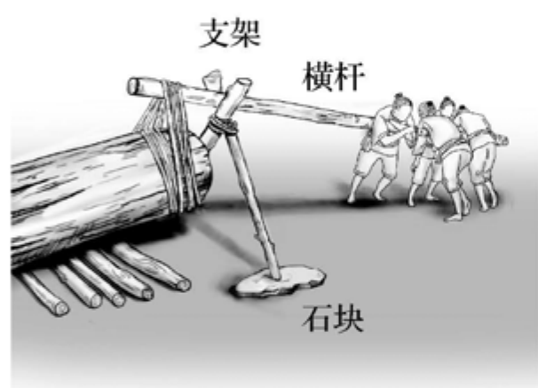
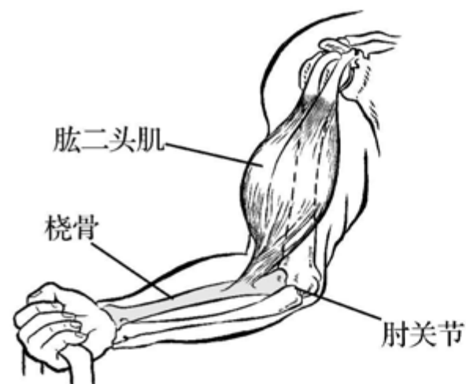

## 义务教育

# 物理课程标准

（2022年版）

中华人民共和国教育部制定

## 前言

习近平总书记多次强调，课程教材要发挥培根铸魂、启智增慧的作用，必须坚持马克思主义的指导地位，体现马克思主义中国化最新成果，体现中国和中华民族风格，体现党和国家对教育的基本要求，体现国家和民族基本价值观，体现人类文化知识积累和创新成果。

义务教育课程规定了教育目标、教育内容和教学基本要求，体现国家意志，在立德树人中发挥着关键作用。2001年颁布的《义务教育课程设置实验方案》和2011年颁布的义务教育各课程标准，坚持了正确的改革方向，体现了先进的教育理念，为基础教育质量提高作出了积极贡献。随着义务教育全面普及，教育需求从“有学上”转向“上好学”，必须进一步明确“培养什么人、怎样培养人、为谁培养人”，优化学校育人蓝图。当今世界科技进步日新月异，网络新媒体迅速普及，人们生活、学习、工作方式不断改变，儿童青少年成长环境深刻变化，人才培养面临新挑战。义务教育课程必须与时俱进，进行修订完善。

### 一、指导思想

以习近平新时代中国特色社会主义思想为指导，全面贯彻党的教育方针，遵循教育教学规律，落实立德树人根本任务，发展素质教育。以人民为中心，扎根中国大地办教育。坚持德育为先，提升智育水平，加强体育美育，落实劳动教育。反映时代特征，努力构建具有中国特色、世界水准的义务教育课程体系。聚焦中国学生发展核心素养，培养学生适应未来发展的正确价值观、必备品格和关键能力，引导学生明确人生发展方向，成长为德智体美劳全面发展的社会主义建设者和接班人。

### 二、修订原则

### （一）坚持目标导向

认真学习领会习近平总书记关于教育的重要论述，全面落实有理想、有本领、有担当的时代新人培养要求，确立课程修订的根本遵循。准确理解和把握党中央、国务院关于教育改革的各项要求，全面落实习近平新时代中国特色社会主义思想，将社会主义先进文化、革命文化、中华优秀传统文化、国家安全、生命安全与健康等重大主题教育有机融入课程，增强课程思想性。

### （二）坚持问题导向

全面梳理课程改革的困难与问题，明确修订重点和任务，注重对实际问题的有效回应。遵循学生身心发展规律，加强一体化设置，促进学段衔接，提升课程科学性和系统性。进一步精选对学生终身发展有价值的课程内容，减负提质。细化育人目标，明确实施要求，增强课程指导性和可操作性。

### （三）坚持创新导向

既注重继承我国课程建设的成功经验，也充分借鉴国际先进教育理念，进一步深化课程改革。强化课程综合性和实践性，推动育人方式变革，着力发展学生核心素养。凸显学生主体地位，关注学生个性化、多样化的学习和发展需求，增强课程适宜性。坚持与时俱进，反映经济社会发展新变化、科学技术进步新成果，更新课程内容，体现课程时代性。

### 三、主要变化

### （一）关于课程方案

一是完善了培养目标。全面落实习近平总书记关于培养担当民族复兴大任时代新人的要求，结合义务教育性质及课程定位，从有理想、有本领、有担当三个方面，明确义务教育阶段时代新人培养的具体要求。

二是优化了课程设置。落实党中央、国务院“双减”政策要求，在保持义务教育阶段九年9522总课时数不变的基础上，调整优化课程设置。将小学原品德与生活、品德与社会和初中原思想品德整合为“道德与法治”，进行一体化设计。改革艺术课程设置，一至七年级以音乐、美术为主线，融入舞蹈、戏剧、影视等内容，八至九年级分项选择开设。将劳动、信息科技从综合实践活动课程中独立出来。科学、综合实践活动起始年级提前至一年级。

三是细化了实施要求。增加课程标准编制与教材编写基本要求；明确省级教育行政部门和学校课程实施职责、制度规范，以及教学改革方向和评价改革重点，对培训、教科研提出具体要求；健全实施机制，强化监测与督导要求。

### （二）关于课程标准

一是强化了课程育人导向。各课程标准基于义务教育培养目标，将党的教育方针具体化细化为本课程应着力培养的核心素养，体现正确价值观、必备品格和关键能力的培养要求。

二是优化了课程内容结构。以习近平新时代中国特色社会主义思想为统领，基于核心素养发展要求，遴选重要观念、主题内容和基础知识，设计课程内容，增强内容与育人目标的联系，优化内容组织形式。设立跨学科主题学习活动，加强学科间相互关联，带动课程综合化实施，强化实践性要求。

三是研制了学业质量标准。各课程标准根据核心素养发展水平，结合课程内容，整体刻画不同学段学生学业成就的具体表现特征，形成学业质量标准，引导和帮助教师把握教学深度与广度，为教材编写、教学实施和考试评价等提供依据。

四是增强了指导性。各课程标准针对“内容要求”提出“学业要求”“教学提示”，细化了评价与考试命题建议，注重实现“教—学—评”一致性，增加了教学、评价案例，不仅明确了“为什么教”“教什么”“教到什么程度”，而且强化了“怎么教”的具体指导，做到好用、管用。

五是加强了学段衔接。注重幼小衔接，基于对学生在健康、语言、社会、科学、艺术领域发展水平的评估，合理设计小学一至二年级课程，注重活动化、游戏化、生活化的学习设计。依据学生从小学到初中在认知、情感、社会性等方面的发展，合理安排不同学段内容，体现学习目标的连续性和进阶性。了解高中阶段学生特点和学科特点，为学生进一步学习做好准备。

在向着第二个百年奋斗目标迈进之际，实施新修订的义务教育课程方案和课程标准，对推动义务教育高质量发展、全面建设社会主义现代化强国具有重要意义。希望广大教育工作者勤勉认真、行而不辍，不断创新实践，把育人蓝图变为现实，培育一代又一代有理想、有本领、有担当的时代新人，为实现中华民族伟大复兴作出新的更大贡献！

## 目录

一、课程性质 1 二、课程理念 2 三、课程目标 4 （一）核心素养内涵 4 （二）目标要求 5 四、课程内容 7 （一）物质 8 （二）运动和相互作用 14 （三）能量 21 （四）实验探究 28 （五）跨学科实践 33 五、学业质量 39 （一）学业质量内涵 39 （二）学业质量描述 39 六、课程实施 41 （一）教学建议 41 （二）评价建议 44 （三）教材编写建议 51

（四）课程资源开发与利用 55（五）教师培训与教学研究 57附录 跨学科实践案例 61

## 一、课程性质

物理学是自然科学领域研究物质的基本结构、相互作用和运动规律的一门基础学科。物理学通过科学观察、实验探究、推理计算等形成系统的研究方法和理论体系。从古代的自然哲学，到近代的相对论、量子论等，物理学引领着人类对自然奥秘的探索，深化着人类对自然界的认识。物理学对化学、生物学、天文学等自然科学产生了重要影响，推动了材料、能源、环境和信息等领域的科学技术进步，促进了人类生产生活方式的变革，对人类的思维方式、价值观等都产生了深远影响，为人类文明和社会进步作出了巨大贡献。

义务教育物理课程是一门以实验为基础的自然科学课程，与小学科学和高中物理课程相衔接，与化学、生物学等课程相关联，具有基础性、实践性等特点。义务教育物理课程旨在促进人类科学事业的传承与社会的发展，帮助学生从物理学视角认识自然、解决相关实际问题，初步形成科学的自然观；引导学生经历科学探究过程，学习科学研究方法，养成科学思维习惯，进而学会学习；引领学生认识科学、技术、社会、环境之间的关系，形成科学态度和正确价值观，增强社会责任感、民族自豪感；激发学生热爱党、热爱祖国、热爱人民的情感，为培养德智体美劳全面发展的社会主义建设者和接班人奠定基础。

## 二、课程理念

### 1. 面向全体学生，培养学生核心素养

义务教育物理课程以习近平新时代中国特色社会主义思想为指导，以学生发展为本，以提升全体学生核心素养为宗旨，为每个学生的学习和发展提供机会。注重落实物理课程的育人价值，培养学生适应个人终身发展和社会发展需要的正确价值观、必备品格和关键能力。

### 2. 从生活走向物理，从物理走向社会

遵循初中学生身心发展规律，贴近学生生活，关注学习生长点，以具体事实、鲜活案例、生活经验和基本概念等引导学生进行理性思考。注重时代性，加强与生产生活、社会发展及科技进步的联系，凸显我国科技成就，引导学生增强文化自信，树立科技强国的远大理想。

### 3. 以主题为线索，构建课程结构

依据物理学科内涵，遵循学生认知规律，明确物理学习主题。主题内分级呈现，层层递进；主题间相互关联，各有侧重。注重“知行合一、学以致用”，体现物理课程基础性、实践性等特点。

### 4.注重科学探究，倡导教学方式多样化

4. 注重科学探究，倡导教学方式多样化注重科学探究，突出问题导向，强调真实问题情境，引导学生不断探索，提高分析问题、解决问题的实践本领和科学思维能力，发展核心素养。倡导教学方式多样化，鼓励教学中根据教学目标、教学内容、教学对象及教学资源等的实际情况，灵活选用教学方式，合理运用信息技术。

### 5.发挥评价的育人功能，促进学生核心素养发展

5. 发挥评价的育人功能，促进学生核心素养发展坚持核心素养导向，注重以评价促进学生发展，构建目标明确、主体多元、方式多样和功能全面的物理课程评价体系。不仅重视对学生学习过程的评价和终结性学业成就的考核，而且关注学生的个体差异，帮助学生建立自信，激发学生学习物理的兴趣和动机，充分发挥评价的育人功能。

## 三、课程目标

三、课程目标立足学生全面发展，依据核心素养内涵及学生身心发展特点，确定课程目标，体现物理课程独特的育人价值。

### （一）核心素养内涵

（一）核心素养内涵核心素养是课程育人价值的集中体现，是学生通过课程学习逐步形成的适应个人终身发展和社会发展需要的正确价值观、必备品格和关键能力。物理课程要培养的核心素养，主要包括物理观念、科学思维、科学探究、科学态度与责任。

### 1.物理观念

物理观念是从物理学视角形成的关于物质、运动和相互作用、能量等内容的总体认识，是物理概念和规律等在头脑中的提炼与升华，是从物理学视角解释自然现象和解决实际问题的基础。

物理观念主要包括物质观念、运动和相互作用观念、能量观念等要素。

### 2.科学思维

科学思维是从物理学视角对客观事物的本质属性、内在规律及相互关系的认识方式；是建构物理模型的抽象概括过程；是分析综合、推理论证等方法在科学领域的具体运用；是基于事实证据和科学推理对不同信息、观点和结论进行质疑和批判，予以检验和修正，进而提出创造性见解的品格与能力。

科学思维主要包括模型建构、科学推理、科学论证、质疑创新等要素。

### 3. 科学探究

科学探究是指基于观察和实验提出物理问题、形成猜想与假设、设计实验与制订方案、获取与处理信息、基于证据得出结论并作出解释，以及对科学探究过程和结果进行交流、评估、反思的能力。

科学探究主要包括问题、证据、解释、交流等要素。

### 4. 科学态度与责任

科学态度与责任是指，在认识科学本质和了解科学、技术、社会、环境之间关系的基础上形成的，探索自然的内在动力，严谨认真、实事求是、持之以恒的品质，热爱自然、保护环境、遵守科学伦理的自觉行为，以及推动可持续发展和实现中华民族伟大复兴的使命担当。

科学态度与责任主要包括科学本质观、科学态度、社会责任等要素。

### （二）目标要求

物理课程旨在促进学生核心素养的养成和发展，引导学生学会学习、学会合作、学会生活，为学生的终身发展奠定基础。通过义务教育物理课程的学习，学生应达到如下目标。

（1）认识物质的形态、属性及结构，认识运动和力、声和光、电和磁，认识机械能、内能、电磁能及能量的转化与守恒；能将所学物理知识与实际情境联系起来，能从物理学视角观察周围事物，解释有关现象，解决简单的实际问题。初步形成物质观念、运动和相互作用观念、能量观念。

（2）会用所学模型分析常见的物理问题；能对相关问题和信息进行分析并得出结论，具有初步的科学推理能力；有利用证据对所研究的问题进行分析和解释的意识，能使用简单和直接的证据表达自己的观点，具有初步的科学论证能力；能独立思考，对相关信息、方案和结论提出自己的见解，具有质疑创新的意识。

（3）有科学探究的意识，能发现问题、提出问题，形成猜想与假设，具有初步的观察能力和提出问题的能力；能制订简单的科学探究方案，有控制实验条件的意识，会通过实践操作等方式收集信息，初步具有获取证据的能力；能分析、处理信息，得出结论，初步具有对科学探究过程和结果作出解释的能力；能书面或口头表述自己的观点，能自我反思和听取他人意见，具有与他人交流的能力。

（4）初步认识科学本质，体会物理学对人类认识深化以及社会发展的推动作用；亲近自然，崇尚科学，乐于思考与实践，具有探索自然的好奇心和求知欲，有克服困难的信心和决心，能总结成功的经验，分析失败的原因，体验战胜困难、解决问题的喜悦，严谨认真，实事求是，善于跟他人分享与合作，不迷信权威，敢于提出并坚持基于证据的个人见解，勇于放弃或修正不正确的观点；能关注科学技术对自然环境、人类生活和社会发展的影响，遵守科学伦理，有保护环境、节约资源的意识，能在力所能及的范围内为社会的可持续发展作出贡献，具有实现中华民族伟大复兴的责任感与使命感。

## 四、课程内容

义务教育物理课程内容由“物质”“运动和相互作用”“能量”“实验探究”“跨学科实践”五个一级主题构成（见表1）。“物质”“运动和相互作用”“能量”主题不仅包含物理概念和规律，还包含物理探索过程、研究方法，以及科学态度与价值观等；“实验探究”主题旨在强调物理课程的实践性，凸显物理实验整体设计，明确学生必做实验要求；“跨学科实践”主题侧重体现物理学与日常生活、工程实践、社会发展等方面的联系。

各一级主题均包含内容要求、学业要求及教学提示，内容要求含二级主题及活动建议，二级主题含三级主题及样例。学业要求反映学生完成一级主题的学习后，在物理观念、科学思维、科学探究、科学态度与责任方面应达到的学业成就。教学提示旨在引导教学方式和学习方式的转变，围绕一级主题给出教学策略建议、情境素材（实验器材）建议。活动建议列举了与二级主题相关的学习活动，三级主题是具体的内容要求，样例是对相关三级主题的举例说明。

### （一）物质

一级主题“物质”包含“物质的形态和变化”“物质的属性”“物质的结构和物质世界的尺度”三个二级主题。“物质”主题的课程内容与日常生活、自然现象及科技发展前沿密切相关。这部分内容的设 计旨在引导学生从物理学的视角认识物质世界，了解身边物质的形态 和变化，了解物质的属性、结构与物质世界的尺度，初步形成物质观 念；引导学生学习科学研究方法，提升科学探究能力，体会科学、技术、社会、环境之间的关系，形成辩证唯物主义世界观和关心环境、保护环境的责任感。

### 【内容要求】

### 1.1 物质的形态和变化

1.1.1 能描述固态、液态和气态三种物态的基本特征，并列举自然界和日常生活中不同物态的物质及其应用。

1.1.2 了解液体温度计的工作原理。会用常见温度计测量温度。能说出生活环境中常见的温度值，尝试对环境温度问题发表自己的见解。

例1 尝试对温室效应、热岛效应等发表自己的见解。

1.1.3 经历物态变化的实验探究过程，知道物质的熔点、凝固点和沸点，了解物态变化过程中的吸热和放热现象。能运用物态变化知识说明自然界和生活中的有关现象。

例2 能运用物态变化知识，说明冰熔化、水沸腾等现象。

例3 了解我国古代的铸造技术，并尝试运用物态变化知识进行解释。

1.1.4 能运用物态变化知识，说明自然界中的水循环现象。了解我国和当地的水资源状况，有节约用水和保护环境的意识。

### 活动建议：

（1）调查学校或家庭的用水状况，设计一个用于学校或家庭的节水方案。（2）调查当地水资源的利用和保护状况，并对当地水资源的利用和保护提出自己的见解。（3）调查当地农田或城市绿化灌溉的主要方式，了解节水灌溉技术。

### 1.2 物质的属性

1.2.1 通过实验，了解物质的一些物理属性，如弹性、磁性、导电性和导热性等，能用语言、文字或图表描述物质的物理属性。

例1通过实验，了解橡胶的弹性。列举弹性在生活中的应用实例。

例2通过实验，了解物质的磁性和磁化现象。调查磁性材料在生活中的应用。

例3通过实验，了解物质的导电性，比较导体、半导体、绝缘体导电性能的差异。

例4通过实验，了解金属与木材导热性能的差异。

1.2.2知道质量的含义。会测量固体和液体的质量。

例5列举质量为几克、几十克、几百克和几千克的一些物品，能估测常见物体的质量。

1.2.3通过实验，理解密度。会测量固体和液体的密度。能解释生活中与密度有关的一些物理现象。

1.2.4了解关于物质属性的研究对生产生活和科技进步的影响。

### 活动建议：

（1）设计实验方案，比较砂锅、铁锅的导热性能。（2）观察生活中的一些日常用品，了解它们分别应用了物质的哪些物理属性。（3）查阅资料，了解我国古代青铜器、铁器的制造技术及其对社会进步的推动作用。

### 1.3 物质的结构和物质世界的尺度

1.3.1知道常见的物质是由分子、原子构成的。

1.3.2知道原子是由原子核和电子构成的，了解原子的核式结构模型。了解人类探索微观世界的大致历程，关注人类探索微观世界的新进展。

例1用图形、文字或语言描述原子的核式结构模型。

1.3.3了解人类探索太阳系及宇宙的大致历程，知道人类对宇宙的探索将不断深入，关注人类探索宇宙的一些重大活动。

例2了解我国在载人航天及其他航天科技方面的新成就，体会我国航天人热爱祖国、为国争光的坚定信念和勇于登攀、敢于超越的进取精神。

1.3.4了解物质世界的大致尺度。

例3设计表格，按空间尺度大小的顺序排列一些从宏观到微观有代表性的物体（如银河系、太阳系、地球、人、原子、原子核、夸克等）。

例4了解一些典型天体、粒子寿命的时间尺度。

### 活动建议：

（1）查阅资料，了解我国第一颗人造地球卫星“东方红一号”从研制到成功发射的历程，体会这一历史性突破对我国航天技术发展的重要意义。

（2）查阅资料，了解“中国天眼”在人类探索宇宙中的作用及我国科学家在建造“中国天眼”过程中的卓越贡献。

（3）查阅资料，了解“天问一号”在探索火星方面的进展及我国航天事业对人类探索宇宙的贡献。

### 【学业要求】

（1）能描述固态、液态和气态的基本特征及在相互转化过程中的特点，能说出生活中常见的温度值，知道质量的含义，理解密度，能说出物质世界从宏观到微观的大致尺度；能根据这些知识解释有关自然现象，尝试运用这些知识解决日常生活中的有关问题，形成初步的物质观念。

（2）知道建构模型是物理研究的重要方法，了解原子的核式结构模型；能通过实验或实例，归纳总结物态变化过程中的吸、放热规律；在归纳或演绎中会引用证据，养成使用证据的习惯；能运用物质的弹性、磁性、导电性等知识，对一些说法进行质疑，发表自己的见解。

（3）在物理学习中，能发现并提出需要探究的物理问题，能根据已有经验作出有关猜想与假设；能制订简单的实验方案，会正确使用天平、温度计等实验器材，能按实验方案操作，获得实验数据；会用简单的物理图像描述数据，根据图像特点对实验结果作出解释；能撰写简单的实验报告。

（4）能通过物态变化等实验，感受物理研究是建立在观察、实验和推理基础上的创造性工作；能在运用密度等知识解决实际问题的过程中获得成就感，具有学好物理的自信心；能用相关知识初步解释自然界的水循环等现象，具有关心和保护环境的意识，能初步体会构建人类命运共同体的重要意义。

### 【教学提示】

### （1）教学策略建议

在“物质”主题教学中，应注重联系生产生活实际，体现“从生活走向物理，从物理走向社会”的课程理念，让学生感受物理学就在身边，体会物理学对科技发展和社会进步的推动作用。

\(①\) 树立教学的整体观，培养学生的物质观念。注重教学的整体设计，避免枯燥、碎片化的概念堆砌，引领学生从认识物质的基本形态和物理属性开始，逐步深入到了解物质的微观结构、基本特征和大致尺度等；从微观世界到宇宙天体，引导学生初步理解物质的内涵，认识物质世界的多样性，逐步形成物质观念。

\(②\) 强化实验探究，注重发展科学思维和科学探究能力。合理安排演示实验，如“低压沸腾”、碘的升华和凝华等，让学生在实验情境中提出探究问题。尤其在物态变化特点、规律的实验教学中，引导学生基于证据进行归纳、总结、解释及交流，促进学生科学思维和科学探究能力的发展。

\((3)\) 丰富教学活动，培养学生的科学态度和社会责任感。开展各类教学活动，如举办“密度、物态变化与生产生活的联系”“温室效应与环境保护”等主题小论坛，让学生在思辨与交流中成长，开阔学生视野，激发学生学习兴趣。引导学生在社会调查、课外阅读中，观察和认识物质世界，如组织学生调查当地的水资源状况，增强学生的环境保护意识，使其感受物理学在解决社会问题、推动社会发展中的作用，培养学生致力学习科学技术、立志造福人类的责任感与使命感。

### （2）情境素材建议

“物质”主题与自然现象、生产生活密切相关。下面侧重提出与物态变化、物质密度、古代科技等相关的常见情境素材建议。

\(①\) 与物态变化相关的素材：自然界中的雨、露、霜、雾、冰、雪等现象，都是由于水的物态发生变化而形成的；将装有酒精的密封塑料袋先后放在热水和冷水中，能观察到明显的汽化和液化现象；夏天从冰箱冷藏柜拿出的饮料罐表面会出现水珠，从冷冻柜取出的物品表面会结霜；吐鲁番的坎儿井能有效减少水的蒸发；给汽车水箱加注防冻液，以防冬天水箱结冰。

\((2)\) 与物质密度相关的素材：影视剧拍摄中倒塌的楼房、滚落的石块等道具通常是用泡沫塑料制作的，这利用了泡沫塑料密度小的特点，可避免对演员造成伤害；体育竞赛中的铅球，则是用密度大的材料制成的，这能使相同质量的球体积更小；运用密度知识可鉴别身边的一些物质。

\((3)\) 与古代科技相关的素材：冶铁技术的出现，为人类大规模制造工具、机械提供了材料支持，使人类文明向前迈出了一大步；我国古人利用天然材料加工制成了纸张、火药，利用磁性材料的特性制成了指南针。

### （二）运动和相互作用

一级主题“运动和相互作用”包含“多种多样的运动形式”“机械运动和力”“声和光”“电和磁”四个二级主题。“运动和相互作用”主题的课程内容包含较多的物理概念和规律，与生产生活密切相关。这部分内容的设计旨在引导学生从物理学视角认识运动和相互作用，了解身边的运动形式及相互作用，了解声、光、电、磁的含义，初步形成运动和相互作用观念；发展学生的推理论证能力及交流合作能力，引导学生了解我国古代和现代的相关科技成就，体会中华民族的智慧，培养学生的科学态度和实现中华民族伟大复兴的责任感与使命感。

### 【内容要求】

### 2.1多种多样的运动形式

2.1.1知道机械运动，举例说明机械运动的相对性。

2.1.2知道自然界和生活中简单的热现象。了解分子热运动的主要特点，知道分子动理论的基本观点。

例观察扩散现象，能用分子动理论的观点加以说明。

2.1.3举例说明自然界存在多种多样的运动形式。知道物质在不停地运动。

### 活动建议：

（1）观察生活中的机械运动现象，说明机械运动的相对性。

（2）利用常见物品设计实验方案，说明组成物质的微粒在不停地运动。

（3）以神舟九号载人飞船与天宫一号目标飞行器成功交会对接为例，讨论机械运动的相对性。

### 2.2 机械运动和力

2.2.1 会选用适当的工具测量长度和时间，会根据生活经验估测长度和时间。

例1 会利用自身的尺度（如步长）估测教室的长度。

例2 了解我国古代测量长度和时间的工具，体会古人解决问题的智慧。

2.2.2 能用速度描述物体运动的快慢，并能进行简单计算。会测量物体运动的速度。

2.2.3 通过常见事例或实验，了解重力、弹力和摩擦力，认识力的作用效果。探究并了解滑动摩擦力的大小与哪些因素有关。

例3 通过实验，认识力的作用是相互的。

例4 通过实验，认识力可以改变物体运动的方向和快慢，也可以改变物体的形状。

2.2.4 能用示意图描述力。会测量力的大小。了解同一直线上的二力合成。知道二力平衡条件。

例5 分析静止在水平桌面上杯子的受力情况。

2.2.5 通过实验和科学推理，认识牛顿第一定律。能运用物体的惯性解释自然界和生活中的有关现象。

例6 了解伽利略在探究与物体惯性有关问题时采用的思想实验，体会科学推理在科学研究中的作用。

例7 能运用惯性，解释当汽车急刹车、转弯时，车内可能发生的现象，讨论系安全带等保护措施的必要性。

2.2.6 知道简单机械。探究并了解杠杆的平衡条件。

2.2.7 通过实验，理解压强。知道增大和减小压强的方法，并了解其在生产生活中的应用。

例8 估测自己站立时对地面的压强。

2.2.8 探究并了解液体压强与哪些因素有关。知道大气压强及其与人类生活的关系。了解流体压强与流速的关系及其在生产生活中的应用。

例9 了解铁路站台上设置安全线的必要性。

2.2.9 通过实验，认识浮力。探究并了解浮力大小与哪些因素有关。知道阿基米德原理，能运用物体的浮沉条件说明生产生活中的有关现象。

例10 了解潜水艇的浮沉原理。

### 活动建议：

（1）查阅资料，了解我国高速列车的运行速度，以及铁路交通的发展进程。

（2）查阅资料，了解中国空间站在太空中飞行的速度大小。

（3）查阅资料，了解我国“奋斗者”号载人潜水器的深潜信息，讨论影响其所受液体压强和浮力大小的因素。

（4）查阅资料，了解我国长江三峡水利枢纽工程中船闸是怎样利用连通器特点让轮船通行的。

### 2.3 声和光

2.3.1 通过实验，认识声的产生和传播条件。

例1 在鼓面上放碎纸屑，敲击鼓面，观察纸屑的运动；敲击音叉，观察与其接触的物体的运动。了解实验中将微小变化放大的方法。

例2 将发声器放入玻璃罩中，逐渐抽出罩内空气，会听到发声器发出的声音逐渐变小，分析导致该现象的原因。

2.3.2 了解声音的特性。了解现代技术中声学知识的一些应用。知道噪声的危害及控制方法。

例3 了解超声波在生产生活和科学研究等方面的应用，如超声雷达、金属探伤、医学检查等。

例4 举例说明如何减弱生活环境中的噪声，具有保护自己、关心他人的意识。

2.3.3 探究并了解光的反射定律。通过实验，了解光的折射现象及其特点。

例5 探究并了解光束在平面镜上反射时，反射角与入射角的关系。

例6 通过光束从空气射入水（或玻璃）中的实验，了解光的折射现象及其特点。

2.3.4 探究并了解平面镜成像时像与物的关系。知道平面镜成像的特点及应用。

2.3.5 了解凸透镜对光的会聚作用和凹透镜对光的发散作用。探究并了解凸透镜成像的规律。了解凸透镜成像规律的应用。

例7 了解凸透镜成像规律在放大镜、照相机中的应用。

例8 了解人眼成像的原理，了解近视眼和远视眼的成因与矫正方法。具有保护视力的意识。

2.3.6 通过实验，了解白光的组成和不同色光混合的现象。

例9 观察红、绿、蓝三束光照射在白墙上重叠部分的颜色。

### 活动建议：

（1）查阅资料，了解我国古建筑应用声学知识的案例。（2）调查社区或工地噪声污染的情况和已采取的控制措施，提出进一步控制噪声的建议。（3）用凸透镜制作简易望远镜，用其观察远处的景物。（4）调查社区或城市光污染的情况，提出改进建议。

### 2.4 电和磁

2.4.1 观察摩擦起电现象，了解静电现象。了解生产生活中关于静电防止和利用的技术。

例1 举例说明生活中的静电现象。

例2 查阅资料，了解静电防止和利用的常用方法。

2.4.2 通过实验，认识磁场。知道地磁场。

例3 查阅资料，了解我国古代指南针的发明对人类社会发展的贡献。

2.4.3 通过实验，了解电流周围存在磁场。探究并了解通电螺线管外部磁场的方向。了解电磁铁在生产生活中的应用。

2.4.4 通过实验，了解通电导线在磁场中会受到力的作用，并知道力的方向与哪些因素有关。

例4 了解动圈式扬声器的结构和原理。

例5 了解直流电动机的工作原理。

2.4.5 探究并了解导体在磁场中运动时产生感应电流的条件。了解电磁感应在生产生活中的应用。

例6 了解发电机的工作原理。

2.4.6 知道电磁波。知道电磁波在真空中的传播速度。知道波长、频率和波速。了解电磁波的应用及其对人类生活和社会发展的影响。

例7 举例说明电磁波的存在。

例8 了解广播电台节目的发射频率和波长。

例9 知道移动通信和卫星通信等都应用了电磁波。

### 活动建议：

（1）利用磁体和缝衣针制作指南针，验证同名磁极相互排斥、异名磁极相互吸引。

（2）查阅资料，了解我国北斗卫星导航系统的作用和优势，讨论电磁波在卫星通信技术中的应用。

（3）查阅资料，了解我国磁悬浮列车的发展状况，讨论电磁技术在其中的应用。

### 【学业要求】

（1）了解机械运动、分子热运动、声和光、电和磁，了解重力、弹力、摩擦力，通过牛顿第一定律和力的作用效果，认识机械运动和力的关系；能用这些知识解释自然界的有关现象，解决日常生活中的有关问题，形成初步的运动和相互作用观念。

（2）知道匀速直线运动、杠杆、光线等物理模型；能运用运动和力、声和光、电和磁的一些规律分析简单问题，并获得结论；能在解释自然现象和解决实际问题时引用证据，具有使用科学证据的意识；能根据运动和相互作用的知识，指出交流中有关说法的不当之处，并能提出自己的见解。

（3）能基于观察和实验，提出与运动和力、声和光、电和磁等现象有关的科学探究问题，并作出有依据的猜想与假设；在关于杠杆、浮力、光的反射、平面镜成像、凸透镜成像、通电螺线管等科学探究中，能制订初步的实验方案；能正确使用弹簧测力计、刻度尺等相关器材获取实验数据；能通过对数据的比较与分析，发现数据的特点，进行初步的因果判断，得出实验结论；能表述实验过程和结果，撰写实验报告。

（4）知道物理学是对相关自然现象的描述与解释，物理学研究需要观察、实验和推理，体会物理学对人类生活和社会发展的影响；具有对运动和力、声和光、电和磁等知识的学习兴趣和严谨认真、实事求是的科学态度；关心我国古代和现代科技成就，为中华民族的科技成就感到自豪，逐步养成实现中华民族伟大复兴的责任感与使命感。

### 【教学提示】

（1）教学策略建议在“运动和相互作用”主题的教学中，建议从学生的已有经验和认知水平出发，设计多种学习活动，重视物理概念的建构过程，促进学生对抽象概念的理解，引导学生在问题解决中提升能力，发展核心素养。

\(①\) 联系生产生活实际创设学习情境。例如：在建立机械运动概念时，建议创设学生熟悉的情境，启发并引导学生对真实情境中的物理问题进行思维加工，概括它们的共同特征等；在声和光、电和磁部分，建议结合生活中的实际情境，进行相关内容的学习。

\((2)\) 渗透科学研究方法，培养学生的科学思维。例如，通过实验引导学生认识光线等物理模型，体会物理模型的重要作用。引导学生通过实验寻找证据，归纳总结出一般性的规律，鼓励学生勇于质疑，敢于表达自己的观点。

\((3)\) 注重问题导向，合理设计探究活动。在探究力的作用效果、牛顿第一定律、压强大小的影响因素、声音的产生和传播条件、光的传播规律、电和磁的相互作用等学习活动中，注重发挥学生的积极性和主动性，给学生留出恰当的时间和空间；鼓励学生发现问题、提出问题，通过科学方法收集证据、得出结论；引导学生解释得出结论的理由，并对探究过程和结果进行评估、反思与交流。

\((4)\) 充分利用科学史料，培养学生的科学态度与社会责任感。建议将我国的相关科技成就引入课堂，如通过分析和讨论孔明灯、司南等与中华优秀传统文化有关的素材和5G技术、北斗卫星导航系统、高速动车组列车、“奋斗者”号载人潜水器等我国现代化建设新成就，培养学生的爱国情怀，提升学生的民族自豪感和实现中华民族伟大复兴的使命感。还可通过项目式学习，开展制作小型电动机、小型发电机等项目活动，让学生体会法拉第等科学家所取得的成就及其对社会发展的贡献。

（2）情境素材建议“运动和相互作用”主题与生产生活实际密切相关。下面侧重提出与运动、力及其作用效果、声和光、电和磁相关的常见情境素材建议。

\(①\) 与运动相关的素材：从星系、天体的运动，到汽车、火车的运动，再到分子的运动等都是运动的例证；介绍伽利略、牛顿等科学家的事迹，让学生感受科学家研究问题的方法和严谨认真、实事求是的科学态度。

\(②\) 与力及其作用效果相关的素材：利用弹簧测力计感受和测量力，利用撬棒、剪刀等分析杠杆的特点，利用气球演示力的作用效果，利用砖块的不同侧面演示压力的作用效果，利用液体压强计测量不同密度的液体内部不同深度处的压强，利用自制潜水艇等研究物体的浮沉条件。

\(③\) 与声和光相关的素材：通过分析声带振动、鼓面振动等现象归纳声音产生的原因，利用“土电话”、真空罩等研究声音的传播条件，利用吉他、钢琴等乐器分析声音的特性；讨论分析“楼台倒影入池塘”“潭清疑水浅”等诗句所反映的光学原理，讨论分析放大镜的成像原理和近视眼镜矫正视力的原理。

\(④\) 与电和磁相关的素材：通过摩擦过的塑料梳子吸引轻小物体或水流等现象演示静电作用，利用小磁针探究磁体和通电导线周围的磁场，分析电动机和发电机模型等，让学生认识电磁的应用，体会物理学发展对社会进步的推动作用。

### （三）能量

一级主题“能量”包含“能量、能量的转化和转移”“机械能”“内能”“电磁能”“能量守恒”“能源与可持续发展”六个二级主题。

“能量”主题的课程内容具有一定的综合性和跨学科性，与生产生活及社会发展密切相关。这部分内容的设计旨在引导学生从物理学视角认识能量，了解不同形式的能量，认识能量转化与守恒的普遍规律，了解节约能源与可持续发展的重要性，初步形成能量观念；发展学生综合分析问题和解决问题的能力，培养学生为可持续发展作贡献、将科学服务于人类的使命感。

### 【内容要求】

### 3.1 能量、能量的转化和转移

3.1.1 了解能量及其存在的不同形式。能描述不同形式的能量和生产生活的联系。

例1列举几种与生活密切相关的能量。

3.1.2 通过实验，认识能量可以从一个物体转移到其他物体，不同形式的能量可以相互转化。

例2列举生活中能量转移和转化的实例。

3.1.3 结合实例，认识功的概念。知道做功的过程就是能量转化或转移的过程。

### 活动建议：

（1）列举太阳能在地球上转化为其他形式能量的实例。（2）讨论人在滑滑梯过程中能量转化的情况。

### 3.2 机械能

3.2.1 知道动能、势能和机械能。通过实验，了解动能和势能的相互转化。举例说明机械能和其他形式能量的相互转化。

例1定性说明荡秋千过程中动能和势能的相互转化。

例2分析《天工开物》中汲水装置工作时能量的相互转化。

3.2.2知道机械功和功率。用生活中的实例说明机械功和功率的含义。

3.2.3知道机械效率。了解提高机械效率的意义和途径。

例3测量某种简单机械的机械效率。

3.2.4能说出人类使用的一些机械。了解机械的使用对社会发展的作用。

### 活动建议：

（1）查阅资料，了解人类利用机械的大致历程，并与同学进行交流。

（2）查阅资料，了解我国古代水磨、水碓等机械，写一篇弘扬中华优秀传统文化的调查报告。

### 3.3内能

3.3.1了解内能和热量。从能量转化的角度认识燃料的热值。

3.3.2通过实验，了解比热容。能运用比热容说明简单的自然现象。

例1能运用比热容说明为什么沙漠中的昼夜温差比海边的大。

3.3.3了解热机的工作原理。知道内能的利用在人类社会发展史中的重要意义。

例2了解热机对社会发展所起的作用和对环境的影响。

### 活动建议：

（1）调查当地近年来炊事、取暖、交通等方面燃料结构的变化，从经济与环保的角度开展讨论。

（2）燃料的种类很多，如木柴、煤、汽油、酒精、天然气等，查阅资料并比较相同质量的不同燃料完全燃烧时放出热量的多少。

### 3.4 电磁能

3.4.1 从能量转化的角度认识电源和用电器的作用。

例1 定性说明电热水壶、电风扇工作时能量转化的情况。

3.4.2 知道电压、电流和电阻。探究电流与电压、电阻的关系，理解欧姆定律。

3.4.3 会使用电流表和电压表。

3.4.4 会看、会画简单的电路图。会连接简单的串联电路和并联电路。能说出生产生活中采用简单串联电路或并联电路的实例。探究并了解串联电路和并联电路中电流、电压的特点。

3.4.5 结合实例，了解电功和电功率。知道用电器的额定功率和实际功率。

例2 调查常见用电器的铭牌，比较它们的电功率。

3.4.6 通过实验，了解焦耳定律。能用焦耳定律说明生产生活中的有关现象。

3.4.7 了解家庭电路的组成。有安全用电和节约用电的意识。

例3 了解我国家庭用电的电压和频率，在家庭用电中有保护自己和他人的安全意识。

### 活动建议：

（1）学读家用电能表，根据读数计算用电量。

（2）调查当地人均用电量的变化，讨论它与当地经济发展的关系。

### 3.5 能量守恒

3.5.1 知道能量守恒定律。列举日常生活中能量守恒的实例。

有用能量转化与守恒的观点分析问题的意识。

3.5.2 从能量转化和转移的角度认识效率。

3.5.3 列举能量转化和转移具有方向性的常见实例。

### 活动建议：

（1）查阅资料或访问农机、汽车维修等专业人员，了解内燃机中燃料燃烧所释放热量的去向，讨论提高效率的可能途径。

（2）调查当地主要炉灶的能量利用效率，写出调查报告。

### 3.6 能源与可持续发展

3.6.1 列举常见的不可再生能源和可再生能源。

3.6.2 知道核能的特点和核能利用可能带来的问题。

例1 了解处理核废料的常用方法。

3.6.3 从能源开发与利用的角度体会可持续发展的重要性。

例2 了解太阳能、风能、氢能等能源的开发对可持续发展的意义。

### 活动建议：

（1）查阅资料，举办小型研讨会，讨论能源利用带来的环境影响，如大气污染、酸雨、温室效应等，探讨可采取的应对措施。

（2）查阅资料，了解我国新能源汽车的发展概况。

（3）了解有关提倡低碳生活的信息，调查当地使用的主要能源及其对当地经济和环境的影响，提出开发当地可再生能源的建议。

（4）查阅资料，了解受控核聚变（人造太阳）的研究进展，了解我国在这方面的研究成就。

### 【学业要求】

（1）能列举能量转化和转移的实例，知道能量在转化和转移过程中是守恒的，认识机械功、热量、电功、热值等是与能量转化或转移密切相关的物理量，知道它们的含义；能用能量转化与守恒的观点解释常见的自然现象，解决日常生活中的有关问题，形成初步的能量观念。

（2）知道能量的利用存在效率问题， \(100\%\) 的能量利用率只是一种理想情况；能用能量转化与守恒的规律对有关具体问题进行科学推理，并形成结论；在对能量问题进行推理时，能从信息中寻找证据并作出说明；具有根据能量守恒的观点对一些不当说法进行质疑的意识。

（3）能通过观察周围事物，发现并提出关于能量的问题，能根据已有知识对问题作出猜想与假设；能根据控制变量法制订简单的探究方案，会正确使用电压表、电流表测量基本的电学量，正确读取和记录实验数据，并排除简单的实验故障；能用表格、图像等多种方式展示实验数据，并通过分析和处理数据得出实验结论；能撰写实验报告，书面或口头表述科学探究的过程和结果。

（4）能从热机对社会发展所产生影响的角度，体会科技进步对人类和社会发展的推动作用；能从能量转化的角度认识提高效率的重大意义，增强学习物理学的动力；能从能量的转化和转移具有一定方向性的角度，体会节约能源与可持续发展的重要性。

### 【教学提示】

（1）教学策略建议在“能量”主题教学中，建议结合学生的认知特点，循序渐进地引导学生学习相关内容，从能量守恒、能量转化和转移的方向性等角度，让学生了解环境保护、可持续发展的重要性，启发学生在力所能及的范围内践行低碳生活。

\(①\) 灵活选用教学方式，帮助学生逐步形成能量观念。例如：通过情境创设、实验探究等，引导学生认识机械能、内能、电磁能等能量的不同存在形式；通过科学探究、课堂讨论，引导学生理解太阳能在地球上是怎样转化成其他形式能量的，体会能量转化和守恒的思想，逐步形成能量观念。

\((2)\) 理论联系实际，提高学生分析问题、解决问题的能力。例如：通过解决生产生活中的具体问题，使学生了解功、功率、电功、电功率及焦耳定律等知识，形成将物理知识与生产生活相联系的意识；在用能量守恒定律等解决问题的过程中，引导学生领悟从守恒的角度分析、解决问题的方法，提高分析、解决实际问题的能力。

\((3)\) 重视探究教学，提高学生的科学探究能力。例如，通过探究电流与电压、电阻的关系等实验，引导学生明确实验目的，运用控制变量等方法制订简单的探究方案，学会分析和处理实验数据，正确表述科学探究的过程和结果，提高科学探究能力。

\((4)\) 设计丰富的实践活动，提高学生的共通性素养。通过调查研究活动，启发学生关注科学、技术、社会、环境之间的关系，引导学生认识环境保护的重要性，认同人与自然和谐共生的理念。例如：通过查阅资料等，了解核能的特点和处理核废料的常用方法，讨论核能利用可能带来的问题；调查当地太阳能的利用情况，估算太阳能的转化效率；调查家庭或学校可能存在的安全用电隐患，提高安全用电的意识。通过设计制作等活动，引导学生加深对节约能源与促进可持续发展的认识，提高节能意识，践行低碳生活，促进其科学态度与责任感的养成。

### （2）情境素材建议

“能量”主题内容跨度大，层次多，教学活动丰富。相关的情境素材可来源于自然现象、物理实验、物理学史、日常生活和社会热点等。下面侧重提出与能量转化和转移，机械能、内能和电磁能，能量守恒与可持续发展相关的情境素材建议。

\((1)\) 与能量转化和转移相关的素材：讨论和分析水轮机带动发电机发电、电风扇通电后扇叶转动、加热试管中的水后橡胶塞从管口弹出、金属丝通电后发热等过程中能量的转化和转移情况。

\((2)\) 与机械能、内能和电磁能相关的素材：用荡秋千的过程定性说明动能和势能的转化情况；展示常见机械的铭牌，比较它们的功率；分析为什么通常沿海地区昼夜温差较小，而沙漠地区昼夜温差较大；展示家用电能表，通过电能表计算用电量。

\((3)\) 与能量守恒与可持续发展相关的素材：讨论和分析我国古代的一些机械，列举不同历史时期人类利用的主要能源。

### （四）实验探究

一级主题“实验探究”包含测量类和探究类学生必做实验。这两类学生必做实验相互关联，各有侧重，旨在体现物理课程实践性的特点，培养学生发现问题和提出问题的能力、动手操作和收集数据的能力、分析和处理数据的能力、解释数据的能力、表达和交流的能力，引导学生学会学习、学会合作，培养学生严谨认真、实事求是的科学态度。

### 【内容要求】

### 4.1测量类学生必做实验

4.1.1用托盘天平测量物体的质量。

例1用托盘天平测量小木块和杯中水的质量。

4.1.2测量固体和液体的密度。

例2用天平、量筒等测量小石块和盐水的密度。

4.1.3用常见温度计测量温度。

例3用实验室温度计测量水的温度，用体温计测量自己的体温。

4.1.4用刻度尺测量长度，用表测量时间。

例4用刻度尺测量物理教科书的长和宽，利用具有秒表功能的设备测量自己脉搏跳动30次所用的时间。

4.1.5 测量物体运动的速度。

例5用秒表和刻度尺，测量小球通过某段距离的速度。

4.1.6 用弹簧测力计测量力。

例6用手拉动弹簧测力计体验1N、2N、4N力的大小，测量一本物理教科书所受的重力。

4.1.7 用电流表测量电流。

例7用实验室指针式电流表，测量直流电路中的电流。

4.1.8 用电压表测量电压。

例8用实验室指针式电压表，测量直流电路中的电压。

4.1.9 用电流表和电压表测量电阻。

例9用电流表、电压表、滑动变阻器等，测量小灯泡正常发光时的电阻。

### 活动建议：

（1）蜡块会漂浮在水面上，尝试用天平和量筒测量蜡块的密度。（2）用电子天平测量一些家用物品的质量，感受电子天平在操作上的优点，体会科技进步给人类生活带来的影响。

### 4.2 探究类学生必做实验

4.2.1 探究水在沸腾前后温度变化的特点。

例1用酒精灯、烧杯、温度计等，探究水在沸腾前后温度变化的特点。

4.2.2 探究滑动摩擦力大小与哪些因素有关。

例2用弹簧测力计、平板、细绳、长方体物块、棉布、毛巾等，探究滑动摩擦力大小与哪些因素有关。

4.2.3 探究液体压强与哪些因素有关。

例3用水、盐水、压强计等，探究液体压强与哪些因素有关。

4.2.4 探究浮力大小与哪些因素有关。

例4用水、盐水、金属块、弹簧测力计等，探究金属块所受浮力与哪些因素有关。

4.2.5 探究杠杆的平衡条件。

例5用杠杆、铁架台、钩码和弹簧测力计，探究杠杆平衡时动力、动力臂与阻力、阻力臂之间的定量关系。

4.2.6 探究光的反射定律。

例6用激光笔、平面镜、光屏及量角器等探究光的反射定律。

4.2.7 探究平面镜成像的特点。

例7用蜡烛（或其他物品）、平板玻璃、刻度尺、白纸等，探究平面镜成像时，像的大小、位置、虚实等有什么特点。

4.2.8 探究凸透镜成像的规律。

例8用蜡烛（或F形光源）、凸透镜、光具座、光屏等，探究凸透镜成像时，像的正倒、大小、位置、虚实等与物距的关系。

4.2.9 探究通电螺线管外部磁场的方向。

例9用小磁针、通电螺线管等，探究通电螺线管外部磁场的方向。

4.2.10 探究导体在磁场中运动时产生感应电流的条件。

例10用矩形线圈或单根导线、磁体、灵敏电流计等探究产生感应电流的条件。

4.2.11 探究串联电路和并联电路中电流、电压的特点。

例11用电流表和电压表，分别探究串联电路和并联电路中电流、电压的特点。

4.2.12 探究电流与电压、电阻的关系。

例12用定值电阻、滑动变阻器、电流表、电压表等，探究电流与电压、电阻的关系。

### 活动建议：

（1）用可变焦距的眼睛模型，演示并说明近视眼、远视眼看不清物体的原因。（2）尝试用力传感器探究影响浮力大小的因素或杠杆的平衡条件。

### 【学业要求】

（1）能通过物理实验建构物理概念，深化对物理规律的认识，领悟其内涵及相互联系；有将实验探究方法及安全操作规范等运用于解决日常问题的意识，能根据所学知识和说明书等解决现实中的简单问题。

（2）知道科学探究会受到各种因素的影响，在实验中能关注主要因素，忽略次要因素；能根据实验数据通过归纳推理获得探究结论；有判断实验数据是否合理、有效的意识；能对实验进行反思，提出改进建议。

（3）在实验中有发现问题、提出问题的意识；能根据实验目的设计实验方案，会正确使用已学实验器材收集数据，能遵守实验室规则，注意实验中的安全问题；能对收集的数据进行整理，归纳总结，形成结论并作出解释；有合作交流的团队意识，能撰写简单的实验报告。

（4）能初步体会物理研究是建立在观察和实验基础上的创造性工作；能通过实验获得结论，产生成就感，有学习物理的兴趣和严谨认真、实事求是的科学态度；有节约资源、保护环境的责任感及自觉行为。

### 【教学提示】

（1）教学策略建议“实验探究”主题中所列三级主题，均为学生必做实验。教师应提前做好实验教学设计，准备好实验器材和场地等，规划好教学时间。教学中，要求每个学生动手动脑完成实验。有条件的学校应尽可能多地给学生创造动手实验的机会，以发挥实验的育人功能，促进学生核心素养的养成。

\(①\) 引导学生发现问题、提出问题，启发学生作出猜想与假设。尽量利用身边的情境引导学生去发现问题、提出问题。例如，用平面镜将室外的阳光反射进教室，调整小镜子的摆放角度，可发现阳光进入教室的角度、位置随之发生变化，引导学生思考太阳光的亮斑为什么不是固定在某个位置，进而思考光的反射现象，提出反射是否会遵循一定的规律。

\(②\) 关注对学生设计实验方案、收集证据能力的培养。注重发挥每个学生的创新潜力，鼓励学生设计实验方案、自制实验器材、改进实验装置及操作方法，给学生提供自主探究的时间和空间。增加实验室开放时间，为有兴趣的学生提供场地、器材、指导等方面的支持，在确保安全的前提下，鼓励学生利用课外活动时间，在校内外利用简单的器材开展科学探究活动。

\(③\) 引导学生通过分析论证得出结论并作出解释，培养学生分析论证的能力。例如：在探究杠杆的平衡条件时，引导学生思考为什么要通过表格记录杠杆平衡时不同的动力、动力臂与阻力、阻力臂数值，通过分析数据寻找定量关系——动力与阻力不同时，动力臂与阻力臂也不同，但动力与动力臂的乘积等于阻力与阻力臂的乘积；组织学生根据数据归纳出杠杆的平衡条件，讨论分析个别数据存在问题的原因，分享更多数据，找到普遍规律。

\(④\) 注重对学生交流合作、评估反思能力的培养。组织学生对实验方案、实验探究过程和结果等进行评估与交流，鼓励学生充分发表见解，调动学生在探究活动中的积极性和主动性。例如：在探究滑动摩擦力大小与哪些因素有关时，会发现物块被拉动时难以保持匀速运动，引导学生思考如何实现物块相对于不同接触面做缓慢匀速运动，以保证弹簧测力计示数等于物块所受滑动摩擦力的大小，组织学生交流并改进；在探究电流与电压、电阻的关系时，让学生设计实验方案并动手操作，发现问题后组织学生对器材或电路进行评估，找到改进实验的方法。

（2）实验器材建议“实验探究”主题中所列的实验，涉及的器材多与实验室或生活中的器材有关。下面分别提出与测量类和探究类学生必做实验相关的实验器材建议。

\(①\) 与测量类学生必做实验相关的器材：在测量物体质量时，可用托盘天平；在测量物体密度时，可用电子天平测量质量，以使实验更加便捷；可用量筒和天平测量形状不规则的石块和蜡块的密度；在测量物体运动的速度时，可测量人步行的速度；用常见温度计测量温度时，可用实验室温度计测量棉手套内的温度和室内空气温度，并进行对比。

\(②\) 与探究类学生必做实验相关的器材：在探究浮力大小与哪些因素有关时，可用相同大小的玻璃珠等进行实验；在探究杠杆的平衡条件时，可在杠杆两侧悬吊学生常见的物体使杠杆平衡，用弹簧测力计测量物体所受的重力，用刻度尺测量力臂；在探究凸透镜成像规律的实验中，可用发光二极管等光源做成F形作为发光物屏，以判断像的正倒和测量像的长度，可用刻度尺测量物距和像距；在探究导体在磁场中运动产生感应电流的条件时，可用磁性较强的磁体进行实验；在探究串联电路和并联电路中电流、电压的特点时，可用电阻、小灯泡等不同的用电器连接串、并联电路，使用指针式仪表或数字式仪表测量电流和电压，探究出串联电路和并联电路中电流、电压的特点。

### （五）跨学科实践

一级主题“跨学科实践”包含“物理学与日常生活”“物理学与工程实践”“物理学与社会发展”三个二级主题。“跨学科实践”主题的内容具有跨学科性和实践性特点，与日常生活、工程实践及社会热点问题密切相关。这部分内容的设计旨在发展学生跨学科运用知识的能力、分析和解决问题的综合能力、动手操作的实践能力，培养学生积极认真的学习态度和乐于实践、敢于创新的精神。

### 【内容要求】

### 5.1物理学与日常生活

5.1.1能发现日常生活中与物理学有关的问题，提出解决方案。

例1调查日常生活用品（如厨房用品）使用中的问题，并提出改进建议，能运用所学的知识论证自己所提建议的合理性。

5.1.2能运用所学知识分析日常生活中的安全问题，提出解决方案，践行安全与健康生活。

例2调查生活中（如用电、乘车、住高楼等）存在的安全隐患，提出安全与健康生活的建议。

5.1.3能运用所学知识指导和规范个人行为，践行低碳生活，具有节能环保意识。

例3了解当地空气质量状况，并调查相关原因。

例4拟订《个人低碳生活行为指南》，对个人节能环保行为提出具体要求。

### 活动建议：

（1）通过资料查阅、商店咨询和实物考察，分析自行车中涉及的不同学科知识，选择感兴趣的主题撰写一篇小论文。

（2）通过资料查阅和实物考察，探索家庭用电的安全问题，从跨学科视角撰写简单的调查报告。

（3）通过资料查阅和实物考察，了解机动车的尾气排放情况，撰写关于城市空气污染和汽车尾气排放的调查报告。

### 5.2 物理学与工程实践

5.2.1 了解我国古代的技术应用案例，体会我国古代科技对人类文明发展的促进作用。

例1 了解我国古代“龙骨水车”的工作原理，尝试设计相关装置。

5.2.2 调查物理学应用于工程技术的案例，体会物理学对工程技术发展的促进作用。

例2 调查物理学在桥梁建筑技术方面的应用案例，体会物理学对桥梁发展的促进作用。

5.2.3 了解物理学在信息技术中的应用。

例3 了解物理学在信息记录或传播中的应用。

### 活动建议：

（1）制作一台小型风力发电机，从跨学科视角与同学交流制作过程与作品。

（2）查阅资料，了解物理学对信息技术发展的贡献。

（3）查阅资料，了解量子计算机相关信息，与同学交流对计算机未来发展的畅想。

### 5.3 物理学与社会发展

5.3.1 结合实例，尝试分析能源的开发与利用对社会发展的影响。

例1 查阅资料并举办报告会，讨论能源利用对环境的影响，结合对当地能源利用现状的调查，提出改进建议。

5.3.2 结合实例，了解一些新材料的特点及其应用。了解新材料的研发与应用对社会发展的影响。

例2了解半导体、超导体的主要特点，展望超导体应用对社会发展的影响。

例3了解纳米材料等新型材料的主要特点，以及这些新材料技术的应用对社会发展的影响。

5.3.3了解我国科技发展的成就，增强科技强国的责任感和使命感。

例4了解我国“两弹一星”的成就，体会科技作为国家发展战略支撑的重大意义，树立科技自立自强的信念；知道赵忠尧、钱学森、邓稼先等科学家的杰出贡献和爱国情怀，发扬勇攀科技高峰的精神。

### 活动建议：

（1）查阅资料，了解深海、太空等的开发与利用对人类社会发展的意义，撰写一篇小论文。（2）查阅资料，了解环境污染治理比较成功的案例，撰写一篇调查报告。（3）查阅资料，了解手机改进历程中的典型案例，体会通信技术的进步对社会发展的影响。

### 【学业要求】

（1）能在跨学科实践中综合认识所涉及的知识；能用物理及其他学科知识解释与健康、安全等有关的日常生活问题，探索一些简单的工程与技术问题，分析与能源、环境等有关的社会热点问题，初步具有运用跨学科知识解决简单问题的能力。

（2）能在跨学科实践中尝试找出影响活动成效的主要因素，能运用简单模型解决问题；能利用归纳或演绎的方法对跨学科问题进行推理，获得结论；能基于证据说明操作的合理性；能在操作中独立思考，提出自己的见解。

（3）能在真实、综合的情境中发现问题，提出假设；能设计简单的跨学科实践方案，能通过调查等方式收集信息，提出证据；能对跨学科实践活动方案、实施过程及结果进行解释；能与他人共同实施方案，合作交流，并撰写简单的活动报告。

（4）为我国古代科技发明感到自豪，能体会物理学对人类生活、工程实践和社会发展的影响；乐于思考与实践，敢于探索，勇于创新，进一步增强安全意识，践行健康生活；具有节能环保、促进可持续发展的责任感。

### 【教学提示】

### （1）教学策略建议

跨学科实践要紧密结合物理教学内容，体现综合性和实践性，注重激发学生的求知欲和学习热情，促进学生学以致用，养成良好学习习惯，提升团队意识和协作能力。

\(①\) 选择具有综合性、实践性的课题。结合当地特点，围绕现实生活和社会发展的热点问题，从多学科角度观察、思考和分析问题，挖掘、选取有教育意义的素材，将其改造成跨学科实践的问题或任务。

\((2)\) 合理制订跨学科实践方案。以问题的解决过程为线索设计方案，将跨学科实践的课题分解为若干驱动性任务，以观察、实验、设计、制作、调查等方式设计活动，将跨学科实践的课题转化为可操作的教学设计和实施方案。

\((3)\) 科学引导、循序渐进实施跨学科实践。布置适当的预习任务，引导学生提前了解活动的流程和要求，以及所需知识、方法和设备等；进行合理分组，使学生能相互取长补短、共同完成活动。引导学生主动学习、独立思考、大胆设计、敢于创新，在学生遇到困难时给予适当的指导和帮助。

\((4)\) 重视活动成果的呈现和交流。注重活动总结，以设计作品、制作模型、撰写报告等多种形式呈现成果。根据物化形式的特点，组织开展成果展览、报告会、研讨会等多种方式的交流活动。

### （2）情境素材建议

“跨学科实践”主题的情境素材很丰富，如与日常生活议题、实践操作、社会发展热点等有关的素材均可选择。下面侧重提出与日常生活、工程实践、社会发展相关的情境素材建议。

\(①\) 与日常生活相关的素材：观察和体验人在活动或劳动过程中的杠杆模型，从具体事例分析省力杠杆和省距离杠杆，尝试综合运用多学科知识解释生活现象；举办“自行车中的科学知识挑战赛”，以自行车为研究对象，确定挑战赛规则，通过趣味比赛引导学生理论联系实际，综合解决问题。

\((2)\) 与工程实践相关的素材：举办关于我国古代科技发明的作品展览；举办“简易滑翔机制作比赛”，让学生利用所学知识分析原理、绘制设计图、选用材料、制作样机，进行比赛；了解水火箭的原理、结构、材料等，小组合作设计并制作简单的水火箭。

\((3)\) 与社会发展相关的素材：设计一个节能环保小屋，思考如何在保护和改善环境的前提下利用太阳能、地热能、风能等能源，从地理位置、气候、成本等方面讨论每种能源利用的可行性，尝试制作节能环保小屋模型；举办“新材料研制与应用报告会”，小组合作收集和整理相关资料，在课堂上进行成果展示与答辩。

## 五、学业质量

### （一）学业质量内涵

学业质量是学生在完成课程阶段性学习后的学业成就表现，反映核心素养要求。

学业质量标准是以核心素养为主要维度，结合课程内容，对学生学业成就具体表现特征的整体描述，是学业水平考试命题的依据，同时对学生学习活动、教师教学活动、教材编写等具有指导作用。

### （二）学业质量描述

能认识物质的形态、属性及结构，认识运动和力、声和光、电和磁，认识机械能、内能、电磁能及能量的转化与守恒，能掌握所学的物理概念和规律；在学习和日常生活中，能从物理学视角观察事物，把所学概念和规律与实际情境联系起来，解释常见自然现象和解决常见物理问题，能综合运用物理概念和规律，分析和解决熟悉情境下的简单物理问题，具有初步的物理观念。

在熟悉的情境中，会用所学模型分析常见的实际问题；在进行简单的物理实验和其他实践活动中，能对活动中的信息进行归纳推理，得到物理结论，在面对日常生活中的实际问题时，能运用所学物理概念、规律进行简单的演绎推理，得到结论；能依照证据形成自己的看法，具有利用证据进行论证的意识；在获取信息时，有判断信息的可靠性和合理性的意识，能从物理学视角对生活中不合理的说法进行质疑并说出理由，发表自己的见解。

能针对一些现象，发现并提出要探究的物理问题，能根据经验和已有知识作出猜想与假设；能针对提出的问题，运用控制变量法等制订比较合理的科学探究方案，会正确使用学生必做实验所涉及的实验器材，并根据实验方案进行规范、安全的实验操作，会正确读取和记录实验数据，能排除简单的实验故障；能根据实验目的整理信息，会用简单的图像或表格描述信息，能通过信息比较或图像分析发现其中的特点，进行初步的因果判断，形成结论并作出解释；能表述物理问题，会用物理学术语、符号、图表等描述探究过程，说明探究结果，撰写简单的科学探究报告。

能初步认识科学本质，体会物理学对人类认识深化及社会发展的推动作用；能保持对自然的好奇、对物理学的兴趣，具有严谨认真和实事求是的科学态度，既坚持原则，又能与他人合作；知道科学探索、技术应用及成果发表具有一定的道德规范，初步了解科学、技术、社会、环境之间的关系，具有保护环境、节约资源、促进可持续发展的责任感和实现中华民族伟大复兴的使命感。

## 六、课程实施

### （一）教学建议

教师应根据课程理念、课程目标和课程内容等，结合教学的实际情况，创造性地开展物理教学，将培养学生核心素养贯穿物理教学活动的全过程。

### 1.围绕学生核心素养的发展设计教学目标

发展学生的核心素养是物理教学的根本目标，教师应在领会核心素养、理解课程内容、掌握学生情况的基础上设计教学目标。

教师应整体理解核心素养内涵。物理观念、科学思维、科学探究、科学态度与责任这四个方面是各有侧重、相互联系、相互促进的整体，是物理课程育人功能和价值的集中体现。

教师应认识每一个学习主题对促进学生核心素养发展的功能和价值，制订明确、具体、可操作的教学目标。“物质”“运动和相互作用”“能量”主题涉及物理学三个基本内容领域，是培养学生物理观念、科学思维、科学探究能力、科学态度与责任感的重要载体。教师应深入理解物理学的基本概念和规律、研究方法等，在教学目标设计中应条理清晰、重点突出地对相关物理内容作出要求。“实验探究”主题涉及学生必做的实验，对培养学生核心素养具有独特价值。教师在教学目标设计中应重视对学生科学探究能力的培养，同时关注实验探究对培养学生物理观念、科学思维、科学态度与责任的重要意义。“跨学科实践”主题涉及物理学与日常生活、工程实践和社会发展相关的内容，在教学目标设计中应引导学生运用多学科知识综合分析和解决问题，培养学生的正确价值观和社会责任感。

教师制订教学目标时，要把握内容的结构性，并考虑学生的差异性。教师应领会物理学科逻辑，既要明确各部分内容在物理学科体系中的地位、价值和彼此间的联系，又要了解相关知识内容的发展脉络，防止教学碎片化、孤立化，努力让学生的学习内容结构化、系统化。同时，教师应了解学生的知识基础、能力水平、学习动机和情感态度等，兼顾不同层次、不同类型的学生，因材施教，关注学生的个性化发展。

### 2. 灵活运用多种教学方式

物理教学应发挥不同教学方式独特的育人功能。教师应依据学生发展阶段、教学内容特点、教学资源等的情况，灵活选用教学方式，促进教学目标的有效达成。

### （1）倡导情境化教学

教师要充分结合学生的生活经验，有目的地创设生动具体的情境，引导学生从经验中概括、提炼事物的共同属性，抽象事物的本质特征，实现从经验常识向物理概念转变；以新奇的现象激发学生的兴趣，通过认知冲突引发学生深入思考，进而引导学生从生活走向物理、从自然走向物理。

### （2）突出问题教学

“问题教学”为学生提供了一个交流、合作、探索、发展的平台，促使学生在问题解决中主动运用知识。在教学活动中以问题为线索，让学生在问题情境中探索和发现知识，掌握技能，发展创新思维。

教师要有意识地创设问题情境，引导学生发现问题、提出问题，促进学生主动学习，不断增强学生运用物理知识解决实际问题的意识和能力。注重帮助学生养成良好的思维习惯，做到概念清楚、研究对象明确、思维有逻辑、结论有依据。

（3）注重“做中学”“用中学”教师要努力通过活动帮助学生学习和运用知识，提升学生的操作技能与探究能力。教学中，可选取能引起学生兴趣的内容，让学生通过阅读教材或其他拓展材料、收集各种形式的信息、调查研究和讨论展示等方式去学习；可让学生结合所学，研究一些小课题，制作一些小模型、小用具等，增强动手能力。

（4）合理运用信息技术教师要充分发挥信息技术的优势，将信息技术有效融入物理教学，创新教学方式，提升教学效率。同时，应鼓励学生将信息技术运用到物理学习中，帮助学生适应数字时代的要求，提升学生运用信息技术的能力。

### 3. 确保物理课程实践活动教学质量

物理实验和跨学科实践是落实物理课程育人要求的重要载体，教师要重视发挥课程实践活动的综合育人功能。

（1）规范物理实验教学为切实发挥实验育人功能，教学中要特别注意以下问题。

演示实验教学应注意引导学生观察实验现象，启发学生积极思考和交流。学生实验教学应引导学生自主进行实验，并鼓励学生用生活中的常见物品做实验。

测量类实验教学应引导学生了解测量原理，学习实验操作技能。探究类实验教学应以学生为主体，注重探究过程，激发学生兴趣，培养学生问题解决能力和创新精神。

实验教学要关注实验原理的科学性、方案的可行性、实验器材的合理性、操作的安全性和规范性；指导学生真实、全面记录实验数据，关注与预设结果相矛盾的信息；引导学生针对实验活动中的困难或错误自主分析原因，积极思考并努力解决；引导学生对实验活动进行总结和评价，促进学生交流、评估、反思能力的提升。

（2）准确把握跨学科实践教学定位跨学科实践教学相对于单一学科教学，更具综合性、开放性，教师要处理好以下关系。

处理好立足本学科与跨学科的关系。选取跨学科实践的课题，既要立足于物理课程内容，又要跨出物理学科。活动设计应以物理教师为主，可邀请相关学科教师共同研究、确定方案。

处理好知识建构与知识应用的关系。跨学科实践既有所学知识的应用，也有新知识的建构；既要关注学生解释、预测、操作等能力的表现，也要关注学生对物理概念的建立或深化，以及对其他概念的综合了解。跨学科实践应与其他主题教学一体化设计，可以独立完成，也可以穿插在其他主题中进行，使跨学科实践成为物理课程的有机组成部分。

处理好教师指导与学生自主的关系。既要有教师的合理指导，确保活动循序渐进开展，又要让学生自主实践、独立思考、大胆设计、敢于创新，在自主活动中提升解决问题的能力，养成良好的科学态度。实施跨学科实践教学要注意控制学生学业负担。

### （二）评价建议

物理学习评价应全面落实新时代教育评价改革要求，以学生发展为本，强化素养导向，着力推进评价观念、评价方式和评价方法的改革，促进学生学习和教师教学的改进。强化评价与课程标准、教学的一致性，促进“教—学—评”有机衔接，提升评价质量，充分发挥评价的育人功能。

### 1.过程性评价

过程性评价应围绕核心素养的达成和学业质量标准的具体要求，创设真实且有价值的问题情境；采用主体多元、形式多样的评价方式，全面客观地了解学生核心素养的发展状况；找出存在的问题，明确发展的方向，及时有效地反馈评价结果，充分发挥评价的诊断和激励功能，促进学生核心素养的发展。

（1）评价原则

\(①\) 坚持素养立意。设计和实施评价应理解核心素养的内涵和学生的行为表现，准确把握学业质量标准的要求，明确评价的目的是诊断学生在物理观念、科学思维、科学探究、科学态度与责任等方面的发展状况，为改进学生的学习和教师的教学提供依据。

\((2)\) 重视真实全面的评价。诊断学生的发展状况应借助多种任务情境，获取不同场合、时间和形式的学生行为表现信息，诊断学生是否形成相关的物理观念、是否能进行科学的思维、是否具有探究和解决实际问题的能力、是否具有科学态度与社会责任感等，从而准确判断学生核心素养的发展状况。

\((3)\) 采取主体多元、形式多样的评价。应充分发挥学校、教师和学生等不同角色在评价中的作用，从不同视角进行评价。充分认识不同评价方式的优势和不足，将学生自我评价与同伴评价、单项评价与整体评价、定量评价与定性评价、终结性评价与过程性评价有机结合，发挥不同评价方式的作用，保证评价结果的准确性和改进策略的有效性。

\((4)\) 增强反馈的有效性。针对评价发现的学生优势和不足，采取恰当的方式进行反馈；倡导学生参与评价结果的判断和解释，让学生了解自己取得的进步、已有的优势和潜能，以及存在的问题和不足，促进反思与改进，提升反馈的效果。

\((5)\) 发挥评价的激励与发展功能。评价不仅要关注学生在不同阶段核心素养的发展状况，更要关注如何通过评价促进学生的发展。收集证据时，既要重视学生在特定任务情境下生成的结果，又要重视在结果形成过程中学生的思考、认识、反思和调整。可对学生的表现进行重复性、持续性的测量和证据收集，记录学生成长轨迹，反映学生不断发展的状况。以评导学，以评促学，激励学生进步。

### （2）评价实施

\(①\) 课堂评价课堂评价以过程性评价为主，要把握课堂评价的关键要素，重视评价目标的确立、评价内容的选择和评价指标的制订。

评价目标应依据核心素养内涵和学业质量标准确立，重视学生个体差异和课堂生成，关注学生在问题解决、讨论发言、动手操作等活动中表现出来的知识理解、技能掌握、能力发展和学习态度等情况。目标应具体明确、可测可评。

评价内容要注重选择课堂教学真实情境中学生的行为表现。这种真实情境应贴近学生经验，引导学生不断生成问题并经历问题解决过程。对探究式学习的评价，可从学生发现问题、提出问题、形成猜想与假设、设计实验与制订方案、获取与处理信息、得出结论并作出解释、反思评估交流等活动中，收集真实反映学生探究能力、科学态度等方面发展状况的证据，提高评价的真实性和准确性。

评价指标应围绕学生学习活动中的行为表现制订，反映学生核心素养典型特征。评价指标应具有层次性、生成性特点，能反映学生的优势与不足，能为学生进一步改进提供指导。

\((2)\) 作业评价注重发挥作业评价的诊断功能，指导学生改进学习；应以阶段性学业要求和学业质量标准为依据，设计层次分明、类型多样的作业，兼顾基础性作业和探究性、实践性作业，注重评价学生的学习态度和学习成果，充分发挥不同类型作业的育人功能。合理调控作业量，避免机械训练、简单重复，切实减轻课业负担。

\((3)\) 阶段性评价充分利用课堂评价、作业评价等的结果，设计好单元评价、期中期末评价，及时了解学生阶段学习状况。

阶段性评价目标应与核心素养内涵、课程内容要求及学业质量标准相一致。试题命制要注重考查学生在真实问题情境中提取变量、分析综合、创造性地解决实际问题等能力。合理控制试题难度，注重保护学生学习积极性。

\((4)\) 跨学科实践评价应注重创设具有综合性、实践性和开放性的跨学科问题情境，收集学生在运用多学科知识和跨学科思维分析、解决问题中的行为表现和活动成果，评价学生提出问题能力、收集和处理信息能力、综合解决实际问题能力，以及团队合作能力。

### 2. 学业水平考试

（1）考试性质和目的初中物理学业水平考试的主要目的是检测学生在义务教育阶段结束时的学业成就，为初中毕业和升学提供重要依据，为评价区域和学校的教学质量提供参考，为改进教学提供指导，体现立德树人、服务选才、引导教学的评价理念。

### （2）命题原则

学业水平考试命题应遵循以下基本原则。

\(①\) 注重导向性。学业水平考试要强化育人导向，体现考试评价对落实课程标准要求、培养学生核心素养的促进作用。考试命题要坚持素养立意，全面考查学生的物理观念、科学思维、科学探究、科学态度与责任；发挥评价对教学的导向作用，引导教师积极探索基于情境、问题导向的教学方式，引导学生自主、合作、探究学习。

\((2)\) 注重科学性。学业水平考试要依据课程内容和学业质量标准等，保证命题框架、试题情境、任务难度等符合相关要求；根据评价内容的特点，深入理解核心素养内涵，选取恰当的评价方法，引导试题创新，设计合适的问题任务。试题要符合教育测量学的指标，重视试题的信度和效度。

\((3)\) 注重规范性。强化命题流程规范，严格试题质量评估，建立质量监测机制，确保命题框架合理、试题命制规范、内容准确无误、情境问题恰当、语言表达清晰、考试结果真实有效。

### （3）测试规划

既要实施纸笔测试，也倡导实验操作类考核。

\(①\) 内容结构。全面考查物理观念、科学思维、科学探究、科学态度与责任及其综合表现，命题范围应包括“物质”“运动和相互作用”“能量”“实验探究”“跨学科实践”五大主题所涉及的相关内容，依据核心素养所涉及的要素和课程内容等规划相应试题的比例。

\((2)\) 题型结构。题型要多样化，注重发挥不同题型的测试功能，特别是发挥综合、探究、论述等题型在考查学生核心素养方面的功能。题型搭配合理，分值比例适当，主观题和客观题比例适当，探究性、开放性、综合性的试题比例适当。

\((3)\) 难度结构。依据课程内容与学业质量标准等确定试题的难度，注意难度分布科学合理；从课程内容、试题情境、知识应用等不同角度设置试题难度，容易题、中档题、难题的比例设置合理。题量与考试时间相匹配，阅读量适中。

\((4)\) 多维细目表。在确定内容结构、题型结构、难度结构的基础上，全面、有效地编制多维细目表。多维细目表的栏目设置全面，各内容模块、素养要素、难易程度、题型题量、分值比例等搭配合理。多维细目表的编制具体详实，指向明确，便于命题操作，关注试题难度、合格率、区分度等指标。

### （4）试题命制

试题命制要注意以下几点。

\(①\) 明确题目的考查内容和测试目标。考查内容方面，要清楚每道题目所考查的物理内容及其对应的认知水平。测试目标方面，要明确每道题目所考查的核心素养及其水平。试题应体现核心素养立意，确保准确考查学生对物理内容的理解程度和学生核心素养的发展状况。试题命制应反映物理学科本质，重视物理内容在真实情境中的应用；要设计能展示学生思维过程的问题；要设计便于探究和实践的任务，让学生运用所学的物理知识解决遇到的问题；要体现积极向上的价值追求和健康的审美情趣，反映中华优秀传统文化、我国科技发展的新成就等。

\((2)\) 考虑试题情境和问题的设计。要创设真实的问题情境，以便考查学生运用物理知识解释现象与解决问题的能力。试题情境要客观真实，准确可靠，反映生产生活中的典型物理现象和问题；试题情境要符合学生的学业水平和心理发展特点，符合学生的学习和生活实际；试题情境要服务于考试目标，信息量要适当。试题情境应为大多数学生所熟悉，对不同群体学生作答的公平性无影响。

\((3)\) 确定试题的评分标准。预估学生的作答情况，对可能出现的各种合理答案进行分类并划分出相应的水平，给出评分标准。参考答案表述清晰完整、无歧义，无知识性错误，无学术性争议，评分要点明确。客观性试题有确定的答案；主观性试题答案与题设关系一致，答案内容与试题的开放性相匹配，符合学科语境和学生发展水平。综合性、探究性和开放性试题的参考答案，要充分考虑不同学业水平学生的作答情况。

### （5）试题样例

题1某市场有甲、乙两种容积相同的电热水壶，额定电压均为 \(220 \mathrm{~V}\) ，额定功率分别为 \(800 \mathrm{~W}\) 和 \(1500 \mathrm{~W}\) 。请你从下列不同角度，作出选择并说明选购理由。

\((1)\) 从烧水快的角度考虑，应选购哪种电热水壶？说明理由。

\((2)\) 若家庭电路的电压是 \(220 \mathrm{~V}\) ，室内插座的额定电流是 \(5 \mathrm{~A}\) ，用该插座给电热水壶供电，从安全用电的角度考虑，应选购哪种电热水壶？说明理由。

### 【参考答案】

\(①\) 应选购乙。因为功率是描述做功快慢的物理量，乙的电功率大，单位时间内做功多，所以乙电热水壶烧水快。

\(②\) 应选购甲。因为甲、乙电热水壶的额定电流分别为3.64A和6.82A，插座的额定电流满足甲电热水壶的正常工作条件，但不满足乙电热水壶的正常工作条件，所以应选购甲电热水壶。（或者比较电功率，额定电压是220V、额定电流是5A的插座能承受的最大功率是1100W，只有甲电热水壶满足条件，所以应选购甲电热水壶。）

### 【考测指标】

本题以学生日常生活中熟悉的电热水壶为命题素材，考查学生在真实的情境中，从不同角度综合运用电功、电功率等物理知识解决实际问题的能力。

本题涉及安全用电问题，考查学生运用额定电压、额定电流和额定功率等知识，解决生活中安全用电问题的能力，同时还考查学生安全生活和健康生活的意识。

题2图1为我国古人运送巨木的劳动情境示意图。他们通过横杆、支架、石块等，将巨木的一端抬起，垫上圆木，以便将其移到其他地方。请分析：

\(①\) 支架下端垫有底面积较大的石块，有什么作用？

\(②\) 如果他们无法将巨木抬起，请你提出一个有可能抬起巨木的改进方案，并简述其中的物理学原理。

### 【参考答案】

\(①\) 为了减小支架对地面的压强。

\(②\) 可缩短横杆上悬绳与支架之间的距离，以减小阻力臂；或者用另一根硬棒绑在横杆上起到加长横杆的作用，以增大动力臂；或者再增加几个人在横杆右端往下压，以增大动力；或者另外请人在巨木下方同时用撬棒抬巨木，以减小阻力。

### 【考测指标】

本题以我国古人劳动的情境为命题素材，将我国古代科技融入物理问题，旨在让学生感受我国古人的聪明才智，增强民族自豪感。本题考查学生运用压强、杠杆等物理知识解决问题的能力。

问题 \(②\) 具有一定开放性。学生需从动力、动力臂、阻力、阻力臂四个因素入手，构思合理的改进方案，因此本题还考查学生的科学探究能力。

### （三）教材编写建议

### 1.教材编写原则

（1）注重教材的方向性。全面贯彻党的教育方针，落实立德树人根本任务，充分发挥教材的育人功能，体现物理课程的基本理念及其在物理观念、科学思维、科学探究、科学态度与责任等方面的要求，有效促进学生核心素养的培养与物理课程目标的达成。

（2）注重教材的科学性。无论内容还是呈现方式，皆应遵从科学性原则。不仅应科学准确地反映课程标准要求的物理概念和规律，还应科学准确地纳入物理实验、跨学科实践，融入科学研究方法、科学态度与责任等相关内容。

（3）注重教材的适用性。应遵循义务教育阶段学生的认知规律，兼顾初高中衔接，关注城乡差异。教材内容应线索清晰，层次分明，循序渐进，重点突出，既有总体的系统性，又有一定的灵活性，为教师的教和学生的学提供方便。

（4）注重教材的人文性。弘扬社会主义先进文化、革命文化、中华优秀传统文化，凸显我国科技成就，注重“从生活走向物理，从物理走向社会”，增强民族自信心和凝聚力；关注多元文化，吸收世界各国物理教材的先进元素。

（5）注重教材的特色与创新。依据课程标准要求、学生学习需求等，考虑不同地域学生的生活经验和学习环境，在教材内容选择、组织与呈现方式等方面合理创新，编写各具特色的教材。

### 2. 教材内容选择

（1）围绕核心素养的要求选择教材内容依据核心素养的要求选择教材内容，既要注重物理学的核心概念和基本规律，又要注重物理学的研究过程和思想方法等，有效促进学生核心素养的培养，为学生终身发展打下基础。例如：注重选择与物质、运动和相互作用、能量等相关的核心内容，加强与实际情境的关联，帮助学生从物理学视角认识自然、理解自然，初步形成物理观念；注重选择与建模、推理、论证、创新等能力培养有关的内容，培养学生的科学思维能力；注重从科学探究的角度选择内容，培养学生的科学探究能力；注重从跨学科实践的角度选择内容，培养学生的创新能力、实践能力和问题解决能力；注重有机融入与科学本质和科学、技术、社会、环境相关的内容，培养学生的科学态度与责任感。

（2）注重教材内容的基础性，关注全体学生的学习需求教材内容的选择应以课程标准所规定的内容为准，注重基础性。教材内容要涵盖本标准的五个一级主题，内容的广度与深度应符合课程标准要求，不能随意增减课程内容，也不能随意拔高或降低要求。教材内容的选择还应考虑义务教育阶段学生的心理特点和知识基础，贴近学生生活实际，既要关注全体学生的学习需求，又要为不同学生的个性化发展提供空间。

（3）反映社会、经济和科技的新发展，体现时代性注意选择反映科学技术发展新成就的内容，使教材具有鲜明的时代气息。介绍科学技术研究最新进展的实例，开阔学生视野，激发学生学习兴趣。融入与科学、技术、社会、环境相关的内容，关注物理学对社会进步及科技发展的重要作用，反映科学技术应用给生产生活带来的影响。

（4）教材内容的选择要有利于探究活动的开展教材应多选择一些便于学生开展探究活动的内容，为探究活动的具体实施创造机会和条件。教材中对探究活动的设计，应关注学生的认知特点，由浅入深，循序渐进；既要对学生给予指导，又要适当留白，为学生自己动手创造空间；让学生通过查阅资料、动手实验等，经历科学探究过程，体验科学探究乐趣，发展科学探究能力。

（5）关注评价改革导向，精心设计习题关注每个学习主题的学业要求和学业质量标准，在教材中适当纳入与日常学习评价、学业水平考试等有关的评价内容，体现评价改革理念。习题设计要联系实际，注重情境创设，有针对性和层次性，便于学生理解学习内容。可设计从易到难的节练习，侧重体现习题的复习与巩固功能，帮助学生建构概念网络、巩固学习内容、检测学习问题、开阔知识视野等；也可设计体现综合强化功能的章练习，培养学生利用所学内容综合解决问题的能力。

（6）注重内容的综合性与实践性，加强知识之间的联系关注学科渗透，注重对学生创新精神、实践能力、社会责任感等的培养。教材内容应密切联系实际，加强与实际情境的关联，突出基于真实情境的问题解决；既体现物理学科内部各部分内容之间的联系，又体现物理学科与其他学科的联系，重视教材内容的综合性、跨学科性与实践性。

### 3.教材内容组织与呈现方式

（1）内容结构编排应有利于教与学教材编写要注意统筹安排、整体设计。课程标准中的内容顺序不一定是教材中的内容顺序，教材内容出现的顺序与方式、所用的篇幅等，都应体现现代教育思想、教学理念和教学实际。教材册数有一定灵活性，只要涵盖所有课程内容即可。教材内容结构的编排，应有利于教师有效组织教学，促进教学创新；有利于引导学生主动建构知识，促进学生核心素养的发展。

（2）内容组织应有利于学生自主学习教材是学生学习的重要资源，学生应在教师的引导下自主地、创造性地使用教材。因此，教材的编写要为学生的自主学习留出空间，在设问引入、内容呈现、实验探究、方法点拨、讨论交流及例题习题等方面均应为学生搭建学习的“脚手架”，引导学生自主思考，促进学生学会学习。

（3）外在形态应有利于学生身心健康发展教材的外在形态应有利于学生学习，符合学生身心健康发展要求。教材的开本大小合适，装帧牢固；教材的版式设计美观大方；教材的纸质、纸张颜色、字体、字号、行距等皆应符合国家相关标准。教材要恰当处理版面和内容的关系，力求全书图文均衡、相得益彰，适合义务教育阶段的学生阅读。

（4）利用信息技术丰富教材配套资源教材编写应有效利用信息技术，可通过信息技术平台提供丰富的课程资源。例如，当一些物理现象很难真实呈现时，可利用信息技术辅助手段，让学生比较直观便捷地进行观察。教材编写还应关注数字教材或电子书包等技术平台的搭建，为学生在线学习提供支持。例如，当有些物理实验无法通过传统实验器材完成，或很难达到预期的效果时，可借助信息技术手段，通过数字实验设备等完成，以便更好地发挥物理实验的育人功能。

### （四）课程资源开发与利用

物理课程资源是指学习物理课程可利用的所有资源，包括文本资源、实验室资源、多媒体资源和社会资源等。教育机构要创造各种优质教育资源为教师的课前准备、课堂教学、课后作业与考试评价等环节服务。学校要根据本校实际，结合学生发展的需要，推荐、指导选择或开发适合学生发展所需要的各种学习材料，充实学生的学习资源。教师要吸收与整合各种优质资源组织教学。

### 1.重视文本课程资源的开发与利用

坚持育人为本，通过多种途径开发种类丰富、形式多样的文本课程资源。结合物理课程学习，推荐物理科普、物理学史、科学家故事、著名物理实验、中国古代科技、现代科技前沿等方面的书籍和报刊。教师要加强阅读指导，激发学生学习兴趣，扩展学生视野，帮助学生更好地理解和运用所学物理知识，引导学生学习科学家精神，勇于探索创新。

### 2.加强实验室课程资源的开发与利用

学校要配备专门实验室，配齐基本仪器设备；提倡师生利用身边的物品、器具、材料等自主开发物理实验器材；有条件的学校可配备数字化实验仪器，增强实验现象的可视化和实验数据采集的实时化；有条件的地区和学校可建设综合实验室。

学校和教师要充分利用各种实验器材和设备，安排足够的学生实验和演示实验，指导学生开展感兴趣的拓展实验，合理安排跨学科实践。

### 3.发挥多媒体教学资源的优势

鼓励利用现代信息技术和网络技术，开发和利用多媒体教学资源，使物理课程的学习更加生动、直观、高效。

（1）音像资料的收集与选择提倡收集与选择切合学习实际的音像资料，展示真实的物理情境，帮助学生观察物理现象，理解物理原理。音像资料的选材可以是多方面的：收集学生难以见到的、有重要物理意义的现象，以及反映科学技术发展实况的录像，如卫星发射、风力发电、山村水磨、激光手术等工作情境的录像；利用快录、慢录、显微摄影等技术手段拍摄的音像资料，向学生展示物理过程的细节，如用慢录快放展示颜料在液体中的扩散，用快录慢放展示足球受力后的形变及运动方向的变化等；收集课堂上难以完成的实验录像资料，如用水银柱测量大气压等。

教师可用多种方法促使学生更好地利用电视进行物理学习。可结合课堂教学内容推荐电视节目，指导学生收看、记录、交流讨论；还可引导学生收看新闻及一些科技类节目，了解科学技术最新成果，关心科技发展。

（2）多媒体软件的开发与使用鼓励开发与使用多媒体软件，发挥其交互性和超文本链接的功能，让物理课程的学习更加生动，丰富学生对物理情境的感性认识，深化学生对科学规律的理解。例如：按照物理规律制作而成的智能型软件，可用来做一些中学实验室中难以完成或不能完成的实验；智能手机中装有多种传感器，可用于物理实验或检测。

（3）互联网及数据库的建设学校应加快局域网、数据库的建设，接入互联网。教师应注重利用网络资源，丰富教学内容和形式；向学生推荐有教育意义的优质网站，鼓励学生充分利用网上教育资源开展自主学习。有条件的学校可搭建数字化学习平台，提供丰富的课程资源；有条件的地区可建设智慧课堂、智慧校园，使信息传递多样化，教学活动智慧化。

### 4. 注重社会教育资源的利用

充分利用科技场馆、少年宫、科研院所、高等学校、工厂等机构，丰富、拓展物理学习资源。学校要创造条件，合理安排并组织参观考察、实践体验、实验探究等活动；利用科技工作者资源，开展“大手牵小手”的科普活动等。

### （五）教师培训与教学研究

物理教学重在培养学生核心素养，这需要物理教师具备培养学生核心素养所需要的专业理论基础和教学实践能力。做好教师培训，可促进教师深入理解课程改革理念，提升教学水平；有针对性地开展区域教研和校本教研，可为持续改进物理教学、提高教学质量服务。

### 1. 教师培训建议

（1）培训要点

\(①\) 注重增强教师以课程标准指导教学的意识。通过培训，引导教师关注物理课程标准修订前后的变化，认识物理课程标准修订的背景、整体思路、结构框架及各部分内容间的关系；让教师对课程标准形成总体认识，使课程标准真正成为实施教学、指导教学、评价教学的重要依据。

\(②\) 注重体现课程育人的思想。通过培训，促进教师将其学科教育思想统一到落实学科育人价值、培养学生核心素养上来。培训中应注意落实学科教育目标、创新教学方式、改进评价方法，帮助教师从整体上深刻理解课程改革理念，将培养学生核心素养作为目标追求，并落实到教学的各个环节。

\((3)\) 注重培训内容的针对性和可操作性。通过典型案例，分析教学中的重点、难点；通过示范教学，展示在教学实际中落实核心素养培养的教学策略；通过专题培训，深化教师对课程改革理念的理解。此外，还应结合本区域教学实际，在培训专题设计、案例选择等方面积极创新。

### （2）培训实施

\(①\) 做好区域教师培训的总体规划。建立由省、市、县级教育行政部门参与的培训体系，做好本区域教师培训的整体设计，统筹培训的部署、督促、评价等工作。各级教育行政部门、教研部门和学校要充分发挥各自的职能作用，组建培训专家团队，把教师培训作为本部门的重要工作来抓。

\((2)\) 做好培训者的培训。把对培训者的培训放在首位，制订多种形式、多个专题、不同层次、不同类别的培训规划，组织培训者深入解析、研究课程标准，开展与教育教学改革相关的各专项内容的培训，培育并组建高质量、高素质的培训者队伍。

\((3)\) 做好培训内容和培训形式的设计。培训要有针对性，精心设计适合不同对象、不同层次的培训专题和主题突出、形式丰富的培训活动，帮助一线教师正确认识和理解与课程理念、核心素养内涵等有关的问题，结合教学实践引导教师转变教育观念、提升教学能力。

\((4)\) 做好培训的组织与实施。强化培训的组织实施，加强培训的过程管理，着力提升培训的有效性，促进教师将培训成果转化为教学行为，提高教学质量。

### 2. 教学研究建议

（1）区域教研

\(①\) 发挥各级教研部门联动作用。省级教研部门做好全省教研的统筹部署；市级教研部门为本区域的教研活动提供专业支撑和课程实施引领；县级教研部门深入教学一线进行教研指导；校级教研部门把开展教研活动与教学实际联系起来，加强实践探索，鼓励开展具有区域特色的教研活动。重视利用互联网平台建立教研网络，开展教研活动，切实发挥联动教研的优势和作用，实现教研活动和资源的共建共享。

\((2)\) 建设区域教研的骨干队伍。组建由学科专家、教研员、一线教学名师、骨干教师等组成的骨干队伍，深入研修课程标准、课程实施策略等，发挥其在教师培训、课程实施中的示范作用，为设计、实施教师培训及教研活动提供支持。

\((3)\) 开展形式多样的教研活动。根据不同对象、内容及目的，结合本区域实际情况，开展多种形式的教研活动，如专家论坛、区域联合教研、主题教研、案例研讨、示范课、观摩课等。加强对乡村学校物理教师的教研指导，关注他们的教学与研究需求，为他们量身定制教研培训计划。发挥区域教研的优势，让与课程实施相关的教研活动进入教学一线。

### （2）校本教研

\(①\) 立足本校实际开展具有特色的教研活动。学校要关注课程改革对物理教学产生的影响，聚焦物理教学存在的问题，研判本校教学基础，开展具有本校、本教研组特色的教研活动。

\((2)\) 开展以研究课程实施为专题的科研活动。学校可将校本教研与教育科研相结合，组织开展关于课程实施的专题研究，聘请专家对教师进行教育科研能力培训，提升教师科研水平，促进教师专业发展。发挥团队和个人的优势，通过研究促进团队与个人协同发展。

\((3)\) 立足培养学生核心素养，不断改进教学。充分挖掘物理课程的育人价值，持续开展教学改进研究与实践，把培养学生核心素养落实到课堂教学中，把物理教学改革聚焦到如何发挥课程育人功能上。

### （3）教师研修

\((1)\) 不断提升教育政策领悟力。加强对党和国家的教育方针、教育重大方略的学习，深刻领会国家对人才的培养要求。教育实践中应以培养有理想、有本领、有担当的时代新人与德智体美劳全面发展的社会主义建设者和接班人为己任，贯彻落实立德树人根本任务。

\((2)\) 不断提升理论水平。既要学习学科专业理论和教育理论，还要认真研读课程标准、物理教科书及教师教学用书。同时，还要关注社会发展对人才培养的要求，关注科技进步，关注国际教育改革与发展趋势，提升自身的专业素养。

\((3)\) 不断提高跨学科教学能力和共通性素养。既要提高自身的学科素养，又要提高人文素养、艺术素养、信息素养等，以适应未来教育及人才培养的需要。从课程的视角，宏观、系统地研究课堂教学，充分挖掘物理课程的育人价值。

\((4)\) 不断提升教学实践能力。在教学活动、学习活动和评价活动中，要注重将知识传授与培养学生核心素养统一起来。将理论学习、教学研究与教学实践有机结合起来，有效提升教育教学质量。

## 附录 跨学科实践案例

### 1. 人体中的杠杆

### 【教学目标】

通过人在活动或劳动中的体验等建立杠杆的概念；探究并了解杠杆的工作原理；了解人体结构，形成从物理学和生物学视角认识周围事物的意识；尝试综合运用多学科知识解释生活现象。

### 【教学思路】

选择人在活动或劳动中的典型事例引入杠杆概念，让学生体会身体运动中蕴含的物理知识。通过对多种杠杆实例共同属性的概括，抽象出它们的本质特征，建构杠杆物理模型。学生通过科学探究活动，了解杠杆工作时动力、阻力、动力臂、阻力臂之间的关系，认识生活中的“省力杠杆”和“省距离杠杆”，并据此研究人或动物的关节、骨、骨骼肌，从杠杆的视角分析它们的功能。

### 【教学实施】

（1）由实践活动引入杠杆活动：在劳动中，同样重的物体，用手提起体积更大的（物体重心离身体较远）要更吃力一些，这是为什么？体会手臂关节和肌肉的活动。

引入：用手提起重物，从生物学的视角，可认为挠骨在肱二头肌的牵引下绕着肘关节转动（如图2）；从物理学的视角来看，这可以简化为一种简单机械模型。

（2）构建杠杆概念创设多个生活中常见的杠杆工作情境，概括它们的共同属性，抽象出它们的本质特征，提炼出简单机械中的杠杆模型。进一步学习杠杆的动力、阻力、支点、动力臂、阻力臂等知识，了解它们在具体情境中的含义。

图2

（3）探究杠杆的平衡条件完成“探究杠杆的平衡条件”学生实验，归纳出杠杆的平衡条件。讨论分析人体活动及劳动过程中的“省力杠杆”和“省距离杠杆”。

（4）应用和拓展学生根据学习条件和兴趣，选择一些专题进行探究。例如，在人体结构和动作中的杠杆模型，家畜、鸟类或鱼类动物的身体结构和动作中的杠杆模型，人在劳动过程中的杠杆模型，健康生活、安全生产中的杠杆模型等。

根据个人的学习条件，把所研究的对象做成标本或模型，体现人或动物身体结构中的杠杆模型。根据所研究的实例，写一篇说明人或动物“结构与功能相适应”观点的文章，文章中要用杠杆相关知识对所研究的实例进行具体分析。

### 2.节能环保小屋的设计和模型制作

### 【问题提出】

【问题提出】随着社会的发展，人们越来越关注节约能源与保护环境等问题。开展节能环保小屋的设计和模型制作活动，既有利于增强学生的节能环保意识，又有利于提升学生跨学科综合运用知识解决实际问题的能力。

### 【活动目的】

【活动目的】从能量转化的角度出发，论证人居房屋中利用风能、太阳能等可再生能源的可行性，探讨利用可再生能源的途径和方法，完成节能环保小屋模型的制作。初步形成能量观念，用物理和跨学科的思维分析与解决问题，了解科学、技术、社会、环境之间的关系，树立促进可持续发展的责任感，践行人与自然的和谐共生。

### 【活动方案】

【活动方案】节能环保小屋的设计是以“能量”主题为核心的跨学科实践。在活动中，根据能量转化与守恒的知识探讨节能环保小屋利用可再生能源的具体途径，结合地理学等知识设计风能的利用方案，结合生物学、地理学等知识设计太阳能的利用方案，结合数学、美术等知识设计节能环保小屋的外形和结构框架，通过一定的工程和技术操作完成节能环保小屋模型的制作。

### 【实施过程】

（1）小屋模型的设计根据小屋的朝向及所在地的气候、地理条件等，构思风力发电装置在整个建筑中的位置；估计风力发电装置所供电的功率，参考网络资料，设计风力发电机模型叶片的形状和尺寸。

根据太阳能热水器所供应的热水容量，设计节能环保小屋热水器模型的尺寸；根据太阳能电池板单位面积发电功率和发电需求，设计太阳能电池板模型的尺寸；根据太阳能暖房所种植的花草蔬菜品种对光合作用的需求，设计玻璃窗的形状、结构和朝向等。

在综合节能设计的基础上，对小屋模型的布局、外形进行结构设计和艺术设计。

### （2）小屋模型的制作

选择制作房屋模型的材料、相关物品的尺寸和颜色等，了解有关黏合剂的物理功能和化学特性，选用适合的黏合剂，按操作要求把所裁剪的部件依次拼接，制成作品。在制作时，应在各部分体现节能环保小屋的功能特征，如保温材料、储能装置等。

### （3）作品的展示、交流与评价

可采用实物或影像等方式对作品进行展示，并进行交流与评价。无论采用哪种方式，都应提交能反映小屋视觉形象的材料和《节能环保小屋设计与制作简介》的文字资料，如介绍模型设计的思路、数据及其合理性等，说明模型制作的关键环节。每名学生对各小组作品的科学性、艺术性和创新性等进行综合评价。